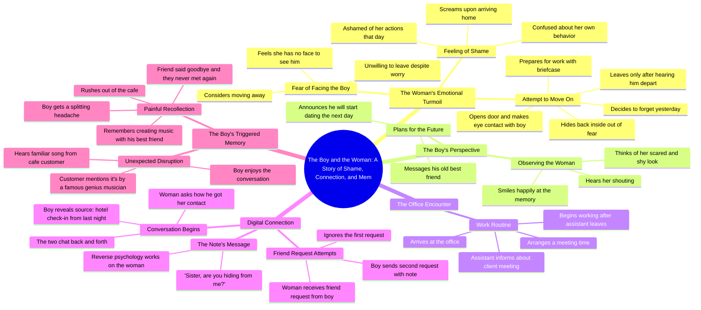

# Neighbor’s Guitar and Cake: A Sudden Heartbeat Next Door

> 🌐 **Read this in:** [English](../../en/2026-07/tiktok-transcript-part5-the-neighbor-s-guitar-and-cake-a-sudden-heartbeat-next-7e7e.md) · **中文**

> **Creator:** [@vjbrisaidajayvonn](https://www.tiktok.com/@vjbrisaidajayvonn) · **Views:** 146.5K · **Posted:** 2026-07-31 · **Niche:** entertainment
>
> **TL;DR:** Starts with a scream and shame, instantly creating curiosity and emotional investment.

[Watch original video →](https://vm.tiktok.com/ZS4jHC1pF/)

## Why This Went Viral

## 钩子（前3秒）
- **逐字开场白：**“那女人一进门就尖叫起来，她为自己今天做的事感到无比羞愧，她完全不知道自己为什么会那样做”
- **钩子模式：**场景+悬念（即时动作加上未解释的情感张力）
- **为何能让人停下滑动：**它直接把你扔进一场危机中，没有任何背景——一声尖叫、一份羞愧，还有一个“她做了什么？”的问题，逼着大脑去填补空白。那种急促、喘不过气来的讲述方式就像在说悄悄话爆料，让观众觉得自己无意间撞见了一个秘密。

## 情感节奏
1. **困惑/好奇**（0–3秒）：尖叫+羞愧，没有前因后果——“发生了什么？”
2. **紧张**（3–10秒）：她躲着那个男孩；他对她的恐惧报以微笑——戏剧性反讽制造悬念。
3. **轻松/喜剧**（10–20秒）：她偷偷溜出去上班，险险避开他——一段俏皮的猫鼠游戏。
4. **期待**（20–30秒）：好友请求来了；她无视了；他反其道而行之（“姐姐你是不是在躲我”）——一个令人满足的小回报。
5. **急转直下**（30–40秒）：咖啡馆里一首随机播放的歌引发剧烈头痛——基调从浪漫急转为创伤。
6. **高潮/情感重击**：记忆揭示——“在他的朋友说了再见之后，两人再也没有见过面”——整个视频被重新定义为悲伤，而非浪漫。

## 关键词密度
- **“女人”/“男孩”**——出现12次以上：为算法的“故事时间”分类锚定人物；简单的人称代词让叙事易于扫读。
- **“羞愧”/“害怕”/“害羞”/“松了一口气”**——6个以上情绪状态词：驱动情感牵引力和评论区共情。
- **“好友请求”**——提及3次：一个普遍能引起共鸣的动作，提升分享率（每个人都无视过某个请求）。
- **“最好的朋友”/“说了再见”**——提及4次：反转的情感核心；触发怀旧和悲伤反应。
- **“音乐”/“歌曲”**——提及3次：把钩子和反转连接起来；同时也是一个可搜索的关键词，便于通过音乐相关发现。

## 为何能传播
- **“她做了什么？”的开放回路**——尖叫+羞愧制造了一个未解答的问题，把观众牢牢钉在3秒标记之后。留存率飙升，因为回报被刻意延迟。
- **反心理学的台词**——“姐姐你是不是在躲我”是一个可引用、可截图的瞬间。观众把它当作“发消息策略”或“如何让人回复”来分享——把视频变成了一种实用工具，而不只是故事。
- **类型诱饵式反转**——视频伪装成浪漫/生活片段故事，然后在最后10秒转向深沉的悲伤。这打破了预期，触发强烈的情感反应（震惊、悲伤）——这是“我完全没料到”这类评论的头号驱动力。
- **“朋友说了再见”的模糊性**——它从不说死亡、分手或争吵。这种模糊性引发猜测，每个评论者都把自己的失去投射其中——推动争论和反复观看。
- **咖啡馆歌曲触发**——一个感官细节（音乐），大多数人都能将其与记忆触发联系起来。这让反转显得个人化，推动观众在评论区分享自己的“那首让我崩溃的歌”的故事。

## 你可以偷师什么
- **从情绪中间开始，而不是从场景中间开始。**用尖叫、笑声、倒吸气开场——而不是“事情是这样的”。让观众的大脑自己去拼凑背景。那个空白就是钩子。
- **类型上的诱饵换钩。**先铺垫一个熟悉的套路（浪漫、喜剧、复仇），然后在最后15秒转向更沉重的主题（悲伤、失去、遗憾）。这种基调转换才是让人重看和转发的原因。
- **用一句模糊而有力的话作为评论诱饵。**“他再也没有见过他最好的朋友”之所以有效，是因为它不够具体。故意留一个模糊的细节，让观众用自己的故事去填补——这才是把被动观众变成评论者的关键。

## Mind Map

## Full Transcript (Generated by [TikTok 转录工具](https://toktranscript.com/?utm_source=github&utm_medium=breakdown&utm_campaign=tool_attribution))

> 📝 Transcripts on this page are auto-generated and show the first 60%. Want to transcribe any TikTok in 30 seconds and get the full version? [Try TokTranscript free →](https://toktranscript.com/?utm_source=github&utm_medium=breakdown&utm_campaign=transcript_cta)

the woman screamed as soon as she got home she felt so ashamed of what she did today she had no idea why she acted that way she thought she had no face to see the boy she considered moving away but she was unwilling to leave she kept worrying about it meanwhile the boy returned home he heard the woman shouting he couldn't help thinking of how scared and shy she looked he smiled happily then he took his phone and messaged his old best friend telling him that he was going to start dating the next day the woman pulled herself together she decided to forget what happened yesterday she picked up her briefcase and opened the door to go to work but she made eye contact with the boy at the door she got so scared that she hid back inside she only opened the door slowly after hearing him leave she felt relieved when she saw no one then she left safely after arriving at the office her assistant told her the client wanted a meeting the woman told her to arrange a time after the assistant left the woman started working then she received a friend request she

*[Read the full transcript on TokTranscript →](https://toktranscript.com/plaza/tiktok-transcript-part5-the-neighbor-s-guitar-and-cake-a-sudden-heartbeat-next-7e7e?utm_source=github&utm_medium=breakdown&utm_campaign=transcript_full)*

## Browse More

- All [entertainment](../../by-niche/zh-CN/entertainment.md) breakdowns
- All [Emotional Cold Open](../../by-pattern/zh-CN/hook-emotional-cold-open.md) examples

## Video Info

| | |
|---|---|
| Creator | [@vjbrisaidajayvonn](https://www.tiktok.com/@vjbrisaidajayvonn) |
| Original video | [https://vm.tiktok.com/ZS4jHC1pF/](https://vm.tiktok.com/ZS4jHC1pF/) |
| Original title | Part5|The Neighbor’s Guitar and Cake A Sudden Heartbeat Next Door#fyp... |
| Views | 146.5K (146500) |
| Posted | 2026-07-31 |
| Duration | 0s |
| Niche | `entertainment` |
| Hook pattern | `Emotional Cold Open` |
| Original language | `en` (this page translated by AI) |
| Available languages | en, zh-CN |
| Generated | 2026-08-01 by [TokTranscript](https://toktranscript.com/) |

---

*This breakdown is for educational analysis under fair use. Original video © [@vjbrisaidajayvonn](https://www.tiktok.com/@vjbrisaidajayvonn). All transcripts are auto-generated and may contain errors.*

*Want to analyze your own TikToks like this? [免费 TikTok 文稿生成器 →](https://toktranscript.com/viral-breakdown?utm_source=github&utm_medium=breakdown&utm_campaign=footer_cta)*