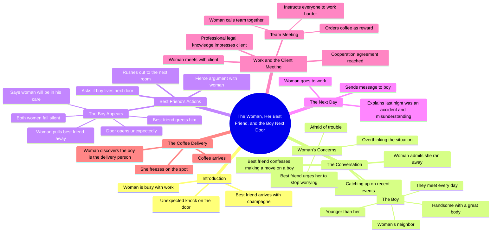

# Neighbor’s Guitar and Cake: A Sudden Heartbeat Next Door

> 🌐 **Read this in:** [English](../../en/2026-07/tiktok-transcript-part6-the-neighbor-s-guitar-and-cake-a-sudden-heartbeat-next-80c4.md) · **中文**

> **Creator:** [@vjbrisaidajayvonn](https://www.tiktok.com/@vjbrisaidajayvonn) · **Views:** 134.8K · **Posted:** 2026-07-31 · **Niche:** entertainment
>
> **TL;DR:** Opens with a mundane scene disrupted by an unexpected visitor with champagne, sparking curiosity about the celebration.

[Watch original video →](https://vm.tiktok.com/ZS46CpEXL/)

## Why This Went Viral

## 钩子（前3秒）
- **逐字开场：**“女人正忙于工作，她听到敲门声，打开门发现她最好的朋友站在那里，手里拿着一瓶香槟”
- **钩子模式：**场景设定，暗含戏剧性承诺（敲门+香槟=庆祝或对峙）
- **为何能阻止滑动：**它让你毫无背景地置身于动作之中。观众立刻会问：*这个女人是谁？为什么是香槟？接下来会发生什么？*平淡的设定（“忙于工作”）与突如其来的社交闯入形成对比——这是一个普遍的紧张点。

## 情绪节奏
1. **好奇**（0–5秒）——敲门+香槟：有事要发生了。
2. **舒适/共鸣**（5–15秒）——两个朋友叙旧，聊一个男孩的八卦。
3. **趣味+轻松调侃**（15–25秒）——最好的朋友叫她胆小鬼；俏皮的互动。
4. **好奇/紧张**（25–40秒）——揭示：那个男孩是她的*邻居*，而且*比她年轻*。年龄差+近距离=高风险。
5. **升级**（40–55秒）——最好的朋友冲出门直奔邻居的房间。肢体喜剧+震惊。
6. **尴尬顶峰（高潮）**（55–70秒）——男孩出现了。沉默。“她只是想见他……女人将由他来照顾。”极致的尴尬+替人难堪。
7. **缓解/重置**（70–85秒）——第二天，工作场景。女人解释说那是个“误会”。
8. **反转结局**（85–100秒）——送咖啡：*是那个男孩。*定格画面。紧张感回归，留下悬念。

**高潮时刻：**男孩在争吵中途走进门。三方对峙。沉默。这是让观众截图发给朋友的“哦不”时刻。

## 关键词密度
- **“男孩”**（10次以上）——欲望/紧张的核心对象；推动浪漫情节。
- **“最好的朋友”**（6次以上）——催化剂角色；制造冲突。
- **“女人”**（8次以上）——主角锚点；让故事显得具有普遍性。
- **“跑掉了”/“胆小鬼”**（4次以上）——情感钩子；将她塑造成令人共鸣的/缺乏安全感的样子。
- **“邻居”**（4次以上）——空间上的近距离=不可避免的碰撞；助燃“他们会不会在一起”的张力。
- **“隔壁”**（3次）——强化尴尬的风险。

**算法触达驱动词：**“男孩”“邻居”“最好的朋友”——高搜索量的浪漫套路，会出现在推荐中。
**情感拉动驱动词：**“跑掉了”“胆小鬼”“误会”——触发共情和互动的脆弱感词汇（评论如“她简直是我本人”）。

## 为何能传播
1. **令人共鸣的浪漫尴尬**——“她从一个帅气的年轻邻居身边跑开了”是一个具体但普遍的恐惧。观众评论：*“我也会这么做”*或*“她居然跑了，不可能吧。”*文字记录中的那句*“她害怕惹麻烦，因为那个男孩是她的邻居”*是情感锚点——每个人都曾因为近距离风险而回避过心动的对象。
2. **最好的朋友作为喜剧混乱制造者**——*“下一秒她最好的朋友立刻站起来冲出了门”*是一个跨越语言障碍的肢体笑点。它适合做成梗——那个“为你两肋插刀但做得太过头的朋友”人设会被@到转发中。
3. **带有视觉冲击的悬念结局**——*“女人发现送咖啡的是那个男孩，她当场愣住了”*——这是一个连续剧式的钩子。观众被迫评论*“第二部？”*，从而提升互动信号。定格画面是一个截图时刻。
4. **年龄差+邻居张力**——*“他比她年轻”*+*“他们每天见面”*=高风险、近乎禁忌的浪漫。这是短篇叙事中被验证过的套路（在亚洲微短剧和西方TikTok系列中同样盛行）。
5. **快节奏场景切换**——每一行都是一个新微场景（敲门→聊天→调侃→冲出去→争吵→门打开→咖啡）。这种节奏保持高留存率；没有冷场。

## 你可以借鉴什么
1. **从动作中间开场，而不是用介绍。**以*“她听到敲门声”*开始——而不是“所以这是一个关于……”的故事。把观众扔进一个瞬间，让背景自行构建。你的第一句话应该让人感觉你是在打断一个场景，而不是开始一个场景。
2. **用一个“搅局者”角色来升级冲突。**最好的朋友做了主角不敢做的事。这在不违背主角性格的前提下制造了即时冲突。添加一个*行动*的角色，而你的主角*反应*——这会让戏剧性翻倍。
3. **以视觉悬念结尾，而不是解决。**送咖啡的揭示是一个零对白的节拍，迫使观众产生“接下来会发生什么”的反应。如果你无法拍摄反转，就以定格画面或一个意味深长的眼神结束。永远不要完全解决——留一条线悬着，以引发评论和第二部的需求。

## Mind Map

## Full Transcript (Generated by [TikTok 转录工具](https://toktranscript.com/?utm_source=github&utm_medium=breakdown&utm_campaign=tool_attribution))

> 📝 Transcripts on this page are auto-generated and show the first 60%. Want to transcribe any TikTok in 30 seconds and get the full version? [Try TokTranscript free →](https://toktranscript.com/?utm_source=github&utm_medium=breakdown&utm_campaign=transcript_cta)

the woman was busy with work she heard a knock on the door she opened it and found her best friend was there holding a bottle of champagne after entering the room the two talked about recent events not long after her best friend said she made a move on the boy but she ran away by herself the woman nodded her best friend teased her for being such a coward and asked if the boy was handsome and in good shape the woman said he was not only handsome but also had a great body her best friend asked in confusion why she ran away the woman said she was afraid of trouble because the boy was her neighbor they met every day and he was younger than her her best friend signalled her to stop talking pursuing love did not require so much consideration she had always been too worried since she was young if she did not see such a good opportunity did she really want to stay single then her best friend asked if the boy lived next door the woman said yes the next second her best friend stood up immediately rushed out the door to the next room the woman stopped her best friend and asked what she was doing the two had a fierce argument just then the door opened the boy appeared in front of the

*[Read the full transcript on TokTranscript →](https://toktranscript.com/plaza/tiktok-transcript-part6-the-neighbor-s-guitar-and-cake-a-sudden-heartbeat-next-80c4?utm_source=github&utm_medium=breakdown&utm_campaign=transcript_full)*

## Browse More

- All [entertainment](../../by-niche/zh-CN/entertainment.md) breakdowns
- All [Mysterious arrival](../../by-pattern/zh-CN/hook-mysterious-arrival.md) examples

## Video Info

| | |
|---|---|
| Creator | [@vjbrisaidajayvonn](https://www.tiktok.com/@vjbrisaidajayvonn) |
| Original video | [https://vm.tiktok.com/ZS46CpEXL/](https://vm.tiktok.com/ZS46CpEXL/) |
| Original title | Part6|The Neighbor’s Guitar and Cake A Sudden Heartbeat Next Door#fyp... |
| Views | 134.8K (134800) |
| Posted | 2026-07-31 |
| Duration | 0s |
| Niche | `entertainment` |
| Hook pattern | `Mysterious arrival` |
| Original language | `en` (this page translated by AI) |
| Available languages | en, zh-CN |
| Generated | 2026-08-01 by [TokTranscript](https://toktranscript.com/) |

---

*This breakdown is for educational analysis under fair use. Original video © [@vjbrisaidajayvonn](https://www.tiktok.com/@vjbrisaidajayvonn). All transcripts are auto-generated and may contain errors.*

*Want to analyze your own TikToks like this? [拆解你自己的 TikTok →](https://toktranscript.com/viral-breakdown?utm_source=github&utm_medium=breakdown&utm_campaign=footer_cta)*