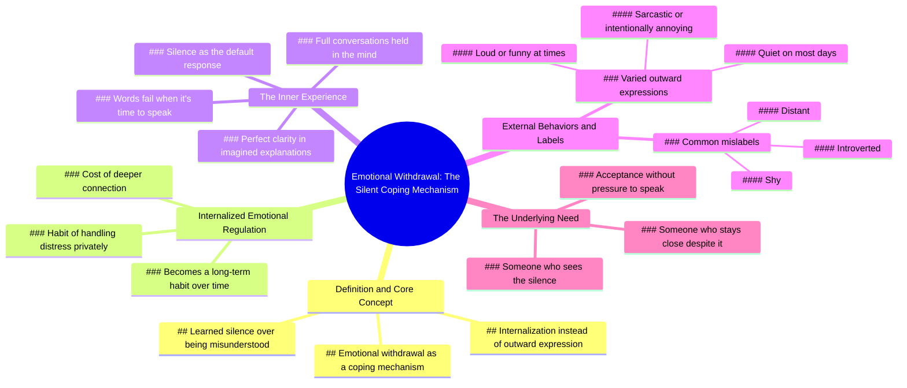

# Why Silent People Withdraw When Hurt

> 🌐 **Read this in:** [English](../../en/2026-07/tiktok-transcript-people-who-go-silent-38db.md) · **中文**

> **Creator:** [@jimmy__jon](https://www.tiktok.com/@jimmy__jon) · **Views:** 3.3M · **Posted:** 2026-07-02 · **Niche:** other
>
> **TL;DR:** Introduces a relatable behavior with a clinical term, creating curiosity and validation.

[Watch original video →](https://www.tiktok.com/t/ZP8GBaGSX/)

## Why This Went Viral

## 钩子（前3秒）
- **逐字开场白：** "那些在遇到烦心事或受伤时突然沉默的人，往往正在经历一种名为情感退缩的应对机制。"
- **钩子模式：** 大胆断言 + 心理学术语（"情感退缩"）
- **为何能让人停下滑动：** 它命名了一种具体且能引发共鸣的行为（难过时沉默），并立即将其重新定义为一种心理机制，而非性格缺陷。这能瞬间触发自我认同（"这就是我"）或对他人行为的好奇。

## 情感节奏
1. **好奇** — 开场白让观众思考："我这样做过吗？我认识这样做的人吗？"
2. **认同** — "不是他们无话可说，而是他们的系统学会了沉默更安全" — 对内向者或常被误解的人产生深度共鸣。
3. **紧张** — "他们在脑海中完成整场对话……但到了开口时，话却说不出口" — 营造悬念与共情。
4. **释然/清晰** — "心理学家称之为内化情绪调节" — 这个标签为模糊的感受提供了结构。
5. **共鸣** — "有时他们很吵闹，有时他们很风趣……但大多数时候他们只是安静" — 将行为人性化，打破刻板印象。
6. **高潮** — "他们真正需要的，是有人看到他们的沉默，却依然选择靠近" — 情感回报：一种赤裸、脆弱的对连接的渴望。
- **高潮时刻：** 最后一句——这是将沉默重新定义为一种需求而非拒绝的转折点。

## 关键词密度
| 关键词/短语 | 出现次数（约） | 驱动因素 |
|---|---|---|
| 沉默 / 安静 | 5 | **算法覆盖** — 高搜索、高关联词 |
| 被误解 | 1（贯穿全文） | **情感吸引** — 核心痛点 |
| 应对机制 | 2 | **算法覆盖** — 心理学关键词 |
| 内化 | 2 | **情感吸引** — 创造深度 |
| 更安全 / 安全 | 1 | **情感吸引** — 触发保护本能 |
| 连接 | 1 | **情感吸引** — 普遍需求 |
| 吵闹 / 风趣 / 讽刺 / 烦人 | 4（对比群组） | **情感吸引** — 打破刻板印象，增加层次感 |
| 靠近 | 1 | **情感吸引** — 高潮词汇 |

- **算法驱动因素：** "沉默"、"应对机制"、"内化" — 这些是可搜索、可分享的心理学词汇。
- **情感驱动因素：** "被误解"、"安全"、"连接"、"靠近" — 这些创造了病毒式的情感钩子，促使人们@朋友或保存视频。

## 为何能传播
1. **普遍共鸣 + 精准标签** — 视频命名了一种几乎人人都经历过（在自己或认识的人身上）的行为，并赋予其临床标签（"情感退缩"）。这让观众感到被看见，并因了解这个术语而显得聪明。  
   *文本证据：* "那些在遇到烦心事或受伤时突然沉默的人" + "心理学家称之为内化情绪调节。"

2. **将负面特质重新定义为生存技能** — 视频没有谴责沉默，而是将其验证为一种习得的安全反应。这减少了羞耻感，让观众想与安静的朋友或伴侣分享。  
   *文本证据：* "不是他们无话可说，而是他们的系统学会了沉默比被误解更安全。"

3. **以直接、情感化的行动号召结尾** — 最后一句不是"点赞订阅"——而是对连接的恳求。观众@伴侣或朋友说"这就是我"或"这就是我们"，从而推动分享。  
   *文本证据：* "他们真正需要的，是有人看到他们的沉默，却依然选择靠近。"

4. **对比创造深度** — 视频没有将安静的人扁平化为单一类型。它展示了他们可以吵闹、风趣、讽刺、烦人——使角色更真实、更易分享。  
   *文本证据：* "有时他们很吵闹，有时他们很风趣、讽刺，甚至故意有点烦人。但大多数时候他们只是安静。"

5. **短小精悍、金句频出** — 每句话都可能成为引语卡片。脚本紧凑，没有废话。这使其易于改编为文字叠加、推文或Instagram标题。  
   *文本证据：* 每一行都是独立的洞见——没有冗余。

## 你可以借鉴什么
1. **以心理学术语开头** — 用"这被称为[术语]"开始视频，而不是"你有没有……？"这个标签创造了权威感，让内容感觉像在揭示一个秘密。  
   *示例：* "那些最后一刻取消计划的人，往往在使用一种名为预期回避的应对机制。"

2. **使用"但大多数时候"的对比** — 在描述特定行为后，添加一句展示人物全貌的话（"有时他们X，有时Y，但大多数时候Z"）。这让角色感觉真实而复杂，增加情感投入。  
   *示例：* "有时他们是派对的主角，有时他们是角落里的那个人。但大多数时候他们只是累了。"

3. **以关系恳求结尾** — 最后一句不应是通用的行动号召。相反，要陈述这个人真正需要从他人那里得到什么。这让视频成为可以@他人的礼物，而不仅仅是独白。  
   *示例：* "他们真正需要的，是有人不把沉默当回事，只是说一句'等你准备好了，我就在这里。'"

## Mind Map

## Full Transcript (Generated by [TokTranscript](https://toktranscript.com/?utm_source=github&utm_medium=breakdown&utm_campaign=tool_attribution))

> 📝 Transcripts on this page are auto-generated and show the first 60%. Want to transcribe any TikTok in 30 seconds and get the full version? [Try TokTranscript free →](https://toktranscript.com/?utm_source=github&utm_medium=breakdown&utm_campaign=transcript_cta)

People who go silent when something upsets or hurts them are often experiencing a coping mechanism called emotional withdrawal. It's not that they have nothing to say, it's that their system Learned silence is safer than being misunderstood. Instead of expressing anger or frustration outwardly, they internalize it. They hold full conversations in their head, explaining exactly how they feel with perfect clarity. But when it's time to speak, the words don't come out, so they stay quiet instead. Psychologists call this internalized emotional regulation, the habit of 

*[Read the full transcript on TokTranscript →](https://toktranscript.com/plaza/tiktok-transcript-people-who-go-silent-38db?utm_source=github&utm_medium=breakdown&utm_campaign=transcript_full)*

## Browse More

- All [other](../../by-niche/zh-CN/other.md) breakdowns
- All [Psychological label reveal](../../by-pattern/zh-CN/hook-psychological-label-reveal.md) examples

## Video Info

| | |
|---|---|
| Creator | [@jimmy__jon](https://www.tiktok.com/@jimmy__jon) |
| Original video | [https://www.tiktok.com/t/ZP8GBaGSX/](https://www.tiktok.com/t/ZP8GBaGSX/) |
| Original title | people who go silent... |
| Views | 3.3M (3300000) |
| Posted | 2026-07-02 |
| Duration | 0s |
| Niche | `other` |
| Hook pattern | `Psychological label reveal` |
| Original language | `en` (this page translated by AI) |
| Available languages | en, zh-CN |
| Generated | 2026-07-05 by [TokTranscript](https://toktranscript.com/) |

---

*This breakdown is for educational analysis under fair use. Original video © [@jimmy__jon](https://www.tiktok.com/@jimmy__jon). All transcripts are auto-generated and may contain errors.*

*Want to analyze your own TikToks like this? [TokTranscript →](https://toktranscript.com/viral-breakdown?utm_source=github&utm_medium=breakdown&utm_campaign=footer_cta)*