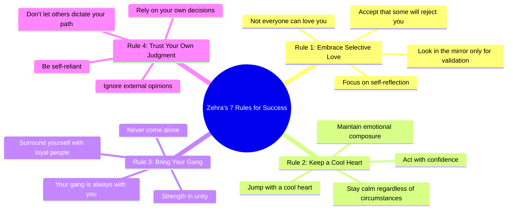

# Queen of Pop Out Now Stream Everywhere

> 🌐 **Read this in:** [English](../../en/2026-07/tiktok-transcript-queen-of-pop-out-now-jetzt-auf-allen-plattformen-streamen-f03a.md) · **中文**

> **Creator:** [@serdar_lunatix](https://www.tiktok.com/@serdar_lunatix) · **Views:** 3.3M · **Posted:** 2026-07-03 · **Niche:** entertainment
>
> **TL;DR:** Opens with a shocking wealth claim that immediately grabs attention and establishes authority.

[Watch original video →](https://vt.tiktok.com/ZSCXVJdy2/)

## Why This Went Viral

## 钩子（前3秒）
- **逐字开场白：**“我现在已经是百万富翁了，她在学校说我什么都没做”
- **钩子模式类型：** **对比**（声称自己是百万富翁，同时承认在学校一事无成）+ **大胆声明**（“我是百万富翁”）
- **为何能阻止滑动：**“百万富翁”与“在学校一事无成”之间的矛盾立即制造了认知失调。观众被迫停下来解开这个悖论——这是真的吗？她是在炫耀还是谦虚？这种张力让人无法抗拒。

## 情感节奏
- **节拍1——好奇：**“我是百万富翁”——瞬间引发兴趣，地位信号
- **节拍2——紧张/防御：**“她在学校说我什么都没做”——脆弱的坦白，制造怀疑
- **节拍3——权威转变：**“因为我知道这是Zehra 7法则第一条”——引入秘密体系，建立可信度
- **节拍4——共鸣/共情：**“你想要成功，不是每个人都能爱你”——一个让人感同身受的普遍真理
- **节拍5——自信飙升：**“我从不独自出现，因为那是法则第三条”——帮派忠诚，人多势众
- **节拍6——高潮/终结：**“我不认为还有谁能告诉我”——最终定论，完全自我掌控
- **高潮时刻：**最后一句——这是整个“我不需要你的认可”弧线的情感回报。

## 关键词密度
| 关键词/短语 | 出现次数 | 目的 |
|---|---|---|
| **百万富翁** | 1（开场） | 算法覆盖——高互动触发词 |
| **法则** | 3（明确提及） | 情感吸引——建立体系，让创作者显得有条理 |
| **成功** | 1 | 情感吸引——励志，广泛吸引力 |
| **爱你** | 1 | 情感吸引——脆弱感，人际连接 |
| **我/我的** | 5+ | 算法+情感——建立个人品牌，传达权威 |
| **帮派** | 1 | 情感吸引——忠诚、社群、部落 |
| **独自** | 1 | 情感吸引——对孤独的恐惧，与“帮派”形成对比 |
| **告诉我** | 1（结尾） | 情感吸引——反抗、终结、收束 |

*注：视频较短，因此密度较低。但每个词都经过策略性布局，以实现最大影响力。*

## 为何能传播
1. **“秘密体系”公式**——“Zehra 7法则”听起来像专有框架。观众分享是为了感觉自己掌握了独家知识。*具体台词：*“因为我知道这是Zehra 7法则第一条”
2. **“谦虚炫耀+脆弱感”悖论**——她声称自己是百万富翁，同时承认在学校是弱势群体。这让她既接地气又励志——病毒式传播的甜蜜点。*具体台词：*“我现在已经是百万富翁了，她在学校说我什么都没做”
3. **“我不在乎”的能量**——最后的终结语（“我不认为还有谁能告诉我”）既引发钦佩也引发争论。支持者分享以肯定这种态度；批评者分享以反驳——两种行为都推动传播。*具体台词：*“我不认为还有谁能告诉我”
4. **“帮派”身份钩子**——“我的帮派和我在一起”制造了部落效应。那些对自己圈子忠诚的观众会立即产生共鸣并分享以表明归属感。*具体台词：*“无论我在哪里，我的帮派都和我在一起”
5. **简短、有力、未完成**——转录在句子中间戛然而止（“是的我我我不认为还有谁能告诉我”）。这制造了悬念——观众评论询问完整法则，从而提升互动信号。*具体台词：*突然的结尾本身。

## 你可以借鉴什么
1. **以矛盾开场。**在你的下一个视频开头，用一个看似自相矛盾的陈述（例如，“我处于行业顶端，却从未感到如此迷茫”）。认知摩擦迫使观众留下来。
2. **发明一个编号体系。**即使只有3条法则，也要明确标注（“法则#1”、“法则#2”）。这传达权威感，让你的内容感觉像作弊码——因为像内部知识而具有分享性。
3. **以引发辩论的定论收尾。**你的结束语要么是大胆的终结（“没人能告诉我”），要么是挑衅性的问题。目标是分裂观众——赞同和反对都能推动评论，从而推动传播。

## Mind Map

## Full Transcript (Generated by [我们用的转录工具](https://toktranscript.com/?utm_source=github&utm_medium=breakdown&utm_campaign=tool_attribution))

> 📝 Transcripts on this page are auto-generated and show the first 60%. Want to transcribe any TikTok in 30 seconds and get the full version? [Try TokTranscript free →](https://toktranscript.com/?utm_source=github&utm_medium=breakdown&utm_campaign=transcript_cta)

that we are already now I am a millionaire she says in school I have done nothing yet because I know this is the zehra 7 Rule number 1 you want success not everyone can love you when you can see the mirror only hot how chews the O M R rule number

*[Read the full transcript on TokTranscript →](https://toktranscript.com/plaza/tiktok-transcript-queen-of-pop-out-now-jetzt-auf-allen-plattformen-streamen-f03a?utm_source=github&utm_medium=breakdown&utm_campaign=transcript_full)*

## Browse More

- All [entertainment](../../by-niche/zh-CN/entertainment.md) breakdowns
- All [Identity Shift / Status Claim](../../by-pattern/zh-CN/hook-identity-shift-status-claim.md) examples

## Video Info

| | |
|---|---|
| Creator | [@serdar_lunatix](https://www.tiktok.com/@serdar_lunatix) |
| Original video | [https://vt.tiktok.com/ZSCXVJdy2/](https://vt.tiktok.com/ZSCXVJdy2/) |
| Original title | Queen of Pop - Out Now! 👑🎤 Jetzt auf allen Plattformen streamen. |
| Views | 3.3M (3300000) |
| Posted | 2026-07-03 |
| Duration | 0s |
| Niche | `entertainment` |
| Hook pattern | `Identity Shift / Status Claim` |
| Original language | `en` (this page translated by AI) |
| Available languages | en, zh-CN |
| Generated | 2026-07-05 by [TokTranscript](https://toktranscript.com/) |

---

*This breakdown is for educational analysis under fair use. Original video © [@serdar_lunatix](https://www.tiktok.com/@serdar_lunatix). All transcripts are auto-generated and may contain errors.*

*Want to analyze your own TikToks like this? [TokTranscript →](https://toktranscript.com/viral-breakdown?utm_source=github&utm_medium=breakdown&utm_campaign=footer_cta)*