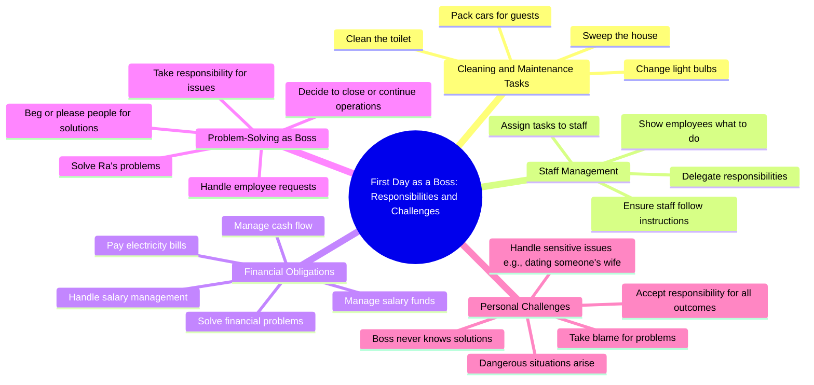

# First Day as Boss: Cleaning Toilets and Packing Cars

> 🌐 **Read this in:** [English](../../en/2026-07/tiktok-transcript-replying-to-ng-c-vui-v-l-m-s-p-l-n-u-n-n-c-nhi-u-b-ng-th-cf18.md) · **中文**

> **Creator:** [@hoanghaangels](https://www.tiktok.com/@hoanghaangels) · **Views:** 568.9K · **Posted:** 2026-07-27 · **Niche:** other
>
> **TL;DR:** Opens with a direct question that sets up a relatable scenario, then subverts expectations with absurd duties.

[Watch original video →](https://www.tiktok.com/@hoanghaangels/video/7567340447031446792)

## Why This Went Viral

## 钩子（前3秒）
- **逐字开场白**："所以，你当老板第一天，你汇报了什么？如果你今天来，你就打扫厕所、扫地、换灯泡、帮客人装车……"
- **钩子模式**：**反差**（荒谬的琐碎任务 vs. "老板"头衔）+ **反问句**
- **为何能阻止滑动**："老板"与"打扫厕所"之间的直接错位制造了认知失调。观众会停下来试图解决这个矛盾：这是玩笑？还是对糟糕管理的讽刺？这种荒谬感瞬间具有分享性。

## 情绪节奏
- **节拍1 – 好奇（0-5秒）**："你当老板第一天……打扫厕所？"——观众感到困惑且被勾起兴趣。
- **节拍2 – 紧张（5-15秒）**：说话者分配不可能完成的任务（"交电费、付现金"），并把所有问题归咎于"老板"。挫败感逐渐累积。
- **节拍3 – 悬念（15-25秒）**："现在你是老板了，你得解决这些问题……拉，你来解决。"——"拉"这个词成了一个充满张力的触发点。拉是谁？会发生什么？
- **节拍4 – 反转/高潮（25-30秒）**："兄弟，我在和你老婆约会。"——最终的升级。这个笑话以背叛式的点睛之笔收尾，彻底翻转了权力关系。
- **节拍5 – 解脱/共鸣**：笑声或震惊。荒谬感得到化解："老板"被自己的员工（拉）戴了绿帽子。

## 关键词密度
| 关键词/短语 | 出现次数（约） | 为何有效 |
|----------------|-----------------|--------------|
| **老板** | 8次以上 | 算法覆盖（职场内容的高搜索词）+ 情感吸引力（权力动态） |
| **拉** | 6次以上 | 情感吸引力——成为角色名和笑点触发词 |
| **解决 / 你来解决** | 5次以上 | 情感吸引力——制造紧张（问题未解决）和缓解（得到解决） |
| **付钱** | 4次以上 | 算法覆盖（金钱/财务内容）+ 情感吸引力（责任压力） |
| **你老婆 / 和你老婆约会** | 3次 | 情感吸引力——背叛、震惊、幽默（病毒式禁忌话题） |
| **打扫厕所** | 1次 | 算法覆盖（意想不到的荒谬短语）+ 情感吸引力（羞辱感） |

## 为何能传播
1. **荒谬的权力反转**——"老板"被告知要打扫厕所、装车。这颠覆了预期的等级制度，使其作为关于糟糕领导力的笑话瞬间具有分享性。*(台词："如果你今天来，你就打扫厕所……")*
2. **带有禁忌反转的紧张升级**——高潮部分（"我在和你老婆约会"）是一个普遍的震惊桥段。它制造了一种"他刚才说了什么？"的时刻，推动评论和分享。*(台词："兄弟，我在和你老婆约会。")*
3. **可共鸣的职场挫败感**——每个员工都曾感受过推卸责任的老板。视频将这种不满转化为喜剧，让人很容易@同事。*(台词："现在你是老板了，你得解决这些问题……")*
4. **神秘角色"拉"**——"拉"这个名字像梗一样被重复。观众分享是为了问"拉是谁？"或嘲笑拉的行为的荒谬性。这推动了互动循环。*(台词："拉，你来解决……")*
5. **短小精悍、可循环的结构**——视频以笑点结束，但荒谬的铺垫邀请观众重看。循环逻辑（"你是老板，你来解决"）使其易于混音或引用。

## 你可以借鉴什么
1. **使用"权力翻转"钩子**——以一个头衔或角色（老板、CEO、专家）开场，然后立即用一个羞辱性或荒谬的任务与之矛盾。认知失调迫使观众停下来观看。
2. **构建一个神秘角色**——尽早引入一个名字（如"拉"），重复它，并使其成为笑点。观众会评论询问或拿它开玩笑，从而提升算法信号。
3. **以禁忌反转结尾**——"我在和你老婆约会"这个笑点有风险但回报高。在你的领域里，找到一个突破边界但在文化上可接受的反转（例如，"我辞职了"或"我抢了你的客户"），从而翻转权力动态。

## Mind Map

## Full Transcript (Generated by [TokTranscript](https://toktranscript.com/?utm_source=github&utm_medium=breakdown&utm_campaign=tool_attribution))

> 📝 Transcripts on this page are auto-generated and show the first 60%. Want to transcribe any TikTok in 30 seconds and get the full version? [Try TokTranscript free →](https://toktranscript.com/?utm_source=github&utm_medium=breakdown&utm_campaign=transcript_cta)

So, on your first day as a boss, what did you report? If you come today, you clean the toilet, sweep the house, change the light bulb, and pack the car for the guests, then you swear to always take the bait and save it, so you make the boss have to do something, your job is to show the staff to let it do it, ah, at 10: 30, you came but no friends came, so you didn't. Now you're the boss, you have to do what is required to pay the electricity, pay the cash, and now you assign that to any friend who is required to be assigned to any friend who is required to be assigned to himself, our brothers. Employees are given three deposits of salary management salary of the boss, the head is big, Ra to solve it, oh so that he Ra he begged people he Please people Give electricity for a while. When I have a salary fund, I close it, that is how I want to solve it, solve it, w

*[Read the full transcript on TokTranscript →](https://toktranscript.com/plaza/tiktok-transcript-replying-to-ng-c-vui-v-l-m-s-p-l-n-u-n-n-c-nhi-u-b-ng-th-cf18?utm_source=github&utm_medium=breakdown&utm_campaign=transcript_full)*

## Browse More

- All [other](../../by-niche/zh-CN/other.md) breakdowns
- All [Rhetorical question with unexpected twist](../../by-pattern/zh-CN/hook-rhetorical-question-with-unexpected-twist.md) examples

## Video Info

| | |
|---|---|
| Creator | [@hoanghaangels](https://www.tiktok.com/@hoanghaangels) |
| Original video | [https://www.tiktok.com/@hoanghaangels/video/7567340447031446792](https://www.tiktok.com/@hoanghaangels/video/7567340447031446792) |
| Original title | Replying to @Ngọc Vui Vẻ ❤️ làm sếp lần đầu nên có nhiều bỡ ngỡ 🥲 @Th... |
| Views | 568.9K (568900) |
| Posted | 2026-07-27 |
| Duration | 0s |
| Niche | `other` |
| Hook pattern | `Rhetorical question with unexpected twist` |
| Original language | `en` (this page translated by AI) |
| Available languages | en, zh-CN |
| Generated | 2026-07-27 by [TokTranscript](https://toktranscript.com/) |

---

*This breakdown is for educational analysis under fair use. Original video © [@hoanghaangels](https://www.tiktok.com/@hoanghaangels). All transcripts are auto-generated and may contain errors.*

*Want to analyze your own TikToks like this? [TikTok 转录工具 →](https://toktranscript.com/viral-breakdown?utm_source=github&utm_medium=breakdown&utm_campaign=footer_cta)*