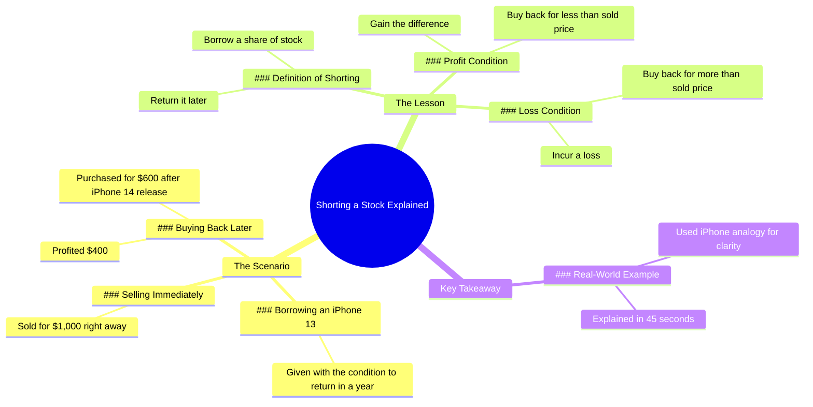

# Rich Dad Market Lesson with iPhone Analogy

> 🌐 **Read this in:** [English](../../en/2026-07/tiktok-transcript-rich-dad-lesson-on-the-market-using-an-iphone-analogy-person-7e7f.md) · **中文**

> **Creator:** [@humphreytalks](https://www.tiktok.com/@humphreytalks) · **Views:** 18.0M · **Posted:** 2026-07-22 · **Niche:** finance
>
> **TL;DR:** The unexpected condition creates immediate intrigue and compels viewers to watch.

[Watch original video →](https://vt.tiktok.com/ZSXpxMxBr/)

## Why This Went Viral

## 钩子（前3秒）
- **逐字开场白：**“我会给你这部iPhone 13，但一年后我要拿回来，行吗？”
- **钩子模式：**场景+反差（一个慷慨的提议附带一个奇怪的条件）
- **为何能让人停下刷屏：**这个条件（“一年后我要拿回来”）打破了预期。慷慨是常态，但归还期限不是。观众会停下来问：*为什么会有人这么做？* 紧张感瞬间拉满。

## 情感节奏
- **节拍1 – 好奇（0–3秒）：**奇怪的条件制造了“这里面有什么猫腻？”的感觉。
- **节拍2 – 紧张（3–10秒）：**接收者在心里盘算利润——现在卖掉，之后再买回来。观众能察觉到有计谋。
- **节拍3 – 悬念（10–20秒）：**归还的时刻。他还会留着手机吗？观众预感到冲突。
- **节拍4 – 惊喜+释然（20–30秒）：**反转——他卖掉了手机，又用更便宜的价格买了回来。紧张感被打破，变成了一个“逮到你”的时刻。
- **节拍5 – 共鸣（30–45秒）：**揭示道理：“这就是做空股票。”观众觉得自己跟着看下来很聪明。
- **高潮：**“那你已经学到了教训，我的孩子。”——这句话将整个视频重新定义为一次教学时刻。

## 关键词密度
- **“iPhone 13”/“iPhone 14”** – 算法覆盖（高搜索量，产品特定）
- **“卖”/“卖了”/“买”/“买了”** – 情感吸引力（交易动词推动故事）
- **“利润”/“盈利”** – 情感吸引力（赚钱带来满足感）
- **“做空股票”** – 算法+情感（金融教育关键词+“顿悟”时刻）
- **“教训”** – 情感吸引力（将视频定位为有价值的内容，而不仅仅是娱乐）
- **“45秒”** – 算法（自我指涉的元评论，关于视频长度）

**为何有效：**产品名称提升可发现性；交易动词制造叙事张力；“做空股票”是高价值的教育关键词，标志着细分领域的权威性。

## 为何能传播
1. **“隐藏的教训”结构** – 视频将金融教育伪装成一个个人故事。观众分享它，因为它*有用*，却不像说教。那句“我刚刚向你展示了什么是做空股票”是揭示点，让整个视频感觉像一份礼物。
2. **“逮到你”的反转** – 接收者的计谋（高价卖，低价买）既聪明又令人满足。那句“所以你从我这里赚了利润”创造了一个意想不到的尊重时刻。观众想和朋友分享这个“聪明之举”。
3. **自我指涉的元钩子** – “你花了一年才解释清楚？不，只花了大约45秒，也就是这个视频的长度。”这句话打破了第四面墙，让视频显得精心设计，并制造出“哇，真高效”的反应。它之所以可分享，是因为它*巧妙*。
4. **可共鸣的紧张感** – 每个人都经历过那种奇怪的社交场合，有人要求归还某样东西。视频将一次平凡的互动变成了金融课。那句“有点奇怪，但行吧”是观众内心的声音，让他们感到被理解。
5. **高重播价值** – 一旦你知道结局，开场白（“一年后我要拿回来”）就成了一个笑点。观众会重看，以捕捉伏笔。那句“如果他一年后要拿回去，我想我现在可以卖掉它”是关键，让第二次观看感觉像解谜。

## 你可以借鉴什么
1. **“有条件慷慨”的钩子** – 给予有价值的东西，但附带一个奇怪的条件。这能立即引发好奇。在你的下一个视频中：“我会给你我的[贵重物品]，但[奇怪的条件]。”例如：“我会给你100美元，但你必须把它花在一个陌生人身上。”
2. **“揭示教训”的结构** – 先讲一个故事，然后抛出教育性的点睛之笔。不要以“今天我要教你做空股票”开头。从iPhone开始。那句“那你已经学到了教训，我的孩子”是回报。在你的下一个视频中：讲一个关于错误的故事，然后揭示商业教训。
3. **“元时间”的呼应** – 将视频长度作为笑点来引用。这让内容显得有自我意识且高效。那句“不，只花了大约45秒”是一种低调的炫耀。在你的下一个视频中：“我花了[时间]才学会，但你只花了[视频长度]就理解了。”

## Mind Map

## Full Transcript (Generated by [我们用的转录工具](https://toktranscript.com/?utm_source=github&utm_medium=breakdown&utm_campaign=tool_attribution))

> 📝 Transcripts on this page are auto-generated and show the first 60%. Want to transcribe any TikTok in 30 seconds and get the full version? [Try TokTranscript free →](https://toktranscript.com/?utm_source=github&utm_medium=breakdown&utm_campaign=transcript_cta)

I'm gonna give you this iPhone 13, but I want it back in a year, okay? Random, but okay. If he wants it back in a year, I guess I could sell it now for $1,000, and then when Apple inevitably comes out with the iPhone 14, they'll discount this model. I'll buy it back for $600, thus I'll profit $400. Hey, how's it going? Do you have that iPhone 13? Yeah, but to be honest, I sold it the day you gave it to me knowing the price would go down, and then I bought it back again now that it's cheaper. So you borrowed my iPhone and when it came to returning it, you bought it back for less than what you sold it for? So you

*[Read the full transcript on TokTranscript →](https://toktranscript.com/plaza/tiktok-transcript-rich-dad-lesson-on-the-market-using-an-iphone-analogy-person-7e7f?utm_source=github&utm_medium=breakdown&utm_campaign=transcript_full)*

## Browse More

- All [finance](../../by-niche/zh-CN/finance.md) breakdowns
- All [Curiosity Gap](../../by-pattern/zh-CN/hook-curiosity-gap.md) examples

## Video Info

| | |
|---|---|
| Creator | [@humphreytalks](https://www.tiktok.com/@humphreytalks) |
| Original video | [https://vt.tiktok.com/ZSXpxMxBr/](https://vt.tiktok.com/ZSXpxMxBr/) |
| Original title | Rich Dad Lesson on the Market using an iPhone analogy. #personalfinan... |
| Views | 18.0M (18000000) |
| Posted | 2026-07-22 |
| Duration | 0s |
| Niche | `finance` |
| Hook pattern | `Curiosity Gap` |
| Original language | `en` (this page translated by AI) |
| Available languages | en, zh-CN |
| Generated | 2026-07-23 by [TokTranscript](https://toktranscript.com/) |

---

*This breakdown is for educational analysis under fair use. Original video © [@humphreytalks](https://www.tiktok.com/@humphreytalks). All transcripts are auto-generated and may contain errors.*

*Want to analyze your own TikToks like this? [TokTranscript 转录工具 →](https://toktranscript.com/viral-breakdown?utm_source=github&utm_medium=breakdown&utm_campaign=footer_cta)*