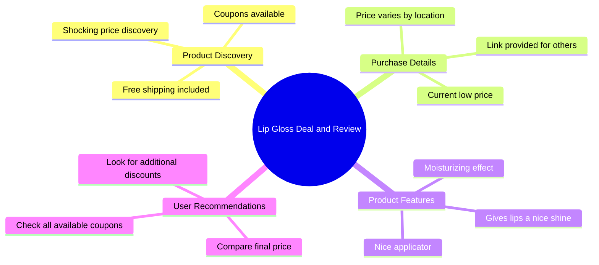

# See How Low This Price Can Go With Coupons

> 🌐 **Read this in:** [English](../../en/2026-07/tiktok-transcript-see-how-low-you-can-get-the-price-on-this-i-am-getting-it-fo-ec1e.md) · **中文**

> **Creator:** [@devotedtothelordjesus](https://www.tiktok.com/@devotedtothelordjesus) · **Views:** 1.4M · **Posted:** 2026-07-23 · **Niche:** beauty
>
> **TL;DR:** Opens with a surprising price reveal that triggers curiosity and urgency.

[Watch original video →](https://www.tiktok.com/@devotedtothelordjesus/video/7656936045262523679?shop_id=7496159694939589020&shop_region=US)

## Why This Went Viral

## 钩子（前3秒）
- **逐字开场白：** "看看我现在买这个的价格！"
- **钩子模式：** **数字 + 场景**（价格揭示 + 现场演示）
- **为何能阻止滑动：** "现在"这个词制造了紧迫感和错失恐惧症。观众立刻想看到价格，并与自己的预期对比。产品+价格在屏幕上的视觉触发"找便宜货"的反射。

## 情感节奏
- **节拍：** 好奇（价格揭示）→ 震惊（低价）→ 紧迫感（免运费，"现在"）→ 信任（好用的涂抹器，保湿）→ 行动（下方链接，查看优惠券）
- **悬念：** 展示价格前的停顿（"我震惊了"）营造期待。
- **共鸣：** "以这个价格真的寄给我"这句话让优惠显得真实且可及。
- **高潮：** 价格在屏幕上展示的那一刻（隐含）——这是情感回报的顶峰。
- **转折：** "查看你所有的优惠券"的呼吁增加了第二层价值——观众可能获得更划算的交易。

## 关键词密度
| 关键词/短语 | 作用 |
|---|---|
| **价格** | 算法（找便宜意图）+ 情感（价值） |
| **现在** | 紧迫感，触发错失恐惧症 |
| **免运费** | 算法（购物意图）+ 情感（省钱） |
| **下方链接** | 行动号召，驱动点击 |
| **保湿唇彩** | 产品益处，情感（自我护理） |
| **震惊了** | 情感钩子，触发好奇 |
| **优惠券** | 算法（优惠券/优惠内容）+ 情感（省钱） |
| **寄给你** | 个性化，让观众想象自己 |

**算法驱动因素：** 价格，免运费，下方链接，优惠券  
**情感吸引力：** 震惊了，现在，寄给你，保湿唇彩

## 为何能传播
1. **紧迫感 + 错失恐惧症循环** – "看看我现在买这个的价格！"制造了"必看"时刻。"现在"和"真的寄给我"的重复让优惠显得转瞬即逝，驱动立即点击。
2. **个性化价值主张** – "我会在下方链接，这样你们也可以看看它寄给你们的价格"将个人购买转化为共享机会。观众觉得他们可以复制这个优惠。
3. **低行动门槛** – "查看你所有的优惠券和任何其他折扣"的呼吁让观众感到掌控感。这不仅仅是价格揭示——而是他们可以复制的策略。
4. **通过透明度建立信任** – 创作者展示产品，描述其优点（好用的涂抹器，保湿，光泽），然后立即提供链接。这减少了怀疑，提高了转化率。
5. **算法优化** – 像"价格"、"免运费"和"优惠券"这样的关键词向平台传达购物意图，将视频推送给积极寻找优惠的用户。

## 你可以借鉴的
1. **以价格揭示+紧迫感开场** – 以"看看我现在买这个的价格！"开始你的视频。这种模式适用于任何产品——美妆、科技、家居用品。它立即触发好奇。
2. **个性化优惠** – 使用"寄给你"的语言让观众想象自己收到产品。这将被动观看转化为主动渴望。
3. **以"查看优惠券"行动号召结尾** – 不要只放链接。告诉观众自己查看额外折扣。这创造了赋权感，增加了他们实际点击和购买的可能性。

## Mind Map

## Full Transcript (Generated by [TokTranscript](https://toktranscript.com/?utm_source=github&utm_medium=breakdown&utm_campaign=tool_attribution))

> 📝 Transcripts on this page are auto-generated and show the first 60%. Want to transcribe any TikTok in 30 seconds and get the full version? [Try TokTranscript free →](https://toktranscript.com/?utm_source=github&utm_medium=breakdown&utm_campaign=transcript_cta)

Check out the price I'm getting this for right now! I was shocked to see the coupons available and also free shipping! It is literally getting sent to me for this price right now. I will link it below so you guys can all check out what price it can be shipped to you for as well! It's got such a nice applicator and it moisturizes and gives y

*[Read the full transcript on TokTranscript →](https://toktranscript.com/plaza/tiktok-transcript-see-how-low-you-can-get-the-price-on-this-i-am-getting-it-fo-ec1e?utm_source=github&utm_medium=breakdown&utm_campaign=transcript_full)*

## Browse More

- All [beauty](../../by-niche/zh-CN/beauty.md) breakdowns
- All [Price Shock + Curiosity Gap](../../by-pattern/zh-CN/hook-price-shock-curiosity-gap.md) examples

## Video Info

| | |
|---|---|
| Creator | [@devotedtothelordjesus](https://www.tiktok.com/@devotedtothelordjesus) |
| Original video | [https://www.tiktok.com/@devotedtothelordjesus/video/7656936045262523679?shop_id=7496159694939589020&shop_region=US](https://www.tiktok.com/@devotedtothelordjesus/video/7656936045262523679?shop_id=7496159694939589020&shop_region=US) |
| Original title | See how low you can get the price on this. I am getting it for less t... |
| Views | 1.4M (1400000) |
| Posted | 2026-07-23 |
| Duration | 0s |
| Niche | `beauty` |
| Hook pattern | `Price Shock + Curiosity Gap` |
| Original language | `en` (this page translated by AI) |
| Available languages | en, zh-CN |
| Generated | 2026-07-23 by [TokTranscript](https://toktranscript.com/) |

---

*This breakdown is for educational analysis under fair use. Original video © [@devotedtothelordjesus](https://www.tiktok.com/@devotedtothelordjesus). All transcripts are auto-generated and may contain errors.*

*Want to analyze your own TikToks like this? [我们用的转录工具 →](https://toktranscript.com/viral-breakdown?utm_source=github&utm_medium=breakdown&utm_campaign=footer_cta)*