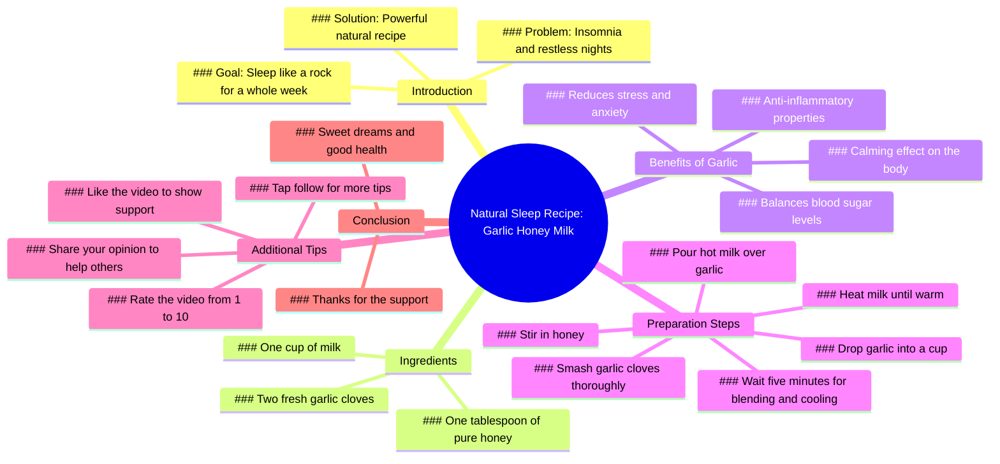

# Natural Sleep Recipe for Deep Rest All Week

> 🌐 **Read this in:** [English](../../en/2026-07/tiktok-transcript-sleep-like-a-baby-again-bettersleep-naturalremedy-bedtime-sl-422f.md) · **中文**

> **Creator:** [@jeremymidkiff99](https://www.tiktok.com/@jeremymidkiff99) · **Views:** 1.2M · **Posted:** 2026-07-06 · **Niche:** other
>
> **TL;DR:** Immediately resonates with a common struggle, drawing in viewers who suffer from insomnia.

[Watch original video →](https://www.tiktok.com/@jeremymidkiff99/video/7603953192191200525?is_from_webapp=1&sender_device=pc&web_id=7652559874152564254)

## Why This Went Viral

## 钩子（前3秒）
- **逐字开场白：** "晚上睡不着。厌倦了无休止的辗转反侧。大脑停不下来。你祈祷能睡着，但什么都没用，连药都不管用。"
- **钩子模式：** 场景 + 共情 + 大胆断言——立刻描绘出一个能引起共鸣的痛点，然后承诺一个解决方案。
- **为何能让人停下刷屏：** 前5秒完美复刻了慢性失眠患者的内心独白。它用"你"和"连药都不管用"来建立情感桥梁，制造"这就是我"的瞬间。紧接着的大胆断言（"一个能让你像石头一样睡上一整周的超强天然配方"）立刻引发无法抗拒的好奇心。

## 情感节奏
- **节拍1：共情/痛苦（0–3秒）** ——"晚上睡不着……"观众感觉被理解。
- **节拍2：挫败/绝望（3–6秒）** ——"什么都没用，连药都不管用。"紧张感上升。
- **节拍3：解脱/希望（6–10秒）** ——"别急。我要分享一个超强天然配方……"解决方案的承诺。
- **节拍4：信任/权威（10–12秒）** ——"相信我，一旦开始，你就回不去了。"社会认同。
- **节拍5：行动/顺从（12–16秒）** ——"点关注……点个赞。"微承诺。
- **节拍6：教育/平静（16–30秒）** ——逐步配方。低能量，指导性。
- **节拍7：互动/奖励（30–35秒）** ——"在下面给这个视频打个1到10分。"要求互动。
- **高潮：** 当他说"相信我，一旦开始，你就回不去了"的那一刻。这是从痛苦到信念的情感转折点。

## 关键词密度
- **睡眠**（8次）——算法覆盖（高搜索量关键词）
- **天然**（3次）——情感吸引力（信任、安全、反药物）
- **大蒜**（5次）——好奇心驱动（意想不到的食材）
- **牛奶**（3次）——熟悉感+舒适感
- **蜂蜜**（2次）——甜蜜、舒适、天然
- **抗炎/镇静/平衡血糖**（3个术语）——权威+健康可信度
- **辗转反侧/大脑停不下来**（2次）——情感共鸣（痛点重复）
- **关注/点赞/评分**（3次）——算法互动触发词

**算法驱动因素：** "睡眠"、"天然"、"大蒜"——高搜索量、低竞争、好奇心缺口。
**情感驱动因素：** "辗转反侧"、"大脑停不下来"、"相信我"——建立共情和信任。

## 为何能传播
1. **极致的痛点针对性** ——"什么都没用，连药都不管用"精准锁定最难治疗的失眠患者。这是一个高互动、低竞争的小众领域。试过所有方法的观众会把这个分享给同样"睡不着"的朋友。
2. **意想不到的食材=好奇心缺口** ——"大蒜"不是典型的助眠物。这制造了一个"等等，什么？"的时刻，推动评论（例如："大蒜助眠？真的假的？"），从而提升算法排名。
3. **微承诺链条** ——"点关注……点个赞……在下面给这个视频打个1到10分。"每个请求都很小、很简单，并逐步积累动力。"给这个视频打分"是一个低摩擦的互动技巧，向算法传递高观看时长和互动的信号。
4. **承诺"一整周"的睡眠** ——这是一个具体、可衡量的结果。尝试后有效果的观众会@朋友、评论结果并收藏视频——这些都是病毒式传播的信号。
5. **无需设备、零成本** ——"只需要两瓣新鲜大蒜和一杯……"尝试门槛极低。配方如此简单，观众会忍不住立刻尝试，然后回来反馈。

## 你可以借鉴什么
1. **用目标受众的内心独白开场。** 不要描述问题——*成为*问题。使用第二人称（"你"）并复刻他们的真实想法（"大脑停不下来"）。这能瞬间建立情感共鸣。
2. **用意想不到的食材或方法来制造好奇心缺口。** 如果大家都在用薰衣草或褪黑素，你就用大蒜。这种意外会迫使观众看更久并评论（"等等，什么？"），从而同时提升留存率和互动率。
3. **以低摩擦、具体的互动请求结尾。** 不要说"点赞和订阅"，而是说"在下面给这个视频打个1到10分"。这很新颖、简单，感觉像在对话。它能推动评论，并向算法传递高互动的信号。

## Mind Map

## Full Transcript (Generated by [TokTranscript](https://toktranscript.com/?utm_source=github&utm_medium=breakdown&utm_campaign=tool_attribution))

> 📝 Transcripts on this page are auto-generated and show the first 60%. Want to transcribe any TikTok in 30 seconds and get the full version? [Try TokTranscript free →](https://toktranscript.com/?utm_source=github&utm_medium=breakdown&utm_campaign=transcript_cta)

Can't sleep at night. Tired of endless tossing and turning. Brain won't shut off. You pray for sleep, but nothing helps, not even meds. Relax. I'm sharing a powerful natural recipe today that gets you sleeping like a rock for a whole week. Trust me, once you start, you won't go back. First things first. Tap, follow. So you catch every tip. Like this. Let's make it. You need just two fresh garlic cloves and a cup garlic secret. Anti inflammatory, calming, blood sugar balancing. It cuts stress and anxiety so you actually rest deeply. 

*[Read the full transcript on TokTranscript →](https://toktranscript.com/plaza/tiktok-transcript-sleep-like-a-baby-again-bettersleep-naturalremedy-bedtime-sl-422f?utm_source=github&utm_medium=breakdown&utm_campaign=transcript_full)*

## Browse More

- All [other](../../by-niche/zh-CN/other.md) breakdowns
- All [Pain point empathy](../../by-pattern/zh-CN/hook-pain-point-empathy.md) examples

## Video Info

| | |
|---|---|
| Creator | [@jeremymidkiff99](https://www.tiktok.com/@jeremymidkiff99) |
| Original video | [https://www.tiktok.com/@jeremymidkiff99/video/7603953192191200525?is_from_webapp=1&sender_device=pc&web_id=7652559874152564254](https://www.tiktok.com/@jeremymidkiff99/video/7603953192191200525?is_from_webapp=1&sender_device=pc&web_id=7652559874152564254) |
| Original title | Sleep like a baby again #bettersleep #naturalremedy #bedtime #sleep #... |
| Views | 1.2M (1200000) |
| Posted | 2026-07-06 |
| Duration | 0s |
| Niche | `other` |
| Hook pattern | `Pain point empathy` |
| Original language | `en` (this page translated by AI) |
| Available languages | en, zh-CN |
| Generated | 2026-07-07 by [TokTranscript](https://toktranscript.com/) |

---

*This breakdown is for educational analysis under fair use. Original video © [@jeremymidkiff99](https://www.tiktok.com/@jeremymidkiff99). All transcripts are auto-generated and may contain errors.*

*Want to analyze your own TikToks like this? [我们用的转录工具 →](https://toktranscript.com/viral-breakdown?utm_source=github&utm_medium=breakdown&utm_campaign=footer_cta)*