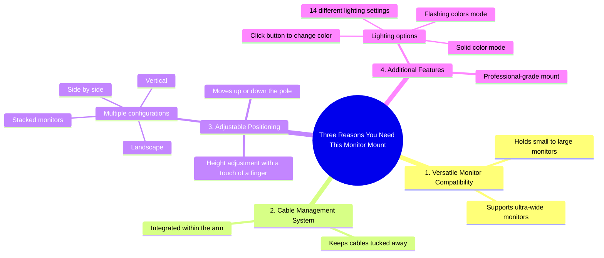

# RGB Monitor Mount Stack, Spin and Shine

> 🌐 **Read this in:** [English](../../en/2026-07/tiktok-transcript-stack-spin-shine-rgb-monitor-mount-does-it-all-odyssey-ole-b4d9.md) · **中文**

> **Creator:** [@huanuo_live](https://www.tiktok.com/@huanuo_live) · **Views:** 1.7M · **Posted:** 2026-07-09 · **Niche:** tech
>
> **TL;DR:** The hook promises a clear, numbered list of benefits, instantly creating curiosity and a reason to watch.

[Watch original video →](https://www.tiktok.com/@huanuo_live/video/7589509215559879967)

## Why This Went Viral

## 钩子（前3秒）
- **原话开头：** "我来告诉你为什么。你需要这款显示器支架的三个理由。"
- **钩子模式：** 大胆断言 + 数字（三个理由）+ 直接称呼（"你需要"）
- **为何能阻止滑动：** "我来告诉你为什么" 营造了内幕信息的承诺，而"三个理由"触发了模式中断——观众在划走之前，会本能地想知道这些理由是什么。

## 情绪节奏
- **好奇心**（0–2秒）："我来告诉你为什么"——设置了一个知识缺口。
- **期待感**（2–5秒）："三个理由"——观众会在心里跟着数。
- **满足感/认同感**（5–15秒）：每个理由都清晰呈现（从小到大的承重、线缆管理、可调节高度）。"超宽显示器"的揭示增添了一丝微妙的炫耀。
- **惊喜/愉悦感**（15–20秒）："只需按一下按钮，就能改变颜色"——RGB灯光功能是一个意想不到的加分项，并非核心功能理由。
- **高潮/权威收尾**（20–22秒）："你想要最专业的支架，就是这款。"——果断、自信、毫不含糊。

## 关键词密度
- **"显示器"**（出现5次）——驱动搜索和产品意图（算法覆盖）。
- **"支架"**（出现4次）——核心产品类别，搜索量高。
- **"线缆"**（出现2次）——痛点词汇，触发桌面杂乱观众的感性诉求。
- **"按一下按钮"**（出现1次，但视觉上强化了）——易用性的情感触发点。
- **"专业"**（出现1次，最后一句）——理想身份词汇，感性吸引力。
- **"颜色/灯光"**（出现2次）——惊喜功能，驱动分享性（审美吸引力）。

## 为何能传播
1. **承诺 + 快速兑现** —— "我来告诉你为什么" 紧接着三个具体理由。没有废话。观众觉得留下来是值得的。
2. **对主张的视觉证明** —— "顺便说一句，那是个超宽显示器" 是一种微妙的炫耀，在不直接说"它很结实"的情况下验证了支架的承重能力。
3. **意想不到的惊喜功能** —— RGB灯光的揭示（颜色变化、闪烁、14种设置）不在"三个理由"列表中，因此感觉像是一个额外福利。这会触发惊喜感，并使视频更容易被喜欢桌面布置的人分享。
4. **强有力的权威收尾** —— "你想要最专业的支架，就是这款" 是一个明确的推荐。没有"也许"或"我觉得"。这建立了信任，减少了购买犹豫。

## 你可以借鉴的点
1. **"三个理由"结构** —— 始终列出少量、奇数的要点。它创造了一个观众想要完成的思维清单。适用于任何产品、教程或观点。
2. **在列表之后埋藏一个额外功能** —— 先给出承诺的理由，然后添加一个意想不到的好处（比如RGB灯光）。这感觉像是一份礼物，增加了感知价值。
3. **以果断、不含糊的推荐结尾** —— 把"我觉得这个不错"换成"你想要X，就是这款"。自信驱动信任和分享性。

## Mind Map

## Full Transcript (Generated by [TokTranscript](https://toktranscript.com/?utm_source=github&utm_medium=breakdown&utm_campaign=tool_attribution))

> 📝 Transcripts on this page are auto-generated and show the first 60%. Want to transcribe any TikTok in 30 seconds and get the full version? [Try TokTranscript free →](https://toktranscript.com/?utm_source=github&utm_medium=breakdown&utm_campaign=transcript_cta)

I'm gonna tell you why. Three reasons you need this monitor mount here. It can hold from small to big monitors. It keeps all your cables tucked away within the arm cable management system. And you can place this monitor at any given height with a touch of a finger. That's an ultra wide monitor, by the way. Now, also, it goes down or up the pole, so you can have it side by side, 

*[Read the full transcript on TokTranscript →](https://toktranscript.com/plaza/tiktok-transcript-stack-spin-shine-rgb-monitor-mount-does-it-all-odyssey-ole-b4d9?utm_source=github&utm_medium=breakdown&utm_campaign=transcript_full)*

## Browse More

- All [tech](../../by-niche/zh-CN/tech.md) breakdowns
- All [List-based promise](../../by-pattern/zh-CN/hook-list-based-promise.md) examples

## Video Info

| | |
|---|---|
| Creator | [@huanuo_live](https://www.tiktok.com/@huanuo_live) |
| Original video | [https://www.tiktok.com/@huanuo_live/video/7589509215559879967](https://www.tiktok.com/@huanuo_live/video/7589509215559879967) |
| Original title | Stack, Spin & Shine! RGB Monitor Mount Does It All 💡🖥️🔥 #odyssey #ole... |
| Views | 1.7M (1700000) |
| Posted | 2026-07-09 |
| Duration | 0s |
| Niche | `tech` |
| Hook pattern | `List-based promise` |
| Original language | `en` (this page translated by AI) |
| Available languages | en, zh-CN |
| Generated | 2026-07-10 by [TokTranscript](https://toktranscript.com/) |

---

*This breakdown is for educational analysis under fair use. Original video © [@huanuo_live](https://www.tiktok.com/@huanuo_live). All transcripts are auto-generated and may contain errors.*

*Want to analyze your own TikToks like this? [TikTok 转录工具 →](https://toktranscript.com/viral-breakdown?utm_source=github&utm_medium=breakdown&utm_campaign=footer_cta)*