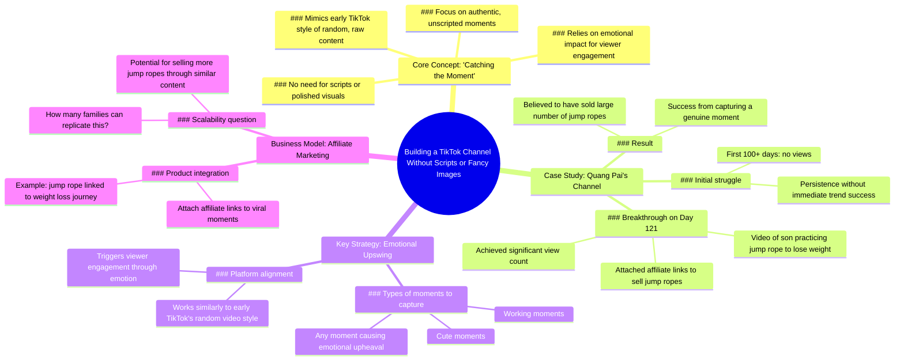

# TikTok Channel Idea From @nguyenquang4998

> 🌐 **Read this in:** [English](../../en/2026-07/tiktok-transcript-t-ng-t-k-nh-anh-nguyenquang4998-nguoimoixaykenh-tutruyenthon-4887.md) · **中文**

> **Creator:** [@duymuoi](https://www.tiktok.com/@duymuoi) · **Views:** 960.5K · **Posted:** 2026-07-30 · **Niche:** other
>
> **TL;DR:** Challenges the common belief that TikTok success requires polished content, immediately grabbing attention.

[Watch original video →](https://www.tiktok.com/@duymuoi/video/7549159211914038535)

## Why This Went Viral

## 钩子（前3秒）
- **逐字开场白：**“有一种做TikTok频道的方式，不需要脚本，你不需要在画面上吹毛求疵。”
- **钩子模式：** **大胆断言**（“不需要脚本”/“不需要吹毛求疵”）+ **神秘感**（“有一种做……的方式”——哪种？）。
- **为何能让人停止滑动：** 这个断言与普遍认为“要爆红需要精致制作”的观念相悖。它承诺了一条低投入的成功路径，从而引发那些因高制作标准而感到不堪重负或被排斥的创作者的好奇心。

## 情绪节奏
1. **好奇心** —— “有一种做……的方式，不需要脚本……”（这是什么秘密方法？）
2. **怀疑/紧张** —— “做这种频道一开始肯定不会火……”（你必须忍受失败——这制造了紧张感）。
3. **宽慰/希望** —— “……但后来会火起来。”（延迟回报的承诺）。
4. **验证** —— 具体成功案例：“第121天……这个视频获得了观看量……附上了联盟链接来卖东西。”
5. **激励/行动号召** —— “有多少家庭敢在这里一起跳绳减肥，卖得更多？”（挑战观众复制这个模式）。
- **高潮时刻：** “这个视频获得了观看量，大家记住这个视频附上了联盟链接来卖东西。”—— 这正是策略证明有利可图的时刻。

## 关键词密度
| 关键词/短语 | 数量（约） | 目的 |
|---|---|---|
| “频道” | 5+ | 算法——表明内容与频道增长相关，触发“如何增长”类查询的推荐。 |
| “趋势/火起来” | 3 | 算法——针对“TikTok趋势”和“爆红”的高搜索量。 |
| “跳绳/跳” | 5+ | 情绪+细分——具体产品类别；将故事锚定在具体、可关联的活动上。 |
| “时刻/抓住时刻” | 3 | 情绪——将策略描述为自发且真实，而非脚本化。 |
| “卖/卖货/卖更多” | 3 | 情绪+算法——触及创作者的变现欲望；“卖”触发与商业相关内容兴趣。 |
| “第121天/100天” | 2 | 算法——标题/钩子中的数字提升点击率；“第121天”表明长期验证点。 |

## 为何能传播
1. **低门槛承诺** —— “不需要脚本，你不需要在画面上吹毛求疵”直接吸引那些觉得自己缺乏时间或设备的创作者。这是核心的可分享洞察。
2. **具体、可复制的案例研究** —— “第121天……附上联盟链接卖跳绳”给出了具体、可衡量的结果。观众可以想象自己在自己的细分领域做同样的事（例如，“我可以用孩子的钢琴练习做同样的事”）。
3. **延迟成功的情绪过山车** —— “没人看，但在100多天的时间里开始起步”将痛苦的早期阶段正常化，然后奖励耐心。这创造了一个“如果他们能，我也能”的认同循环。
4. **变现揭示** —— “卖出了大量跳绳”是将故事变成商业蓝图的回报点。观众分享它，因为它感觉像是一个秘密作弊码。
5. **挑战/激将式结尾** —— “有多少家庭敢在这里一起跳绳减肥，卖得更多？”这个反问句作为一个微妙的行动号召，邀请互动（评论、标签、分享）。

## 你可以借鉴什么
1. **以“无需技能”的断言开场** —— 在你的下一个视频开头用大胆的陈述，比如“你不需要脚本，你不需要好的灯光”，立即吸引那些感到卡住的创作者。
2. **展示具体的日期回报** —— 当策略开始奏效时，提及一个具体的数字（例如，“第47天”）。数字增加可信度，并使时间线感觉可实现。
3. **以挑战/激将式问题结尾** —— 不要用通用的“点赞和订阅”，而是用一个挑战观众尝试同样方法的问题结尾（例如，“你们中有多少人今天真的会拍下孩子的练习课？”）。这能推动评论和分享。

## Mind Map

## Full Transcript (Generated by [TokTranscript](https://toktranscript.com/?utm_source=github&utm_medium=breakdown&utm_campaign=tool_attribution))

> 📝 Transcripts on this page are auto-generated and show the first 60%. Want to transcribe any TikTok in 30 seconds and get the full version? [Try TokTranscript free →](https://toktranscript.com/?utm_source=github&utm_medium=breakdown&utm_campaign=transcript_cta)

There is a kind of building a TikTok channel that doesn't need a script, you don't need to be fussy about the image to do anything. Doing this type of channel will definitely not get the trend at first, but it will get the trend later. Today I just found out that his channel is also called Quang Pai, and this channel only focuses on the moment his son practiced jumping rope to lose weight in the first days of posting, no one watched it but started it up in the range of more than 100 days coming back here on day 121. This video has achieved a view and everyone remembers that this video has attached affiliate links to sell people, I believe this channel has sold a large number of jump wires that these two parents used and the C

*[Read the full transcript on TokTranscript →](https://toktranscript.com/plaza/tiktok-transcript-t-ng-t-k-nh-anh-nguyenquang4998-nguoimoixaykenh-tutruyenthon-4887?utm_source=github&utm_medium=breakdown&utm_campaign=transcript_full)*

## Browse More

- All [other](../../by-niche/zh-CN/other.md) breakdowns
- All [Contrarian opener](../../by-pattern/zh-CN/hook-contrarian-opener.md) examples

## Video Info

| | |
|---|---|
| Creator | [@duymuoi](https://www.tiktok.com/@duymuoi) |
| Original video | [https://www.tiktok.com/@duymuoi/video/7549159211914038535](https://www.tiktok.com/@duymuoi/video/7549159211914038535) |
| Original title | Ý tưởng từ kênh anh @nguyenquang4998  #nguoimoixaykenh #tutruyenthong... |
| Views | 960.5K (960500) |
| Posted | 2026-07-30 |
| Duration | 0s |
| Niche | `other` |
| Hook pattern | `Contrarian opener` |
| Original language | `en` (this page translated by AI) |
| Available languages | en, zh-CN |
| Generated | 2026-07-30 by [TokTranscript](https://toktranscript.com/) |

---

*This breakdown is for educational analysis under fair use. Original video © [@duymuoi](https://www.tiktok.com/@duymuoi). All transcripts are auto-generated and may contain errors.*

*Want to analyze your own TikToks like this? [免费 TikTok 文稿生成器 →](https://toktranscript.com/viral-breakdown?utm_source=github&utm_medium=breakdown&utm_campaign=footer_cta)*