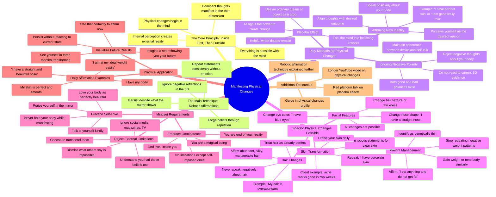

# Get Your Dream Body Once and For All

> 🌐 **Read this in:** [English](../../en/2026-07/tiktok-transcript-ten-el-f-sico-de-tus-sue-os-de-una-vez-por-todas-k-5d53.md) · **中文**

> **Creator:** [@karimemindsetcoach](https://www.tiktok.com/@karimemindsetcoach) · **Views:** 2.9M · **Posted:** 2026-07-19 · **Niche:** other
>
> **TL;DR:** Promises a radical physical change without surgery, instantly grabbing attention.

[Watch original video →](https://www.tiktok.com/@karimemindsetcoach/video/7636573080025943326?is_from_webapp=1&sender_device=pc&web_id=7664062104052139534)

## Why This Went Viral

## 钩子（前3秒）
- **逐字开场白：** "嘿，我们来聊聊身体变化。我可以改变我的鼻子，让它变得超级蓬松，而且不用做手术。没错，你可以做到。"
- **钩子模式：** 大胆声明 + 直接称呼（"嘿"）+ 具体且看似不可能实现的承诺（无需手术改变鼻子）
- **为何能让人停下滑动：** 这个声明瞬间具有挑衅性——它以一种具体、可视化的方式（"超级蓬松的鼻子"）承诺了一种超自然能力（意念控制身体）。"没错，你可以做到"的重复营造出一种催眠般的、权威性的节奏，直接挑战观众的怀疑态度。

## 情感节奏
- **节拍1——好奇/挑战：** "我可以改变我的鼻子……不用做手术" → 观众心想"扯淡，证明给我看"
- **节拍2——不可能性的升级：** "我可以改变我的眼睛颜色……我想要蓝色的。没错，你可以做到。" → 紧张感加剧，声明变得更加荒谬
- **节拍3——通过权威释放紧张：** "你可以用你的意念做任何事。这非常简单。" → 语气转为平静的笃定
- **节拍4——共鸣/ relatable：** "我们每天都会收到见证" → 社会证明，你并不孤单
- **节拍5——情感高潮：** "我是我现实的神。我的意念所拥有的能力，你甚至无法想象。" → 赋权巅峰，近乎宗教狂热
- **节拍6——解脱/安慰：** "我已经在YouTube上录了一个视频……我有一个指南" → 提供了解决方案，指明了前进道路
- **节拍7——最后推动：** "这就是你三个月后会看到的样子。你所要做的就是肯定。" → 希望 + 具体的时间线

## 关键词密度
1. **"显化" / "显化中"**（8次以上）—— 算法覆盖（在TikTok/YouTube上搜索量高）
2. **"重复" / "重复中"**（10次以上）—— 情感吸引力（强化"机械式肯定"技巧）
3. **"内在" / "外在"**（6次以上）—— 概念锚点（身心连接，易于想象）
4. **"完美肌肤" / "完美"**（7次以上）—— 情感吸引力（对无瑕的渴望，理想化追求）
5. **"减肥" / "胖"**（6次以上）—— 算法覆盖（高竞争、高需求话题）
6. **"眼睛颜色" / "鼻子" / "头发"**（5次以上）—— 具体性（让抽象声明变得可感知）
7. **"第三维度"**（3次）—— 小众术语（建立社群认同，暗示内行知识）
8. **"神" / "全能" / "神奇的存在"**（4次）—— 情感吸引力（精神赋权，身份转变）

## 为何能传播
- **1. 极端、可验证的声明制造"好奇缺口"** —— "不用手术改变眼睛颜色"如此离谱，以至于观众必须看下去，看她是否真的能证明。文字记录中直接说"谁说有限制？"——这等于在挑战观众去反驳它。
- **2. 重复作为记忆技巧** —— "先是内在，然后才是外在"这句话在短时间内重复了4次。这让概念变得粘人且易于分享——观众可以转述给朋友。"机械式陈述"技巧本身就是一种病毒式传播格式。
- **3. 通过客户见证提供社会证明** —— "我有一个客户，她想消除痘印……两周后，什么都没有了。"这是一个具体、有时间限制的结果，尽管前提很疯狂，但感觉可信。它降低了怀疑。
- **4. 身份转变框架** —— "开始把自己认同为那个吃什么都不胖的人"——这不仅仅是一个建议，而是一种新的身份。人们会分享那些帮助他们重新定义自己的内容（例如，"我是我现实的神"）。
- **5. "未来预言家"可视化钩子** —— "假装我是一个预言家，我可以向你展示你的未来……这就是你三个月后的样子。"这把这个视频变成了一种小型仪式，让人感觉像是一个被揭示的秘密。观众会@朋友："和我一起试试这个。"

## 你可以借鉴什么
- **1. "不可能清单"开场** —— 快速连续抛出3个具体、离谱的声明（"我可以改变我的鼻子……眼睛颜色……减肥"）。这能瞬间引发好奇，并暗示视频包含"禁忌知识"。
- **2. "内在-外在"咒语循环** —— 选择一个4个词的短语来概括你的核心概念，连续重复3-4次，每次稍微改变重音。这会让这个想法感觉像自然法则，而不仅仅是个人观点。
- **3. "未来预言家"可视化** —— 让观众想象你向他们展示一张他们未来自己的照片。然后说"你所要做的就是[你的行动]。"这会把一个模糊的承诺变成一个具体、充满情感的行动号召，感觉就像作弊码。

## Mind Map

## Full Transcript (Generated by [TokTranscript 转录工具](https://toktranscript.com/?utm_source=github&utm_medium=breakdown&utm_campaign=tool_attribution))

> 📝 Transcripts on this page are auto-generated and show the first 60%. Want to transcribe any TikTok in 30 seconds and get the full version? [Try TokTranscript free →](https://toktranscript.com/?utm_source=github&utm_medium=breakdown&utm_campaign=transcript_cta)

Hey, let's talk about physical changes. I can change my nose and get it super fluffy. without surgery. Yes, you can. I can change my eye color. I just have dark brown, but I want them blue. Yes, you can, I can lose weight, can't I lose weight? Yes, you can. You can do everything with your mind. It's very easy. Manifesting physical changes is very easy. What's up? We are, honey, manipulating external energy outside of us. Okay, yes. Specific person. There is no free will. We are expressing it. Testimonies are coming to us every day. For you to tell me that you can't change your eye color, lose weight, your straight Chinese hair is even easier if I can manipulate the outside. Because it started here. Now, imagine manipulate my body here. Inside is first and then outside. First it is inside and then it is outside. The same for your body. First is Tuesday and then it's outside. First it's inside and then it's outside. Not everything. Everything. Everything. Everything. Everything in general. Okay. So, you want to be a thin person. Perceive yourself as a thin person. You want to be a person who can eat anything. and not get fat. Perceive yourself as a person who eats anything and does not get fat. You're full of acne marks. Realize that you have a porcelain skin. I, for example, I'm going to tell you. I have repeated many times that I have perfect skin. that my skin is perfect that I have porcelain skin, I don't even get a pimple, I have superb skin. And I no longer repeat it because with so much repetition I forged a belief. But at first I had to repeat it here. The same as we do for other statements, sorry, for other manifestations or other wishes. We will do the same in physical changes. The technique is the same and the one I will always tell you, crazy in her little head, lulus babies in their little heads, robotic statements. You know that's my technique. I will always show them and I am going to say that this is the way to manifest. You don't need a thrill, you need to repeat. Your thoughts dominant manifest and your dominant thinking about you, the physique, is what is going to be shown in your third dimension. so, for example, I have a client, that she wants to eliminate her acne marks, was stating two weeks, has nothing, nothing. what did he do? He persisted, persisted, persisted, persisted. I have perfect skin, I have perfect skin. Okay, what do we do? For example, also when we want to lose weight a little at a time, there are not two extremes, the person who wants to lose weight and who cannot, because even though it is lived on a diet, never lowers anything, breathes and fattens, and the person who eats anything and never gets fat. And what does this person say? It's my genetics. I can eat anything and never get fat? Is it my genetics? Yes, that is what is constantly being repeated. And he got his genetics done because they are constantly saying it, are repeating and repeating and repeating. It is a fact for those people who eat and do not get fat. and that is what shows its reality. Unlike other people who live it on a diet and always repeat themselves. I just don't know why I get fat and fat, because I have heard that phrase, I have been told, is that I lose and get fat. I can't lose weight, it's super hard for me. I don't know why I can't. I just live it on a diet. You are constantly repeating that to yourself is constantly what you're going to see in your third dimension. Start identifying yourself as the person who eats anything and does not get fat, begin to identify with the person which is genetically thin, begins to meet that person who eats anything and does not put on weight. And now it is an example, losing weight can also be the other way around, gain weight or have a toned body, or your nose to change from one shape to another.. , very possible. Affirm, I have a straight nose, I have a perfectly straight nose. Karime is possible, change eye color, also possible. Who says there are limitations? The limitation is set by you and the social networks. And what we see magazines and what we see on television programs. and what everyone says. I understand why they have them, you know? I had them too. But once that we understand that we are magical beings and that we are all-powerful, because the universe live of us and god lives inside us, and I am god of my reality. The capacity that my mind has is that you can't even imagine it. Then we have the capacity to show everything and to have everything we want. I already recorded a video on youtube about this, much deeper, much longer in case you want to go see it. And I also have a guide in my physical changes profile. so that's all they have to do, begin to perceive themselves as that person. Remember my dominant thoughts, create my reality and apply for physical changes easier. Challenging eye, yes, challenger. And I don't want to put limiting beliefs on you, much less. But you have constant aging. Then I need you to grab your pants and affirm despite what the mirror is showing you. I need you see yourself in the mirror and say, I love my bo

*[Read the full transcript on TokTranscript →](https://toktranscript.com/plaza/tiktok-transcript-ten-el-f-sico-de-tus-sue-os-de-una-vez-por-todas-k-5d53?utm_source=github&utm_medium=breakdown&utm_campaign=transcript_full)*

## Browse More

- All [other](../../by-niche/zh-CN/other.md) breakdowns
- All [Impossible Claim](../../by-pattern/zh-CN/hook-impossible-claim.md) examples

## Video Info

| | |
|---|---|
| Creator | [@karimemindsetcoach](https://www.tiktok.com/@karimemindsetcoach) |
| Original video | [https://www.tiktok.com/@karimemindsetcoach/video/7636573080025943326?is_from_webapp=1&sender_device=pc&web_id=7664062104052139534](https://www.tiktok.com/@karimemindsetcoach/video/7636573080025943326?is_from_webapp=1&sender_device=pc&web_id=7664062104052139534) |
| Original title | Ten el físico de tus sueños de una vez por todas 👏🏻👏🏻👏🏻🫰🏻🫰🏻🫰🏻🫰🏻😁😁😁 #k... |
| Views | 2.9M (2900000) |
| Posted | 2026-07-19 |
| Duration | 0s |
| Niche | `other` |
| Hook pattern | `Impossible Claim` |
| Original language | `en` (this page translated by AI) |
| Available languages | en, zh-CN |
| Generated | 2026-07-20 by [TokTranscript](https://toktranscript.com/) |

---

*This breakdown is for educational analysis under fair use. Original video © [@karimemindsetcoach](https://www.tiktok.com/@karimemindsetcoach). All transcripts are auto-generated and may contain errors.*

*Want to analyze your own TikToks like this? [TokTranscript 转录工具 →](https://toktranscript.com/viral-breakdown?utm_source=github&utm_medium=breakdown&utm_campaign=footer_cta)*