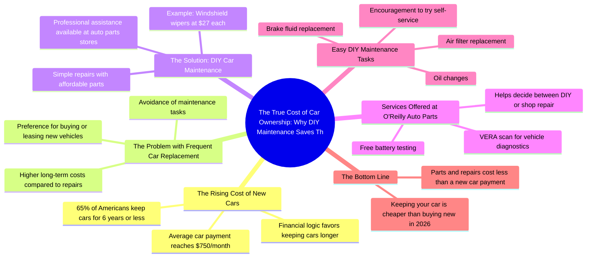

# Average New Car Payment Hits $750 Monthly

> 🌐 **Read this in:** [English](../../en/2026-07/tiktok-transcript-the-average-new-car-payment-nearly-750-dollars-a-month-now-o-e2b6.md) · **中文**

> **Creator:** [@humphreytalks](https://www.tiktok.com/@humphreytalks) · **Views:** 3.9M · **Posted:** 2026-07-08 · **Niche:** finance
>
> **TL;DR:** Opens with a surprising dollar amount to grab attention immediately.

[Watch original video →](https://vt.tiktok.com/ZSCwGuoya/)

## Why This Went Viral

## 钩子（前3秒）
- **逐字开场白：**“每月750美元？为什么这成了现在美国平均车贷的新标准？”
- **钩子模式：****数字+大胆断言**——一个令人震惊的金额（750美元）搭配一个反问句。
- **为何能阻止用户划走：**这个数字高得离谱（大多数人预期约500美元），瞬间引发财务焦虑。问题暗示“你被宰了”，迫使观众留下来寻找答案。

## 情绪节奏
1. **震惊/焦虑**——750美元的车贷像一记重拳击中要害。
2. **共鸣**——“65%的美国人用车不超过六年”——观众认出了自己的行为。
3. **紧张感**——“但尽可能长时间地保留你的车在财务上要明智得多”——在人们实际做的和应该做的之间制造了差距。
4. **解脱/好奇**——“自己动手做简单的汽车维修……”——提供了解决方案的路径。
5. **建立信任**——奥莱利店的佩德罗免费为你服务（电池测试、VERA扫描）——降低了感知难度。
6. **满足感**——“那真是轻松无痛”——低摩擦的成功时刻。
7. **行动号召（赋能）**——“我鼓励你……尝试在奥莱利汽车配件店购买零件并自己动手。”
8. **高潮**——“保留你的车并支付零件和维修费用，仍然比在2026年买新车便宜得多”——用一个具体、面向未来的胜利闭环收尾。

## 关键词密度
| 关键词/短语 | 出现次数 | 驱动类型 |
|---|---|---|
| “车” | 8 | 算法驱动（广泛搜索） |
| “省钱”/“更便宜” | 4 | 情感+算法驱动（价值导向） |
| “自己”/“DIY” | 4 | 情感驱动（赋能） |
| “奥莱利汽车配件” | 3 | 品牌驱动（赞助/合作） |
| “保养” | 3 | 算法驱动（操作指南意图） |
| “零件” | 3 | 算法驱动（产品搜索） |
| “新车” | 3 | 对比钩子（旧车vs新车） |
| “实惠”/“仅需27美元” | 2 | 情感驱动（解脱、价格锚定） |
| “修理”/“维修” | 2 | 算法驱动（问题-解决方案） |
| “2026年” | 1 | 情感驱动（紧迫感、面向未来） |

**为何有效：**“车”和“保养”驱动搜索发现性。“省钱”、“自己”和“DIY”触发情感共鸣（节俭、独立）。“奥莱利汽车配件”是品牌回报——该视频本质上是一个包裹在病毒式传播格式中的原生广告。

## 为何能传播
1. **财务焦虑+具体解决方案**——开场“每月750美元”触发了一个普遍痛点。解决方案（“用实惠的零件自己动手”）具体、可实现且立即可行。*转录文本：“用实惠的零件自己动手做简单的汽车维修是省钱最简单的方法之一。”*
2. **低难度示范**——佩德罗免费为你服务（电池测试、VERA扫描、雨刮器安装）。这消除了“我不擅长动手”的反对意见。*转录文本：“奥莱利汽车配件店的佩德罗说他会帮我做，这真的很酷。”*
3. **社会证明+免费价值**——VERA扫描是一个免费诊断工具，为观众提供了清晰的下一步（“决定是我自己能修的，还是应该送去修理厂”）。*转录文本：“他还测试了我的电池，然后进行了VERA扫描……”*
4. **面向未来的紧迫感**——“仍然比在2026年买新车便宜得多”将行动框定为长期胜利，而不仅仅是一次性小技巧。*转录文本：“保留你的车并支付零件和维修费用，仍然比在2026年买新车便宜得多。”*
5. **通过共鸣实现可分享性**——65%的美国人用车不超过六年。这个统计数据让观众觉得“每个人都这么做，但这很蠢”——从而产生自然的分享冲动（“我的朋友需要看到这个”）。

## 你可以借鉴什么
1. **以令人震惊的数字+反问句开场**——以一个具体、充满情感的数字（750美元、1000美元、65%）和一个暗示观众错过了什么的问题开头。这迫使产生“我需要知道”的循环。
2. **嵌入一个免费、低摩擦的“英雄时刻”**——让专家或员工在镜头前为你做一件小事（免费电池测试、免费扫描、免费安装）。这让解决方案感觉毫不费力且值得信赖，而不是推销味十足。
3. **以未来锚定的比较收尾**——以一个具体年份（2026年、2027年）和直接的成本比较结束。这创造了紧迫感，并使这个技巧感觉像是一个战略决策，而不是随意的窍门。

## Mind Map

## Full Transcript (Generated by [免费 TikTok 文稿生成器](https://toktranscript.com/?utm_source=github&utm_medium=breakdown&utm_campaign=tool_attribution))

> 📝 Transcripts on this page are auto-generated and show the first 60%. Want to transcribe any TikTok in 30 seconds and get the full version? [Try TokTranscript free →](https://toktranscript.com/?utm_source=github&utm_medium=breakdown&utm_campaign=transcript_cta)

$750 a month? Why is that the new average car payment in America now? A recent survey showed that 65% of Americans keep their current cars for six years or less. But it makes so much more financial sense to keep your car for as long as you can. But many people don't want to deal with maintenance themselves, so they just end up buying or leasing a new car. But doing simple car repairs yourself with affordable parts is one of the easiest ways to save money. I found these windshield wipers for my car, and they only cost $27 each, so let's go replace them. So I was gonna do it myself, but then Pedro here at O'reilly Auto Parts said he would do it for me, which is really dope. He also tested my battery, and then he performed a VERA scan, which gives me a readout of what is wrong with my vehicle s

*[Read the full transcript on TokTranscript →](https://toktranscript.com/plaza/tiktok-transcript-the-average-new-car-payment-nearly-750-dollars-a-month-now-o-e2b6?utm_source=github&utm_medium=breakdown&utm_campaign=transcript_full)*

## Browse More

- All [finance](../../by-niche/zh-CN/finance.md) breakdowns
- All [Shocking Statistic](../../by-pattern/zh-CN/hook-shocking-statistic.md) examples

## Video Info

| | |
|---|---|
| Creator | [@humphreytalks](https://www.tiktok.com/@humphreytalks) |
| Original video | [https://vt.tiktok.com/ZSCwGuoya/](https://vt.tiktok.com/ZSCwGuoya/) |
| Original title | The average new car payment nearly $750 dollars a month now. One of t... |
| Views | 3.9M (3900000) |
| Posted | 2026-07-08 |
| Duration | 0s |
| Niche | `finance` |
| Hook pattern | `Shocking Statistic` |
| Original language | `en` (this page translated by AI) |
| Available languages | en, zh-CN |
| Generated | 2026-07-09 by [TokTranscript](https://toktranscript.com/) |

---

*This breakdown is for educational analysis under fair use. Original video © [@humphreytalks](https://www.tiktok.com/@humphreytalks). All transcripts are auto-generated and may contain errors.*

*Want to analyze your own TikToks like this? [TokTranscript →](https://toktranscript.com/viral-breakdown?utm_source=github&utm_medium=breakdown&utm_campaign=footer_cta)*