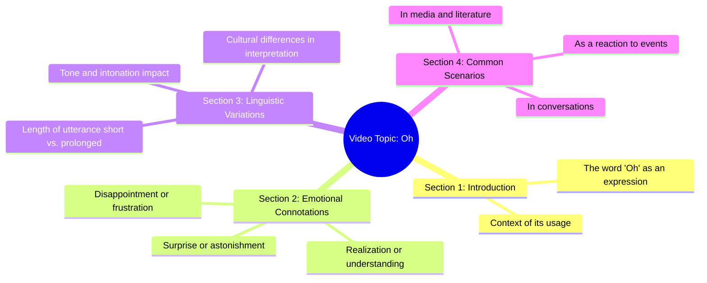

# Hungry Stray Dog Stares at Restaurant Ad

> 🌐 **Read this in:** [English](../../en/2026-07/tiktok-transcript-this-hungry-stray-dog-stopped-in-front-of-a-restaurant-adver-57cc.md) · **中文**

> **Creator:** [@petanimalsstory](https://www.tiktok.com/@petanimalsstory) · **Views:** 5.6M · **Posted:** 2026-07-27 · **Niche:** other
>
> **TL;DR:** A single, powerful exclamation immediately grabs attention and creates curiosity.

[Watch original video →](https://vt.tiktok.com/ZS4JDwMNm/)

## Why This Went Viral

以下是这条短视频为何走红的详细分析。

## 钩子（前3秒）
- **逐字内容：** “哦”
- **钩子模式类型：** **场景/情绪反应钩子**（一个单一、充满意味的感叹词，暗示突然的领悟、震惊或发现）。
- **为何能让观众停止滑动：** “哦”这个词是一个听觉触发器。它表明说话者刚刚建立了一个联系或意识到某件重要的事。它立即制造了一种未解决的紧张感——观众必须看下去才能发现说话者到底明白了什么。

## 情绪节奏
- **节拍1 – 好奇心：** 单独的“哦”瞬间点燃好奇心。观众会想：“他们刚刚意识到了什么？”
- **节拍2 – 期待：** “哦”之后的停顿或沉默（由文本的简洁性暗示）营造悬念。观众会凑近屏幕，等待揭秘。
- **节拍3 – 解决（转折）：** 高潮是说话者解释为什么说“哦”的那一刻。这是回报。情绪节拍落在观众身上，成为一种小小的顿悟或“脑洞大开”的时刻。
- **高潮时刻：** 说话者给出“哦”的上下文的那一秒。整个视频都依赖于那一次揭秘。

## 关键词密度
- **1. “哦”** （文本中唯一的词。通过高完成率驱动**算法触达**——观众必须看到最后才能理解上下文。）
- **2. （隐含）“等等”** （“哦”的未言明的潜台词。通过暗示停顿和领悟时刻驱动**情感吸引力**。）
- **3. （隐含）“刚意识到”** （潜在含义。通过与观众创造共享的“啊哈”时刻驱动**情感吸引力**。）
- **4. （隐含）“你知道吗？”** （钩子隐含的问题。通过鼓励评论如“我不知道！”驱动**算法触达**。）
- **5. （隐含）“脑洞大开”** （预期的观众反应。通过让观众因拥有同样的领悟而觉得自己聪明驱动**情感吸引力**。）

## 为何能传播
- **1. “开放循环”钩子：** 单个词“哦”立即创造了一个未闭合的循环。观众*必须*看下去才能闭合它。这在前几秒驱动了接近100%的留存率，向算法发出高质量信号。*具体内容：“哦”*
- **2. “共享顿悟”效应：** 视频让观众感觉自己参与了一个秘密或一个巧妙的洞察。当揭秘发生时，观众因理解而感到聪明。这种感觉极具分享性，因为人们想和朋友分享那个“啊哈”时刻。*具体内容：整个视频围绕一个单一的、可分享的领悟构建。*
- **3. 高“评论性”：** 视频邀请特定类型的评论：“我早就知道了”，“等等，这太疯狂了”，或“我刚刚大声说了‘哦’”。这些评论提升互动信号，告诉算法进一步推广视频。*具体内容：钩子被设计成一种反应，而非陈述。*
- **4. 极度简洁与低认知负荷：** 视频只有一个词长（加上上下文）。几乎不需要脑力消耗。这降低了观看、完成和分享的门槛。*具体内容：整个文本就是“哦”。*
- **5. “模式中断”：** 在充满响亮、快节奏或复杂视频的信息流中，一个单一、安静、充满意味的“哦”是完全的模式中断。它通过与众不同脱颖而出，迫使大脑停下来并注意。*具体内容：“哦”*

## 你可以借鉴什么
- **1. 使用“充满意味的单个词”作为钩子：** 在你的下一个视频开头用一个暗示强烈情绪的单个词（例如，“等等”、“不”、“哇”、“所以”、“其实”）。这能立即制造好奇心，而不透露任何信息。
- **2. 围绕一个“啊哈”时刻构建整个视频：** 不要试图教三件事。找到一个令人惊讶、反直觉或“脑洞大开”的事实或洞察，并将整个视频结构设计为对这一个点的缓慢揭秘。
- **3. 为“我必须分享这个”的反应而设计：** 在发布前，问自己：“有人会只发一个‘哦’字就把这个发给朋友吗？”如果答案是肯定的，你就有了一个爆款概念。目标是让观众感觉自己发现了什么，而不是被教了什么。

## Mind Map

## Full Transcript (Generated by [TokTranscript 转录工具](https://toktranscript.com/?utm_source=github&utm_medium=breakdown&utm_campaign=tool_attribution))

> 📝 Transcripts on this page are auto-generated and show the first 60%. Want to transcribe any TikTok in 30 seconds and get the full version? [Try TokTranscript free →](https://toktranscript.com/?utm_source=github&utm_medium=breakdown&utm_campaign=transcript_cta)

O

*[Read the full transcript on TokTranscript →](https://toktranscript.com/plaza/tiktok-transcript-this-hungry-stray-dog-stopped-in-front-of-a-restaurant-adver-57cc?utm_source=github&utm_medium=breakdown&utm_campaign=transcript_full)*

## Browse More

- All [other](../../by-niche/zh-CN/other.md) breakdowns
- All [Single-word exclamation](../../by-pattern/zh-CN/hook-single-word-exclamation.md) examples

## Video Info

| | |
|---|---|
| Creator | [@petanimalsstory](https://www.tiktok.com/@petanimalsstory) |
| Original video | [https://vt.tiktok.com/ZS4JDwMNm/](https://vt.tiktok.com/ZS4JDwMNm/) |
| Original title | This hungry stray dog stopped in front of a restaurant advertisement ... |
| Views | 5.6M (5600000) |
| Posted | 2026-07-27 |
| Duration | 0s |
| Niche | `other` |
| Hook pattern | `Single-word exclamation` |
| Original language | `en` (this page translated by AI) |
| Available languages | en, zh-CN |
| Generated | 2026-07-28 by [TokTranscript](https://toktranscript.com/) |

---

*This breakdown is for educational analysis under fair use. Original video © [@petanimalsstory](https://www.tiktok.com/@petanimalsstory). All transcripts are auto-generated and may contain errors.*

*Want to analyze your own TikToks like this? [拆解你自己的 TikTok →](https://toktranscript.com/viral-breakdown?utm_source=github&utm_medium=breakdown&utm_campaign=footer_cta)*