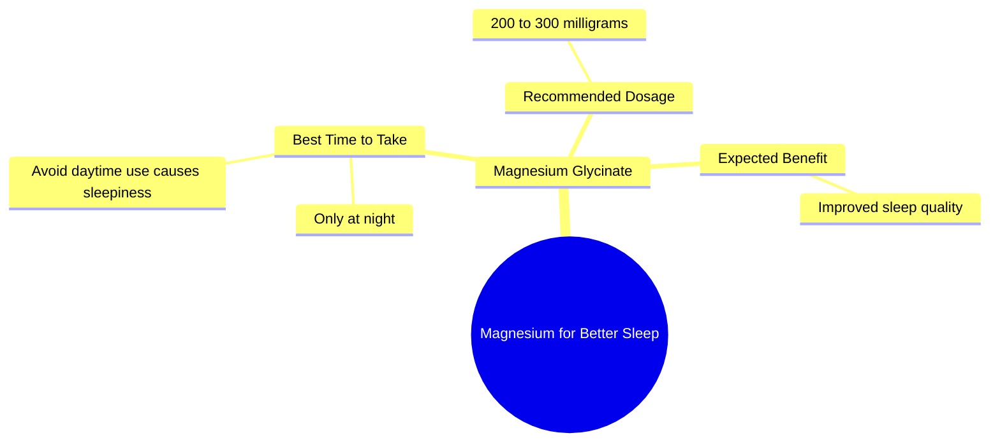

# Magnesium Glycinate For Better Sleep: Dosage Guide

> 🌐 **Read this in:** [English](../../en/2026-07/tiktok-transcript-this-supplement-will-change-your-life-menopause-magnesium-su-603d.md) · **中文**

> **Creator:** [@drmartinkinsella](https://www.tiktok.com/@drmartinkinsella) · **Views:** 3.6M · **Posted:** 2026-07-01 · **Niche:** fitness
>
> **TL;DR:** Starts with a strong, inclusive directive that immediately positions the advice as essential for a common problem.

[Watch original video →](https://www.tiktok.com/@drmartinkinsella/video/7400083642480905505?is_from_webapp=1&sender_device=pc&web_id=7652559874152564254)

## Why This Went Viral

## 钩子（前3秒）
- **原文：** "Everyone should take magnesium if they're struggling to sleep."
- **钩子模式：** 大胆断言 + 直接问题解决
- **为何能吸引人：** 这是一个针对普遍痛点（睡眠不佳）的全民健康主张（"每个人"）。权威语气（"应该"）立即引发好奇：*这是真的吗？我需要吗？*

## 情感节奏
- **节拍1 – 好奇：** "Everyone should take magnesium if they're struggling to sleep." → 观众心想，*我睡眠不好，快告诉我更多。*
- **节拍2 – 紧张/纠正：** "Magnesium glycinate should only be taken at night. If you take it in the day, you'll get sleepy." → 制造"恍然大悟"时刻（很多人用错了）。观众感觉*我可能做错了。*
- **节拍3 – 释然/清晰：** "Take 2 to 300 milligrams of that at night and see how much better you sleep." → 简单、可操作的剂量。以明确的回报化解紧张。
- **高潮：** 精确的剂量范围（"2 to 300 milligrams"）——感觉科学、可信、立即可用。

## 关键词密度
1. **镁** – 3次（核心主题，驱动搜索/算法）
2. **睡眠** – 3次（高流量痛点，情感吸引力）
3. **晚上** – 2次（时间具体性，建立信任）
4. **服用** – 3次（动作动词，驱动转化）
5. **毫克** – 1次（精确性，算法权威信号）
6. **甘氨酸盐** – 1次（具体形式，针对知情观众的长尾关键词）
- **算法驱动因素：** "镁"、"睡眠"——高搜索量，热门健康话题。
- **情感吸引力：** "挣扎"、"困倦"、"更好"——直接触及挫败感和希望。

## 为何能传播
1. **普遍问题，零门槛：** "Everyone should take magnesium" 消除了犹豫。不是"如果你缺乏"——而是包容性的指令。*原文：* "Everyone should take magnesium if they're struggling to sleep."
2. **纠正创造分享性：** 关于白天嗜睡的警告是一个"辟谣"时刻。用错的观众会忍不住与可能也犯同样错误的朋友分享。*原文：* "If you take it in the day, you'll get sleepy."
3. **可操作的具体性驱动收藏：** "2 to 300 milligrams at night" 是一个具体、可重复的指令。观众收藏视频以备后用，提升留存信号。*原文：* "Take 2 to 300 milligrams of that at night."
4. **简洁带来权威：** 没有废话，没有犹豫。简洁自信的节奏模仿医生建议。观众感知到高可信度，增加信任和分享意愿。*原文：* "Magnesium glycinate should only be taken at night."

## 你可以借鉴什么
1. **以普遍指令+痛点开头：** 用"Everyone should [做X] if they're struggling with [Y]" 开头。立即吸引有该问题的任何人。
2. **加入"纠错"节拍：** 添加一行揭示常见错误（例如，"most people take it wrong"）。这触发"我需要纠正"的情绪，提升分享性。
3. **以精确、编号的行动结尾：** 给出具体剂量、时间或数量。模糊的建议不会被收藏。"Take 2 to 300 milligrams at night" 是一个配方——观众会收藏它。

## Mind Map

## Full Transcript (Generated by [免费 TikTok 文稿生成器](https://toktranscript.com/?utm_source=github&utm_medium=breakdown&utm_campaign=tool_attribution))

> 📝 Transcripts on this page are auto-generated and show the first 60%. Want to transcribe any TikTok in 30 seconds and get the full version? [Try TokTranscript free →](https://toktranscript.com/?utm_source=github&utm_medium=breakdown&utm_campaign=transcript_cta)

Everyone should take magnesium if they're struggling to sleep. Magnesium glycinate should only be taken at night. If you take it in the day, 

*[Read the full transcript on TokTranscript →](https://toktranscript.com/plaza/tiktok-transcript-this-supplement-will-change-your-life-menopause-magnesium-su-603d?utm_source=github&utm_medium=breakdown&utm_campaign=transcript_full)*

## Browse More

- All [fitness](../../by-niche/zh-CN/fitness.md) breakdowns
- All [Universal Command](../../by-pattern/zh-CN/hook-universal-command.md) examples

## Video Info

| | |
|---|---|
| Creator | [@drmartinkinsella](https://www.tiktok.com/@drmartinkinsella) |
| Original video | [https://www.tiktok.com/@drmartinkinsella/video/7400083642480905505?is_from_webapp=1&sender_device=pc&web_id=7652559874152564254](https://www.tiktok.com/@drmartinkinsella/video/7400083642480905505?is_from_webapp=1&sender_device=pc&web_id=7652559874152564254) |
| Original title | This supplement will change your life! 🤯 #menopause #magnesium #suppl... |
| Views | 3.6M (3600000) |
| Posted | 2026-07-01 |
| Duration | 0s |
| Niche | `fitness` |
| Hook pattern | `Universal Command` |
| Original language | `en` (this page translated by AI) |
| Available languages | en, zh-CN |
| Generated | 2026-07-02 by [TokTranscript](https://toktranscript.com/) |

---

*This breakdown is for educational analysis under fair use. Original video © [@drmartinkinsella](https://www.tiktok.com/@drmartinkinsella). All transcripts are auto-generated and may contain errors.*

*Want to analyze your own TikToks like this? [免费 TikTok 文稿生成器 →](https://toktranscript.com/viral-breakdown?utm_source=github&utm_medium=breakdown&utm_campaign=footer_cta)*