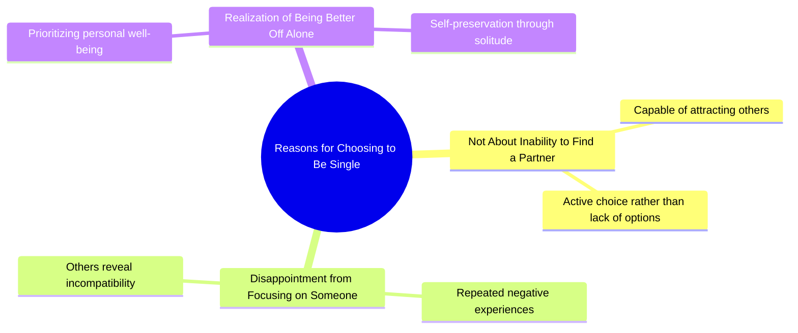

# Tom Hardy Explains Why He Chooses to Be Single

> 🌐 **Read this in:** [English](../../en/2026-07/tiktok-transcript-tom-hardy-motivation-tomhardy-relationshipgoals-relationship-9d4f.md) · **中文**

> **Creator:** [@jimmy__jon](https://www.tiktok.com/@jimmy__jon) · **Views:** 4.0M · **Posted:** 2026-07-02 · **Niche:** other
>
> **TL;DR:** The hook reframes a common assumption about singleness, creating intrigue and relatability.

[Watch original video →](https://www.tiktok.com/t/ZP8GBfDW1/)

## Why This Went Viral

## 钩子（前3秒）
- **逐字开场白：** "我单身不是因为没人要。我单身是因为每次我专注于某个人时，他们都会让我明白为什么我更适合一个人过。"
- **钩子模式：** 大胆断言 + 对比（对常见污名的负面重构）
- **为何能阻止滑动：** 它将受害者叙事翻转成赋权的自我认知。观众期待一个悲情故事（"我很孤独"），却得到了一个反叛而真实的共鸣。节奏（"我...我不是..."）制造了一种暗示脆弱的停顿，然后转折重重落下。

## 情感节奏
- **节拍1 – 好奇（0–2秒）：** "我单身不是因为没人要"——观众凑近，期待一个炫耀或借口。
- **节拍2 – 紧张（2–4秒）：** "每次我专注于某个人"——设定了一个失望的模式。
- **节拍3 – 共鸣（4–6秒）：** "他们都会让我明白为什么我更适合一个人过"——点睛之笔。观众感到被看见（被辜负的共同经历）。
- **节拍4 – 解脱/赋权（6–8秒）：** 情感释放。没有自怜，只有清醒。观众点头，而不是哭泣。
- **高潮：** 最后一句"更适合一个人过"——像麦克风掉落一样落地，而非哀叹。

## 关键词密度
| 词/短语 | 计数（约） | 驱动因素 |
|---------|-----------|---------|
| "单身" | 2 | 算法：高搜索、高身份关键词（约会领域） |
| "我不是" | 2 | 情感拉力：重构身份（反叛） |
| "因为" | 2 | 算法：因果连接词驱动留存（观众想要解释） |
| "每次" | 1 | 情感拉力：普遍模式，而非一次性事件 |
| "专注于某个人" | 1 | 情感拉力：可共鸣的行为（约会努力） |
| "让我明白" | 1 | 情感拉力：被动受害者 → 主动观察者 |
| "更适合一个人过" | 1 | 情感拉力：赋权结论，可分享的口头禅 |

**算法驱动因素：** "单身" + "因为" —— 高搜索量，高完成率（因果钩子）。  
**情感拉力：** "更适合一个人过" —— 粘性强，可引用，可作为标题或肯定语重新分享。

## 为何能传播
1. **重构被污名化的身份（单身 = 失败 → 单身 = 自尊）。** "我单身不是因为没人要"这句话直接攻击了常见的评判。对自己的单身状态感到防御的观众现在有了可以分享的武器。
2. **使用"模式中断"结构。** 停顿"我。我不是"暗示了原始、未经脚本的真实性。感觉像忏悔，而非剧本——这驱动信任和保存。
3. **以可引用的麦克风掉落结尾。** "更适合一个人过"是一个4字口头禅，可作为文字叠加、推文、简介。易于重复，易于混搭。
4. **触发"相同经历"算法。** "每次我专注于某个人，他们都会让我明白"暗示了一个重复模式——有过多次糟糕关系的观众会感到被针对。这驱动高完成率和类似"这说的就是我"的评论。
5. **没有行动号召，但高隐性分享性。** 视频不要求任何东西，但情感回报（"我更适合一个人过"）如此令人满足，以至于观众*想要*将其作为状态更新或群聊分享。

## 你可以借鉴什么
1. **以对常见标签的负面重构开头。** 拿一个污名（孤独、破产、混乱、焦虑）并将其翻转成力量宣言。"我破产不是因为懒惰。我破产是因为我拒绝为不重视我的人工作。"
2. **在前2秒使用言语停顿或犹豫。** "我。我不是..."暗示了真实感。录下自己开始句子，然后重新开始。它打破了精致TikTok的感觉，并建立了即时信任。
3. **以4-6字可独立存在的口头禅结尾。** 最后一句应该无需上下文即可引用。测试它：如果把它放在T恤上或作为文字叠加，它仍然有力吗？如果是，它就会传播。

## Mind Map

## Full Transcript (Generated by [TokTranscript](https://toktranscript.com/?utm_source=github&utm_medium=breakdown&utm_campaign=tool_attribution))

> 📝 Transcripts on this page are auto-generated and show the first 60%. Want to transcribe any TikTok in 30 seconds and get the full version? [Try TokTranscript free →](https://toktranscript.com/?utm_source=github&utm_medium=breakdown&utm_campaign=transcript_cta)

I'm. I'm not single because I can't get anyone. I'm single because every time I focus 

*[Read the full transcript on TokTranscript →](https://toktranscript.com/plaza/tiktok-transcript-tom-hardy-motivation-tomhardy-relationshipgoals-relationship-9d4f?utm_source=github&utm_medium=breakdown&utm_campaign=transcript_full)*

## Browse More

- All [other](../../by-niche/zh-CN/other.md) breakdowns
- All [Contradiction/Reframe](../../by-pattern/zh-CN/hook-contradiction-reframe.md) examples

## Video Info

| | |
|---|---|
| Creator | [@jimmy__jon](https://www.tiktok.com/@jimmy__jon) |
| Original video | [https://www.tiktok.com/t/ZP8GBfDW1/](https://www.tiktok.com/t/ZP8GBfDW1/) |
| Original title | Tom Hardy motivation #tomhardy #relationshipgoals #relationships #rel... |
| Views | 4.0M (4000000) |
| Posted | 2026-07-02 |
| Duration | 0s |
| Niche | `other` |
| Hook pattern | `Contradiction/Reframe` |
| Original language | `en` (this page translated by AI) |
| Available languages | en, zh-CN |
| Generated | 2026-07-03 by [TokTranscript](https://toktranscript.com/) |

---

*This breakdown is for educational analysis under fair use. Original video © [@jimmy__jon](https://www.tiktok.com/@jimmy__jon). All transcripts are auto-generated and may contain errors.*

*Want to analyze your own TikToks like this? [TokTranscript 转录工具 →](https://toktranscript.com/viral-breakdown?utm_source=github&utm_medium=breakdown&utm_campaign=footer_cta)*