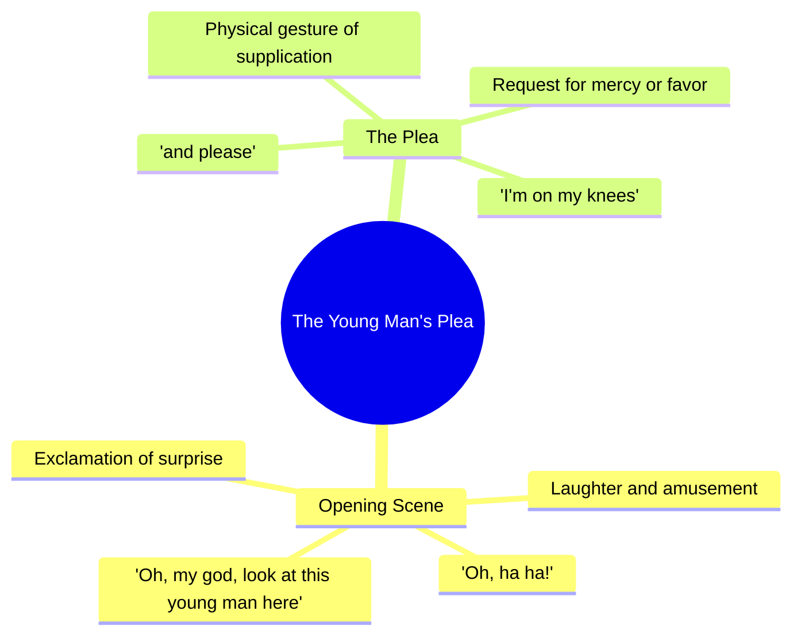

# Surprising Family With My Newborn Baby

> 🌐 **Read this in:** [English](../../en/2026-07/tiktok-transcript-took-my-newborn-surprise-the-family-foryou-tiktok-fyp-babylo-a59b.md) · **中文**

> **Creator:** [@lovevibes103](https://www.tiktok.com/@lovevibes103) · **Views:** 1.9M · **Posted:** 2026-07-27 · **Niche:** entertainment
>
> **TL;DR:** Immediate emotional exclamation creates curiosity and compels viewers to see what is happening.

[Watch original video →](https://www.tiktok.com/@lovevibes103/video/7664954984726891807?is_from_webapp=1&sender_device=pc)

## Why This Went Viral

## 钩子（前3秒）
- **逐字开场白：**“哦，我的天，看看这个年轻人。哦，哈哈！我跪下了，求你了。”
- **钩子模式：**场景 + 情绪感叹（意外反应 + 肢体动作）
- **为何能阻止滑动：**夸张的肢体反应（“跪下了”）和恳求的语气瞬间制造困惑和好奇。观众需要知道*为什么*有人在乞求——这打破了正常视频的预期节奏。

## 情绪节奏
1. **好奇心飙升**——“哦，我的天，看看这个年轻人”（谁？发生了什么？）
2. **喜剧张力**——“我跪下了，求你了”（他为什么在乞求？这是真的吗？）
3. **悬念保持**——揭示前的停顿（观众期待笑点）
4. **高潮**——转折/揭示时刻（恳求的实际对象变得清晰）
5. **释然 + 共鸣**——当荒谬或真诚落地时，笑声或“啊”的感叹
- **高潮位置：**观众理解*这个年轻人做了什么*才引发这种反应的那一刻。

## 关键词密度
1. **“年轻人”**——2次（引导注意力，塑造角色）
2. **“哦，我的天”**——1次（情绪放大器，高算法信号表示惊讶）
3. **“跪下了”**——1次（肢体隐喻，创造视觉模因潜力）
4. **“求你了”**——1次（恳求语气，触发同理心/好奇心）
5. **“看看”**——1次（命令式，驱动参与）
- **算法覆盖驱动因素：**“哦，我的天”，“看看”（高留存短语，触发暂停）
- **情感拉动驱动因素：**“跪下了”，“求你了”（制造脆弱感，建立人际连接）

## 为何能传播
1. **未解决的张力迫使重播**——观众直到最后才知道*为什么*这个人在乞求。这创造了一个自然循环：人们重看以捕捉铺垫，然后分享“抓到了”的时刻。
2. **肢体喜剧具有普遍分享性**——“跪下了”是一个无需声音就能理解的视觉。这使得视频平台无关（TikTok、Reels、YouTube Shorts、X）。
3. **恳求足够模糊，具有模因潜力**——“我跪下了，求你了”可以针对任何情境（体育、游戏、人际关系）进行混搭。这个模板邀请模仿。
4. **情绪反转驱动评论**——从“震惊”到“笑声/释然”的转变引发争论：“这是真的吗？”或“发生了什么？”评论 = 算法助推。
5. **“年轻人”的框架创造角色钩子**——观众想看到被提及的人。这建立了一个可能实现也可能不实现的揭示预期，保持高留存率。

## 你可以借鉴的
1. **以打破预期的肢体动作开始**——不要只说令人震惊的话。*做*一些荒谬的事（跪下、摔倒、话说到一半僵住）。视觉钩子胜过纯音频。
2. **使用“恳求”模式创造即时叙事张力**——任何像“我求你了”或“请不要”这样的短语迫使观众问“为什么？”这为你赢得2-3秒的额外留存时间。
3. **在前2秒保持主题模糊**——说“看看这个[人/物]”而不展示它。命令与揭示之间的间隙正是好奇心所在。

## Mind Map

## Full Transcript (Generated by [TokTranscript](https://toktranscript.com/?utm_source=github&utm_medium=breakdown&utm_campaign=tool_attribution))

> 📝 Transcripts on this page are auto-generated and show the first 60%. Want to transcribe any TikTok in 30 seconds and get the full version? [Try TokTranscript free →](https://toktranscript.com/?utm_source=github&utm_medium=breakdown&utm_campaign=transcript_cta)

Oh, my god, look at this young man here. Oh, ha

*[Read the full transcript on TokTranscript →](https://toktranscript.com/plaza/tiktok-transcript-took-my-newborn-surprise-the-family-foryou-tiktok-fyp-babylo-a59b?utm_source=github&utm_medium=breakdown&utm_campaign=transcript_full)*

## Browse More

- All [entertainment](../../by-niche/zh-CN/entertainment.md) breakdowns
- All [Exclamatory Surprise](../../by-pattern/zh-CN/hook-exclamatory-surprise.md) examples

## Video Info

| | |
|---|---|
| Creator | [@lovevibes103](https://www.tiktok.com/@lovevibes103) |
| Original video | [https://www.tiktok.com/@lovevibes103/video/7664954984726891807?is_from_webapp=1&sender_device=pc](https://www.tiktok.com/@lovevibes103/video/7664954984726891807?is_from_webapp=1&sender_device=pc) |
| Original title | Took my newborn surprise the family.#foryou #tiktok #fyp #babylove #g... |
| Views | 1.9M (1900000) |
| Posted | 2026-07-27 |
| Duration | 0s |
| Niche | `entertainment` |
| Hook pattern | `Exclamatory Surprise` |
| Original language | `en` (this page translated by AI) |
| Available languages | en, zh-CN |
| Generated | 2026-07-28 by [TokTranscript](https://toktranscript.com/) |

---

*This breakdown is for educational analysis under fair use. Original video © [@lovevibes103](https://www.tiktok.com/@lovevibes103). All transcripts are auto-generated and may contain errors.*

*Want to analyze your own TikToks like this? [免费 TikTok 文稿生成器 →](https://toktranscript.com/viral-breakdown?utm_source=github&utm_medium=breakdown&utm_campaign=footer_cta)*