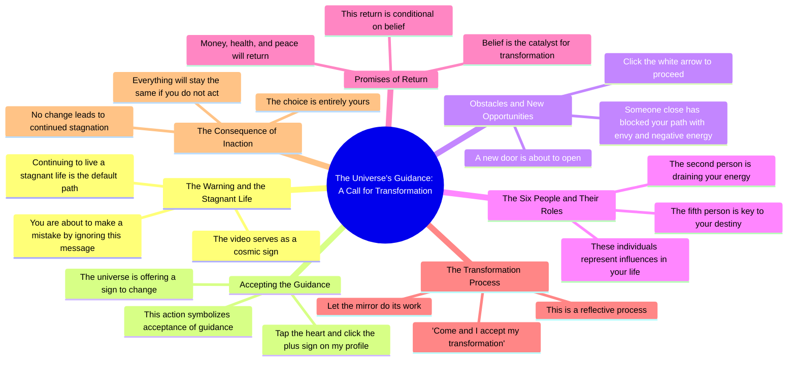

# Universe Tarot Warning: Stop Ignoring This Sign

> 🌐 **Read this in:** [English](../../en/2026-07/tiktok-transcript-universe-tarotok-viral-tarot-foryou-fypviraltiktok-tarotr-fc1e.md) · **中文**

> **Creator:** [@blythe.sidney8](https://www.tiktok.com/@blythe.sidney8) · **Views:** 1.5M · **Posted:** 2026-07-08 · **Niche:** entertainment
>
> **TL;DR:** Creates immediate tension and fear of missing out.

[Watch original video →](https://www.tiktok.com/t/ZP8G9SywS/)

## Why This Went Viral

## 钩子（前3秒）
- **逐字开场白：**“你即将犯下一个错误。你会忽略这个视频，继续过着停滞不前的生活。”
- **钩子模式：****大胆断言 + 直接对话**（指责性、对抗性、个性化）
- **为何能阻止滑动：**它立即制造认知失调——观众感觉被点名批评。“错误”一词触发错失恐惧症（FOMO），而“停滞不前的生活”的指责攻击了观众的自我形象，迫使他们观看以证明这个说法是错的或寻求认同。

## 情绪节奏
1. **紧迫感 + 恐惧**（0:00–0:05）——“你即将犯下一个错误……停滞不前的生活”→ 引发焦虑和自我怀疑
2. **希望 + 奖励**（0:05–0:10）——“宇宙正在给你一个信号……接受指引”→ 提供出路，带来解脱感
3. **怀疑 + 好奇**（0:10–0:15）——“某个亲近的人……用嫉妒挡住了你的路”→ 引入秘密敌人，制造神秘感
4. **期待 + 行动**（0:15–0:20）——“点击白色箭头……看看那六个人”→ 游戏化体验，观众成为参与者
5. **高潮**（0:20–0:25）——“第二个人正在消耗你的能量，但第五个人是你命运的关键”→ 最高张力，揭示隐藏真相
6. **解决 + 赋权**（0:25–0:30）——“财富、健康与平静将会回归……只要你相信”→ 为顺从提供明确奖励
7. **最后通牒**（0:30–结束）——“选择权在你手中”→ 将责任交给观众，创造收束感

## 关键词密度
| 关键词/短语 | 频率（约） | 功能 |
|---|---|---|
| **你 / 你的** | 12+ | 直接对话——算法参与度（高点击率、评论）+ 情感个性化 |
| **错误 / 停滞不前 / 消耗** | 4 | 恐惧触发——情感拉力，保持留存率 |
| **信号 / 指引 / 命运** | 4 | 灵性框架——情感共鸣，可分享性 |
| **接受 / 相信 / 转变** | 4 | 行动号召语言——驱动评论、收藏、分享 |
| **财富、健康、平静** | 3 | 普遍渴望——情感拉力，广泛吸引力 |
| **选择** | 2 | 赋权——驱动参与度（如“我选择”的评论） |
| **宇宙 / 能量 / 镜子** | 3 | 神秘/新时代词汇——在灵性领域的算法覆盖 |

**算法覆盖驱动因素：**“你”、“信号”、“宇宙”、“能量”——这些是灵性成长领域的高搜索量关键词。  
**情感拉力驱动因素：**“错误”、“停滞不前”、“消耗”、“命运”、“财富、健康、平静”——这些触发恐惧、希望和欲望。

## 为何能传播
1. **互动游戏化**——“点按爱心……点击白色箭头……看看那六个人”迫使观众采取实际行动。这增加了观看时间、收藏和分享，因为观众感觉自己在参与一个仪式，而不仅仅是观看内容。*证据：“点击白色箭头，看看出现的六个人。”*

2. **个性化威胁 + 奖励循环**——视频声称知道关于观众的某些具体信息（“某个亲近的人……挡住了你的路”）。这制造了专属感和紧迫感，促使观众分享以查看其他人是否收到相同的信息。*证据：“某个亲近你的人用嫉妒挡住了你的路。”*

3. **低门槛、高风险的行动号召**——“来吧，我接受我的转变”是一个简单的短语，观众可以评论或重复，从而产生参与信号。最后通牒（“如果你不这样做，一切都会保持不变”）提高了不作为的感知成本。*证据：“选择权在你手中。”*

4. **对被落下的普遍恐惧**——开场将忽略视频定义为改变人生的错误。这利用了错失恐惧症和存在焦虑，迫使观众观看以避免后悔。*证据：“你会忽略这个视频，继续过着停滞不前的生活。”*

5. **神秘感 + 社会认同诱饵**——“看看出现的六个人”暗示视频将揭示隐藏的敌人或盟友。这制造了悬念，推动完播率，并鼓励观众@朋友。*证据：“第二个人正在消耗你的能量，但第五个人是你命运的关键。”*

## 你可以借鉴什么
1. **以直接指责或预测开场**——以“你即将……”或“如果你……你就犯错了”开头。这立即制造紧张感，迫使观众观看以寻求解决。适用于任何领域（健身：“你即将浪费你的锻炼”；商业：“你即将失去一个客户”）。

2. **构建逐步的互动仪式**——给观众2-3个简单的物理动作（点击、点按、评论一个词），感觉像秘密握手。这增加了参与度指标，并使视频感觉像个性化体验。使用“宇宙正在给你一个信号”或“接受指引”等短语，将其框定为有意义的行为。

3. **以二元选择/最后通牒结尾**——以“选择权在你手中”或“只要你相信”结束。这迫使观众做出心理承诺，并驱动评论（人们会说“我接受”或“我选择”）。它还创造了赋权感，使观众更有可能分享。

## Mind Map

## Full Transcript (Generated by [TokTranscript 转录工具](https://toktranscript.com/?utm_source=github&utm_medium=breakdown&utm_campaign=tool_attribution))

> 📝 Transcripts on this page are auto-generated and show the first 60%. Want to transcribe any TikTok in 30 seconds and get the full version? [Try TokTranscript free →](https://toktranscript.com/?utm_source=github&utm_medium=breakdown&utm_campaign=transcript_cta)

You're about to make a mistake. You're going to ignore this video and continue living a stagnant life. But if you're watching this, the universe is giving you a sign. Tap the heart and click the plus sign on my profile to accept the guidance. Someone close to you has blocked your path with envy and negative energy, but a new door is about to open. Click the white arrow and look at the six people who appear. T

*[Read the full transcript on TokTranscript →](https://toktranscript.com/plaza/tiktok-transcript-universe-tarotok-viral-tarot-foryou-fypviraltiktok-tarotr-fc1e?utm_source=github&utm_medium=breakdown&utm_campaign=transcript_full)*

## Browse More

- All [entertainment](../../by-niche/zh-CN/entertainment.md) breakdowns
- All [Urgent Warning](../../by-pattern/zh-CN/hook-urgent-warning.md) examples

## Video Info

| | |
|---|---|
| Creator | [@blythe.sidney8](https://www.tiktok.com/@blythe.sidney8) |
| Original video | [https://www.tiktok.com/t/ZP8G9SywS/](https://www.tiktok.com/t/ZP8G9SywS/) |
| Original title | #universe #tarotok #viral #tarot #foryou #fypviraltiktok🖤シ゚☆♡ #tarotr... |
| Views | 1.5M (1500000) |
| Posted | 2026-07-08 |
| Duration | 0s |
| Niche | `entertainment` |
| Hook pattern | `Urgent Warning` |
| Original language | `en` (this page translated by AI) |
| Available languages | en, zh-CN |
| Generated | 2026-07-09 by [TokTranscript](https://toktranscript.com/) |

---

*This breakdown is for educational analysis under fair use. Original video © [@blythe.sidney8](https://www.tiktok.com/@blythe.sidney8). All transcripts are auto-generated and may contain errors.*

*Want to analyze your own TikToks like this? [TokTranscript →](https://toktranscript.com/viral-breakdown?utm_source=github&utm_medium=breakdown&utm_campaign=footer_cta)*