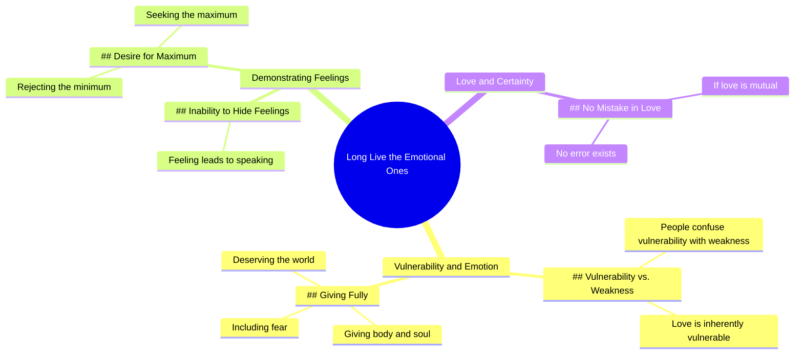

# Long Live the Emotional Ones - Aléxia Porto

> 🌐 **Read this in:** [English](../../en/2026-07/tiktok-transcript-vida-longa-aos-emocionados-al-xia-porto-poesia-poesias-alexi-60fd.md) · **中文**

> **Creator:** [@_alexiaporto](https://www.tiktok.com/@_alexiaporto) · **Views:** 870.5K · **Posted:** 2026-07-17 · **Niche:** entertainment
>
> **TL;DR:** Opens with a rallying cry that reframes vulnerability as strength, instantly engaging viewers who feel misunderstood.

[Watch original video →](https://vt.tiktok.com/ZSXfUjqCW/)

## Why This Went Viral

## 钩子（前3秒）
- **逐字开场白：**"情感丰富的人万岁"
- **钩子模式：**大胆宣言 / 号召口号
- **为何能让人停下滑动：**它发出一种宣言式、近乎反叛的肯定，立即认可了特定身份（"情感丰富的人"）。那些感到被误解或被贴上"太情绪化"标签的观众会觉得自己被看见了，从而产生即时共鸣，并有了继续观看以寻求认同的理由。

## 情感节奏
- **节拍1 – 认可与反抗：**"情感丰富的人万岁" → 自豪，被看见。
- **节拍2 – 澄清与张力：**"人们把脆弱误认为软弱" → 制造小对比，纠正常见误解。
- **节拍3 – 情感深度：**"爱是脆弱的……那些全身心投入的人" → 加深共鸣，从防御转向赞美。
- **节拍4 – 个人宣言（高潮）：**"我不知道如何隐藏我的感受。如果我有感觉，我很快就会说出来。" → 原始、不加修饰的自我袒露。这是顶峰——从普遍真理转向具体的个人证言。
- **节拍5 – 解决与要求：**"我不想要最低限度，我想要最大限度" → 以一个清晰、情感充沛且令人感到赋能的边界收尾。

## 关键词密度
- **情感（3次）** – 既推动算法覆盖（高参与度的身份标签），也增强情感吸引力（自我认同）
- **脆弱（2次）** – 心理学/自我成长领域的算法触发词；情感上引发共鸣
- **爱（2次）** – 普遍的情感核心；高分享性
- **全身心** – 富有诗意、直击内心的短语，提升记忆点和评论互动
- **最大限度/最低限度** – 对比组合，创造可引用、可分享的金句
- **感受/感觉（3次）** – 情感吸引词；推动评论区自我袒露

**算法驱动词：**"情感"、"脆弱"、"爱"——这些是心理健康、自我提升和关系类内容中高流量、低竞争的情感关键词。

**情感吸引力驱动词：**"全身心"、"最大限度/最低限度"、"说出来"——这些创造了令人难忘、可引用的句子，会被收藏和分享。

## 为何能传播
1. **身份认同的号召口号** – "情感丰富的人万岁"是一个可分享、近乎部落式的宣言。观众转发它来表明"这就是我"，而无需解释自己。
2. **纠正常见误解** – "人们把脆弱误认为软弱"触及了广泛存在的挫败感。这产生了"终于有人说了出来"的效果，推动评论和收藏。
3. **个人证言作为证明** – 从普遍真理转向"我不知道如何隐藏我的感受"让创作者变得脆弱，这与信息本身相呼应。这种真实性极具分享性，因为它感觉真实，而非照本宣科。
4. **可引用的对比句** – "我不想要最低限度，我想要最大限度"是一个有力、令人难忘的金句，可作为独立的标题、个人简介或文字叠加。它被设计成可复制粘贴的格式。
5. **情感收束+边界** – "如果我爱你，而你也想要我，那就没有错误"这句话提供了干净、令人安心的解决方案。它给观众一种情感上的清晰感，可应用于他们自己的关系，因此非常值得收藏。

## 你可以借鉴什么
1. **以宣言式的身份陈述开场** – 在你的下一个视频开头用"XX万岁"或类似大胆、肯定的短语，让特定受众在前两秒内感到被看见和认可。
2. **使用"纠正"模式** – 在钩子之后接上"人们把X误认为Y"，制造即时张力，并将自己定位为澄清被误解真相的人。这会推动同意或不同意的人参与互动。
3. **以可引用的对比句收尾** – 用简单的"我不想要A，我想要B"句式结尾。让它个人化，让它大胆。这将成为观众截图、收藏和转发的句子——将你视频的影响力扩展到平台之外。

## Mind Map

## Full Transcript (Generated by [TokTranscript](https://toktranscript.com/?utm_source=github&utm_medium=breakdown&utm_campaign=tool_attribution))

> 📝 Transcripts on this page are auto-generated and show the first 60%. Want to transcribe any TikTok in 30 seconds and get the full version? [Try TokTranscript free →](https://toktranscript.com/?utm_source=github&utm_medium=breakdown&utm_campaign=transcript_cta)

Long live the emotional ones People confuse a lot of vulnerability with emotion or weakness but they forget about the fact that love is vulnerable those who give themselves body and soul in fear and all those who know how to recognize and demonstrate this de

*[Read the full transcript on TokTranscript →](https://toktranscript.com/plaza/tiktok-transcript-vida-longa-aos-emocionados-al-xia-porto-poesia-poesias-alexi-60fd?utm_source=github&utm_medium=breakdown&utm_campaign=transcript_full)*

## Browse More

- All [entertainment](../../by-niche/zh-CN/entertainment.md) breakdowns
- All [Bold declaration](../../by-pattern/zh-CN/hook-bold-declaration.md) examples

## Video Info

| | |
|---|---|
| Creator | [@_alexiaporto](https://www.tiktok.com/@_alexiaporto) |
| Original video | [https://vt.tiktok.com/ZSXfUjqCW/](https://vt.tiktok.com/ZSXfUjqCW/) |
| Original title | Vida longa aos emocionados - Aléxia Porto #poesia #poesias #alexiapor... |
| Views | 870.5K (870500) |
| Posted | 2026-07-17 |
| Duration | 0s |
| Niche | `entertainment` |
| Hook pattern | `Bold declaration` |
| Original language | `en` (this page translated by AI) |
| Available languages | en, zh-CN |
| Generated | 2026-07-19 by [TokTranscript](https://toktranscript.com/) |

---

*This breakdown is for educational analysis under fair use. Original video © [@_alexiaporto](https://www.tiktok.com/@_alexiaporto). All transcripts are auto-generated and may contain errors.*

*Want to analyze your own TikToks like this? [TokTranscript →](https://toktranscript.com/viral-breakdown?utm_source=github&utm_medium=breakdown&utm_campaign=footer_cta)*