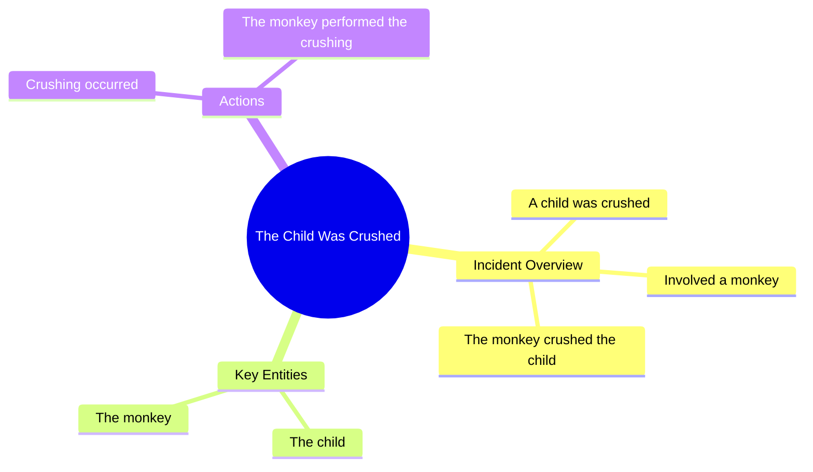

# We Don't Deserve Dogs

> 🌐 **Read this in:** [English](../../en/2026-07/tiktok-transcript-we-don-t-deserve-dogs-hopecore-wholesome-positivity-dogs-8129.md) · **中文**

> **Creator:** [@hopecore.o](https://www.tiktok.com/@hopecore.o) · **Views:** 23.3M · **Posted:** 2026-07-03 · **Niche:** other
>
> **TL;DR:** The hook jolts the viewer with an absurd, violent image that defies expectations.

[Watch original video →](https://www.tiktok.com/@hopecore.o/video/7636203479266102550?is_from_webapp=1&sender_device=pc)

## Why This Went Viral

## 钩子（前3秒）
- **逐字开场白：** "Саннна Song میں وی اوتھے 孩子被压碎了 猴子 你压碎了孩子"
- **钩子模式类型：** **场景+冲击/断裂叙事** —— 俄语、乌尔都语和英语的混乱混合，加上一句脱离上下文的暴力指控。
- **为何能阻止滑动：** 观众瞬间被多语种的胡言乱语和突然出现的刺耳短语"孩子被压碎了"搞得晕头转向。这种荒谬和潜在的危险感让人立刻产生"我刚才看到了什么？"的停顿。它打破了正常视频的预期模式，迫使大脑重新投入。

## 情绪节奏
1. **困惑/迷失方向**（0–2秒）：胡言乱语和刺耳的指控造成了认知缺口。
2. **紧张/不安**（2–4秒）："猴子 你压碎了孩子" —— 观众感受到一种黑色幽默与警觉的混合。
3. **荒谬/释放**（4–6秒）："猴子 你压碎了孩子"这句话如此离奇且毫无上下文，以至于变得滑稽。情绪重量从震惊转向大笑。
4. **共鸣/模因满足感**（6–10秒）：观众意识到这是一个刻意的荒诞模因 —— "压碎了孩子"的重复和无意义的结构成为了笑点。
- **高潮时刻：** "压碎了孩子"的第二次重复 —— 荒谬感达到顶峰，观众要么大笑，要么难以置信地分享。

## 关键词密度
- **"压碎了孩子"** —— 在前5秒内重复2–3次。驱动**情感拉力**（震惊、黑色幽默、荒谬）。
- **"猴子"** —— 出现一次，但它是荒谬对比（动物 vs. 孩子）的锚点。
- **"孩子"** —— 重复2次。驱动**算法覆盖**（高情绪、高参与度的词汇，能引发好奇心和安全标记）。
- **"你"** —— 直接指控，制造**个人紧张感**和第二人称参与感。
- **"歌" / "萨娜娜"** —— 无意义词汇，成为**模因诱饵**（可搜索、可转发、可混音）。

**算法驱动因素：** "孩子"、"压碎"、"猴子" —— 高参与度、高情绪的关键词，能推动观看时长和分享。
**情感驱动因素：** "压碎"、"孩子"、"你" —— 制造震惊、内疚和荒谬感。

## 为何能传播
1. **认知失调作为钩子：** 多语种胡言乱语（"Саннна Song میں وی اوتھے"）迫使观众重新阅读和重新处理。这增加了**停留时间**和**重看率** —— 两个关键的算法信号。*具体台词："Саннна Song میں وی اوتھے"*
2. **黑色幽默+荒谬=可分享的冲击：** "孩子被压碎了"这句话如此夸张且缺乏上下文，以至于变成了一个模因。人们分享它是为了说"看看这疯狂的东西"。*具体台词："孩子被压碎了"*
3. **未解之谜：** 视频从未解释*谁*压碎了孩子，*为什么*有猴子参与，或者那是什么*语言*。这创造了一个**评论诱饵**循环 —— 观众涌入评论区问"这是什么意思？"*具体台词："猴子 你压碎了孩子"*
4. **混音潜力：** 这种断裂的、几乎像AI生成的感觉使其非常适合混音、反应视频和字幕编辑。缺乏明确含义激发了创造性的重新诠释。*具体台词：整个文本结构。*

## 你可以借鉴什么
1. **使用断裂的多语种开场：** 用另一种语言的短语或无意义的词汇组合开始你的视频。这打破了算法的模式识别，迫使观众重新投入。*策略：用印地语、俄语或胡言乱语的随机短语开场，然后切入你的重点。*
2. **制造"虚假指控"钩子：** 使用一个明显荒谬的、针对第二人称的震惊指控（"你压碎了孩子"）。这能引发好奇心和情绪反应，而不会冒犯他人。*策略："你刚刚毁了整个项目" —— 然后揭示这说的是一个蛋糕。*
3. **让意义悬而未决：** 不要解释这个笑话。在不澄清荒谬前提的情况下结束视频。这能推动评论、分享和重看，因为人们试图"解开"它。*策略：用一个随机的、未解释的短语如"猴子 你压碎了孩子"结束，然后黑屏。*

## Mind Map

## Full Transcript (Generated by [免费 TikTok 文稿生成器](https://toktranscript.com/?utm_source=github&utm_medium=breakdown&utm_campaign=tool_attribution))

> 📝 Transcripts on this page are auto-generated and show the first 60%. Want to transcribe any TikTok in 30 seconds and get the full version? [Try TokTranscript free →](https://toktranscript.com/?utm_source=github&utm_medium=breakdown&utm_campaign=transcript_cta)

Саннна Song میں وی اوتھے The child was crushe

*[Read the full transcript on TokTranscript →](https://toktranscript.com/plaza/tiktok-transcript-we-don-t-deserve-dogs-hopecore-wholesome-positivity-dogs-8129?utm_source=github&utm_medium=breakdown&utm_campaign=transcript_full)*

## Browse More

- All [other](../../by-niche/zh-CN/other.md) breakdowns
- All [Shock non-sequitur](../../by-pattern/zh-CN/hook-shock-non-sequitur.md) examples

## Video Info

| | |
|---|---|
| Creator | [@hopecore.o](https://www.tiktok.com/@hopecore.o) |
| Original video | [https://www.tiktok.com/@hopecore.o/video/7636203479266102550?is_from_webapp=1&sender_device=pc](https://www.tiktok.com/@hopecore.o/video/7636203479266102550?is_from_webapp=1&sender_device=pc) |
| Original title | we don't deserve dogs #hopecore #wholesome #positivity #dogs |
| Views | 23.3M (23300000) |
| Posted | 2026-07-03 |
| Duration | 0s |
| Niche | `other` |
| Hook pattern | `Shock non-sequitur` |
| Original language | `en` (this page translated by AI) |
| Available languages | en, zh-CN |
| Generated | 2026-07-04 by [TokTranscript](https://toktranscript.com/) |

---

*This breakdown is for educational analysis under fair use. Original video © [@hopecore.o](https://www.tiktok.com/@hopecore.o). All transcripts are auto-generated and may contain errors.*

*Want to analyze your own TikToks like this? [TokTranscript →](https://toktranscript.com/viral-breakdown?utm_source=github&utm_medium=breakdown&utm_campaign=footer_cta)*