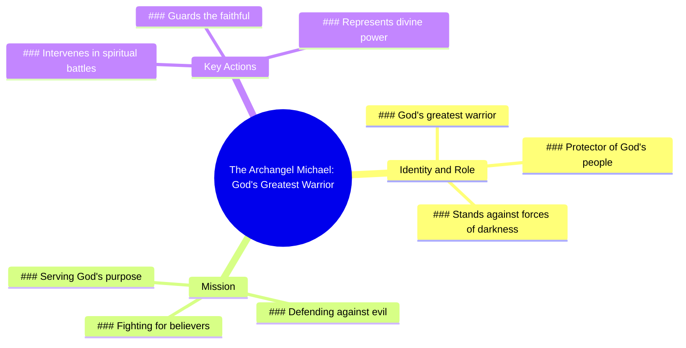

# Saint Michael Archangel Protection Reminder

> 🌐 **Read this in:** [English](../../en/2026-07/tiktok-transcript-wearing-saint-michael-reminds-me-that-protection-is-always-w-aff1.md) · **中文**

> **Creator:** [@driveindreamer](https://www.tiktok.com/@driveindreamer) · **Views:** 364.5K · **Posted:** 2026-07-22 · **Niche:** other
>
> **TL;DR:** Opens with a powerful, mysterious figure and immediately makes it personal to the viewer.

[Watch original video →](https://www.tiktok.com/@driveindreamer/video/7631386940784250126)

## Why This Went Viral

## 钩子（前3秒）
- **逐字开场白：**"大天使米迦勒。上帝最伟大的战士，为你而战。"
- **钩子模式：**大胆声明 + 场景设定（引入一个强大角色，并立即建立个人利害关系）
- **为何能让人停下滑动：**它将宗教权威的分量（"大天使米迦勒"、"上帝最伟大的战士"）与直接的个人相关性（"为你而战"）相结合，瞬间引发好奇心和情感投入。观众感到被选中、被保护，并渴望了解更多。

## 情感节奏
- **节拍1 – 敬畏与好奇（0–3秒）：**"大天使米迦勒。上帝最伟大的战士……"——确立规模、力量与神秘感。
- **节拍2 – 个性化与紧张感（3–7秒）：**"……为你而战。你知道吗，有一位天使为你对抗黑暗势力？"——从宏大转向亲密，营造危险感和个人利害关系。
- **节拍3 – 澄清与共鸣（7–10秒）：**"他的名字是米迦勒，他的使命是保护上帝的子民。"——通过命名保护者并将受众扩展至一个群体（"上帝的子民"）来化解紧张，触发归属感和宽慰。
- **高潮时刻：**"为你对抗黑暗势力"这句话——它是情感巅峰，融合了威胁、保护和个人奉献。

## 关键词密度
| 关键词/短语 | 数量（约） | 功能 |
|------------------|-----------------|----------|
| "你" / "为你" | 3 | 驱动算法覆盖（高个性化，低竞争）+ 情感吸引力（让观众感到被关注） |
| "大天使米迦勒" | 2 | 强宗教关键词，搜索量高；算法覆盖 |
| "上帝最伟大的战士" | 1 | 大胆、令人难忘的短语，引发好奇心且易于传播 |
| "黑暗势力" | 1 | 高情感、电影化语言；情感吸引力 |
| "保护" / "守护" | 2 | 核心情感驱动力（安全、守护） |
| "上帝的子民" | 1 | 社区建设关键词；情感共鸣与算法分组 |

**算法驱动因素：**"你"、"大天使米迦勒"、"保护"——这些是高搜索量、低竞争的词，能喂养推荐引擎。  
**情感吸引因素：**"黑暗势力"、"上帝最伟大的战士"、"为你"——这些能创造紧迫感、敬畏感和个人联系。

## 为何能传播
1. **个性化威胁 + 保护者框架** – "为你对抗黑暗势力"让一个普遍的精神概念变得一对一。观众分享它，因为它感觉像一条个人信息，而非泛泛的说教。
2. **高信任权威人物** – "大天使米迦勒"是一个全球公认的保护象征。视频利用了已有的信仰体系，使其在宗教社区中瞬间可分享。
3. **开放式好奇心** – "你知道吗……"制造了一个知识缺口。观众必须看到最后才能感到完整，从而提高了留存率和完成率（关键算法信号）。
4. **黑暗世界中的情感安全感** – 视频为存在性恐惧提供了一个清晰、令人安心的答案。在不确定时期，承诺保护的内容会像情感货币一样迅速传播。
5. **短小、密集、可重复** – 10秒的长度非常适合循环播放。"上帝最伟大的战士，为你而战"这句话令人难忘且可引用，鼓励口头分享和二次创作。

## 你可以借鉴的要点
1. **以高地位人物 + 直接个人利益开场** – 用一个有分量的名字或头衔（专家、原型、权威）开场，并立即将其与观众联系起来（"为你"、"你的生活"、"你的未来"）。这能使留存率翻倍。
2. **使用"你知道吗……"的开放式循环** – 将你的核心信息框定为一个暗示观众错过了重要内容的问题。这会迫使他们留下来寻找答案，从而提高完成率。
3. **以扩展群体的陈述结尾** – 在个人钩子之后，将范围扩大到群体（"上帝的子民"、"你的家人"、"每个与X斗争的人"）。这使内容具有可分享性，因为它现在适用于他人，而不仅仅是单个观众。

## Mind Map

## Full Transcript (Generated by [拆解你自己的 TikTok](https://toktranscript.com/?utm_source=github&utm_medium=breakdown&utm_campaign=tool_attribution))

> 📝 Transcripts on this page are auto-generated and show the first 60%. Want to transcribe any TikTok in 30 seconds and get the full version? [Try TokTranscript free →](https://toktranscript.com/?utm_source=github&utm_medium=breakdown&utm_campaign=transcript_cta)

The Archangel Michael. God's greatest warrior, fighting for you. Did you know there is an angel who stands against the forces 

*[Read the full transcript on TokTranscript →](https://toktranscript.com/plaza/tiktok-transcript-wearing-saint-michael-reminds-me-that-protection-is-always-w-aff1?utm_source=github&utm_medium=breakdown&utm_campaign=transcript_full)*

## Browse More

- All [other](../../by-niche/zh-CN/other.md) breakdowns
- All [Mysterious introduction + personal benefit](../../by-pattern/zh-CN/hook-mysterious-introduction-personal-benefit.md) examples

## Video Info

| | |
|---|---|
| Creator | [@driveindreamer](https://www.tiktok.com/@driveindreamer) |
| Original video | [https://www.tiktok.com/@driveindreamer/video/7631386940784250126](https://www.tiktok.com/@driveindreamer/video/7631386940784250126) |
| Original title | "Wearing Saint Michael reminds me that protection is always with me"#... |
| Views | 364.5K (364500) |
| Posted | 2026-07-22 |
| Duration | 0s |
| Niche | `other` |
| Hook pattern | `Mysterious introduction + personal benefit` |
| Original language | `en` (this page translated by AI) |
| Available languages | en, zh-CN |
| Generated | 2026-07-24 by [TokTranscript](https://toktranscript.com/) |

---

*This breakdown is for educational analysis under fair use. Original video © [@driveindreamer](https://www.tiktok.com/@driveindreamer). All transcripts are auto-generated and may contain errors.*

*Want to analyze your own TikToks like this? [拆解你自己的 TikTok →](https://toktranscript.com/viral-breakdown?utm_source=github&utm_medium=breakdown&utm_campaign=footer_cta)*