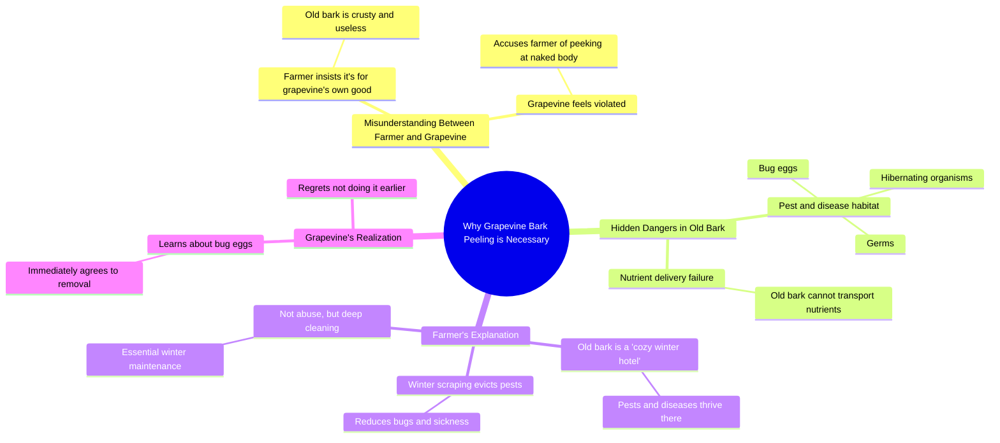

# Why Grapevine Bark Is Stripped in Winter

> 🌐 **Read this in:** [English](../../en/2026-07/tiktok-transcript-why-is-the-bark-of-grapevines-stripped-in-winter-60fe.md) · **中文**

> **Creator:** [@Dr.bananapu](https://www.tiktok.com/@Dr.bananapu) · **Views:** 694.6K · **Posted:** 2026-07-30 · **Niche:** entertainment
>
> **TL;DR:** Opens with a shocking accusation that immediately creates curiosity and tension.

[Watch original video →](https://www.facebook.com/reel/3256077654564312)

## Why This Went Viral

## 钩子（前3秒）
- **逐字开场白：** “嘿！你扒我的皮干嘛？”
- **钩子模式：** **对话驱动的冲突**（拟人化物体 vs. 人类）加上一个**令人震惊的问题**。
- **为何能让人停下滑动：** 观众听到一个非人类的声音发出看似荒谬的指控（“扒我的皮”），立刻产生认知失调。他们必须看下去才能解开这个荒谬之谜。

## 情绪节奏
1. **困惑/震惊**（0-3秒）：拟人化的葡萄藤提出抗议，观众被这个离奇设定震住。
2. **紧张/怀疑**（3-6秒）：农夫为自己的行为辩护，葡萄藤指责他变态（“偷看我的裸体”）。观众身体前倾。
3. **好奇/揭示**（6-12秒）：农夫说出“虫卵”“病菌”“冬眠”。荒谬感翻转成实用逻辑。
4. **释然/理解**（12-18秒）：葡萄藤突然同意（“那你咋不早说？”）。观众被这个反转逗笑。
5. **收尾/科普**（18-24秒）：农夫解释真正的农业原因。观众感到满足且学到了知识。
- **高潮时刻：** “等等！虫卵？”——从荒谬冲突转向现实实用性的关键转折点。

## 关键词密度
| 词语/短语 | 次数（约） | 驱动因素 |
|------------|------------|----------|
| **皮/树皮** | 5 | **算法触达**（可搜索的园艺术语）+ 情绪（恶心感） |
| **扒/剥掉** | 4 | **情绪拉动**（产生生理性反应） |
| **虫卵/病菌** | 3 | **算法触达**（病虫害防治的高互动关键词） |
| **老** | 3 | **情绪拉动**（将行为框定为必要而非残忍） |
| **冬天/大扫除** | 2 | **算法触达**（季节性、时效性内容） |
| **裸体** | 1 | **情绪拉动**（禁忌幽默，驱动评论和分享） |

- **算法驱动词：** “皮”“树皮”“虫卵”“冬天”——这些是园艺/DIY领域的高搜索量关键词。
- **情绪驱动词：** “裸体”“扒”“病菌”——这些触发厌恶、幽默和好奇心，提升观看时长和分享率。

## 为何能传播
1. **拟人化冲突创造即时情感投入。** 葡萄藤的抗议（“你扒我的皮干嘛？”）让观众对一个无生命物体产生关心。这是经过验证的故事钩子手法。
2. **“恶心感”转折触发分享欲。** “虫卵”和“病菌”的揭示足够恶心，让观众想给朋友看，但又不会恶心到让人反感。这是完美的“咦——但有意思”的临界点。
3. **科普反转颠覆预期。** 观众以为会是一个笑话或荒诞剧，结果却得到了一个真实的农业技巧。这种惊喜的学习时刻让视频显得有价值，增加收藏和分享。
4. **对话形式天然适合重看。** 一来一回的对话模仿小品，鼓励观众重看以捕捉笑点或知识点。那句点睛之笔（“这不是虐待，这是农夫的冬季大扫除”）朗朗上口，易于引用。
5. **季节性相关驱动搜索流量。** “冬季葡萄藤养护”是一个具体的高意向搜索词。视频用一个令人难忘的框架抓住了真实的痛点（病虫害防治）。

## 你可以借鉴什么
1. **将无生命物体拟人化，制造即时冲突。** 给植物、工具甚至一件家具赋予声音，让它反对必要的操作。这能立刻用荒诞感钩住观众。
2. **使用“恶心感→科普”的叙事弧线。** 从触发厌恶或震惊的内容开始（例如“虫卵”），然后转向实用的解释。这能让观众持续观看直到谜底揭晓。
3. **用一句话总结收尾。** 农夫的最后一句台词（“这不是虐待，这是农夫的冬季大扫除。”）简短、好记、易于分享。始终把教训总结成可以当推文或标题用的一句话。

## Mind Map

## Full Transcript (Generated by [免费 TikTok 文稿生成器](https://toktranscript.com/?utm_source=github&utm_medium=breakdown&utm_campaign=tool_attribution))

> 📝 Transcripts on this page are auto-generated and show the first 60%. Want to transcribe any TikTok in 30 seconds and get the full version? [Try TokTranscript free →](https://toktranscript.com/?utm_source=github&utm_medium=breakdown&utm_campaign=transcript_cta)

Hey! What are you peeling my skin for? I'm doing this for your own good! Peeling my skin is for my own good? Your skin's all old and crusty! It's not doing you any favors! I think you're just trying to peek at my naked body! It can't even deliver nutrients anymore! And it's full of bug eggs! Wait! Bug eggs? I had no idea! Take a good look! It's loaded with eggs and germs and they're all hibernating in there. You'd better strip off all that old bark now. If they grow up, you're gonna be 

*[Read the full transcript on TokTranscript →](https://toktranscript.com/plaza/tiktok-transcript-why-is-the-bark-of-grapevines-stripped-in-winter-60fe?utm_source=github&utm_medium=breakdown&utm_campaign=transcript_full)*

## Browse More

- All [entertainment](../../by-niche/zh-CN/entertainment.md) breakdowns
- All [False accusation / misunderstanding](../../by-pattern/zh-CN/hook-false-accusation-misunderstanding.md) examples

## Video Info

| | |
|---|---|
| Creator | [@Dr.bananapu](https://www.tiktok.com/@Dr.bananapu) |
| Original video | [https://www.facebook.com/reel/3256077654564312](https://www.facebook.com/reel/3256077654564312) |
| Original title | Why is the bark of grapevines stripped in winter? |
| Views | 694.6K (694611) |
| Posted | 2026-07-30 |
| Duration | 0s |
| Niche | `entertainment` |
| Hook pattern | `False accusation / misunderstanding` |
| Original language | `en` (this page translated by AI) |
| Available languages | en, zh-CN |
| Generated | 2026-07-31 by [TokTranscript](https://toktranscript.com/) |

---

*This breakdown is for educational analysis under fair use. Original video © [@Dr.bananapu](https://www.tiktok.com/@Dr.bananapu). All transcripts are auto-generated and may contain errors.*

*Want to analyze your own TikToks like this? [TikTok 转录工具 →](https://toktranscript.com/viral-breakdown?utm_source=github&utm_medium=breakdown&utm_campaign=footer_cta)*