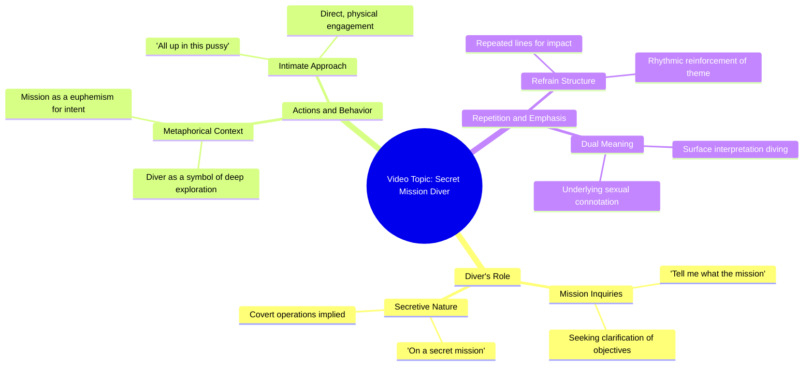

# Diver Describes Secret Mission Underwater

> 🌐 **Read this in:** [English](../../en/2026-07/tiktok-transcript-with-the-fishes-junus-e42a.md) · **中文**

> **Creator:** [@zah1de](https://www.tiktok.com/@zah1de) · **Views:** 2.2M · **Posted:** 2026-07-03 · **Niche:** entertainment
>
> **TL;DR:** The hook establishes a bold, memorable identity and immediately invites curiosity about the mission.

[Watch original video →](https://vt.tiktok.com/ZSCXXqSFr/)

## Why This Went Viral

## 钩子（前3秒）
- **逐字开场白：** "我是个潜水员，告诉我任务是什么，整个人都钻进这小穴里，就像在执行秘密任务"
- **钩子模式：** 场景 + 反差（将潜水隐喻与露骨性暗示意外结合，以面无表情的严肃语气呈现）
- **为何能让人停下滚动：** 专业"潜水员"身份与直白的性双关语并列，立即造成认知失调。观众会愣住，因为他们无法预测接下来会发生什么——这既荒谬、震撼又好笑。

## 情绪节奏
- **节拍1 – 震惊/困惑（0-2秒）：** 观众听到露骨台词，意识到这个荒谬的隐喻。
- **节拍2 – 好奇（2-4秒）：** 重复（"我是个潜水员，告诉我任务是什么"）形成节奏循环，暗示这是段子或梗，而非真实告白。
- **节拍3 – 紧张（4-6秒）：** 第二句以相同结构出现——观众等待笑点或转折。
- **节拍4 – 释然/大笑（6-8秒）：** 面无表情的表演和缺乏自我意识，使荒谬本身成为笑点。观众意识到这是恶搞。
- **高潮时刻：** 第二次重复"整个人都钻进这小穴里，就像在执行秘密任务"——此时模式已清晰，观众要么大笑，要么分享。

## 关键词密度
- **"潜水员"**（2次）—— 驱动核心隐喻；通过小众"潜水员"社群+荒谬性实现算法触达。
- **"任务"**（2次）—— 营造间谍/动作框架；从军事/动作关键词获得算法吸引力，从紧张感获得情感吸引力。
- **"秘密"**（1次）—— 强化间谍主题；排他性的情感吸引力。
- **"小穴"**（2次）—— 通过禁忌语制造冲击并推动病毒式传播；情感吸引力强，算法风险中等（但通过互动获得回报）。
- **"钻进"**（2次）—— 口语化、有节奏感的短语，令人印象深刻；提升可分享性。
- **"告诉我"**（2次）—— 模仿问答的命令结构；从对话模式获得算法吸引力。

## 为何能传播
1. **冲击+荒谬=被迫分享：** 露骨隐喻如此出人意料，以至于观众*必须*找别人确认自己没听错。"整个人都钻进这小穴里，就像在执行秘密任务"这句话正是可分享的瞬间。
2. **重复创造梗格式：** 两个相同的句子使其易于混搭、引用或改编。任何人都可以说"我是个[X]，告诉我[Y]是什么"——这个结构就是一个模板。
3. **面无表情的表演增加反讽层次：** 说话者不笑也不出戏。这暗示"这是个段子"，邀请观众因理解笑点而觉得自己聪明，从而增加互动。
4. **短时长（10秒以内）：** 视频大小完美适合循环播放。观众会重看以再次感受荒谬，提升留存指标。
5. **小众跨界吸引力：** 潜水社群+梗社群+冲击价值爱好者三者交汇，创造多个分享生态系统。

## 你可以借鉴什么
1. **使用意想不到的身份+露骨隐喻：** 选择一个平凡职业（水管工、会计、图书管理员），配合直白的双关语，面无表情地呈现。反差就是钩子。
2. **完全重复同一句话两次：** 重复暗示"这是个梗"，使片段适合循环。也降低了观众引用它的门槛。
3. **永远不破功：** 面无表情的表演才是荒谬感的关键。如果创作者笑了，视频就会失去病毒式传播的锐度。全身心投入这个段子。

## Mind Map

## Full Transcript (Generated by [TokTranscript](https://toktranscript.com/?utm_source=github&utm_medium=breakdown&utm_campaign=tool_attribution))

> 📝 Transcripts on this page are auto-generated and show the first 60%. Want to transcribe any TikTok in 30 seconds and get the full version? [Try TokTranscript free →](https://toktranscript.com/?utm_source=github&utm_medium=breakdown&utm_campaign=transcript_cta)

I'm a Diver, tell me what the mission, all up in this pussy like he on a secret mission I'm a Diver, tell

*[Read the full transcript on TokTranscript →](https://toktranscript.com/plaza/tiktok-transcript-with-the-fishes-junus-e42a?utm_source=github&utm_medium=breakdown&utm_campaign=transcript_full)*

## Browse More

- All [entertainment](../../by-niche/zh-CN/entertainment.md) breakdowns
- All [Identity + Call to Action](../../by-pattern/zh-CN/hook-identity-call-to-action.md) examples

## Video Info

| | |
|---|---|
| Creator | [@zah1de](https://www.tiktok.com/@zah1de) |
| Original video | [https://vt.tiktok.com/ZSCXXqSFr/](https://vt.tiktok.com/ZSCXXqSFr/) |
| Original title | With the fishes @Junus  |
| Views | 2.2M (2200000) |
| Posted | 2026-07-03 |
| Duration | 0s |
| Niche | `entertainment` |
| Hook pattern | `Identity + Call to Action` |
| Original language | `en` (this page translated by AI) |
| Available languages | en, zh-CN |
| Generated | 2026-07-06 by [TokTranscript](https://toktranscript.com/) |

---

*This breakdown is for educational analysis under fair use. Original video © [@zah1de](https://www.tiktok.com/@zah1de). All transcripts are auto-generated and may contain errors.*

*Want to analyze your own TikToks like this? [TikTok 转录工具 →](https://toktranscript.com/viral-breakdown?utm_source=github&utm_medium=breakdown&utm_campaign=footer_cta)*