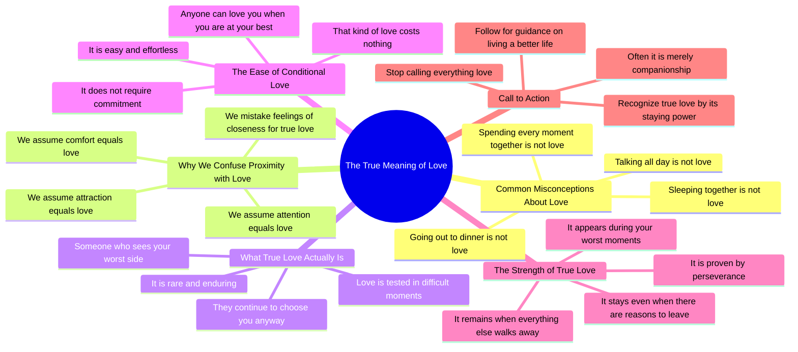

# True Love Stays When Everything Else Leaves

> 🌐 **Read this in:** [English](../../en/2026-08/tiktok-transcript-1-6m-views-26k-reactions-dormire-insieme-non-amore-parlare-t-d733.md) · **中文**

> **Creator:** [@Spiritualità Moderna](https://www.tiktok.com/@Spiritualità Moderna) · **Views:** 713.6K · **Posted:** 2026-08-27 · **Niche:** other
>
> **TL;DR:** The hook uses a series of relatable but false assumptions, immediately challenging the viewer's beliefs.

[Watch original video →](https://www.facebook.com/share/r/1EBWsGU6Bm/)

## Why This Went Viral

## 钩子（前3秒）
- **逐字开场白：**“睡在一起不是爱。”
- **钩子模式：** **对比/否定重置。** 它把一个普遍接受的假设翻转成一个否定性陈述。
- **为何能阻止滑动：** 它制造了即时的认知失调。观众*以为*睡在一起就是亲密，但说话者否定了这一点。这迫使观众做出一个微决策：“等等，那爱到底是什么？”——观众必须继续观看才能解开这个矛盾。

## 情绪节奏
1. **挑战/挑衅**（0:00–0:05）：“睡在一起不是爱。整天聊天不是爱。”——直接攻击观众的舒适区。
2. **困惑 → 好奇**（0:05–0:10）：“我们常常把亲近感误认为真爱。”——提供了一个理性的桥梁，在缓解紧张的同时加深了问题。
3. **层层递进的否定**（0:10–0:15）：“舒适不是爱。吸引力不是爱。关注不是爱。”——有节奏的重复制造出一种催眠式的递进，剥去所有虚假的替代品。
4. **转折/定义**（0:15–0:20）：“爱是有人看到你最糟糕的一面，仍然选择你。”——高潮。一个简洁、令人难忘的定义，重新框定了整个前提。
5. **验证**（0:20–0:30）：“任何人都能在你最好的时候爱你……真正的爱在你最糟糕的时候显现。”——用一个能引起共鸣的痛苦真相强化高潮。
6. **行动号召/收束**（0:30–0:40）：“别再什么都叫爱……真爱很稀有，你会认出它，因为它留下来。”——给出一个核心观点，然后转向后续的行动号召。

**高潮时刻：**“爱是有人看到你最糟糕的一面，仍然选择你”——这是会被引用、分享和截图的那句话。

## 关键词密度
- **爱：** 出现8次——核心主题；驱动算法主题分类。
- **不是：** 出现6次——结构性否定；创造修辞模式。
- **真（真正的）：** 出现3次——限定词，将信息从泛泛提升到令人向往。
- **陪伴：** 出现1次——制造“顿悟”时刻的尖锐对比词。
- **留下/留下来：** 出现2次——情感锚点；驱动“忠诚”主题。
- **最糟糕：** 出现2次——脆弱感触发器；驱动情感拉力。

**算法触达驱动词：**“爱”和“不是”（恋爱领域高搜索、高互动话题）。
**情感拉力驱动词：**“真”和“最糟糕”（触及不安全感与渴望被认可的心理）。

## 为何能传播
- **针对普遍的不安全感：**“我们常常把亲近感误认为真爱”——这句话直接说给每一个曾怀疑过自己感情的人。它验证了一种隐藏的恐惧，让观众感到*被看见*，并忍不住分享给伴侣或朋友（“这让我想起了我们”）。
- **值得截图的定义：**“爱是有人看到你最糟糕的一面，仍然选择你”——这是一句独立、可引用的金句。它在视频格式中充当“文字帖”，便于在Stories、推文或配文中转发。
- **“残酷真相”格式：**整个脚本是一系列否定句，拆解了常见的信念。这塑造了一种“严厉的爱”人设，显得权威可信。观众分享它，是为了在自己的主页上展现智慧（“我知道什么是真正的爱”）。
- **开放式闭环：**视频没有说*如何*找到这种爱——只说“你会认出它”。这留下了一个缺口，驱动评论区互动（“我怎么知道他是不是对的人？”）和关注（等待下一个视频）。
- **低门槛行动号召：**“如果你是新来的，记得关注我”——关注请求被包装成一个自我提升的承诺（“帮你过上更好的生活”），而不是自我推销的恳求。

## 你可以借鉴什么
1. **否定阶梯：**以3–5个简短有力的否定句开场，否定常见信念（“X不是Y。Z不是Y。”），制造节奏感和认知失调。然后给出一个简洁、清晰的定义，翻转整个叙事。
2. **“最糟糕时刻”测试：**围绕一个*脆弱阈值*构建你的信息——不是感觉好的时候，而是感觉糟的时候还能剩下什么。这会立刻提升你建议的感知价值。
3. **截图金句：**在脚本中间写一句可以独立成引文的话。让它成为高潮。如果观众截图了你的视频，你就赢了算法——他们会把它作为图片转发，把流量带回给你。

## Mind Map

## Full Transcript (Generated by [免费 TikTok 文稿生成器](https://toktranscript.com/?utm_source=github&utm_medium=breakdown&utm_campaign=tool_attribution))

> 📝 Transcripts on this page are auto-generated and show the first 60%. Want to transcribe any TikTok in 30 seconds and get the full version? [Try TokTranscript free →](https://toktranscript.com/?utm_source=github&utm_medium=breakdown&utm_campaign=transcript_cta)

Dormire insieme non è amore. Parlare tutto il giorno non è amore. Passare ogni momento insieme non è amore. Uscire a cena non è amore. Spesso confondiamo la sensazione di vicinanza con il vero amore. Pensiamo che solo perché qualcosa ci fa stare bene allora debba essere amore. Ma il conforto non è amore. L'attrazione non è amore. L'attenzione non è amore. L'amore è qualcuno che vede il lato peggiore di te e continua a sceglierti allo stesso modo. Chiunque può amarti quando sei al meglio. Quello è facile, non costa nulla. Il vero amore si manifesta qu

*[Read the full transcript on TokTranscript →](https://toktranscript.com/plaza/tiktok-transcript-1-6m-views-26k-reactions-dormire-insieme-non-amore-parlare-t-d733?utm_source=github&utm_medium=breakdown&utm_campaign=transcript_full)*

## Browse More

- All [other](../../by-niche/zh-CN/other.md) breakdowns
- All [Repetition with negation](../../by-pattern/zh-CN/hook-repetition-with-negation.md) examples

## Video Info

| | |
|---|---|
| Creator | [@Spiritualità Moderna](https://www.tiktok.com/@Spiritualità Moderna) |
| Original video | [https://www.facebook.com/share/r/1EBWsGU6Bm/](https://www.facebook.com/share/r/1EBWsGU6Bm/) |
| Original title | 1.6M views · 26K reactions | Dormire insieme non è amore. Parlare tutto il giorno non è amore. Passare ogni momento insieme non è amore. Uscire a cena non è amore. Spesso confondiamo la sensazione di vicinanza con il vero amore. Pensiamo che, solo perché qualcosa ci fa stare bene, allora debba essere amore. Ma il conforto non è amore. L'attrazione non è amore. L'attenzione non è amore. L'amore è qualcuno che vede il lato peggiore di te e continua a sceglierti allo stesso modo. È qualcuno che ti vede crollare e non se ne va. È qualcuno che conosce i tuoi difetti, le tue ferite, i tuoi momenti più bui... e decide comunque di restare. Chiunque può amarti quando sei al meglio. Quello è facile. Non costa nulla. Il vero amore si manifesta quando sei nel tuo momento peggiore, quando avrebbe tutte le ragioni per andarsene... e invece resta. Smetti di chiamare amore qualunque cosa. Molto spesso è soltanto compagnia. Il vero amore è raro. E lo riconoscerai perché rimane, quando tutto il resto se ne andrebbe. Se queste parole ti hanno fatto riflettere, scrivi “Vivere” nei commenti, e ti manderò gratis la raccolta delle 10 riflessioni più importanti del mio libro "Come vivere una vita migliore", da cui è stato ispirato questo reel. Leggile, e capirai come questo libro abbia già aiutato più di 3000 italiani a vivere meglio le proprie relazioni, il proprio lavoro e la propria vita.🙌🏻🍃 Sei d’accordo con ciò che ho detto?🔥 Doppiaggio a cura di: @ivanouli #spiritualità #vita #filosofia #gratitudine #crescitapersonale | Spiritualità Moderna |
| Views | 713.6K (713556) |
| Posted | 2026-08-27 |
| Duration | 0s |
| Niche | `other` |
| Hook pattern | `Repetition with negation` |
| Original language | `en` (this page translated by AI) |
| Available languages | en, zh-CN |
| Generated | 2026-08-28 by [TokTranscript](https://toktranscript.com/) |

---

*This breakdown is for educational analysis under fair use. Original video © [@Spiritualità Moderna](https://www.tiktok.com/@Spiritualità Moderna). All transcripts are auto-generated and may contain errors.*

*Want to analyze your own TikToks like this? [TikTok 转录工具 →](https://toktranscript.com/viral-breakdown?utm_source=github&utm_medium=breakdown&utm_campaign=footer_cta)*