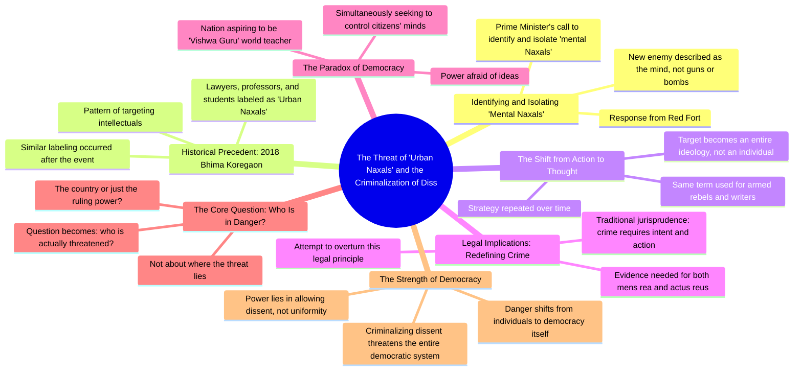

# Is It a Crime to Think in India Now?

> 🌐 **Read this in:** [English](../../en/2026-08/tiktok-transcript-1-7m-views-124k-reactions-is-it-a-crime-to-think-in-india-no-664b.md) · **中文**

> **Creator:** [@Vijender Chauhan](https://www.tiktok.com/@Vijender Chauhan) · **Views:** 1.5M · **Posted:** 2026-08-19 · **Niche:** other
>
> **TL;DR:** Opens with a provocative question that challenges the viewer's knowledge and creates immediate curiosity.

[Watch original video →](https://www.facebook.com/reel/1081511094771620/?mibextid=rS40aB7S9Ucbxw6v)

## Why This Went Viral

## 钩子（前3秒）
- **逐字开场白：**“这些思想纳萨尔派必须被识别出来，必须被隔离。你知道吗，这个国家最新的敌人是谁？”
- **钩子模式：**大胆断言 + 反问句（对比）。它抛出一个煽动性的、高度政治化的短语（“思想纳萨尔派”），并立即用“你知道新敌人是谁吗？”挑战观众。
- **为何能阻止滑动：**它利用了一个热门政治术语，制造了“我们 vs. 他们”的紧张感，并激将观众形成立场。“枪”与“思想”之间的对比令人震惊，激发强烈好奇。

## 情绪节奏
1. **愤怒/挑衅（0–3秒）：**“思想纳萨尔派”一词立即触发政治警觉。
2. **好奇（3–8秒）：**“这个国家最新的敌人是谁？”——观众必须看下去才能得到答案。
3. **紧张（8–15秒）：**提及2018年比马·科雷冈事件，并将律师、教授、学生标签为“城市纳萨尔派”——营造历史不公感。
4. **智识升级（15–25秒）：**从具体事件转向法律/哲学批判（法理学、意图与行为）——观众因跟上思路而自觉更聪明。
5. **共鸣/反转（25–35秒）：**“一个称自己为世界导师的国家，却想控制自己公民的思想”——讽刺感强烈冲击。
6. **高潮（35–45秒）：**转折点：“问题不再是危险在哪里……到底谁面临危险？”——将整个叙事从“外部敌人”翻转成“民主本身的危险”。
7. **收束（45秒至结尾）：**最后的哲学重击：“当异议被定为犯罪的那一天……危险就威胁到整个民主。”——留给观众一个令人深思、值得分享的结论。

## 关键词密度
- **思想纳萨尔派** — 3次。驱动算法触达（热门政治术语）+ 情绪吸引力（恐惧/愤怒）。
- **危险/威胁** — 4次。情绪锚点；制造紧迫感和利害关系。
- **权力/政权** — 3次。政治共鸣；驱动意识形态分享。
- **异议** — 2次。核心哲学价值；对民主受众的情绪吸引力。
- **犯罪** — 2次。法律/道德分量；触发追求正义的观众。
- **民主** — 2次。高情绪关键词；在政治活跃用户中具有算法触达力。
- **目标** — 2次。视觉化、威胁性意象；情绪吸引力。

## 为何能传播
- **挑衅性框架加反转：**视频将政府用语（“思想纳萨尔派”）重新语境化，将其描绘为对民主的威胁，而非对国家的威胁。这种反转（“国家面临危险，还是政权面临危险？”）是可分享的“顿悟时刻”——观众分享以传播反叙事。
- **历史锚定：**引用2018年比马·科雷冈事件（一个真实且有争议的事件）赋予论点事实分量。它暗示“这不是新事”——使视频感觉像揭露而非观点，提升可信度和分享率。
- **智识筹码逐步升级：**视频从新闻头条 → 历史模式 → 法律理论 → 哲学高潮。每一步都提升智识回报，让观众觉得获得了值得传递的洞见。
- **普适的民主吸引力：**最后几句（“异议是民主的力量”）超越党派界限。即使是温和派观众也可以将其作为“支持民主”的声明分享，扩大潜在分享群体，超越单一政治阵营。
- **情绪闭环但引发思考：**结尾不告诉观众该做什么——而是留给他们一个问题（“谁面临危险？”）。未解决的张力驱动评论、辩论和转发。

## 你可以借鉴什么
- **以热门短语加问题开场：**选取你领域（新闻、科技、文化）中已在流传的术语，立即挑战观众：“你知道这真正意味着什么吗？”——迫使参与。
- **用历史先例建立权威：**不要只陈述观点；将其锚定在过去的事件上（哪怕是5年前的）。这将热点评论转化为“模式揭示”，显得更有价值、更易分享。
- **以哲学转折而非结论收尾：**不要总结，而是将问题抛回给观众（“谁真正面临危险？”）。留给他们一句开放式的、有力的话，让人忍不住引用或争论——这就是评论区燃料。

## Mind Map

## Full Transcript (Generated by [TokTranscript](https://toktranscript.com/?utm_source=github&utm_medium=breakdown&utm_campaign=tool_attribution))

> 📝 Transcripts on this page are auto-generated and show the first 60%. Want to transcribe any TikTok in 30 seconds and get the full version? [Try TokTranscript free →](https://toktranscript.com/?utm_source=github&utm_medium=breakdown&utm_campaign=transcript_cta)

इन दिमागी नक्सलियों को पहचाना होगा, को आइसूलेट करना होगा क्या आपको पता चला देश का सबसे नया दुश्मन कौन है? बंदूक नहीं, बम नहीं, लाल किले से जवाब आया है दिमाग पधान मंत्री ने कहा दिमागी नकसल को पहचानो और आईसूलेट करो पर यह कोई नया खेल नहीं है 2018 में भीमा कोरे गाउं के बाद यही हुआ था लिखने पढ़ने वाले वकील, प्रोफेसर, विद्यार्थी, अर्बन नकसल कहे दिये गई और यह कोई संयोग नहीं है जब एक ही शब्द बंदूक उठाने वाले और कलम उठाने वाले दोनों के लिए इस्टेमाण होने हैं तो निशाना एक इंसान नहीं रहता, निशाना पुरी सोच बन जाने हैं यह एक सूची समची रणनी ती है जो बार बार दोराई जाए जाए जूरिस्प्रुडेंस के अनुसार अब तक अपराध मंशा और एक्षन दोनों के मिलने से डिफाइन होता था क्या नियत थी तथा क्या किया इसके सबूतों से दोनों मिलकर अपराध बनते थे उस प्रमाइस को पलटने की कोशिश करता ह

*[Read the full transcript on TokTranscript →](https://toktranscript.com/plaza/tiktok-transcript-1-7m-views-124k-reactions-is-it-a-crime-to-think-in-india-no-664b?utm_source=github&utm_medium=breakdown&utm_campaign=transcript_full)*

## Browse More

- All [other](../../by-niche/zh-CN/other.md) breakdowns
- All [Rhetorical question + shocking claim](../../by-pattern/zh-CN/hook-rhetorical-question-shocking-claim.md) examples

## Video Info

| | |
|---|---|
| Creator | [@Vijender Chauhan](https://www.tiktok.com/@Vijender Chauhan) |
| Original video | [https://www.facebook.com/reel/1081511094771620/?mibextid=rS40aB7S9Ucbxw6v](https://www.facebook.com/reel/1081511094771620/?mibextid=rS40aB7S9Ucbxw6v) |
| Original title | 1.7M views · 124K reactions | Is it a crime to think in india now? #intellect #thinking #dimaginaxal #naxal #modi | Vijender Chauhan |
| Views | 1.5M (1544532) |
| Posted | 2026-08-19 |
| Duration | 0s |
| Niche | `other` |
| Hook pattern | `Rhetorical question + shocking claim` |
| Original language | `en` (this page translated by AI) |
| Available languages | en, zh-CN |
| Generated | 2026-08-20 by [TokTranscript](https://toktranscript.com/) |

---

*This breakdown is for educational analysis under fair use. Original video © [@Vijender Chauhan](https://www.tiktok.com/@Vijender Chauhan). All transcripts are auto-generated and may contain errors.*

*Want to analyze your own TikToks like this? [TokTranscript →](https://toktranscript.com/viral-breakdown?utm_source=github&utm_medium=breakdown&utm_campaign=footer_cta)*