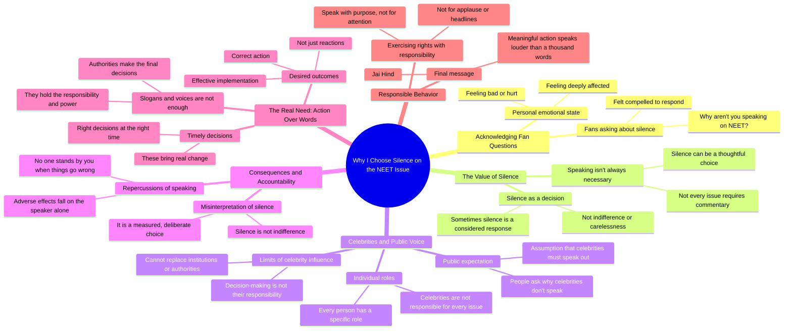

# Isha Koppikar Addresses NEET Issue and Fan Concerns

> 🌐 **Read this in:** [English](../../en/2026-08/tiktok-transcript-12k-views-28k-reactions-to-everyone-feeling-anxious-angry-or-55d0.md) · **中文**

> **Creator:** [@Isha Koppikar](https://www.tiktok.com/@Isha Koppikar) · **Views:** 619.7K · **Posted:** 2026-08-01 · **Niche:** other
>
> **TL;DR:** The creator directly addresses fan pressure and flips the expectation, creating immediate curiosity and engagement.

[Watch original video →](https://www.facebook.com/share/v/1Buf2CwoTG/)

## Why This Went Viral

## 钩子（前3秒）
- **逐字开场：**“नमशकार，很多粉丝问我为什么不谈NEET的问题……”
- **钩子模式：**直接回应观众 + 未解决的争议（一种“提问式”钩子，但带有反转——它回应的是批评，而不是提出新问题）。
- **为何能阻止滑动：**创作者点名承认了一个热点问题（NEET），瞬间表明相关性。它反其道而行之：不是加入愤怒的浪潮，而是准备为*沉默*辩护——这种逆向立场迫使观众为了看推理过程而继续观看。

## 情绪节奏
1. **紧张**——“你为什么不谈NEET？”（观众期待辩解或愤怒）
2. **不情愿的脆弱**——“不管我心里多难受……”（承认个人痛苦，放下防备）
3. **挫败感的释放**——“不是每件事都必须说”（第一次逆向转折）
4. **对批评者的对抗**——“为什么名人不说……后果只有我们独自承担”（制造我们vs他们的共鸣）
5. **理性权威**——“每个人都有自己角色……不能取代当局的位置”（从情绪转向逻辑）
6. **呼吁信任**——“请不要把我们的沉默当作漠不关心”（直接恳求，使立场人性化）
7. **高潮——行动号召**——“我们不需要只是反应……我们需要有效的落实、正确的行动”（从辩护转向要求）
8. **哲学性收尾**——“不要为关注、掌声或头条而发声，而要带着目的……有意义的行动胜过千言万语”（升华到普世真理）
9. **爱国收尾**——“जय हिंद”（情感锚点，文化共鸣）

## 关键词密度
- **“说 / 说出口 / 发声”**——重复6次以上；推动核心辩论和算法触达（争议关键词）。
- **“沉默”**——重复3次；情感拉力，将创作者塑造成深思熟虑而非缺席的形象。
- **“决定”**——重复4次；将焦点转向权威和行动，触发“问责”搜索兴趣。
- **“责任”**——重复3次；道德分量，与那些对机构感到失望的观众产生共鸣。
- **“反应 vs. 行动”**——对比组合；通过“NEET”+“名人”+“沉默”趋势集群实现算法触达，通过“我们独自承受”实现情感拉力。

## 为何能传播
- **对热门危机的逆向立场：**当每个创作者都在发布关于NEET的愤怒内容时，这个视频说“沉默是一种选择”。这种反向观点引发争论——支持者和批评者都会分享。
- **直接回应用户的框架：**“很多粉丝问我”让观众感到被直接点名；邀请他们进入私人对话，提升评论参与度。
- **名人问责诱饵：**“为什么名人不说”是一个被八卦/新闻聚合器抓取的重量级短语，带来外部流量。
- **普世的哲学收尾：**英文台词（“不要为关注而发声……有意义的行动胜过千言万语”）值得引用——会被截图并作为独立梗图转发，将传播范围扩展到视频之外。
- **文化签名“जय हिंद”：**以爱国基调收尾，与民族主义情绪一致，提升跨人口群体的可分享性。

## 你可以借鉴什么
- **直接点名房间里的大象：**以观众正在问的确切争议开场（例如，“你一直问我为什么没发关于X的内容……”）。这保证相关性并阻止滑动。
- **使用“沉默即策略”的转折：**不是增加噪音，而是采取相反的立场——为你的克制辩护。这在饱和的信息流中创造了独特角度，并在评论区引发争论。
- **以值得引用的普世金句收尾：**切换到一种感觉“更大”的语言或语气（这里：英文格言），并说出一句可以独立存在的金句。让它可截图——那是你的免费分发引擎。

## Mind Map

## Full Transcript (Generated by [TikTok 转录工具](https://toktranscript.com/?utm_source=github&utm_medium=breakdown&utm_campaign=tool_attribution))

> 📝 Transcripts on this page are auto-generated and show the first 60%. Want to transcribe any TikTok in 30 seconds and get the full version? [Try TokTranscript free →](https://toktranscript.com/?utm_source=github&utm_medium=breakdown&utm_campaign=transcript_cta)

नमशकार, कई फैन्स ने मुझसे पूछा कि आप नीट के मुद्दे पर बात क्यों नहीं कर रहे हो, तो मैंने उनसे ये कहना बहुत जरूरी समझा कि मुझे इस वक कितना भी बुरा लग रहा हो या फील हो रहा हो, पर हर बात पर बोलना जरूरी नहीं होता, कभी कभी खामो पश्कार, कई फैन्स ने मुझसे पूछा कि आप नीट के मुद्दे पर बात क्यों नहीं कर रहे हो, तो मैंने उनसे ये कहना बहुत जरूरी समझा कि मुझे इस वक कितना भी बुरा लग रहा हो, या फील हो रहा हो, पर हर बात पर बोलना जरूरी नहीं होता, कभी-कभी खा बकसर कहते हैं कि celebrities क्यों नहीं बोलते लेकिन जब किसी बात का उल्टा असर होता है उसके repercussions हम अकेले ही जहिलते हैं तब कोई हमारे लिए खड़ा नहीं होता और एक बात हर इंसान का अपना एक रोल होता है सेलेब्रिटीज का काम हर मुद्दे पर आवाज उठाना नहीं है और ना ही हम संस्ताओं या अथॉलिटीज की जगह ले सकते हैं जिनके हाथ में फैसले लेने की जिम्मिदारी है हमारी खामोशी को आप बेपरवाही मत समझे कभी-कभी वो सिर्फ सोच 

*[Read the full transcript on TokTranscript →](https://toktranscript.com/plaza/tiktok-transcript-12k-views-28k-reactions-to-everyone-feeling-anxious-angry-or-55d0?utm_source=github&utm_medium=breakdown&utm_campaign=transcript_full)*

## Browse More

- All [other](../../by-niche/zh-CN/other.md) breakdowns
- All [Direct address + contrarian stance](../../by-pattern/zh-CN/hook-direct-address-contrarian-stance.md) examples

## Video Info

| | |
|---|---|
| Creator | [@Isha Koppikar](https://www.tiktok.com/@Isha Koppikar) |
| Original video | [https://www.facebook.com/share/v/1Buf2CwoTG/](https://www.facebook.com/share/v/1Buf2CwoTG/) |
| Original title | 12K views · 28K reactions | To everyone feeling anxious, angry, or uncertain right now, I hear you. Your concerns matter. Your voice matters. But let’s not lose hope or let emotions push us towards violence. Because the goal isn’t just a reaction. The goal is the right outcome. | Isha Koppikar |
| Views | 619.7K (619734) |
| Posted | 2026-08-01 |
| Duration | 0s |
| Niche | `other` |
| Hook pattern | `Direct address + contrarian stance` |
| Original language | `en` (this page translated by AI) |
| Available languages | en, zh-CN |
| Generated | 2026-08-02 by [TokTranscript](https://toktranscript.com/) |

---

*This breakdown is for educational analysis under fair use. Original video © [@Isha Koppikar](https://www.tiktok.com/@Isha Koppikar). All transcripts are auto-generated and may contain errors.*

*Want to analyze your own TikToks like this? [TikTok 转录工具 →](https://toktranscript.com/viral-breakdown?utm_source=github&utm_medium=breakdown&utm_campaign=footer_cta)*