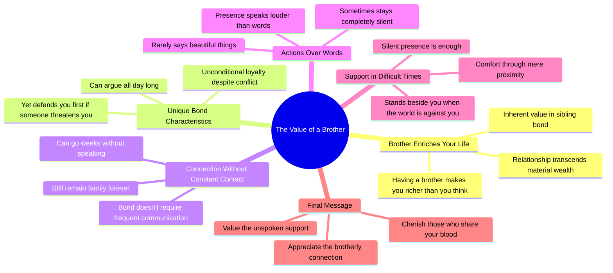

# If You Have a Brother, You Are Richer Than You Think

> 🌐 **Read this in:** [English](../../en/2026-08/tiktok-transcript-14k-reactions-2-3k-shares-4036.md) · **中文**

> **Creator:** [@Арсен Бегендыкович](https://www.tiktok.com/@Арсен Бегендыкович) · **Views:** 152.7K · **Posted:** 2026-08-25 · **Niche:** other
>
> **TL;DR:** The hook reframes a common relationship as a hidden wealth, instantly making viewers feel special and prompting them to continue.

[Watch original video →](https://www.facebook.com/share/r/1FM6E3gqeY/?mibextid=wwXIfr)

## Why This Went Viral

## 钩子（前3秒）
- **逐字开场白：**“如果你有一个兄弟，你比你想象的更富有。”
- **钩子模式：**大胆断言 + 对比（“比你想象的更富有”暗示隐藏的价值）。
- **为何能阻止滑动：**它瞬间将一种常见关系（兄弟）重新定义为隐藏资产，触发自我反思和“我有这个吗？”的停顿。它普遍、个人化，并且让观众对自己的生活感到满足。

## 情感节奏
- **节拍1 — 好奇/认同（0–2秒）：**大胆断言营造出温暖、讨喜的前提。
- **节拍2 — 张力（3–5秒）：**“可以吵一整天，但如果有人碰你，他会第一个站起来”——引入冲突（争吵），随即展现忠诚（保护）。这是第一个情感高峰。
- **节拍3 — 共鸣（6–8秒）：**“可以几周不联系，却永远是家人”——将疏远正常化，缓解愧疚感，引发深度共鸣。
- **节拍4 — 安静的深度（9–12秒）：**“他很少说漂亮话，有时沉默”——降低强度，建立亲密感。
- **节拍5 — 高潮（13–15秒）：**“当全世界都反对你时，兄弟可以沉默地站在你身边。而这，就足够了。”——情感巅峰。这是一个诗意、极简的收束，像一记重拳击中人心。
- **节拍6 — 行动号召（16秒）：**“珍惜那些与你血脉相连的人。”——一个直接、命令式的结尾，触发分享欲。

## 关键词密度
- **兄弟** — 5次。核心主题，既驱动算法主题清晰度，也驱动情感吸引力。
- **沉默/沉默地** — 2次。情感锚点；营造无声忠诚的母题。
- **身边** — 2次。强化物理/情感在场；强烈的视觉提示。
- **富有** — 1次（开场）。高冲击力，设定框架。
- **亲人/血脉** — 1次。将概念从血缘扩展到选择的亲近关系。
- **足够** — 1次。高潮词；极简即力量。

**算法驱动词：**“兄弟”（清晰主题）、“家人”（广泛触达）、“富有”（励志向往）。
**情感拉力：**“沉默”、“身边”、“足够”——它们营造出一种安静力量的感觉。

## 为何会传播
- **普遍中的具体：**它针对一种特定关系（兄弟），但情感适用于任何有兄弟姐妹或亲密朋友的人。观众会@自己的兄弟，或分享给那些感觉像兄弟的人。“几周不联系”这句话让发送给疏远的兄弟姐妹变得容易。
- **无负面的情感对比：**它承认冲突（“吵一整天”），但将其转化为忠诚。这让它安全可分享——没有戏剧性，只有温暖。
- **极简高潮：**“他的存在胜过千言万语”和“沉默就足够”是一个完美的、可引用的时刻。它被设计成可截图或作为独立文本转发。
- **嵌入情感的行动号召：**“珍惜那些与你血脉相连的人”不是“点赞和订阅”——它是一种道德命令。它让观众觉得分享是一种感恩的行为，而非推广。
- **节奏感：**短句，每个节拍后有停顿。文字稿读起来像口语诗，非常适合配慢节奏、情感充沛的背景音乐做旁白。

## 你可以借鉴什么
- **以重新定义开场，而非陈述。**“你比你想象的更富有”之所以有效，是因为它暗示观众正在错过某种有价值的东西。试试：“如果你有X，你已经拥有了大多数人寻找的东西。”
- **将沉默作为叙事工具。**不要用文字填满每一秒。让一句安静的话（“而这，就足够了”）在下一句之前完整呼吸一个节拍。停顿就是情感。
- **以感觉像礼物的指令结尾。**不要用“关注获取更多”，而是用一句让观众觉得分享让自己变得更好人的话：“珍惜那些……”——它把视频变成了社交货币。

## Mind Map

## Full Transcript (Generated by [TokTranscript](https://toktranscript.com/?utm_source=github&utm_medium=breakdown&utm_campaign=tool_attribution))

> 📝 Transcripts on this page are auto-generated and show the first 60%. Want to transcribe any TikTok in 30 seconds and get the full version? [Try TokTranscript free →](https://toktranscript.com/?utm_source=github&utm_medium=breakdown&utm_campaign=transcript_cta)

Если у тебя есть брат, ты богаче, чем думаешь. Брат — это тот, кто может спорить с тобой весь день, но если кто-то тронет тебя, он встанет первым. Это тот, с кем можно не общаться неделями и все равно остаться родными навсегда. Он редко говорит красивые слова, Иногда вообще молчит. Но в

*[Read the full transcript on TokTranscript →](https://toktranscript.com/plaza/tiktok-transcript-14k-reactions-2-3k-shares-4036?utm_source=github&utm_medium=breakdown&utm_campaign=transcript_full)*

## Browse More

- All [other](../../by-niche/zh-CN/other.md) breakdowns
- All [Value affirmation](../../by-pattern/zh-CN/hook-value-affirmation.md) examples

## Video Info

| | |
|---|---|
| Creator | [@Арсен Бегендыкович](https://www.tiktok.com/@Арсен Бегендыкович) |
| Original video | [https://www.facebook.com/share/r/1FM6E3gqeY/?mibextid=wwXIfr](https://www.facebook.com/share/r/1FM6E3gqeY/?mibextid=wwXIfr) |
| Original title | 14K reactions · 2.3K shares | Брат | Арсен Бегендыкович |
| Views | 152.7K (152652) |
| Posted | 2026-08-25 |
| Duration | 0s |
| Niche | `other` |
| Hook pattern | `Value affirmation` |
| Original language | `en` (this page translated by AI) |
| Available languages | en, zh-CN |
| Generated | 2026-08-26 by [TokTranscript](https://toktranscript.com/) |

---

*This breakdown is for educational analysis under fair use. Original video © [@Арсен Бегендыкович](https://www.tiktok.com/@Арсен Бегендыкович). All transcripts are auto-generated and may contain errors.*

*Want to analyze your own TikToks like this? [TokTranscript 转录工具 →](https://toktranscript.com/viral-breakdown?utm_source=github&utm_medium=breakdown&utm_campaign=footer_cta)*