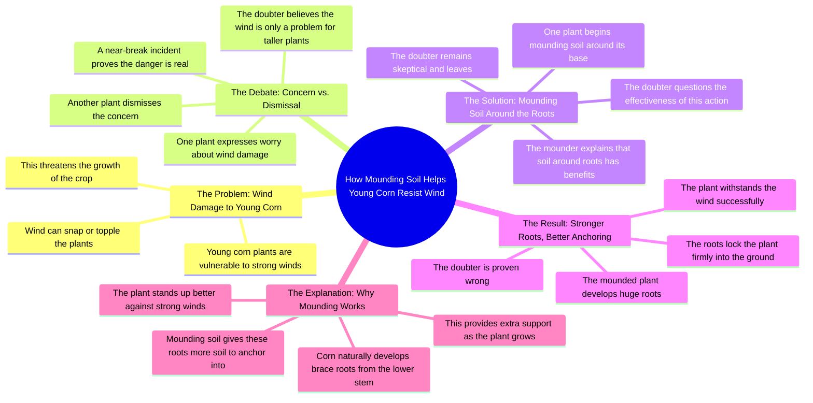

# How to Keep Corn From Blowing Over in Wind

> 🌐 **Read this in:** [English](../../en/2026-08/tiktok-transcript-161k-views-3-7k-reactions-this-method-keeps-corn-from-blowin-16ca.md) · **中文**

> **Creator:** [@Dr.Bota](https://www.tiktok.com/@Dr.Bota) · **Views:** 111.1K · **Posted:** 2026-08-14 · **Niche:** entertainment
>
> **TL;DR:** Immediately personifies the corn and creates an emotional, relatable problem that hooks viewers.

[Watch original video →](https://www.facebook.com/reel/1092022893358681/?fs=e&rdid=eNsGPUAAMgkdB535&share_url=https%3A%2F%2Fwww.facebook.com%2Fshare%2Fr%2F1BtAVEZRnN#)

## Why This Went Viral

## 钩子（前3秒）
- **逐字开场白：** “哥们，这事儿天天发生！这样咱们还怎么长啊？”
- **钩子模式：** 场景+张力（两个角色之间的对话，即刻的挫败感）
- **为何能止住滑动：** 观众被直接抛入一场进行中的危机对话。赌注（“这样还怎么长”）不明朗却紧迫，而拟人化的玉米植株制造了一个即时的好奇缺口——*等等，玉米在说话？而且它还很害怕？* 这种拟人化的转折足够出人意料，能让人停下滑动的手指。

## 情绪节奏
- **节拍1——紧张/焦虑（0–3秒）：** 小玉米对每天的风感到恐慌。观众感受到那种不稳定性。
- **节拍2——轻描淡写/喜剧缓解（3–6秒）：** 老玉米说“咱们还没那么高呢”——一种轻松的、近乎家长式的平静，降低了紧张感。
- **节拍3——震惊/升级（6–9秒）：** “它差点把咱们拦腰折断！”——突如其来的危险，引入了身体层面的风险。紧张感飙升。
- **节拍4——沮丧/冲突（9–12秒）：** 小玉米称这个办法“没用”并放弃了（“回头再说吧。”）。情绪低谷——像是失败。
- **节拍5——回报/高潮（12–15秒）：** “看那些巨大的根！”——视觉揭示。土堆起作用了。紧张感转化为胜利。
- **节拍6——胜利/释放（15–18秒）：** “哈哈，你就这点本事？”——宣泄、自信、喜剧式的虚张声势。
- **节拍7——科普/收束（18–28秒）：** 平静、权威的画外音解释科学原理。情绪从高点降至中性——一个令人满意的落地。

## 关键词密度
- **“根”** ——出现4次以上；同时驱动视觉回报和科普回报。
- **“风”** ——重复4次以上；制造了反派和紧张感。
- **“长”** ——重复3次；与核心问题和解决方案相关联。
- **“土壤/培土”** ——重复3次；可操作的核心要点。
- **“担心”** ——重复3次；为观众自身对园艺的恐惧提供情感锚点。
- **“支撑”** ——出现1次，但它是最终锁定科普价值的关键词。

**算法触达：** “风”和“根”是高搜索量的园艺词汇，会出现在字幕、话题标签和推荐视频的元数据中。  
**情感拉力：** “担心”和“长”与园丁的普遍焦虑相连——人们害怕自己的植物死掉，他们想要 reassurance（安心）。

## 为何能传播
- **拟人化创造即时共鸣：** 两株玉米进行“老爸和焦虑孩子”的对话，让一个农业小贴士看起来像情景喜剧场景。观众分享它是因为它*有趣*，而不仅仅是有信息量——“哥们，看那些巨大的根”这句台词是一个可以做成表情包的胜利时刻。
- **转折是视觉和物理性的：** 12–15秒支撑根的揭示是一个实时“前后对比”的回报。观众在解释之前先看到了证据——这满足了大脑的奖赏回路，让视频感觉像变魔术。
- **冲突结构呼应故事弧线：** 这不是一场讲座；这是一部微缩戏剧，有反派（风）、英雄（老玉米）、怀疑者（小玉米）和一个结局。这种叙事形态天生具有可分享性，因为它感觉像一部30秒的电影。
- **科普回报的时机恰到好处：** 画外音在情绪高潮*之后*出现，因此观众已经做好了学习的准备。人们分享让他们觉得自己变聪明的视频——这个视频教了一个具体、可操作的小技巧（培土），观众可以立即使用。
- **简短有力的对话，金句频出：** “你就这点本事？”和“让大个子们去担心风吧”很容易被剪辑、引用和二次创作——这推动了混剪和合拍。

## 你可以借鉴什么
- **给你的主题赋予个性和问题：** 不要只是解释一个技巧——创造一个双角色动态（焦虑的新手 vs. 冷静的专家），让他们争论。紧张感让知识点更难忘。
- **把回报推迟到情绪峰值之后：** 先展示问题，让观众怀疑解决方案，*然后*在解释科学原理之前用视觉揭示结果。“先证明，后解释”的结构能保持高留存率。
- **以平静、权威的画外音收尾：** 戏剧性之后，降低能量，用中性语气陈述事实。这种对比让科普部分感觉像一段可信的“后记”——也是观众截图保存的部分。

## Mind Map

## Full Transcript (Generated by [TokTranscript](https://toktranscript.com/?utm_source=github&utm_medium=breakdown&utm_campaign=tool_attribution))

> 📝 Transcripts on this page are auto-generated and show the first 60%. Want to transcribe any TikTok in 30 seconds and get the full version? [Try TokTranscript free →](https://toktranscript.com/?utm_source=github&utm_medium=breakdown&utm_campaign=transcript_cta)

Dude, this happens every day! How are we supposed to grow like this? Why are you so worried? We're not even that tall yet! Let the big guys worry about the wind! You see that? It almost snapped us in half, and you're telling me not to worry? What are you doing? The wind's up here, not down there! There's no way this is gonna fix anything! Don't worry, mounding soil around your roots has its benefits. Just wait and see. Ah, this is no use. Later. Dude, look at those huge roots. Let's see the wind beat that. Haha, is

*[Read the full transcript on TokTranscript →](https://toktranscript.com/plaza/tiktok-transcript-161k-views-3-7k-reactions-this-method-keeps-corn-from-blowin-16ca?utm_source=github&utm_medium=breakdown&utm_campaign=transcript_full)*

## Browse More

- All [entertainment](../../by-niche/zh-CN/entertainment.md) breakdowns
- All [Relatable Frustration](../../by-pattern/zh-CN/hook-relatable-frustration.md) examples

## Video Info

| | |
|---|---|
| Creator | [@Dr.Bota](https://www.tiktok.com/@Dr.Bota) |
| Original video | [https://www.facebook.com/reel/1092022893358681/?fs=e&rdid=eNsGPUAAMgkdB535&share_url=https%3A%2F%2Fwww.facebook.com%2Fshare%2Fr%2F1BtAVEZRnN#](https://www.facebook.com/reel/1092022893358681/?fs=e&rdid=eNsGPUAAMgkdB535&share_url=https%3A%2F%2Fwww.facebook.com%2Fshare%2Fr%2F1BtAVEZRnN#) |
| Original title | 161K views · 3.7K reactions | This Method Keeps Corn From Blowing Over | Dr.Bota |
| Views | 111.1K (111105) |
| Posted | 2026-08-14 |
| Duration | 0s |
| Niche | `entertainment` |
| Hook pattern | `Relatable Frustration` |
| Original language | `en` (this page translated by AI) |
| Available languages | en, zh-CN |
| Generated | 2026-08-15 by [TokTranscript](https://toktranscript.com/) |

---

*This breakdown is for educational analysis under fair use. Original video © [@Dr.Bota](https://www.tiktok.com/@Dr.Bota). All transcripts are auto-generated and may contain errors.*

*Want to analyze your own TikToks like this? [拆解你自己的 TikTok →](https://toktranscript.com/viral-breakdown?utm_source=github&utm_medium=breakdown&utm_campaign=footer_cta)*