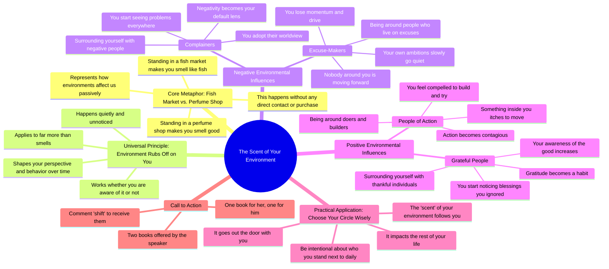

# Why You Smell Like the People You Surround Yourself With

> 🌐 **Read this in:** [English](../../en/2026-08/tiktok-transcript-188k-views-5-7k-reactions-if-you-spend-a-whole-day-at-a-fish-5e18.md) · **中文**

> **Creator:** [@Hard Truth Talks](https://www.tiktok.com/@Hard Truth Talks) · **Views:** 103.0K · **Posted:** 2026-08-17 · **Niche:** entertainment
>
> **TL;DR:** Uses a vivid, relatable metaphor to instantly create curiosity and set up the core message.

[Watch original video →](https://www.facebook.com/share/r/1Eh1q98FmD/)

## Why This Went Viral

## 钩子（前3秒）
- **逐字开场白：** “整天站在鱼市场里，出来时你身上会带着鱼腥味，哪怕你一条鱼都没碰过。”
- **钩子模式：** 对比 + 熟悉的感官场景（鱼市场对比香水店）。
- **为何能让人停下滑动：** 它利用了一种普遍、直击感官的体验（气味），每个人都能立刻产生共鸣，然后将其翻转成隐喻。大脑立刻想知道这个类比要引向何处——感觉像在解一个谜。

## 情绪节奏
1. **好奇（0–5秒）：** 鱼市场的画面生动且略带不适感；观众凑近想看明白要点。
2. **认同（5–10秒）：** 香水店的对比落地——“事情就是这样”制造了一个小小的“啊哈”时刻。
3. **转向不安（10–20秒）：** “你的环境总会潜移默化地影响你”——语气转向内省，略带警示意味。
4. **张力累积（20–35秒）：** 负面例子（抱怨者、找借口的人）制造了一种不安感——观众在心里审视自己的圈子。
5. **释然/向往（35–45秒）：** 转向“行动派”和“心怀感恩的人”让情绪上扬；感觉像是一条前进的路。
6. **高潮（45–50秒）：** “你环境的气味……总会跟着你走出门”——隐喻闭环，以诗意的终结感抛出核心论点。
7. **轻量行动号召（50秒+）：** 赠书提议像是坚持看完的奖励。

## 关键词密度
- **“花时间”**（4次）——驱动核心行为信息；通过清晰、可重复的措辞获得算法触达。
- **“环境”**（2次）——概念锚点；对自我提升类受众有高搜索量和兴趣吸引力。
- **“鱼腥味/气味/味道”**（4次）——感官隐喻；情绪牵引，让抽象变得可感知。
- **“抱怨/借口/行动/感恩”**（4组对比）——情绪牵引；制造圈内与圈外的身份认同。
- **“谨慎选择”**（1次，但至关重要）——可执行的结论；因为具有指令性而驱动分享。
- **“书/评论关键词”**（1次）——算法互动触发器（评论提升触达）。

## 为何能传播
- **隐喻一听就懂，随手可转述。** 鱼/香水的类比足够简洁，观众可以原封不动地转述给朋友——这就是“口口相传”测试。它成为复杂概念的思维捷径。
- **它点出了一个沉默的问题。** “你的环境会潜移默化地影响你”是人们能感受到却很少说出口的事。视频给了他们表达的语言，从而驱动收藏和分享（“这正是我一直想说的”）。
- **它制造了一次身份审视。** 负面例子（抱怨者、找借口的人）迫使观众审视自己的圈子。这种自我反思令人不适，而人们分享不适的真相来表明自我觉察。
- **情绪弧线是一个完整的故事。** 从好奇→警示→希望在不到一分钟内完成。这种完整性让它更像一部“微电影”而非单纯的口播，从而提升观看时长。
- **行动号召低门槛且由好奇驱动。** “评论关键词”是一个词，容易输入，而两本书（一本给他，一本给她）的承诺制造了个性化奖励，提升评论量——进而喂养算法。

## 你可以借鉴什么
- **在讲道理之前，先用一个感官化的普遍隐喻开场。** 不要一开始就抛出论点；先让观众解一个小谜题。鱼市场那句话比任何抽象陈述都更有力量。
- **用成对对比来构建节奏。** 抱怨者对比行动派，借口对比感恩。每一对都是一个小节拍，推动脚本前进，让信息显得普适。
- **用一个具体、低成本的互动触发器收尾。** “评论关键词”之所以有效，是因为它只有一个词、容易记住、并承诺了切实的回报。让你的行动号召也这么简单——不是“关注获取更多”，而是一个能解锁某样东西的单词。

## Mind Map

## Full Transcript (Generated by [拆解你自己的 TikTok](https://toktranscript.com/?utm_source=github&utm_medium=breakdown&utm_campaign=tool_attribution))

> 📝 Transcripts on this page are auto-generated and show the first 60%. Want to transcribe any TikTok in 30 seconds and get the full version? [Try TokTranscript free →](https://toktranscript.com/?utm_source=github&utm_medium=breakdown&utm_campaign=transcript_cta)

Spend your whole day standing in a fish market and you'll walk out smelling like fish, even if you never laid a finger on a single one. But spend that same day inside a perfume shop and you'll leave smelling good, even if you never bought a thing off the shelf. That's not a trick, that's just how it works. And it's true of far more than smells. Your environment always rubs off on you, quietly, whether you notice it happening or not. Spend your time around people who do nothing but complain. And before long, you'll start seeing problems and negativity everywhere you look. Because that's the lens you've been handed. Spend it around people who live on excuses. And you'll find your own ambitions slowly going quiet. Because nobody around you is movi

*[Read the full transcript on TokTranscript →](https://toktranscript.com/plaza/tiktok-transcript-188k-views-5-7k-reactions-if-you-spend-a-whole-day-at-a-fish-5e18?utm_source=github&utm_medium=breakdown&utm_campaign=transcript_full)*

## Browse More

- All [entertainment](../../by-niche/zh-CN/entertainment.md) breakdowns
- All [Metaphor/Contrast Hook](../../by-pattern/zh-CN/hook-metaphor-contrast-hook.md) examples

## Video Info

| | |
|---|---|
| Creator | [@Hard Truth Talks](https://www.tiktok.com/@Hard Truth Talks) |
| Original video | [https://www.facebook.com/share/r/1Eh1q98FmD/](https://www.facebook.com/share/r/1Eh1q98FmD/) |
| Original title | 188K views · 5.7K reactions | If you spend a whole day at a fish market, then you will smell like fish. #podcast #relationships #love #men #women | Hard Truth Talks |
| Views | 103.0K (102962) |
| Posted | 2026-08-17 |
| Duration | 0s |
| Niche | `entertainment` |
| Hook pattern | `Metaphor/Contrast Hook` |
| Original language | `en` (this page translated by AI) |
| Available languages | en, zh-CN |
| Generated | 2026-08-19 by [TokTranscript](https://toktranscript.com/) |

---

*This breakdown is for educational analysis under fair use. Original video © [@Hard Truth Talks](https://www.tiktok.com/@Hard Truth Talks). All transcripts are auto-generated and may contain errors.*

*Want to analyze your own TikToks like this? [我们用的转录工具 →](https://toktranscript.com/viral-breakdown?utm_source=github&utm_medium=breakdown&utm_campaign=footer_cta)*