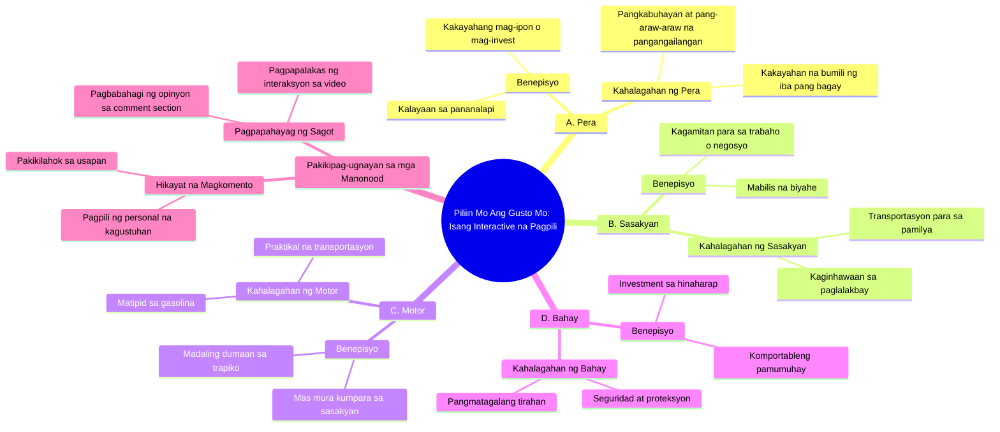

# Choose Your Prize: Money, Car, Motorcycle, or House

> 🌐 **Read this in:** [English](../../en/2026-08/tiktok-transcript-1m-views-20k-reactions-comment-nyo-na-mga-boss-baka-sa-inyo-77c9.md) · **中文**

> **Creator:** [@𝔦𝔳 𝔱𝔢𝔞𝔪.](https://www.tiktok.com/@𝔦𝔳 𝔱𝔢𝔞𝔪.) · **Views:** 316.0K · **Posted:** 2026-08-30 · **Niche:** other
>
> **TL;DR:** Directly challenges the viewer to make a personal choice, triggering immediate engagement.

[Watch original video →](https://www.facebook.com/share/r/1DqKGDowiZ/)

## Why This Went Viral

## 钩子（前3秒）
- **逐字开场白：**“选你想要的。A. 钱 B. 车 C. 摩托车 或 D. 房子”
- **钩子模式：**互动选择/带选项的问题（一种“选门”模式）
- **为何能阻止滑动：**它迫使观众立即做出心理决定。观众无法被动观看——他们的大脑天生就会去回答。这些选项都是普遍令人向往的（钱、车、摩托车、房子），所以它能在2秒内触发个人利害关系。没有开场白，没有背景——纯粹的参与诱饵。

## 情绪节奏
1. **好奇/挑战**（0–2秒）：“选你想要的”——观众被激将去选择。
2. **自我投射**（2–5秒）：阅读选项时，观众在脑中权衡自己的欲望（钱 vs. 房子——一种价值观冲突）。
3. **期待**（5–7秒）：“在下方评论区打出你的答案”——建立一种社交契约；你会觉得自己*应该*回复。
4. **直接施压**（7–9秒）：“你会选哪个？说给我听啊！”——“啊”是一种俏皮的催促，增加了紧迫感和一丝个人责任感。
5. **高潮：**最后的“说给我听啊！”——这是情绪峰值，被动观众在此刻变成主动参与者。紧张感只有通过评论才能解除。

## 关键词密度
- **“Piliin”**（选择）——重复2次；驱动互动机制，是算法参与度信号。
- **“Pera”**（钱）——第一选项；情绪吸引力最强，是普遍欲望。
- **“Sasakyan”**（车）——有抱负的、与身份地位相关的。
- **“Motor”**（摩托车）——贴近生活，对年轻文化有吸引力。
- **“Bahay”**（房子）——最深层的情感锚点（安全感、家庭）。
- **“I-comment”**（评论）——直接行动号召；算法金矿（提升评论率）。
- **“Sagot”**（答案）——强化行动循环。
- **“Sabihin mo”**（说给我听）——口语化，营造一种被单独点名的感觉。

*算法驱动因素：*“I-comment”（评论）、“sagot”（答案）、“piliin”（选择）——都在推动平台的参与度指标。
*情绪吸引力：*“Pera”（钱）、“Bahay”（房子）、“Sasakyan”（车）——这些不只是词语；它们是人生目标，能瞬间触发自我认同。

## 为何能传播
1. **零门槛参与：**整个视频就是一个带选项的问题。任何人都能在5秒内回答。文案中的“在下方评论区打出你的答案”是一个无摩擦的行动号召——不需要思考，只需打一个字母。
2. **基于价值观的辩论引擎：**通过提供“钱”与“房子”的对比，视频迫使产生价值观冲突。评论区会爆发人们为自己的选择辩护的讨论（“房子更好，因为是投资” vs. “钱才能有自由”）。这场辩论才是真正的内容——视频只是火花。
3. **个人责任陷阱：**“说给我听啊！”是一句伪对抗性的台词。它让观众觉得被单独点名了。这推动了评论量，因为人们觉得有义务去“捍卫”自己的选择。
4. **跨人群的普遍共鸣：**这些选项覆盖了每个社会经济阶层。学生选“摩托车”，父母选“房子”，奋斗者选“钱”。这保证了广泛、多元的评论受众——这向算法发出信号，让它进一步推送。
5. **评论区即内容：**视频被设计成让*评论*成为病毒式内容。人们截图评论区并转发。文案中的开放式问题确保了源源不断的回复，这又喂养了循环。

## 你可以借鉴什么
1. **以强制选择开场，而不是陈述句。**在前3秒给你的观众2–4个具体选项（A/B/C/D）。即使你的领域不相关，也要把你的主题框定为一个两难选择：“X更好还是Y更好？”——大脑无法忽略一个未解决的选择。
2. **在结尾加上一个伪个人化的催促。**复制“说给我听啊！”的模式：一句简短、略带俏皮的命令，让观众感觉被单独点名。例如：“说真的，回答这个。”或“不回答就别划走。”它能把被动观众转化为评论者。
3. **为评论区设计，而不是为视频设计。**提出一个有*多个有效答案*的问题，让人们能在评论区争论。避免是非题。目标是制造一场辩论，让每一条评论都成为算法推广你视频的新理由。你的文案是诱饵；评论是陷阱。

## Mind Map

## Full Transcript (Generated by [TokTranscript](https://toktranscript.com/?utm_source=github&utm_medium=breakdown&utm_campaign=tool_attribution))

> 📝 Transcripts on this page are auto-generated and show the first 60%. Want to transcribe any TikTok in 30 seconds and get the full version? [Try TokTranscript free →](https://toktranscript.com/?utm_source=github&utm_medium=breakdown&utm_campaign=transcript_cta)

Piliin mo ang gusto mo. A. Pera B. Sasakyan C. Motor o D. Bahay I-comment mo ang 

*[Read the full transcript on TokTranscript →](https://toktranscript.com/plaza/tiktok-transcript-1m-views-20k-reactions-comment-nyo-na-mga-boss-baka-sa-inyo-77c9?utm_source=github&utm_medium=breakdown&utm_campaign=transcript_full)*

## Browse More

- All [other](../../by-niche/zh-CN/other.md) breakdowns
- All [Interactive Choice Hook](../../by-pattern/zh-CN/hook-interactive-choice-hook.md) examples

## Video Info

| | |
|---|---|
| Creator | [@𝔦𝔳 𝔱𝔢𝔞𝔪.](https://www.tiktok.com/@𝔦𝔳 𝔱𝔢𝔞𝔪.) |
| Original video | [https://www.facebook.com/share/r/1DqKGDowiZ/](https://www.facebook.com/share/r/1DqKGDowiZ/) |
| Original title | 1M views · 20K reactions | Comment nyo na mga boss baka sa inyo na sunod! 😱🥳 #ivanaalawi #monaalawi #ivanaalawireall #laptopwarehouse #lapag #dailyvlog #laptop #bossa #BossA #Pamorma #CrisHippers #Kuyamoboss #fistbump #TisayShin #filipina #iphone #pera | 𝔦𝔳 𝔱𝔢𝔞𝔪. |
| Views | 316.0K (315979) |
| Posted | 2026-08-30 |
| Duration | 0s |
| Niche | `other` |
| Hook pattern | `Interactive Choice Hook` |
| Original language | `en` (this page translated by AI) |
| Available languages | en, zh-CN |
| Generated | 2026-08-31 by [TokTranscript](https://toktranscript.com/) |

---

*This breakdown is for educational analysis under fair use. Original video © [@𝔦𝔳 𝔱𝔢𝔞𝔪.](https://www.tiktok.com/@𝔦𝔳 𝔱𝔢𝔞𝔪.). All transcripts are auto-generated and may contain errors.*

*Want to analyze your own TikToks like this? [免费 TikTok 文稿生成器 →](https://toktranscript.com/viral-breakdown?utm_source=github&utm_medium=breakdown&utm_campaign=footer_cta)*