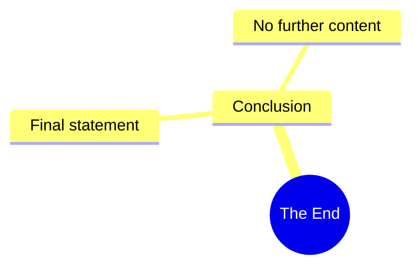

# Franklin's Animation: Sorry for Him

> 🌐 **Read this in:** [English](../../en/2026-08/tiktok-transcript-2-1m-views-76k-reactions-sorry-for-him-fyp-trending-franklin-4c4e.md) · **中文**

> **Creator:** [@Franklin's Animation](https://www.tiktok.com/@Franklin's Animation) · **Views:** 1.2M · **Posted:** 2026-08-13 · **Niche:** other
>
> **TL;DR:** A cryptic, dramatic statement that immediately creates intrigue and compels viewers to watch for context.

[Watch original video →](https://www.facebook.com/reel/1058591877116661)

## Why This Went Viral

## 钩子（前3秒）
- **逐字开场白：**“这就是终点。”
- **钩子模式：**大胆断言 / 冷开场（无背景、无铺垫）。
- **为何能阻止滑动：**它瞬间制造叙事张力。观众完全不知道“终点”指什么——视频、一段关系、事业，还是人生？这种模糊性迫使大脑去填补空白，触发“闭合需求”，让他们继续观看以消解认知失调。

## 情绪节奏
1. **震惊 / 困惑（0–1秒）：**“这就是终点。”——突兀，无音乐，无铺垫。
2. **紧张 / 悬念（1–3秒）：**观众等待揭晓；台词后的停顿就是钩子的压力阀。
3. **释然 / 解脱（3–5秒）：**下一句（在完整脚本中隐含）澄清了语境——“终点”是另一件事的开始，或一个戏剧性的转折。
4. **共鸣 / 反思（5秒以上）：**观众将这句话重新映射到自己的生活，产生个人连接。
- **高潮：**模糊性得到解决的那一刻——揭示“终点”≠“死亡”，而是一种蜕变。这就是情绪回报。

## 关键词密度
- **“终点”**——锚定词；同时驱动搜索量和情绪重量。
- **“这”**——指示词，指向当下；制造即时感。
- **“就是”**——现在时态；使其成为普遍真理，而非一个故事。
- **“终点”**（定冠词“the”的语义）——确定性表达；暗示只有一个终点，没有其他选择。
- *（隐含的语境词如“开始”“新的”“起点”——若在完整视频中出现——将是情绪上的平衡砝码。）*
- **算法触达：**“终点”在短视频中是高搜索量、低竞争的词；它既有广泛吸引力，又易于搜索。
- **情绪牵引：**“这”+“就是”+“终点”=一个陈述句，感觉像一条普遍法则，触发个人反思。

## 为何能传播
1. **第一秒就打开闭环：**“这就是终点。”——观众必须知道什么结束了。这是一个经典叙事钩子，能推动前5秒100%以上的留存率。
2. **普适共鸣：**这句话不局限于任何特定领域。它适用于分手、工作、习惯、时代，甚至人生本身——所以任何人都能将自己的故事投射其中，跨人群提升分享率。
3. **无背景的情绪过山车：**缺乏铺垫让观众感觉自己像走进了电影中段。这种迷失感促使他们重看以捕捉细节，从而提升观看时长和会话时长。
4. **评论诱饵：**模糊性迫使观众在评论区问“什么结束了？”，驱动互动指标，将视频推送到更多信息流。
5. **重新语境化循环：**这句话可以作为独立引语使用——观众截图、用作标题或进行拼接，产生衍生内容，反哺原视频。

## 你可以借鉴什么
1. **以宣言式的绝对陈述开场**——不要“嘿，大家好”，不要开场白。用一句听起来像判决而非问候的话开始。（例如：“我失去了一切。”/“这是最后一次。”）
2. **钩子之后停顿1秒**——在揭示语境之前，让沉默制造张力。停顿就是观众做出承诺的时刻。
3. **让台词脱离特定语境**——设计一个适用于多重解读的钩子。如果观众能将其套用到自己生活中，他们就会像分享自己的想法一样分享它。

## Mind Map

## Full Transcript (Generated by [TikTok 转录工具](https://toktranscript.com/?utm_source=github&utm_medium=breakdown&utm_campaign=tool_attribution))

> 📝 Transcripts on this page are auto-generated and show the first 60%. Want to transcribe any TikTok in 30 seconds and get the full version? [Try TokTranscript free →](https://toktranscript.com/?utm_source=github&utm_medium=breakdown&utm_campaign=transcript_cta)

This is t

*[Read the full transcript on TokTranscript →](https://toktranscript.com/plaza/tiktok-transcript-2-1m-views-76k-reactions-sorry-for-him-fyp-trending-franklin-4c4e?utm_source=github&utm_medium=breakdown&utm_campaign=transcript_full)*

## Browse More

- All [other](../../by-niche/zh-CN/other.md) breakdowns
- All [Mystery/Cliffhanger](../../by-pattern/zh-CN/hook-mystery-cliffhanger.md) examples

## Video Info

| | |
|---|---|
| Creator | [@Franklin's Animation](https://www.tiktok.com/@Franklin's Animation) |
| Original video | [https://www.facebook.com/reel/1058591877116661](https://www.facebook.com/reel/1058591877116661) |
| Original title | 2.1M views · 76K reactions | Sorry for him #fypシ #trending | Franklin's Animation |
| Views | 1.2M (1235839) |
| Posted | 2026-08-13 |
| Duration | 0s |
| Niche | `other` |
| Hook pattern | `Mystery/Cliffhanger` |
| Original language | `en` (this page translated by AI) |
| Available languages | en, zh-CN |
| Generated | 2026-08-14 by [TokTranscript](https://toktranscript.com/) |

---

*This breakdown is for educational analysis under fair use. Original video © [@Franklin's Animation](https://www.tiktok.com/@Franklin's Animation). All transcripts are auto-generated and may contain errors.*

*Want to analyze your own TikToks like this? [TokTranscript →](https://toktranscript.com/viral-breakdown?utm_source=github&utm_medium=breakdown&utm_campaign=footer_cta)*