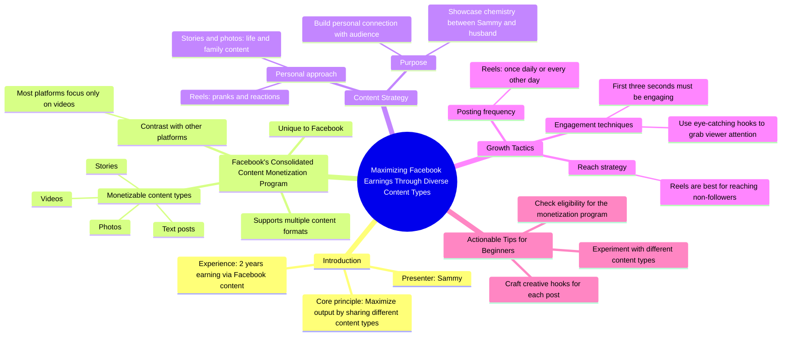

# Maximize Facebook Income with Samantha Blizzard’s Content...

> 🌐 **Read this in:** [English](../../en/2026-08/tiktok-transcript-2-5m-views-20k-reactions-a-reminder-that-you-can-earn-money-ba3c.md) · **中文**

> **Creator:** [@Facebook for Creators](https://www.tiktok.com/@Facebook for Creators) · **Views:** 1.2M · **Posted:** 2026-08-15 · **Niche:** marketing
>
> **TL;DR:** Immediately offers a clear financial benefit, enticing viewers to keep watching for the actionable advice.

[Watch original video →](https://www.facebook.com/reel/1872427233306540)

## Why This Went Viral

## 钩子（前3秒）
- **逐字开场白：**“如果你想知道利用收益的最佳方式，那就是通过分享不同类型的内容来最大化产出。”
- **钩子模式：**大胆断言 + 直接称呼（“你”）+ 金钱触发词（“变现”）。
- **为何能阻止滑动：**它在第一句话就承诺了一个财务公式，立即创造了感知价值。“金钱”一词激活了损失厌恶——观众会觉得如果跳过，自己就是在白白丢钱。

## 情绪节奏
1. **好奇（0–3秒）：**“最佳变现方式”——观众被吸引。
2. **权威（3–8秒）：**“嗨，我叫Sammy……两年”——通过经验证明建立信任。
3. **对比/张力（8–15秒）：**“虽然大多数平台只关注视频”——在观众已知与可能之间制造差距。
4. **释然/顿悟（15–20秒）：**揭示具体项目和多元格式策略——“啊哈”时刻。
5. **个人证明（20–30秒）：**“我展示我和我丈夫的化学反应……”——将策略人性化，增加 relatable 和真实性。
6. **可操作清晰度（30–40秒）：**“每天或隔天发布一次Reels”——具体、低门槛的指令。
7. **高潮（40–45秒）：**“Reels是触达非关注者的最佳方式”——单一最有价值的洞察，放在后面以保持留存。
8. **行动号召（45–50秒）：**“检查你的资格……尝试不同类型的内容”——紧迫感 + 简单的下一步。

## 关键词密度
- **“赚取/收益”**（4次）——双重目的：算法层面（金钱领域 = 高CPM广告主）和情感层面（渴望拉动）。
- **“内容类型”**（3次）——驱动教育角度；暗示列表式价值。
- **“Reels”**（3次）——平台特定关键词，针对Facebook推荐算法。
- **“前三秒”**（1次）——元评论，暗示“这个视频知道如何钩住你”，强化可信度。
- **“增长”**（1次）——渴望触发器。
- **“资格”**（1次）——制造稀缺门槛；观众自我判断是否符合条件。
- **“变现”**（1次）——高情绪金钱词汇，比“赚取”更有力。

**算法驱动词：**“Facebook”、“Reels”、“变现计划”、“赚取”——这些匹配搜索和推荐关键词。
**情感拉动：**“变现”、“化学反应”、“增长”、“家庭”——这些创造身份和生活方式共鸣。

## 为何能传播
- **“秘密之门”效应：**“虽然大多数平台只关注视频……在Facebook上，你可以通过故事、视频、照片和文字赚钱”——揭示了一个鲜为人知的漏洞，让观众觉得获得了值得分享的内幕知识。
- **通过个人叙事证明：**“我通过恶作剧展示我和我丈夫的化学反应”——这不是抽象建议；这是一个真实的人和真实的关系，让建议显得经过验证且真实。
- **具体性建立信任：**“每天或隔天发布一次我的Reels”——一个精确的节奏，听起来像公式，而非模糊建议。具体性 = 可信度 = 分享。
- **留存回报：**“Reels是触达非关注者的最佳方式”——这是最值得分享的一句话。这是一个普适的增长真理，包裹在平台特定洞察中，因此适用范围超越Facebook。
- **可操作结尾：**“检查你的资格”——将被动观众转化为主动参与者。人们会分享能给人脉提供清晰下一步的内容。

## 你可以借鉴什么
1. **第一句话就用金钱或结果承诺开场。**不要预热。直接说“如果你想[期望结果]，就做[具体行动]”——即使视频其余部分是教育性的，第一行必须创造感知价值。
2. **在视频中段嵌入“个人证明”时刻。**提及一段真实关系、一个真实习惯或一个真实数字（“两年”、“每天一次”）。这将泛泛建议转化为亲身经历——这是讲座与故事的区别。
3. **把你最有价值的单一洞察留到70–80%的位置。**“Reels是触达非关注者的最佳方式”这句话放在后面，迫使观众看完整个视频才能获得精华。设计你的脚本，让最佳洞察不是第一个——而是坚持看完的奖励。

## Mind Map

## Full Transcript (Generated by [免费 TikTok 文稿生成器](https://toktranscript.com/?utm_source=github&utm_medium=breakdown&utm_campaign=tool_attribution))

> 📝 Transcripts on this page are auto-generated and show the first 60%. Want to transcribe any TikTok in 30 seconds and get the full version? [Try TokTranscript free →](https://toktranscript.com/?utm_source=github&utm_medium=breakdown&utm_campaign=transcript_cta)

If you want to know the best way to cash in on your earnings, it's to maximize the output by sharing different content types. Hi, my name is Sammy, and I've been earning money through my Facebook content for two years now. While most platforms only focus on videos, on Facebook, you can earn money from stories, videos, photos, and text posts as a part of the Consolidated Content Monetization Program. I like to show mine and my husband's chemistry through pranks and reactions on reels, while also sharing the life and family on my stories and photos. I was able 

*[Read the full transcript on TokTranscript →](https://toktranscript.com/plaza/tiktok-transcript-2-5m-views-20k-reactions-a-reminder-that-you-can-earn-money-ba3c?utm_source=github&utm_medium=breakdown&utm_campaign=transcript_full)*

## Browse More

- All [marketing](../../by-niche/zh-CN/marketing.md) breakdowns
- All [Direct benefit promise](../../by-pattern/zh-CN/hook-direct-benefit-promise.md) examples

## Video Info

| | |
|---|---|
| Creator | [@Facebook for Creators](https://www.tiktok.com/@Facebook for Creators) |
| Original video | [https://www.facebook.com/reel/1872427233306540](https://www.facebook.com/reel/1872427233306540) |
| Original title | 2.5M views · 20K reactions | A reminder that you can earn money on Facebook by sharing different types of content. 🤑 Take a look at Samantha Blizzard's tips for maximizing your income on Facebook! | Facebook for Creators |
| Views | 1.2M (1168493) |
| Posted | 2026-08-15 |
| Duration | 0s |
| Niche | `marketing` |
| Hook pattern | `Direct benefit promise` |
| Original language | `en` (this page translated by AI) |
| Available languages | en, zh-CN |
| Generated | 2026-08-16 by [TokTranscript](https://toktranscript.com/) |

---

*This breakdown is for educational analysis under fair use. Original video © [@Facebook for Creators](https://www.tiktok.com/@Facebook for Creators). All transcripts are auto-generated and may contain errors.*

*Want to analyze your own TikToks like this? [TokTranscript 转录工具 →](https://toktranscript.com/viral-breakdown?utm_source=github&utm_medium=breakdown&utm_campaign=footer_cta)*