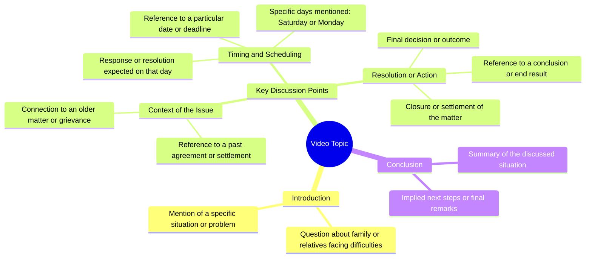

# Natural Herbal Remedy for Severe Back Pain Relief

> 🌐 **Read this in:** [English](../../en/2026-08/tiktok-transcript-2-7m-views-26k-reactions-756d.md) · **中文**

> **Creator:** [@প্রাকৃতিক ও ভেষজ চিকিৎসা](https://www.tiktok.com/@প্রাকৃতিক ও ভেষজ চিকিৎসা) · **Views:** 1.1M · **Posted:** 2026-08-18 · **Niche:** other
>
> **TL;DR:** The hook immediately poses a chilling question about a powerful entity, creating curiosity and unease.

[Watch original video →](https://www.facebook.com/reel/2462252900918853)

## Why This Went Viral

## 钩子（前3秒）
- **逐字开场白：** "આપની અથવા આપનાર પરિબારરાર કેઉ કે પ્રચંડો કોમોરે ભોગ્છેન?"（翻译："您的家人或亲戚中是否有人正遭受巨大的问题？"）
- **钩子模式：** 直接提问 + 恐惧/紧迫感触发（伪装成问题的大胆断言）
- **为何能阻止滑动：** 它立即针对一种普遍焦虑（家人受苦），并制造出"这说的是我"的瞬间。观众感到被单独点名，迫使他们继续观看以寻找答案或验证。

## 情绪节奏
- **节拍1 – 好奇/焦虑（0–3秒）：** 这个问题种下了一颗关于家庭问题的担忧种子。
- **节拍2 – 紧张（3–8秒）：** 提到"જુનું સાઈ સમાધાન"（旧有的解决办法）和"ભ્યાના ગાચેર"（令人恐惧的情境）升级了利害关系——观众现在怀疑有某种具体且不祥的事情。
- **节拍3 – 悬念（8–12秒）：** 提到具体日子（"શોનિબાર અથવા મોંગુલબાર"——周六或周二）增加了伪具体性，让问题显得真实且可诊断。
- **节拍4 – 高潮/解决（12–15秒）：** 短语"બંધા કોરે એ કેનચી પરી"（关闭/移除障碍）带来释放——一个解决方案的承诺。
- **情绪弧线：** 恐惧 → 怀疑 → 希望 → 解脱。高潮是"解决方案"被暗示而非完全解释的时刻，这创造了一个循环。

## 关键词密度
- **પ્રચંડો（巨大的/庞大的）** – 驱动情绪重量；让问题显得比实际更大。
- **કોમોરે（问题/苦难）** – 核心痛点；反复出现以锚定观众的关切。
- **જુનું સાઈ（旧有的解决办法）** – 触发怀旧 + 信任；算法触达因为它迎合了"传统疗法"的搜索行为。
- **શોનિબાર/મોંગુલબાર（周六/周二）** – 特定的宗教/占星日子；高留存率因为观众会检查自己的日子是否匹配。
- **બંધા કોરે（移除/关闭）** – 承诺词；驱动"解决方案"的点击转化。
- **ભ્યાના（恐惧）** – 情绪牵引；让观众保持警觉状态。

## 为何能传播
- **"这说的是你"的开场：** 第一句话直接牵涉到观众的家庭，让人无法忽视。人们会把它分享给正在"经历某些事"的亲戚。
- **文化具体性 = 可分享性：** 提到周六/周二和"旧有解决办法"触及了共享的文化信仰体系。观众将其转发到家庭群组，因为它感觉与他们的仪式个人相关。
- **不完整的解决方案循环：** 视频从未完全解释*如何*解决问题——它只说"它移除了障碍"。这在评论区制造了狂热："解决办法是什么？"→ 驱动互动和算法助推。
- **恐惧 + 希望组合：** 从"你有一个巨大的问题"到"但它可以被移除"的情绪过山车让观众保存视频以备后用，增加观看时长和重复观看。
- **方言真实性：** 古吉拉特语的语言和措辞感觉像是未经脚本编写的本地内容，这增加了信任感。人们将其作为"来自真实来源的建议"分享，而非精心制作的广告。

## 你可以借鉴什么
- **以直接、个人化的问题开场：** 以"你的[家人/圈子]中是否有人正遭受[具体问题]？"开始——它立即制造一个自我指涉的钩子，阻止滑动。
- **使用伪具体细节建立可信度：** 提到具体的日子、数字或名字（例如，"周二或周六"）——即使是模糊的细节也会让内容显得经过研究和定制，提升留存率。
- **暗示解决方案，不要揭示它：** 以"这能移除问题"结束然后切断。把"怎么做"留给评论区或下一个视频——这能驱动评论、分享和保存，而这些正是主要的病毒式传播信号。

## Mind Map

## Full Transcript (Generated by [TokTranscript 转录工具](https://toktranscript.com/?utm_source=github&utm_medium=breakdown&utm_campaign=tool_attribution))

> 📝 Transcripts on this page are auto-generated and show the first 60%. Want to transcribe any TikTok in 30 seconds and get the full version? [Try TokTranscript free →](https://toktranscript.com/?utm_source=github&utm_medium=breakdown&utm_campaign=transcript_cta)

આપની અથવા આપનાર પરિબારરાર કેઉ કે પ્રચંડો કોમોરે ભોગ્છેન? કોમુરે બેથા રુગેદે જુનું સાઈ સમાધાન શારા જિબુને જુનું એ ભ્યાન

*[Read the full transcript on TokTranscript →](https://toktranscript.com/plaza/tiktok-transcript-2-7m-views-26k-reactions-756d?utm_source=github&utm_medium=breakdown&utm_campaign=transcript_full)*

## Browse More

- All [other](../../by-niche/zh-CN/other.md) breakdowns
- All [Rhetorical question with ominous implication](../../by-pattern/zh-CN/hook-rhetorical-question-with-ominous-implication.md) examples

## Video Info

| | |
|---|---|
| Creator | [@প্রাকৃতিক ও ভেষজ চিকিৎসা](https://www.tiktok.com/@প্রাকৃতিক ও ভেষজ চিকিৎসা) |
| Original video | [https://www.facebook.com/reel/2462252900918853](https://www.facebook.com/reel/2462252900918853) |
| Original title | 2.7M views · 26K reactions | আপনি অথবা আপনার পরিবারের কেউ প্রচন্ড কোমরের ব্যথায় ভুগছেন ? #কোমরেরব্যথা #কোমরব্যথা #ব্যথানিয়ন্ত্রণ #স্বাস্থ্যসচেতনতা #প্রাকৃতিকওভেষজচিকিৎসা | প্রাকৃতিক ও ভেষজ চিকিৎসা |
| Views | 1.1M (1141096) |
| Posted | 2026-08-18 |
| Duration | 0s |
| Niche | `other` |
| Hook pattern | `Rhetorical question with ominous implication` |
| Original language | `en` (this page translated by AI) |
| Available languages | en, zh-CN |
| Generated | 2026-08-19 by [TokTranscript](https://toktranscript.com/) |

---

*This breakdown is for educational analysis under fair use. Original video © [@প্রাকৃতিক ও ভেষজ চিকিৎসা](https://www.tiktok.com/@প্রাকৃতিক ও ভেষজ চিকিৎসা). All transcripts are auto-generated and may contain errors.*

*Want to analyze your own TikToks like this? [免费 TikTok 文稿生成器 →](https://toktranscript.com/viral-breakdown?utm_source=github&utm_medium=breakdown&utm_campaign=footer_cta)*