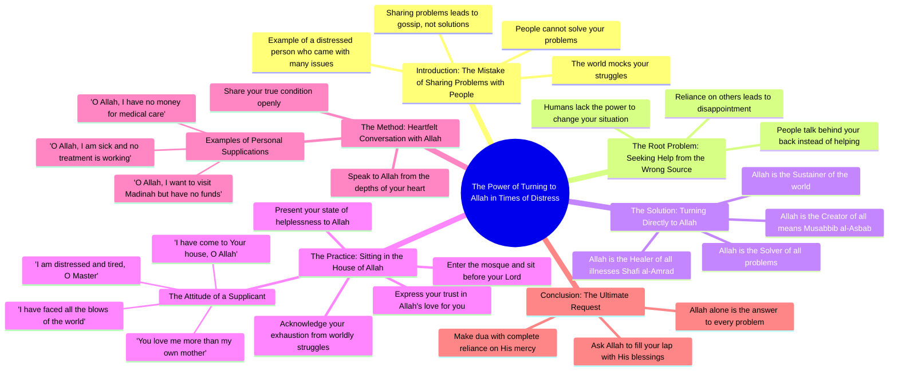

# Deep Lines on the Karakoram Highway: Scenic Drive Through...

> 🌐 **Read this in:** [English](../../en/2026-08/tiktok-transcript-2-9k-views-43k-reactions-deep-lines-naltar-expressway-by-ree-c45a.md) · **中文**

> **Creator:** [@Reelbymeer](https://www.tiktok.com/@Reelbymeer) · **Views:** 200.0K · **Posted:** 2026-08-11 · **Niche:** other
>
> **TL;DR:** Starts with a strong, relatable warning that immediately grabs attention and sets a confidential, emotional tone.

[Watch original video →](https://www.facebook.com/share/r/1PUHRaLnWk/)

## Why This Went Viral

## 钩子（前3秒）
- **逐字开场：** “کسی کو مت بتایا کرو کیا پرابلم ہے”（“别告诉任何人你的问题是什么”）
- **钩子模式：** 大胆断言 / 直接命令——一条以绝对确定性陈述的反直觉人生法则。
- **为何能阻止滑动：** 它瞬间挑战了人类的本能（分享自己的问题）。观众会感到认知失调：*等等，我以为分享是好事？* 这立即制造了一个“为什么？”的缺口，迫使观众继续观看以解开这个张力。

## 情绪节奏
1. **张力（0–3秒）：** 大胆断言制造摩擦和怀疑。
2. **认同（3–8秒）：** “کوئی کچھ نہیں کر سکتا دنیا والے مزاق اڑاتے ہیں”——“没人能帮你；世人只会嘲笑你。” 这从挑战转向苦涩的真相，与任何曾感到被背叛或被忽视的人产生共鸣。
3. **个人故事（8–12秒）：** “آیا تھا میرے پاس بڑا پریشان تھا”——引入叙事，使其 relatable 且具体。
4. **转折（12–15秒）：** “جس رب کائنات سے مسئلہ حل کرنا ہے”——反转：解决方案不是人，而是真主。这是从绝望到希望的情绪转折。
5. **臣服/高潮（15–25秒）：** “تیرے گھر میں آ گیا ہوں... تھک گیا ہوں مولا”——赤裸的脆弱达到顶峰。说话者处于人生最低谷，这制造了强烈的情感共鸣。
6. **化解（25–30秒）：** “تو میری ماں سے زیادہ مجھے چاہنے والا ہے”——情感回报：无条件的爱。这是宣泄式的释放，让观众感到被看见、被安慰。

**高潮时刻：** “تیرے گھر میں آ گیا ہوں”这句——臣服于真主门前的举动。这是情感重量达到顶峰之处，观众感受到从无助到信任的转变。

## 关键词密度
1. **“مسئلہ”（问题）**——出现5次以上；驱动核心主题，并对任何搜索解决方案或正在挣扎的人具有算法相关性。
2. **“اللہ / رب”（真主 / 主）**——贯穿全文；精神锚点和主要情感牵引力。
3. **“پریشان”（担忧/焦虑）**——反复出现；切入高流量情绪搜索词。
4. **“تھک گیا”（累了/精疲力竭）**——反复出现；唤起倦怠感，一种普遍感受。
5. **“گھر”（房子/家）**——反复出现；象征安全、归属和庇护。
6. **“پیسے”（钱）**——被提及；触发财务焦虑，一个高互动话题。

**算法触达驱动词：** “مسئلہ”、“پریشان”、“اللہ”——这些是乌尔都语市场中的高流量搜索词。算法捕捉到情绪困扰关键词，并将其推送给搜索解决方案或安慰的用户。

**情感牵引驱动词：** “تھک گیا”、“ماں سے زیادہ چاہنے والا”——这些是亲密感触发器，与说话者建立准社会关系，让视频感觉像是发给每位观众的私人信息。

## 为何会传播
- **通过共同痛苦产生共鸣：** “دنیا بھر کے دھکے کھا لیے”（“我受尽了世间的打击”）这句如此普遍，任何被生活击垮过的人都能在其中看到自己。观众将其分享给正在挣扎的朋友——这是一种“这是给你的”信息。
- **精神化解弧线：** 视频不只是抱怨；它提供了解决方案（转向真主）。这使其作为*礼物*被分享——观众将其发送给他人作为一种情感支持，而不仅仅是娱乐。
- **原始、未经修饰的表达：** 说话者的声音因真实情感而沙哑。没有剧本化的打磨，这使其感觉像一场真实的忏悔。真实性触发“这是真的”反应，推动“我感同身受”之类的评论。
- **“别告诉任何人”悖论：** 开场告诉你*不要*分享你的问题，但观看和分享视频这个行为*就是*在分享问题。这制造了一种元评论，推动评论区互动：“但我刚刚分享了这条视频……”
- **细节的具体性：** “مدینہ جانا ہے”（“我想去麦地那”）和 “علاج کے پیسے نہیں”（“没钱治病”）是具体、可共鸣的挣扎，使抽象的痛苦变得可触可感。具体性推动分享，因为它让人觉得说话者在讲述*你*的故事。

## 你可以借鉴什么
1. **以反直觉命令开场：** 以直接、反直觉的指令开始你的视频（“不要做X”或“停止做Y”）。它制造即时的认知摩擦，阻止滑动。不要解释——让张力积累3–5秒后再给出理由。
2. **使用“转折式反转”结构：** 以关于世界的苦涩真相开始（人们会嘲笑你），然后转向一个更高的解决方案（转向更高的力量、更大的理念、不同的框架）。这种两部分结构——问题→超越——赋予你的视频一种完整且令人满足的情感弧线。
3. **以无条件的爱结尾，而非行动号召：** 不要用“点赞和订阅”，而是以一句让观众感到被珍视的话收尾（“你被爱着，远超你所知”）。这制造分享冲动，因为观众想把那种感觉传递给他人。在病毒式短视频中，情感共鸣胜过明确的行动号召。

## Mind Map

## Full Transcript (Generated by [免费 TikTok 文稿生成器](https://toktranscript.com/?utm_source=github&utm_medium=breakdown&utm_campaign=tool_attribution))

> 📝 Transcripts on this page are auto-generated and show the first 60%. Want to transcribe any TikTok in 30 seconds and get the full version? [Try TokTranscript free →](https://toktranscript.com/?utm_source=github&utm_medium=breakdown&utm_campaign=transcript_cta)

کسی کو مت بتایا کرو کیا پرابلم ہے کوئی کچھ نہیں کر سکتا دنیا والے مزاق اڑاتے ہیں آپ کسی کو جا کر کہتا ہے نا میرا یہ پرابلم ہے میرا یہ مسئلہ ہے اب حل کر دیں حل نہیں کرتے پیچھے جا کے باتیں کرتے ہیں آیا تھا میرے پاس بڑا پریشان تھا اس کا تو یہ مسئلہ تھا اس کا تو یہ مسئلہ تھا میں کیوں مت ہوں کسی کو یار میرا مسئلہ جس رب کائنات سے مسئلہ حل کرنا ہے جو مسبیبل اسباب ہے جو شافیل امراض ہے جو دنیا کو نواز رہا ہے بیٹھ جاؤ نا اس کے گھر میں آ گیا ہوں یا اللہ تیرے گھر میں پریشان ہوں 

*[Read the full transcript on TokTranscript →](https://toktranscript.com/plaza/tiktok-transcript-2-9k-views-43k-reactions-deep-lines-naltar-expressway-by-ree-c45a?utm_source=github&utm_medium=breakdown&utm_campaign=transcript_full)*

## Browse More

- All [other](../../by-niche/zh-CN/other.md) breakdowns
- All [Direct advice with negative consequence](../../by-pattern/zh-CN/hook-direct-advice-with-negative-consequence.md) examples

## Video Info

| | |
|---|---|
| Creator | [@Reelbymeer](https://www.tiktok.com/@Reelbymeer) |
| Original video | [https://www.facebook.com/share/r/1PUHRaLnWk/](https://www.facebook.com/share/r/1PUHRaLnWk/) |
| Original title | 2.9K views · 43K reactions | Deep lines 🥀 📍 naltar expressway 📹 by Reelbymir The Karakoram Highway (KKH) is an engineering marvel and a breathtaking road trip through the Himalayas, Karakoram, and Hindu Kush mountains, often called the “Eighth Wonder of the World”. Perfect for showcasing snowy peaks, rugged gorges, and high-altitude, the KKH connects Pakistan and China via the scenic Khunjerab Pass ❤️Double tap if epic road journeys inspire you 💾 Stay connected with us for the best reels. 🔔 Follow Reelbymir for more epic nature views ⏩Share with your friends and loved ones. #viralpost❤️ #trendingsong❤️ #reelinstagram❤️ #reels #réel | Reelbymeer |
| Views | 200.0K (199990) |
| Posted | 2026-08-11 |
| Duration | 0s |
| Niche | `other` |
| Hook pattern | `Direct advice with negative consequence` |
| Original language | `en` (this page translated by AI) |
| Available languages | en, zh-CN |
| Generated | 2026-08-13 by [TokTranscript](https://toktranscript.com/) |

---

*This breakdown is for educational analysis under fair use. Original video © [@Reelbymeer](https://www.tiktok.com/@Reelbymeer). All transcripts are auto-generated and may contain errors.*

*Want to analyze your own TikToks like this? [免费 TikTok 文稿生成器 →](https://toktranscript.com/viral-breakdown?utm_source=github&utm_medium=breakdown&utm_campaign=footer_cta)*