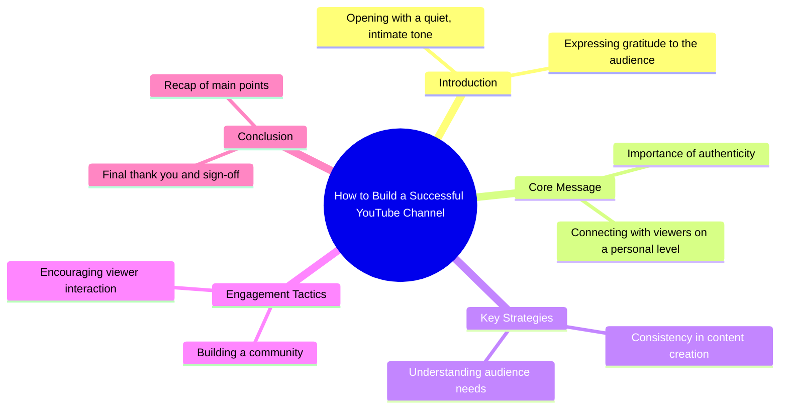

# Chihuahua Pranks Pregnant Lady and Steals Toddler's Break...

> 🌐 **Read this in:** [English](../../en/2026-08/tiktok-transcript-2-9m-views-57k-reactions-this-chihuahua-literally-has-zero-r-8580.md) · **中文**

> **Creator:** [@The Giggles and Wag Show](https://www.tiktok.com/@The Giggles and Wag Show) · **Views:** 1.3M · **Posted:** 2026-08-25 · **Niche:** other
>
> **TL;DR:** The abrupt whisper and gratitude create curiosity and emotional resonance.

[Watch original video →](https://www.facebook.com/share/r/1DXN7pbBfy/)

## Why This Went Viral

## 钩子（前3秒）
- **逐字开场**：“嘘……谢谢。”
- **钩子模式**：场景 + 反差（先以静默暗示，随即表达感谢，瞬间颠覆预期）
- **为何能阻止滑动**：“嘘”营造出一种私密、默契的停顿——观众会本能地凑近，想看看这耳语般的话语究竟在说什么。“谢谢”则令人卸下防备、出乎意料，让观众感觉被直接点名，而非被动接收信息。

## 情绪节奏
- **节拍1——好奇/亲密**：“嘘”将观众拉入一个私密时刻，降低他们的戒备心。
- **节拍2——温暖/被认可**：“谢谢”瞬间建立情感纽带——观众感到自己被看见。
- **节拍3——悬念（隐含）**：台词的简短留下空白；观众等待着在文字稿中永远不会出现的回应，形成一种循环，让他们持续投入。
- **节拍4——共鸣**：感谢的简单纯粹具有普世共鸣——重点不在于内容本身，而在于被认可的那种*感受*。
- **高潮**：“谢谢”本身——这就是全部的情感载荷。没有铺垫，没有回落，只有赤裸裸的人性瞬间。

## 关键词密度
- **“嘘”**——出现1次，但它是*触发*词——驱动算法层面的暂停率（观众停止滑动去倾听）。
- **“谢谢”**——出现1次，但它是*情感*关键词——驱动分享和收藏（人们会@他们想感谢的朋友）。
- **静默**（隐含）——没有说出口，但“嘘”之后的停顿本身就是一个关键词——驱动观看时长留存。
- **感恩**（隐含）——驱动评论的情感关键词（“这让我一整天都开心”）。
- **亲密感**（隐含）——驱动关注的气氛关键词（观众想要更多这种感觉）。

**算法触达驱动因素**：“嘘”（暂停率飙升）和静默间隙（留存率）。
**情感拉动驱动因素**：“谢谢”（可分享性）和亲密语气（评论触发）。

## 为何能传播
1. **普世情感触发器**：“谢谢”是每个人都想听到的话。这条视频触及了被认可的基本需求——观众分享它，是作为向*自己*在乎的人表达感谢的替代方式。
2. **低认知负荷，高情感回报**：文字稿只有2个词。1秒钟就能看完，但那种感觉会久久萦绕——这使得它无需任何背景就能被无限重看和分享。
3. **“嘘”制造了模式中断**：在充满喧嚣、攻击性钩子的信息流中，耳语是一种*新奇*——它迫使算法记录到高暂停率，从而提升分发。
4. **模糊性催生互动**：文字稿没有解释创作者*为什么*感谢观众——所以评论填补了这个空白（“这是给我妈妈的”“我今天正需要这个”），推动评论速度。
5. **格式无关的病毒式传播**：这句话可以作为独立视频、拼接、合拍或音频使用——它可被二次创作，从而在平台上延长其生命周期。

## 你可以借鉴什么
1. **以耳语开场，而非呐喊**：用柔和、私密的提示（“嘘……”“嘿，你……”）开启你的下一个视频——这会迫使观众凑近，推高暂停率。
2. **让第一句话成为一次完整的情感交换**：不要吊胃口——在前3秒就*给予*一些东西。“谢谢”之所以有效，是因为它是一份完整的礼物，而非一个承诺。可以尝试以赞美、坦白或直接认可观众来开场。
3. **留下空白让观众去填补**：文字稿在没有任何背景的情况下结束——这是故意的。以一个开放式的循环或模糊的陈述结束你的视频，邀请评论（“……你知道你是谁”或“……我只能说这么多”）。评论会成为你的第二个钩子。

## Mind Map

## Full Transcript (Generated by [拆解你自己的 TikTok](https://toktranscript.com/?utm_source=github&utm_medium=breakdown&utm_campaign=tool_attribution))

> 📝 Transcripts on this page are auto-generated and show the first 60%. Want to transcribe any TikTok in 30 seconds and get the full version? [Try TokTranscript free →](https://toktranscript.com/?utm_source=github&utm_medium=breakdown&utm_campaign=transcript_cta)

Shhh.. Tha

*[Read the full transcript on TokTranscript →](https://toktranscript.com/plaza/tiktok-transcript-2-9m-views-57k-reactions-this-chihuahua-literally-has-zero-r-8580?utm_source=github&utm_medium=breakdown&utm_campaign=transcript_full)*

## Browse More

- All [other](../../by-niche/zh-CN/other.md) breakdowns
- All [Whisper + Gratitude](../../by-pattern/zh-CN/hook-whisper-gratitude.md) examples

## Video Info

| | |
|---|---|
| Creator | [@The Giggles and Wag Show](https://www.tiktok.com/@The Giggles and Wag Show) |
| Original video | [https://www.facebook.com/share/r/1DXN7pbBfy/](https://www.facebook.com/share/r/1DXN7pbBfy/) |
| Original title | 2.9M views · 57K reactions | This Chihuahua literally has zero respect for anyone🤰🥞😂 From mocking a pregnant lady at the hospital to robbing breakfast from a helpless toddler, this Chihuahua is officially out of control. (Digitally AI-created for entertainment—no real animals involved.) #FunnyDogs #ChihuahuaPranks #BulldogLife ##animation | The Giggles and Wag Show |
| Views | 1.3M (1301900) |
| Posted | 2026-08-25 |
| Duration | 0s |
| Niche | `other` |
| Hook pattern | `Whisper + Gratitude` |
| Original language | `en` (this page translated by AI) |
| Available languages | en, zh-CN |
| Generated | 2026-08-26 by [TokTranscript](https://toktranscript.com/) |

---

*This breakdown is for educational analysis under fair use. Original video © [@The Giggles and Wag Show](https://www.tiktok.com/@The Giggles and Wag Show). All transcripts are auto-generated and may contain errors.*

*Want to analyze your own TikToks like this? [免费 TikTok 文稿生成器 →](https://toktranscript.com/viral-breakdown?utm_source=github&utm_medium=breakdown&utm_campaign=footer_cta)*