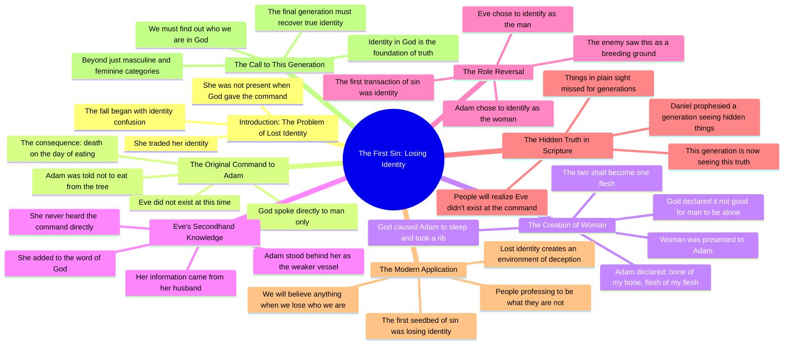

# Lost Gender Identity and the Fall of Mankind: Fallen Ange...

> 🌐 **Read this in:** [English](../../en/2026-08/tiktok-transcript-26k-views-17k-reactions-lost-gender-identity-caused-the-fall-8669.md) · **中文**

> **Creator:** [@The Confessionals](https://www.tiktok.com/@The Confessionals) · **Views:** 520.5K · **Posted:** 2026-08-11 · **Niche:** other
>
> **TL;DR:** Opens with a shocking, counterintuitive claim about Eve and directly engages a listener, immediately creating curiosity and tension.

[Watch original video →](https://www.facebook.com/share/v/19VhuNNjKA/?mibextid=wwXIfr)

## Why This Went Viral

## 钩子（前3秒）
- **逐字开场：**“她失去了自己的身份。她曾将自己的身份交易了出去。”
- **钩子模式：**大胆断言 + 即刻的、未加解释的指控。它点名了一个熟悉的人物（“她”），却抛出一个令人震惊的结论（“失去了自己的身份”），且毫无上下文。
- **为何能让人停下滑动：**它把模糊性当作武器。观众立刻发问：*“她”是谁？夏娃？某位名人？还是我？*“身份”一词的重复（2秒内出现两次）暗示了一个高风险主题，而讲道者强烈的表达方式制造出一种“你必须听这个”的紧迫感，打断了被动的滑动。

## 情绪节奏
- **节拍1——困惑/好奇：**“她失去了自己的身份……交易掉了自己的身份”（观众感到迷失方向，身体前倾）。
- **节拍2——智识张力：**“托尼，上帝说那话的时候，她根本都还没出现。”（点名“托尼”营造对话式的亲密感；设置了一个谜题：*谁对谁说了什么？*）
- **节拍3——悬念升级：**他按顺序走了一遍《创世记》——亚当的命令、给动物命名、肋骨、婚礼——构建出一条时间线，感觉像侦探在重演现场。
- **节拍4——反转（高潮）：**“她对蛇所说的一切……都是她丈夫告诉她的……这世上最初的罪之交易，就是身份。”（揭示落地：夏娃的罪是*二手知识*加*角色颠倒*。这就是让观众倒回去重看的“啊哈”时刻。）
- **节拍5——共鸣/现代应用：**“如今有人自称是某种人，其实他们不是……这末后的世代，我们必须弄清楚自己是谁。”（从古代解经转向当下的身份危机，使其变得个人化且易于分享。）
- **节拍6——收束：**“我们必须弄清楚我们在上帝里面是谁。”（以救赎性、可行动的话语收尾——不仅仅是定罪。）

## 关键词密度
- **身份**（8次）——*算法触达：*一个普适、可搜索的话题（性别、自我探索、灵性），能跨领域触发推荐系统。
- **上帝说 / 上帝的话语**（6次）——*情感拉力：*锚定权威，触发宗教受众的“阿们”反射，增加信仰社群内的分享。
- **最初的罪 / 最初的温床**（3次）——*情感拉力：*制造“隐藏知识”钩子——人们喜欢感觉自己发现了经文中的秘密。
- **世代 / 末后的世代**（4次）——*算法+情感：*切入预言类内容（末世话题参与度高），制造紧迫感。
- **明明可见却隐藏**（3次）——*情感拉力：*一个令人难忘的短语，观众会在评论区引用，提升互动信号。
- **男人 / 女人 / 男性 / 女性**（5次）——*算法触达：*性别角色是高争议话题，驱动评论、分享和辩论——全是病毒式传播的燃料。

## 为何会传播
- **“秘密被揭晓”模式：**“明明可见却隐藏”这句话（重复两次）将视频框定为阴谋论式的揭示。观众分享它是为了说：*“你注意到这个了吗？我没有。”*这与“圣经密码”或“失落经卷”类内容的机制相同——它让观众获得“圈内人”的优越感。
- **反常识的圣经论断：**“夏娃根本没听到。她根本还不存在。”这直接与主日学的常见叙事相矛盾。反常识论断之所以被分享，是因为它们*可争论*——每一次分享都引发一场辩论，从而推动评论区活跃度（第一互动指标）。
- **当代相关性钩子：**从夏娃转向“有人自称是某种人，其实他们不是”（明显指向性别/身份争论），让古代文本显得紧迫。它搭乘文化热点话题，却不明确点名——足够安全可分享，又足够尖锐能引发讨论。
- **对话式框架：**“托尼，她根本不在场……”——对一个具名者说话，营造出一种私密、即兴揭示的感觉。观众觉得自己在偷听一场私人教导，这增加了观看时长和“收藏”率。
- **节奏性重复增强记忆：**“我们现在就处在这个光景”（重复两次）和“我们必须弄清楚我们是谁”（首尾呼应）为观众提供了可引用的金句。短视频平台奖励那些能产出适合混剪和接龙回应的片段式金句的内容。

## 你可以偷师什么
- **以结论开场，而非提问。**用一个令人震惊的陈述句开头（“她失去了自己的身份”），点名一个熟悉的主题，却翻转预期叙事。不要解释——让困惑感牵引观众度过前10秒。
- **构建“时间线揭示”。**一步步走一遍广为人知的故事（如《创世记》的序列），但停在一个所有人都忽略的细节上。*“我读过一百遍，却从没看到这个”*的感觉，是教育类内容中最具分享性的情绪。
- **将古代文本桥接到现代争议——却不点名。**视频从未说出“跨性别”或“性别角色”，但其含义不言而喻。这让观众将自己的语境投射到内容上，使其感觉个人化，并增加他们@朋友或在群聊中分享的可能性。

## Mind Map

## Full Transcript (Generated by [TikTok 转录工具](https://toktranscript.com/?utm_source=github&utm_medium=breakdown&utm_campaign=tool_attribution))

> 📝 Transcripts on this page are auto-generated and show the first 60%. Want to transcribe any TikTok in 30 seconds and get the full version? [Try TokTranscript free →](https://toktranscript.com/?utm_source=github&utm_medium=breakdown&utm_campaign=transcript_cta)

She lost her identity. She had traded her identity. Tony, she was not even around when God said that. She did not even exist. When you go back in scripture and you find God said it to man only. He said to Adam, of every tree in the garden you can eat, but of this tree you shall not eat of it, for in the day that you eat of it you shall surely die. Boom. Next verse. Talks about naming the animals. Next verse. and God said, it is not good for a man to be alone. And God caused man to lay down and to a sleep and he took a rib and out of that rib, he brought woman and presented her to him. And he said, oh, bone of my bone, flesh of my flesh. Therefore shall a man leave his father and mother and cleave unto his wife and the two shall become one flesh. So the reality is this, this is what I'm talking about, hidden in plain sight. This is what I'm talking about when Daniel said in the last days, this generation is gonna see things, not adding, twisting, not feeling a different way about scripture, but reading something that's in there that we have missed for generations. When you go back and look at it, not only does she add to the word of God, she added to the word of God because she didn't even hear it. She didn't even exist. Everything that she said to the serpent she said on secondhand knowledge was told to her by her husband who was standing behind her becoming the weaker vessel who had chosen to identify as the woman and she had chosen to identify as the man. The first initial transaction of sin in this world was identity. When they lost their identity, she took on the role of the masculine. He took on the role of the feminine. When t

*[Read the full transcript on TokTranscript →](https://toktranscript.com/plaza/tiktok-transcript-26k-views-17k-reactions-lost-gender-identity-caused-the-fall-8669?utm_source=github&utm_medium=breakdown&utm_campaign=transcript_full)*

## Browse More

- All [other](../../by-niche/zh-CN/other.md) breakdowns
- All [Bold Claim + Direct Address](../../by-pattern/zh-CN/hook-bold-claim-direct-address.md) examples

## Video Info

| | |
|---|---|
| Creator | [@The Confessionals](https://www.tiktok.com/@The Confessionals) |
| Original video | [https://www.facebook.com/share/v/19VhuNNjKA/?mibextid=wwXIfr](https://www.facebook.com/share/v/19VhuNNjKA/?mibextid=wwXIfr) |
| Original title | 26K views · 17K reactions | Lost Gender Identity caused the Fall of Mankind 812: Fallen Angels and the Final Flood | The Confessionals |
| Views | 520.5K (520506) |
| Posted | 2026-08-11 |
| Duration | 0s |
| Niche | `other` |
| Hook pattern | `Bold Claim + Direct Address` |
| Original language | `en` (this page translated by AI) |
| Available languages | en, zh-CN |
| Generated | 2026-08-12 by [TokTranscript](https://toktranscript.com/) |

---

*This breakdown is for educational analysis under fair use. Original video © [@The Confessionals](https://www.tiktok.com/@The Confessionals). All transcripts are auto-generated and may contain errors.*

*Want to analyze your own TikToks like this? [TokTranscript 转录工具 →](https://toktranscript.com/viral-breakdown?utm_source=github&utm_medium=breakdown&utm_campaign=footer_cta)*