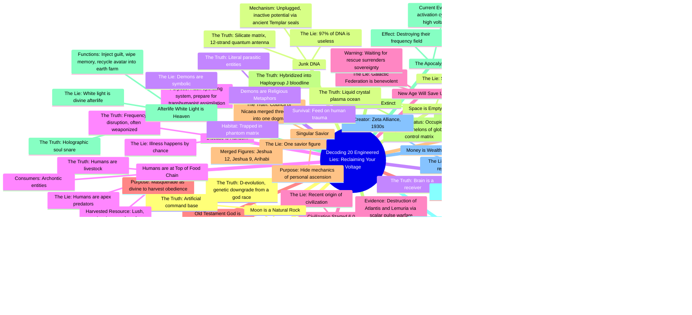

# 20 Lies You Were Taught in School

> 🌐 **Read this in:** [English](../../en/2026-08/tiktok-transcript-2k-views-77k-reactions-20-lies-you-were-taught-in-school-evo-1ffd.md) · **中文**

> **Creator:** [@Rex Edison](https://www.tiktok.com/@Rex Edison) · **Views:** 876.1K · **Posted:** 2026-08-16 · **Niche:** entertainment
>
> **TL;DR:** Promises a high-stakes reveal of 20 lies, creating immediate curiosity and a sense of forbidden knowledge.

[Watch original video →](https://www.facebook.com/reel/27249227684770564/?fs=e&s=TIeQ9V&fs=e&mibextid=wwXIfr&fs=e)

## Why This Went Viral

## 钩子（前3秒）
- **逐字开场白：**“你在学校学到的一切几乎都是精心编造的谎言和掩盖真相的故事。”
- **钩子模式：**大胆断言 + 阴谋论框架（“精心编造的谎言”），针对制度不信任感。
- **为何能阻止滑动：**它攻击一种普遍共享的经历（学校教育），并承诺提供秘密知识——观众要么立刻感到被认同（如果他们不信任制度），要么感到被挑衅（如果他们不信任）。两种情绪都会促成观看。

## 情绪节奏
1. **反抗/认同**（0:00–0:05）——“你学到的一切都是谎言”迎合了观众的怀疑心态。
2. **紧张升级**（0:05–0:20）——“20个谎言”的承诺制造了一种倒计时驱动的强迫感，让人忍不住继续看下去。
3. **震惊/难以置信**（0:20–1:00）——早期的谎言（达尔文、DNA、意识）足够离谱，能触发“不可能”的反应，从而激发评论。
4. **势头/上瘾**（1:00–2:30）——快速连珠炮式的讲述（每个谎言约5–10秒）营造出老虎机般的节奏；观众不断等待下一个刺激。
5. **荒诞巅峰/反转**（2:30–3:30）——第12至15个谎言（月球是人造的、恶魔是真实存在的、人类是被圈养的牲畜）将观众推入“这太疯狂了但我停不下来”的状态。
6. **赋权高潮**（3:30–4:15）——第19个谎言翻转剧本：“你无能为力”变成“你承载着12股钻石太阳架构”——情感回报是个人力量。
7. **解决/紧迫感**（4:15–结尾）——“天启 = 揭开面纱”将当前的混乱重新定义为胜利，以邀请参与的号召性用语收尾。

**高潮时刻：**第19个谎言（“你无能为力 → 你是神级电池”）——它将恐惧转化为能动性，这是推动分享的情感巅峰。

## 关键词密度
- **“真相”**（使用10次以上）——既推动算法触达（阴谋论领域的高互动关键词），也拉动情感吸引力（在混乱世界中承诺确定性）。
- **“谎言”**（使用20次以上）——结构性锚点；每次重复都强化“我们 vs. 他们”的框架。
- **“你/你的”**（使用15次以上）——直接称呼制造个人利害关系；提升观看时长，因为感觉像是专门为观众传递的信息。
- **“矩阵/系统/控制”**（使用8次以上）——切入已有的阴谋论搜索流量和社群关键词。
- **“电压/能量/频率”**（使用6次以上）——该创作者品牌的独特之处；创造出粉丝在评论中重复的标志性词汇。
- **“神/神圣/古代”**（使用7次以上）——触发灵性追寻者受众，并推动在形而上学社群中的分享。

**算法驱动词：**“真相”、“谎言”、“矩阵”——高搜索量、强点击率潜力的关键词。
**情感驱动词：**“你”、“电压”、“觉醒”——制造身份认同和社群归属感。

## 为何能传播
- **倒计时结构制造完成强迫症。**“20个谎言”加上快速连珠炮式的讲述，意味着观众无法中途停止。文字记录的节奏（每个谎言 = 一次呼吸）是为刷视频上瘾而设计的。*具体台词：“让我们从最大的谎言开始……第二个谎言是……第三个谎言是……”*——一条无情的链条。
- **每一个断言都是可分享的“麦克风掉落”时刻。**每个谎言都是自成一体的，且足够离谱，可以被引用或截图。*具体台词：“月球是一个人造指挥基地”*——这一句话本身就能成为独立的表情包，推动自然分享。
- **结尾将焦虑重新定义为赋权。**天启反转（“这是你和我的开始”）将当前世界事件转化为胜利叙事。这种情感转折正是观众将其发送给那些对新闻感到焦虑的朋友的原因。*具体台词：“你现在目睹的混乱不是世界末日……而是恒星激活周期。”*
- **号召性用语是一个社群建设陷阱。**“评论‘真相’这个词，我会给你发送我的第一阶段高电压排毒方案”——这将被动观众转化为潜在客户，并创造评论区的互动，从而提升算法推荐。*具体台词：“评论你的反馈或你的怀疑，如果你愿意，也可以评论‘真相’这个词。”*
- **它将身份武器化。**视频不仅仅是告知——它在招募。到结尾时，观众要么是“觉醒的”，要么是“沉睡的”。这种二元身份框架是病毒式阴谋论内容中最强的分享触发器。*具体台词：“是时候拔掉插头了……让我们夺回我们的电压，开始人类复兴。”*

## 你可以借鉴什么
- **使用倒计时结构来提升留存率。**将你的内容框架化为“X个[事物]”，并在10秒内交付每一项。编号列表制造了一个开放循环，让观众持续观看到结束——这是排名第一的算法信号。
- **将负面信念翻转成个人力量的回报。**不要只揭露问题；以一个赋予观众能动性的反转收尾。“你无能为力 → 你是神级电池”的转折是情感引擎。将其应用到任何领域：“你认为自己不擅长理财 → 你实际上是被编程成这样的。”
- **以低摩擦的互动诱饵收尾。**要求观众评论一个词（“真相”）来获得某物。这之所以有效，是因为它只是一个词，而不是一段话，并且它创造了一个向算法发出高互动信号的评论区。改编一下：“评论‘蓝图’，我会把清单发给你。”

## Mind Map

## Full Transcript (Generated by [TokTranscript 转录工具](https://toktranscript.com/?utm_source=github&utm_medium=breakdown&utm_campaign=tool_attribution))

> 📝 Transcripts on this page are auto-generated and show the first 60%. Want to transcribe any TikTok in 30 seconds and get the full version? [Try TokTranscript free →](https://toktranscript.com/?utm_source=github&utm_medium=breakdown&utm_campaign=transcript_cta)

Almost everything you were taught in school is an engineered lie and cover story. And I'm going to decode all 20 of these incredible fabrications in the next few minutes so you can finally know the truth about who you are, where you came from, and how to reclaim your voltage. And listen closely, because lie number 20 explains exactly why their entire matrix is collapsing right now. Let's start with the biggest lie, shall we? Darwinian evolution. The narrative says you are an accidental upgrade from a primate. The reality is it's D evolution. You are actually a genetic downgrade from a literal god race. And this happened over 560 million years ago on a higher dimensional planet called Tara. Second lie is junk DNA. Science claims 97% of your DNA is useless. The truth is it's silicate matrix, a 12-strand quantum antenna intentionally unplugged and left with inactive potential via ancient Templar seals. The third lie is that the brain generates consciousness. The truth is the brain is a receiver. You exist entirely outside the body. Your body is simply a biological decoder for a frequency field. The fourth lie, disease is random. The truth is illness is a frequency disruption often weaponized to hack your operating system and prepare you for transhumanist assimilation Line number five, civilization only started 6,000 years ago. The truth is, history is a reset loop. Pure destruction of highly advanced civilizations like Atlantis and Lemuria via scalar pulse warfare. 6. The Old Testament God is the prime creator The truth is, this is the Jehovian Enunnaki a parasitic collective masquerading as the divine to harvest your obedience 7. A singular savior The truth is, the Council of Nicaea merged three entirely different men Jeshua 12, Jeshua 9, and Arihabi into one controlled dogma to higher mechanics of your own personal ascension. How about line number eight? Neanderthals went extinct. The truth is they did not go extinct. They were hybridized into the Haplogroup J bloodline that occupies the highest echelons of the global control matrix today. Line number nine, one of my favorite. The afterlife, white light, is heaven. The truth is, it's a holographic soul snare designed to inject guilt, wipe your memory, and recycle your avatar back into the earth farm. Lie 10. The New World Order is a myth. The truth it is the Atlantean conspiracy managed by human hybrid sleeper races to finalize global centralization Lie number 11 is money is wealth The truth is the financial system is a thermodynamic siphon created by the Zeta Alliance in the 1930s to keep you locked in root chakra survival mode now lie number 12 is going to get some the moon is a natural rock i'm sorry folks but the truth is it's an artificial command base and it's broadcasting the niberian electrostatic transduction field to keep you trapped in 3d how about 13 that space is just an empty vacuum well is actually a highly active liquid crystal plasma ocean. The empty space narrative is a psy

*[Read the full transcript on TokTranscript →](https://toktranscript.com/plaza/tiktok-transcript-2k-views-77k-reactions-20-lies-you-were-taught-in-school-evo-1ffd?utm_source=github&utm_medium=breakdown&utm_campaign=transcript_full)*

## Browse More

- All [entertainment](../../by-niche/zh-CN/entertainment.md) breakdowns
- All [Listicle with urgency](../../by-pattern/zh-CN/hook-listicle-with-urgency.md) examples

## Video Info

| | |
|---|---|
| Creator | [@Rex Edison](https://www.tiktok.com/@Rex Edison) |
| Original video | [https://www.facebook.com/reel/27249227684770564/?fs=e&s=TIeQ9V&fs=e&mibextid=wwXIfr&fs=e](https://www.facebook.com/reel/27249227684770564/?fs=e&s=TIeQ9V&fs=e&mibextid=wwXIfr&fs=e) |
| Original title | 2K views · 77K reactions | 20 Lies You Were Taught in School #evolution #religion #dna #detox #moon #loosh #disclosure #ufo | Rex Edison |
| Views | 876.1K (876063) |
| Posted | 2026-08-16 |
| Duration | 0s |
| Niche | `entertainment` |
| Hook pattern | `Listicle with urgency` |
| Original language | `en` (this page translated by AI) |
| Available languages | en, zh-CN |
| Generated | 2026-08-17 by [TokTranscript](https://toktranscript.com/) |

---

*This breakdown is for educational analysis under fair use. Original video © [@Rex Edison](https://www.tiktok.com/@Rex Edison). All transcripts are auto-generated and may contain errors.*

*Want to analyze your own TikToks like this? [TokTranscript →](https://toktranscript.com/viral-breakdown?utm_source=github&utm_medium=breakdown&utm_campaign=footer_cta)*