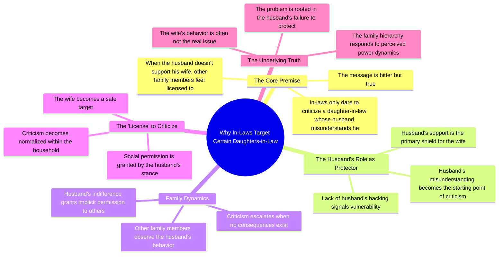

# In-Laws Only Mock a Wife Whose Husband Doesn’t Support Her

> 🌐 **Read this in:** [English](../../en/2026-08/tiktok-transcript-3-4k-views-73k-reactions-instalike-instadaily-insta-instagra-898f.md) · **中文**

> **Creator:** [@Kavya2000](https://www.tiktok.com/@Kavya2000) · **Views:** 1.6M · **Posted:** 2026-08-05 · **Niche:** other
>
> **TL;DR:** Starts with a provocative, universally relatable truth that immediately grabs attention.

[Watch original video →](https://www.facebook.com/share/r/1DzA7s9Jor/)

## Why This Went Viral

## Hook（前3秒）
- **逐字开场：**“婆家只敢说那个儿媳的坏话，前提是她的丈夫也认为她不好。”
- **钩子模式：**大胆断言 + 文化禁忌。这是关于印度家庭关系中一个直白、普遍的真相，几乎没有人会公开说出来。
- **为何能让人停下滑动：**它用一句话点破了痛苦而难以言说的权力动态。观众会觉得自己被精准击中——无论是作为儿媳、丈夫，还是婆家人——并且必须听下去，以确认或反驳这个说法。

## 情绪节奏
- **节拍1（好奇/震惊）：**开场断言尖锐直接。观众被猛然击中。
- **节拍2（紧张）：**“而当她的丈夫也不站在她这边的时候”——紧张感升级。背叛感层层叠加：不只是婆家，连丈夫也一样。
- **节拍3（共鸣/认同）：**“那其他家人就拿到了说她坏话的许可证”——“许可证”这个词是情绪转折点。它把虐待重新定义为一种系统性的默许，而非孤立事件。
- **节拍4（高潮）：**“这话难听，但却是事实。”——这是反转。说话者承认真相带来的痛苦，这卸下了防御心理，迫使听众认同。
- **整体弧线：**震惊 → 紧张 → 痛苦的认同 → 无奈的接受。

## 关键词密度
- **“गलत”（错）**——出现3次。推动道德框架和情绪牵引力。
- **“पती”（丈夫）**——反复出现。是被揭露的权力动态的核心。
- **“ससुराल वाले”（婆家）**——锚定文化背景，在印度家庭内容领域具有高搜索量和传播潜力。
- **“साथ नहीं देता”（不站在……一边）**——对任何感受过被抛弃的人都是情绪触发器。
- **“लाइसेंस”（许可证）**——最具病毒传播潜力的一个词。它是隐喻性的、可做成梗的、可引用的。
- **“सच”（事实）**——在结尾句中重复两次。推动其作为“真相炸弹”被分享。

## 为何能传播
- **它利用了普遍的恐惧：**视频精准点出了女性在父权家庭中失去所有保护的那个瞬间。任何目睹或经历过这种事的人都会把它当作一种认同来分享。
- **“许可证”这个隐喻适合被转发：**“लाइसेंस मिल जाता है”是一个可以独立引用的句子。它可以被截图、配文、脱离语境转发——非常适合Instagram短视频和WhatsApp转发。
- **它制造了“我们vs.他们”的清晰对立：**脚本把世界分成受害者（儿媳）和纵容者（丈夫+婆家）。这种二元对立推动评论、争论和互动。
- **结尾句预先堵住了反驳：**“这话难听，但却是事实”是一面修辞盾牌。它在批评者打出“但不是所有家庭都这样……”之前就卸掉了他们的火力——这反而讽刺地引发了更多评论。
- **它针对特定性别但人人都想看：**男性看是为了辩护或反思；女性看是为了共鸣；婆家人看是为了争论。三个观众群体 = 三条评论线 = 更高的算法推荐。

## 你可以借鉴什么
- **以禁忌真相开场，而不是提问。**问题会让人跳过。大胆的断言迫使观众留下来验证。使用“सिर्फ... ही... की हिम्मत रखते हैं”——一种暗示排他性和不公的结构。
- **为系统性问题创造一个具象的隐喻。**“许可证”把抽象的权力动态变成了一个可触摸的物体。找到一个能概括你整个论点的词，并反复使用它。
- **以让步收尾，卸下批评者的防备。**“这话难听，但却是事实”——承认自己话语中的痛苦。这让你显得公正，从而增加信任和分享率。试试：“这话说起来刺耳，但这就是现实。”

## Mind Map

## Full Transcript (Generated by [TokTranscript 转录工具](https://toktranscript.com/?utm_source=github&utm_medium=breakdown&utm_campaign=tool_attribution))

> 📝 Transcripts on this page are auto-generated and show the first 60%. Want to transcribe any TikTok in 30 seconds and get the full version? [Try TokTranscript free →](https://toktranscript.com/?utm_source=github&utm_medium=breakdown&utm_campaign=transcript_cta)

ससुराल वाले सिर्फ उसी बहू को गलत बोलने की हिम्मत रखते हैं, जिसका पती ही उसे गलत समझता हो. और जब उसका पती भी उसका साथ नहीं देता ह

*[Read the full transcript on TokTranscript →](https://toktranscript.com/plaza/tiktok-transcript-3-4k-views-73k-reactions-instalike-instadaily-insta-instagra-898f?utm_source=github&utm_medium=breakdown&utm_campaign=transcript_full)*

## Browse More

- All [other](../../by-niche/zh-CN/other.md) breakdowns
- All [Bold Truth Statement](../../by-pattern/zh-CN/hook-bold-truth-statement.md) examples

## Video Info

| | |
|---|---|
| Creator | [@Kavya2000](https://www.tiktok.com/@Kavya2000) |
| Original video | [https://www.facebook.com/share/r/1DzA7s9Jor/](https://www.facebook.com/share/r/1DzA7s9Jor/) |
| Original title | 3.4K views · 73K reactions | ससुराल वालों को पत्नी को ग़लत बोलने का मौका मिल जाता है…………………… #instalike #instadaily #insta #instagram #youtube | Kavya2000 |
| Views | 1.6M (1571804) |
| Posted | 2026-08-05 |
| Duration | 0s |
| Niche | `other` |
| Hook pattern | `Bold Truth Statement` |
| Original language | `en` (this page translated by AI) |
| Available languages | en, zh-CN |
| Generated | 2026-08-06 by [TokTranscript](https://toktranscript.com/) |

---

*This breakdown is for educational analysis under fair use. Original video © [@Kavya2000](https://www.tiktok.com/@Kavya2000). All transcripts are auto-generated and may contain errors.*

*Want to analyze your own TikToks like this? [TokTranscript 转录工具 →](https://toktranscript.com/viral-breakdown?utm_source=github&utm_medium=breakdown&utm_campaign=footer_cta)*