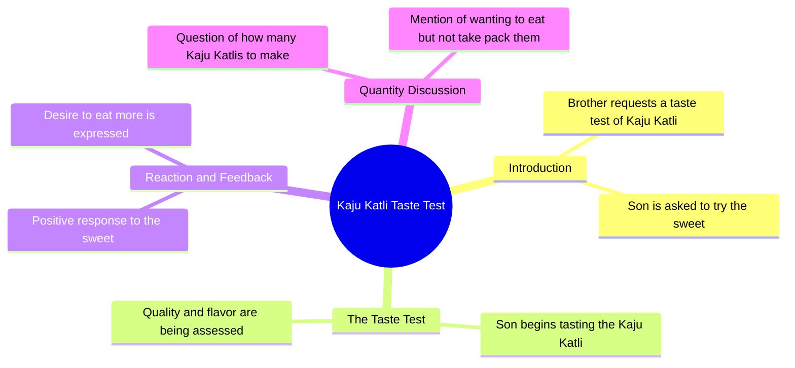

# Cute Baby Tries Sweets at Shop | Funny AI Video

> 🌐 **Read this in:** [English](../../en/2026-08/tiktok-transcript-38m-views-659k-reactions-cute-baby-sweets-shop-ai-funny-vide-3b18.md) · **中文**

> **Creator:** [@    Mini Masti AI](https://www.tiktok.com/@    Mini Masti AI) · **Views:** 14.0M · **Posted:** 2026-08-08 · **Niche:** other
>
> **TL;DR:** The hook immediately sets up a relatable snack-testing scenario with a humorous twist, drawing viewers in.

[Watch original video →](https://www.facebook.com/reel/4529745093933737/)

## Why This Went Viral

## Hook (前3秒)
- **逐字开场白：** "भाईया एक काजु कतली टेस्ट करवादो ना"（大哥，请让我尝一块卡朱卡特里吧）
- **钩子模式：** 场景 + 直接请求（一个孩子/年轻人用礼貌又讨喜的语气向店主请求）
- **为何能让人停下滑动：** 天真无邪、略带撒娇却又甜美的请求瞬间制造了好奇心——观众不知道店主会不会答应，两人之间的互动立刻让人产生共鸣，倍感温馨。方言表达（"करवादो ना"）增添了真实感和文化共鸣。

## 情绪节奏
- **节拍1 — 好奇（0–3秒）：** 请求提出；我们想看到回应。
- **节拍2 — 张力（3–5秒）：** 店主回答"लो बेटा टेस्ट करो"（来，孩子，尝尝吧）——他会免费给还是收费？
- **节拍3 — 俏皮反转（5–8秒）：** 店主说"अच्छा अब कितनी काजु कतली कर दूँ"（好，那要给你做多少块卡朱卡特里？）——暗示他愿意多给，气氛从交易转向慷慨。
- **节拍4 — 喜剧爆点（8–10秒）：** 点睛之笔"खाने का मन्था लेने का नहीं"（想吃的心有，想买的心没有）——一句机智又自知的坦白，把整个互动翻转成幽默。
- **高潮：** 最后一句作为喜剧揭示落地——孩子承认自己只是想要免费试吃，不是要买。

## 关键词密度
- **"काजु कतली"（卡朱卡特里）** — 重复3次；驱动视觉/感官吸引力以及这款甜食的可搜索性。
- **"टेस्ट कर"（品尝/试吃）** — 重复2次；形成试吃/品尝的模式，这是消费者常见的行为。
- **"खाने का"（为了吃）** — 重复2次；强调欲望与行动之间的反差。
- **"मन्था"（心情/意愿）** — 仅用一次，但它是点睛之笔的锚点；情感拉动力强。
- **"लो बेटा"（来，孩子）** — 仅用一次；塑造了温暖的店主形象，推动情感共鸣。

**算法触达：** "काजु कतली"在节日季（排灯节、甜食渴望期）是高搜索量关键词。  
**情感拉力：** "खाने का मन्था लेने का नहीं"是具备病毒传播潜力的金句——它适合做成梗、被引用、成为反应视频素材。

## 为何能广泛传播
- ** relatable 的坦诚：** "खाने का मन्था लेने का नहीं"捕捉了一种普遍的人性冲动——想要某样东西却不想付钱。每个人都经历过这种处境，这种直白的坦白让观众发笑并@朋友。
- **文化真实性：** 印地语/印地英语方言和糖果店场景精准触达了庞大的印度受众，他们能从自己生活中认出这种一模一样的互动——这是一个共享的文化时刻。
- **短小精悍的结构：** 视频不到15秒，有清晰的铺垫→回报。笑点快速落地，让人容易反复观看和分享而不失冲击力。
- **双角色动态：** 孩子（天真、调皮）vs. 店主（温暖、被逗乐）形成了天然的喜剧搭档。观众分享它，因为这种互动感觉像是生活写好的剧本，而不是创作者编排的。
- **可做成梗的点睛之笔：** 最后那句是独立可引用的金句，可以被改造成表情包、配文或反应片段——让视频的生命力超越原始发布。

## 你可以借鉴什么
- **以一个直接、人性化的请求开场：** 让你的视频以某人请求某件简单又 relatable 的事情开始——这能瞬间抓住注意力，因为观众想看到结果。
- **以自嘲式的点睛之笔收尾：** "खाने का मन्था लेने का नहीं"这个反转之所以有效，是因为它诚实地承认了一个缺点。设计一句用幽默或脆弱感翻转预期的收尾语——那就是你可分享的高光时刻。
- **用方言和场景作为捷径：** 不要净化你的语言或地点。地域特色正是让内容显得真实、可分享的原因。拥抱你的地方方言、店铺或日常场景——具体性创造普世性。

## Mind Map

## Full Transcript (Generated by [TikTok 转录工具](https://toktranscript.com/?utm_source=github&utm_medium=breakdown&utm_campaign=tool_attribution))

> 📝 Transcripts on this page are auto-generated and show the first 60%. Want to transcribe any TikTok in 30 seconds and get the full version? [Try TokTranscript free →](https://toktranscript.com/?utm_source=github&utm_medium=breakdown&utm_campaign=transcript_cta)

भाईया एक काजु कतली टेस्ट करवादो ना लो बेटा टेस्ट करो अच्छा अब कितन

*[Read the full transcript on TokTranscript →](https://toktranscript.com/plaza/tiktok-transcript-38m-views-659k-reactions-cute-baby-sweets-shop-ai-funny-vide-3b18?utm_source=github&utm_medium=breakdown&utm_campaign=transcript_full)*

## Browse More

- All [other](../../by-niche/zh-CN/other.md) breakdowns
- All [Direct request + playful refusal](../../by-pattern/zh-CN/hook-direct-request-playful-refusal.md) examples

## Video Info

| | |
|---|---|
| Creator | [@    Mini Masti AI](https://www.tiktok.com/@    Mini Masti AI) |
| Original video | [https://www.facebook.com/reel/4529745093933737/](https://www.facebook.com/reel/4529745093933737/) |
| Original title | 38M views · 659K reactions | Cute baby @Sweets shop🥮🎂🍩 AI funny video 🩵 #funnyreels #cutebaby #viralreelsシ #trendingreelsvideo #funnyreels | Mini Masti AI |
| Views | 14.0M (14028252) |
| Posted | 2026-08-08 |
| Duration | 0s |
| Niche | `other` |
| Hook pattern | `Direct request + playful refusal` |
| Original language | `en` (this page translated by AI) |
| Available languages | en, zh-CN |
| Generated | 2026-08-09 by [TokTranscript](https://toktranscript.com/) |

---

*This breakdown is for educational analysis under fair use. Original video © [@    Mini Masti AI](https://www.tiktok.com/@    Mini Masti AI). All transcripts are auto-generated and may contain errors.*

*Want to analyze your own TikToks like this? [免费 TikTok 文稿生成器 →](https://toktranscript.com/viral-breakdown?utm_source=github&utm_medium=breakdown&utm_campaign=footer_cta)*