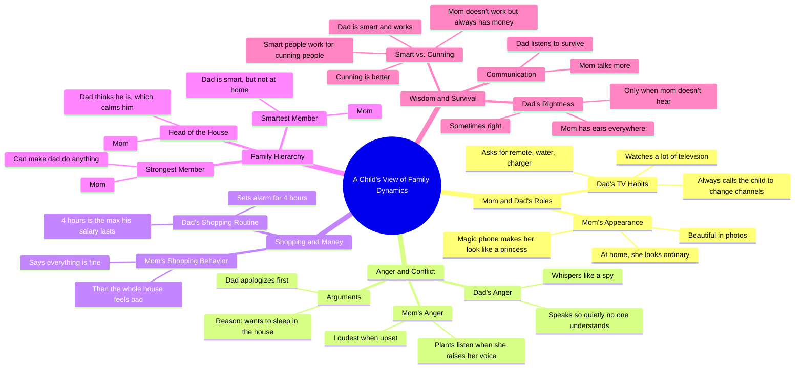

# Dad Only Calls Me to Change the TV Channel

> 🌐 **Read this in:** [English](../../en/2026-08/tiktok-transcript-3m-views-94k-reactions-giorgi-bartia-on-reels-578f.md) · **中文**

> **Creator:** [@Giorgi Bartia](https://www.tiktok.com/@Giorgi Bartia) · **Views:** 2.1M · **Posted:** 2026-08-25 · **Niche:** entertainment
>
> **TL;DR:** The hook immediately sets up a relatable family dynamic with a child's candid perspective, drawing viewers in with the promise of humorous revelations.

[Watch original video →](https://www.facebook.com/share/v/1DC9DAQxis/?mibextid=wwXIfr)

## Why This Went Viral

## 钩子（前3秒）
- **逐字开场：**“爸爸经常看电视吗？”——一个向孩子提出的问题，回答是“嗯”。
- **钩子模式：**提问 + 孩子的视角（好奇心缺口 + 天真无邪）。
- **为何能让人停下滑动：**观众立刻看到一个孩子被采访家庭日常。柔和好奇的童声加上略带禁忌感的话题（父母的怪癖）制造了“他们接下来会说什么？”的即时张力。观众必须看下去才能听到不加过滤的真相。

## 情绪节奏
1. **温暖的好奇心** —— 孩子回答关于爸爸看电视习惯的简单问题。
2. **共鸣式幽默** —— “换台，拿遥控器，拿水，拿充电器”——一个普遍的爸爸刻板印象。
3. **俏皮的对比** —— 妈妈在手机里是“公主”，在家却是“土豆”——荒诞、视觉化的喜剧。
4. **逐渐升温的张力** —— “谁吼得最大声？”→ 妈妈。孩子把话题升级到冲突领域。
5. **意外的反转** —— “爸爸像间谍一样小声说话，这样别人就听不懂”——出人意料、巧妙的表述。
6. **喜剧缓解** —— “爸爸先道歉，因为他想睡在家里”——妙语逻辑。
7. **不断升级的荒诞** —— 4小时闹钟的笑话联系到工资生存——用天真的方式讲出黑色幽默。
8. **峰值共鸣** —— “妈妈说她没事，然后整个家都不好了”——普遍真实，情感共鸣强烈。
9. **高潮** —— “爸爸很聪明，但在家不聪明”+“聪明人给狡猾的人打工”——孩子说出了哲学级的金句。
10. **温暖的收尾** —— “爸爸听着是为了生存”——一个最终令人难忘的妙语，为家庭画像画上句号。

**高潮时刻：**“聪明 vs. 狡猾”的对话——孩子的世界观凝结成一句病毒式传播的名言。

## 关键词密度
- **妈妈** —— 出现约10次；驱动情感吸引力（ relatable 的母亲原型）。
- **爸爸** —— 出现约12次；核心主题，驱动搜索/算法覆盖（家庭领域）。
- **聪明/狡猾** —— 在高潮中重复出现；高情感吸引力，值得引用。
- **在家** —— 重复对比；驱动“公开 vs. 私下”的叙事。
- **手机** —— 重复出现；与现代育儿相关，算法相关性高。
- **工作** —— 重复出现；经济张力， relatable 的压力。
- **真的** —— 作为孩子的求证重复出现；建立真实感。
- **听着** —— 结尾词；情感吸引力，令人难忘的收尾。

**算法覆盖驱动词：**“妈妈”“爸爸”“手机”——高流量的家庭/生活方式关键词。
**情感吸引力驱动词：**“聪明/狡猾”“听着”“在家”——构成可分享、可引用的核心。

## 为何能传播
- **孩子不加过滤的诚实：**孩子面无表情的陈述（“爸爸像间谍一样小声说话”）感觉像秘密告白。观众分享它，因为它验证了他们自己家庭观察——文字记录中“你照片里的妈妈很漂亮，对吧？对。但他的手机是魔法手机”是一个完美的循环片段。
- **普遍的原型，具体的细节：**每一句都对应一个可识别的家庭角色（懒惰的爸爸、强势的妈妈、聪明的孩子）。具体性（“4小时闹钟”）让它感觉真实，而原型让它具有普遍共鸣——这是一个病毒式传播的组合。
- **值得引用的妙语：**“聪明人给狡猾的人打工”和“爸爸听着是为了生存”是独立的表情包。观众截图并转发这些句子，将视频的生命力延伸到平台之外。
- **60秒内的情绪过山车：**视频在幽默、张力和智慧之间切换如此之快，观众会重看以捕捉层次。“妈妈说她没事”这句话在一个笑话之后深深触动情感，触发“@某人”的冲动。
- **安全的争议性：**它温和地调侃了父母双方，但以温情收尾（“爸爸也很聪明”）。这种“带着爱的吐槽”形式可以毫无愧疚地分享——观众可以发给家人而不会冒犯任何人。

## 你可以借鉴什么
- **用孩子（或孩子般）的采访者来传达成人的真相：**天真无邪能解除观众的防备，让尖锐的观察显得迷人。如果你不能用孩子，就采用一个天真的“局外人”人设来问简单的问题。
- **以问答结构逐步升级：**从日常问题开始，然后逐渐转向冲突、金钱和权力动态。每个回答都应该抬高门槛——以最具哲理性或荒诞性的内容收尾。
- **以一句可独立引用的金句收尾：**最后一句（“爸爸听着是为了生存”）是让视频被剪辑和分享的关键。倒着写你的脚本——先打磨最后一句，然后构建通向它的提问。

## Mind Map

## Full Transcript (Generated by [TokTranscript](https://toktranscript.com/?utm_source=github&utm_medium=breakdown&utm_campaign=tool_attribution))

> 📝 Transcripts on this page are auto-generated and show the first 60%. Want to transcribe any TikTok in 30 seconds and get the full version? [Try TokTranscript free →](https://toktranscript.com/?utm_source=github&utm_medium=breakdown&utm_campaign=transcript_cta)

Папа много смотрит телевизор? Угу. А что он делает, когда хочет переключить канал? Зовет меня, всегда меня. Переключи, принеси пульт, принеси воду, принеси зарядку. Мама у тебя на фото красивая, да? Да. Но у него телефон волшебный. В телефоне она принцесса, а дома она картошка. Кто громче всех, когда злится? Мама. Когда он повышает голос, даже растения слушают. А папа? Папа шепчет. Как шпион, чтобы его не понимали. Когда мама и папа ссорятся, кто первый извиняется? Папа. Почему? Потому что хочет спать в доме. Ну да, логично. Что делает твой папа, когда мама идет за покупками? Ставит будильник на 4 часа. Почему именно на 4? Это максимум, сколько живет его зарплата. Мама у тебя на фото красивая, да? Да. У него телефон волшебный. В телефоне она принцесса, а дома она картошка. Мама. Правда? Почему? Она все время говорит, у меня все хорошо, а пото

*[Read the full transcript on TokTranscript →](https://toktranscript.com/plaza/tiktok-transcript-3m-views-94k-reactions-giorgi-bartia-on-reels-578f?utm_source=github&utm_medium=breakdown&utm_campaign=transcript_full)*

## Browse More

- All [entertainment](../../by-niche/zh-CN/entertainment.md) breakdowns
- All [Question-Answer Interview](../../by-pattern/zh-CN/hook-question-answer-interview.md) examples

## Video Info

| | |
|---|---|
| Creator | [@Giorgi Bartia](https://www.tiktok.com/@Giorgi Bartia) |
| Original video | [https://www.facebook.com/share/v/1DC9DAQxis/?mibextid=wwXIfr](https://www.facebook.com/share/v/1DC9DAQxis/?mibextid=wwXIfr) |
| Original title | 3M views · 94K reactions | Giorgi Bartia on Reels |
| Views | 2.1M (2077583) |
| Posted | 2026-08-25 |
| Duration | 0s |
| Niche | `entertainment` |
| Hook pattern | `Question-Answer Interview` |
| Original language | `en` (this page translated by AI) |
| Available languages | en, zh-CN |
| Generated | 2026-08-26 by [TokTranscript](https://toktranscript.com/) |

---

*This breakdown is for educational analysis under fair use. Original video © [@Giorgi Bartia](https://www.tiktok.com/@Giorgi Bartia). All transcripts are auto-generated and may contain errors.*

*Want to analyze your own TikToks like this? [TikTok 转录工具 →](https://toktranscript.com/viral-breakdown?utm_source=github&utm_medium=breakdown&utm_campaign=footer_cta)*