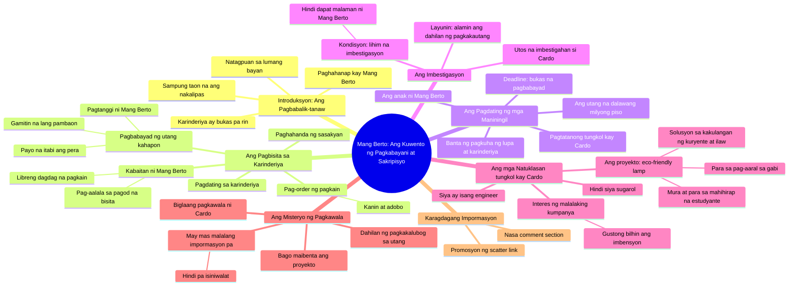

# The Sukli of Kindness - Part 2: A Heartwarming Reunion

> 🌐 **Read this in:** [English](../../en/2026-08/tiktok-transcript-405k-views-27k-reactions-ang-sukli-ng-kabutihan-part-2-aral-2dd5.md) · **中文**

> **Creator:** [@Talking Ai ᴾᴴ](https://www.tiktok.com/@Talking Ai ᴾᴴ) · **Views:** 239.1K · **Posted:** 2026-08-17 · **Niche:** entertainment
>
> **TL;DR:** The time jump immediately creates curiosity and emotional weight.

[Watch original video →](https://www.facebook.com/share/v/1B4t38j7wB/)

## Why This Went Viral

## 钩子（前3秒）
- **逐字开场白：**“芒·贝托，十年过去了。你们现在过得怎么样？”
- **钩子模式：**时间跳跃 + 情感提问（怀旧/好奇混合体）
- **为何能阻止滑动：**“十年”这个短语瞬间营造出叙事分量——观众会联想到重逢、清算或真相揭晓。直接称呼具名角色（芒·贝托）暗示这是一个持续进行的故事，触发“我需要了解背景”的反射，从而让拇指停止滑动。

## 情感节奏
1. **怀旧/好奇**——“十年过去了”奠定了一种感伤、悬而未决的基调。
2. **希望/释然**——“我们终于找到他了”——即将迎来一个结局。
3. **温暖/慰藉**——小餐馆场景：免费阿多波，“那顿我请了”——构建了一个安全、友善的世界。
4. **紧张升级**——“二百万比索”+ 威胁要夺走土地——突如其来的利害冲突。
5. **神秘/悬念**——“你们去调查一下芒·贝托的儿子”——一场秘密调查就此展开。
6. **共情/共鸣**——反转揭晓：卡多是一名工程师，不是赌徒；他倾尽所有为贫困学生制作了一款环保台灯。
7. **高潮/不公**——“他突然就消失了”——受害者同时也是英雄，加深了悲剧色彩。
8. **挫败感切出**——在情感投入达到顶峰时插入“散弹”广告，迫使观众陷入“接下来会发生什么”的循环。

## 关键词密度
- **“芒·贝托”**（5次）——角色锚点；驱动情感牵引力和叙事连贯性。
- **“债务”**（3次）——核心冲突；通过高唤醒度的财经话题实现算法触达。
- **“孩子”**（4次）——家庭共鸣；情感牵引力。
- **“百万比索”**（2次）——数字具体化；引发震惊和分享欲。
- **“环保台灯”**（2次）——独特物件；激发好奇心和公益角度。
- **“消失”**（2次）——悬疑关键词；提升观看时长。
- **“散弹”**（1次）——直接针对博彩相关流量的算法诱饵（高搜索量）。

## 为何能广泛传播
- **道德冲击：**视频先塑造了一个善良贫穷的小贩（芒·贝托），然后让他面临二百万比索的债务威胁——观众出于愤怒和同情而分享。
- **隐藏英雄反转：**卡多不是个废物；他是一个无私的发明家。这颠覆了“赌徒”的刻板印象，让故事显得新颖且值得分享（“你绝对想不到他真正的身份”）。
- **连续剧式结构：**“十年后”的开场和结尾未解的失踪事件制造了悬念——观众评论“求第二集”并@好友，提升了互动信号。
- **文化特异性+普世利害：**菲律宾小餐馆、家庭牺牲和教育贫困在当地引发共鸣，而“好人受冤”的叙事弧线在全球范围内都能引发共情——实现双受众触达。
- **刻意安排的广告位置：**“散弹”链接被插入在情感峰值处（失踪揭晓之后），利用高唤醒状态最大化点击率——这是一种病毒式变现策略。

## 你可以借鉴什么
- **以时间跳跃式提问开场：**“五年前，[名字]。你后来怎么样了？”——瞬间制造叙事负债，迫使观众留下来等待答案。
- **颠覆反派揭晓：**先设定一个失败者形象（负债者、赌徒），然后揭示他们其实是一个怀有崇高目标的隐秘英雄——这种反转之所以值得分享，是因为它颠覆了预期。
- **在情感悬念处放置行动号召：**不要把链接或产品放在开头。先建立张力，抛出反转，然后在观众迫切渴望结局的那一刻插入你的行动号召——那正是点击率飙升的时机。

## Mind Map

## Full Transcript (Generated by [TokTranscript 转录工具](https://toktranscript.com/?utm_source=github&utm_medium=breakdown&utm_campaign=tool_attribution))

> 📝 Transcripts on this page are auto-generated and show the first 60%. Want to transcribe any TikTok in 30 seconds and get the full version? [Try TokTranscript free →](https://toktranscript.com/?utm_source=github&utm_medium=breakdown&utm_campaign=transcript_cta)

Mang Berto, sampung taon na ang nakalipas. Kumusta na kaya kayo? Ma'am Jessa, nahanap na po namin siya. Bukas pa rin po ang karinderiya niya sa lumang bayan. Ihanda ang sasakyan. Aalis tayo ngayon. Anak, anong oorderin mo? Isang kanin at adobo po. Mukhang pagod ka. O, dagdagan natin. Libre ko na yan. Hindi talaga kayo nagbago. May sinabi ka, anak? Wala po. Mang Berto, bayad ko po sa kinain ko kahapon. Hindi ka nga makabayad ng matrikula. Tapos ibabayad mo pa sa akin yan? Itabi mo yan. Pambaon mo na lang. Salamat po. Sampung taon na Mang Berto. Pero hanggang ngayon, inuunan nyo pa rin ang ibang tao. Nasan si Cardo? Anong kailangan nyo sa anak ko? May utang sa amin ang anak mo. Magkano? Dalawang milyong piso. Kapag hindi siya nakapagbayad bukas, kukunin namin ang lupa at karinderiyang ito. Imbestigahan ninyo ang anak ni Mang Berto. Gusto kong malaman kung bakit siya nalubog sa utang. Opo, ma'am. At isa pa, hindi dapat malaman ni Mang Berto 

*[Read the full transcript on TokTranscript →](https://toktranscript.com/plaza/tiktok-transcript-405k-views-27k-reactions-ang-sukli-ng-kabutihan-part-2-aral-2dd5?utm_source=github&utm_medium=breakdown&utm_campaign=transcript_full)*

## Browse More

- All [entertainment](../../by-niche/zh-CN/entertainment.md) breakdowns
- All [Time-jump nostalgia](../../by-pattern/zh-CN/hook-time-jump-nostalgia.md) examples

## Video Info

| | |
|---|---|
| Creator | [@Talking Ai ᴾᴴ](https://www.tiktok.com/@Talking Ai ᴾᴴ) |
| Original video | [https://www.facebook.com/share/v/1B4t38j7wB/](https://www.facebook.com/share/v/1B4t38j7wB/) |
| Original title | 405K views · 27K reactions | Ang Sukli ng Kabutihan - Part 2 Aral sa Part 2: Ang kabutihang tunay ay hindi kumukupas sa paglipas ng panahon. Minsan, ang taong minsan mong tinulungan nang walang hinihinging kapalit ang siyang babalik kapag ikaw naman ang nangangailangan. #ViralStory #storytelling #PinoyDrama #MoralStory #DramaSeries | Talking Ai ᴾᴴ |
| Views | 239.1K (239103) |
| Posted | 2026-08-17 |
| Duration | 0s |
| Niche | `entertainment` |
| Hook pattern | `Time-jump nostalgia` |
| Original language | `en` (this page translated by AI) |
| Available languages | en, zh-CN |
| Generated | 2026-08-18 by [TokTranscript](https://toktranscript.com/) |

---

*This breakdown is for educational analysis under fair use. Original video © [@Talking Ai ᴾᴴ](https://www.tiktok.com/@Talking Ai ᴾᴴ). All transcripts are auto-generated and may contain errors.*

*Want to analyze your own TikToks like this? [TikTok 转录工具 →](https://toktranscript.com/viral-breakdown?utm_source=github&utm_medium=breakdown&utm_campaign=footer_cta)*