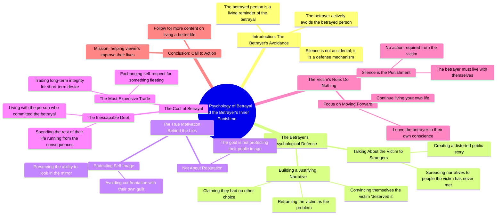

# Why a Betrayer Avoids You: The Silent Punishment

> 🌐 **Read this in:** [English](../../en/2026-08/tiktok-transcript-408k-views-10k-reactions-una-persona-che-ti-ha-tradito-far-d-ad89.md) · **中文**

> **Creator:** [@Spiritualità Moderna](https://www.tiktok.com/@Spiritualità Moderna) · **Views:** 150.7K · **Posted:** 2026-08-27 · **Niche:** other
>
> **TL;DR:** It immediately reframes the betrayer's behavior, making the viewer feel seen and understood.

[Watch original video →](https://www.facebook.com/share/r/1BcXRXdKAz/)

## Why This Went Viral

## 钩子（前3秒）
- **逐字开场白：** *“一个背叛过你的人会想尽一切办法避开你，因为你是他所做之事的活生生的提醒。”*
- **钩子模式：** 大胆的心理断言 + 直接称呼（“你”）。
- **为何能阻止滑动：** 它将背叛从一个关于受害者的故事，重新框定为一个关于背叛者内疚的故事。它向观众承诺，*他们*掌握着力量，这是一个令人深感满足且出乎意料的转折。

## 情绪节奏
1. **认同（0–3秒）：** 观众瞬间代入场景——“这发生在我身上。”
2. **验证（3–10秒）：** 声称背叛者避开你是因为你是“活生生的提醒”，验证了观众的痛苦与困惑。
3. **张力（10–18秒）：** 叙事转向背叛者的内心挣扎——他们的自欺与合理化。这营造出一种安静、近乎电影般的悬念。
4. **高潮（18–24秒）：** *“他用对自己的尊重换来了某种转瞬即逝的东西。”* 这是直击要害的一句。它将背叛重新框定为一种自我伤害，而非观众的损失。
5. **宣泄/释然（24–35秒）：** 最后的反转——*“他的沉默已经是他的惩罚”*——带来解脱与力量感。观众被免除了采取行动或寻求报复的需要。

## 关键词密度
- **背叛（Tradito / tradimento）** — 驱动核心情绪主题与搜索相关性。
- **活生生的提醒（Promemoria vivente）** — 一个独特、令人难忘的短语，锚定钩子。
- **惩罚（Punizione）** — 高情绪吸引力，框定结局。
- **交换/换取（Scambio / barattato）** — 强化背叛的交易性隐喻。
- **镜子（Specchio）** — 视觉化、自我反思的关键词，加深心理共鸣。
- **自我（Sé / se stesso）** — 通过自我提升领域获得算法覆盖；通过身份认同获得情绪吸引力。

## 为何能传播
- **它翻转了受害者叙事。** 大多数背叛内容聚焦于“如何疗愈”。这个视频说：*“你不需要做任何事——他们早已支离破碎。”* 这是一个值得分享的“掷麦”时刻。
- **它是独白，而非建议。** 脚本读起来像一首口语诗或电影旁白。观众将其作为“状态”或“文案”分享，因为它感觉像一句引言，而非教程。
- **高潮句专为截取而设计。** *“他用对自己的尊重换来了某种转瞬即逝的东西”* 是一个独立、可引用的句子。它促使观众保存或转发。
- **它将一种特定的痛苦普遍化。** 即使观众未被背叛过，“有罪者回避无辜者”的主题适用于分手、友谊和职场冲突——扩大了病毒式传播的受众。
- **结尾是一个伪装成释然的行动号召。** *“你只需要继续生活”* + *“关注我，获得更好的生活”* 将情绪释放转化为关注行为，而不显得推销。

## 你可以借鉴什么
- **以重新框定开场，而非问题。** 从一个逆转观众预期权力动态的断言开始。例如：“那个无视你的人，其实怕你怕得要死。”
- **为片段而写，而非为视频而写。** 确保中间有一句可以独立作为引言。那就是你可分享的碎片。
- **以允许结尾，而非指示。** 不要告诉观众该做什么，而是告诉他们*不需要*做什么。然后转向一个柔和的关注邀请（“如果你是新来的……”）。这降低了抗拒感，提升了完播率。

## Mind Map

## Full Transcript (Generated by [免费 TikTok 文稿生成器](https://toktranscript.com/?utm_source=github&utm_medium=breakdown&utm_campaign=tool_attribution))

> 📝 Transcripts on this page are auto-generated and show the first 60%. Want to transcribe any TikTok in 30 seconds and get the full version? [Try TokTranscript free →](https://toktranscript.com/?utm_source=github&utm_medium=breakdown&utm_campaign=transcript_cta)

Una persona che ti ha tradito farà di tutto per evitarti, perché tu sei il promemoria vivente di ciò che ha fatto. Ecco perché non ti cerca. Ecco perché parla di te con persone che non hai mai conosciuto. Deve farlo, perché l'alternativa sarebbe restare da sola con la versione di sé che ha compiuto quel gesto. Così si costruisce una storia in cui il problema eri tu, in cui te lo meritavi, in cui non aveva altra scelta, non sta proteggendo la propria reputazione, sta proteggendo la propria capacità di guardarsi allo specchio. perché il giorno in cui ti ha tradito ha fatto lo scambio più costoso della sua vita, ha barattato il rispetto pe

*[Read the full transcript on TokTranscript →](https://toktranscript.com/plaza/tiktok-transcript-408k-views-10k-reactions-una-persona-che-ti-ha-tradito-far-d-ad89?utm_source=github&utm_medium=breakdown&utm_campaign=transcript_full)*

## Browse More

- All [other](../../by-niche/zh-CN/other.md) breakdowns
- All [Psychological insight](../../by-pattern/zh-CN/hook-psychological-insight.md) examples

## Video Info

| | |
|---|---|
| Creator | [@Spiritualità Moderna](https://www.tiktok.com/@Spiritualità Moderna) |
| Original video | [https://www.facebook.com/share/r/1BcXRXdKAz/](https://www.facebook.com/share/r/1BcXRXdKAz/) |
| Original title | 408K views · 10K reactions | Una persona che ti ha tradito farà di tutto per evitarti, perché tu sei il promemoria vivente di ciò che ha fatto. Ecco perché non ti cerca. Ecco perché parla di te con persone che non hai mai conosciuto. Deve farlo. Perché l'alternativa sarebbe restare da sola con la versione di sé che ha compiuto quel gesto. Così si costruisce una storia in cui il problema eri tu. In cui te lo meritavi. In cui non aveva altra scelta. Non sta proteggendo la propria reputazione. Sta proteggendo la propria capacità di guardarsi allo specchio. Perché il giorno in cui ti ha tradito ha fatto lo scambio più costoso della sua vita. Ha barattato il rispetto per sé stesso con qualcosa di effimero che desiderava in quel momento. E adesso dovrà passare il resto della sua vita cercando di sfuggire al conto di quella scelta. Tu non devi fare nulla. Il suo silenzio è già la sua punizione. Lei dovrà convivere con la persona che ha fatto tutto questo. Tu devi solo continuare a vivere. Se queste parole ti hanno fatto riflettere, scrivi “Vivere” nei commenti, e ti manderò gratis la raccolta delle 10 riflessioni più importanti del mio libro "Come vivere una vita migliore", da cui è stato ispirato questo reel. Leggile, e capirai come questo libro abbia già aiutato più di 3000 italiani a vivere meglio le proprie relazioni, il proprio lavoro e la propria vita.🙌🏻🍃 Sei d’accordo con ciò che ho detto?🔥 Doppiaggio a cura di: @ivanouli #spiritualità #vita #filosofia #gratitudine #crescitapersonale | Spiritualità Moderna |
| Views | 150.7K (150721) |
| Posted | 2026-08-27 |
| Duration | 0s |
| Niche | `other` |
| Hook pattern | `Psychological insight` |
| Original language | `en` (this page translated by AI) |
| Available languages | en, zh-CN |
| Generated | 2026-08-28 by [TokTranscript](https://toktranscript.com/) |

---

*This breakdown is for educational analysis under fair use. Original video © [@Spiritualità Moderna](https://www.tiktok.com/@Spiritualità Moderna). All transcripts are auto-generated and may contain errors.*

*Want to analyze your own TikToks like this? [TikTok 转录工具 →](https://toktranscript.com/viral-breakdown?utm_source=github&utm_medium=breakdown&utm_campaign=footer_cta)*