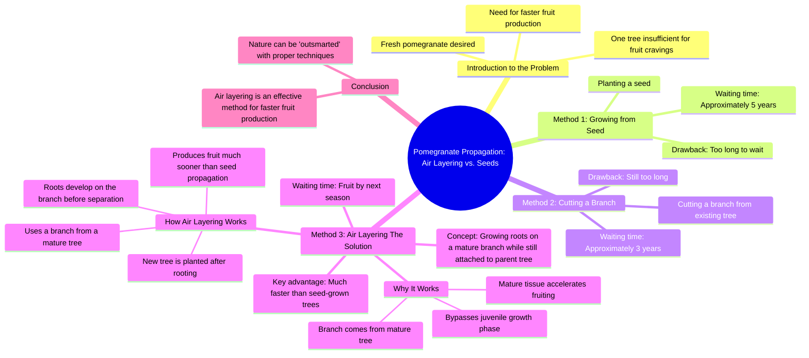

# Grow a New Fruit Tree Faster: Branch Cutting Trick

> 🌐 **Read this in:** [English](../../en/2026-08/tiktok-transcript-458k-views-14k-reactions-how-to-grow-a-new-fruit-tree-withou-60c0.md) · **中文**

> **Creator:** [@Dr.Bota](https://www.tiktok.com/@Dr.Bota) · **Views:** 294.9K · **Posted:** 2026-08-12 · **Niche:** other
>
> **TL;DR:** The hook presents a relatable desire and a problem, instantly engaging viewers with a promise of a clever solution.

[Watch original video →](https://www.facebook.com/reel/1020260861011786)

## Why This Went Viral

## 钩子（前3秒）
- **逐字开场白：** “嗯，这个石榴看起来真新鲜多汁，但一棵树可满足不了我对水果的渴望。”
- **钩子模式：** 场景 + 欲望落差（一个角色表现出明显的渴望，立刻被一个限制所阻挡）。
- **为何能阻止滑动：** 它以动作中的感官词（“嗯”）和一个 relatable 的问题（想要更多美味的东西）开场。观众瞬间理解利害关系——无需任何背景。拟人化的树回应（“那简单。种下我的一颗种子就行”）增添了超现实、喜剧性的转折，打破预期。

## 情绪节奏
- **好奇心（0–5秒）：** “嗯，这个石榴看起来真新鲜”——感官愉悦 + 铺垫。
- **张力（5–15秒）：** “五年？不可能”——引入挫败感；树反驳说“三年”——还是不够。不耐烦逐步升级。
- **喜剧缓解（15–20秒）：** “嘿，你在干什么？你以为你能耍过自然吗？”——树的愤慨增添幽默和虚假冲突。
- **悬念（20–25秒）：** “用我的方法，这根小枝条下个季节就能结果。现在，我们等着。”——一个承诺 + 时间跳跃制造期待。
- **回报（25–35秒）：** “哇，这个小家伙真是个早熟品种。”——枝条结果的视觉证明。满足感。
- **高潮 + 解决（35–40秒）：** “这叫高空压条。”——转折揭示。专家解释方法，将惊叹转化为可教学的时刻。

## 关键词密度
- **“水果”/“结果”** ——重复5次以上；驱动核心承诺（快速见效），通过可搜索性获得算法覆盖。
- **“枝条”** ——重复4次；锚定物理动作和视觉。
- **“树”** ——重复4次；确立角色和背景。
- **“年”** ——重复4次；制造对比（5年 vs. 3年 vs. 明年），推动情绪弧线。
- **“高空压条”** ——只说一次，但作为回报；高价值搜索关键词，利于教育和病毒式传播。
- **“早熟品种”** ——令人难忘的短语；情感共鸣，可单独作为引语分享。

**算法驱动因素：** “水果”、“高空压条”、“种植”——可搜索、常青的园艺话题。  
**情感吸引力：** “早熟品种”、“耍过自然”、“小家伙”——人性化内容，提升收藏和分享。

## 为何能传播
- **“不可能承诺”结构：** 观众听到“5年”→“3年”→“明年？”——每一拍都提高赌注。最终揭示（高空压条）提供了一个合理、令人惊讶的解决方案。这种模式（问题→升级→转折→证明）天生具有重看和分享价值。*具体台词：“你以为你能耍过自然吗？”*
- **拟人化创造角色弧线：** 树不是道具——它有态度（“嘿，你在干什么？”）。这把一个教育性园艺技巧变成了一部迷你剧。观众分享它是因为它有趣，而不仅仅是信息丰富。*具体台词：“那就剪掉我的一根枝条。”*
- **回报中的视觉证明：** 枝条结果的时间流逝（“哇，这个小家伙真是个早熟品种”）是“啊哈”时刻。视觉转变片段有高完播率，并驱动评论如“等等，那真的有用？”
- **可共鸣的不耐烦：** 人类角色的“我想明年就吃上石榴”反映了普通观众对快速结果的渴望。这种情感钩子让内容感觉个人化，增加收藏（人们想尝试）。
- **结尾的教育性转折：** 专家台词“这叫高空压条”给视频一种“我现在学到了东西”的感觉。观众分享它来显得聪明或对园艺的朋友有帮助。

## 你可以借鉴什么
- **在前5秒使用“欲望→障碍→不可能截止日期”的设置。** 不要从解决方案开始。从渴望（食物、金钱、技能）和一个令人沮丧的限制开始。这个落差创造钩子。
- **将“专家”或“方法”拟人化为一个角色。** 给解决方案一个声音和态度（像会说话的树）。它增添幽默，让教育内容感觉像故事，而不是讲座。
- **以命名技巧结尾，而不仅仅是结果。** 在视觉回报之后，抛出术语（“高空压条”）。这给观众一个可以搜索、保存或分享的收获——把有趣的视频变成有用的视频。

## Mind Map

## Full Transcript (Generated by [TokTranscript 转录工具](https://toktranscript.com/?utm_source=github&utm_medium=breakdown&utm_campaign=tool_attribution))

> 📝 Transcripts on this page are auto-generated and show the first 60%. Want to transcribe any TikTok in 30 seconds and get the full version? [Try TokTranscript free →](https://toktranscript.com/?utm_source=github&utm_medium=breakdown&utm_campaign=transcript_cta)

Mmm, this pomegranate looks so fresh and juicy, but one tree won't be enough to satisfy my fruit cravings. That's easy. Just plant one of my seeds and wait about five years. Five years? No way, I can't wait that long. Then just cut one of my branches. It'll still take about three years to produce fruit. Three years? That's still too long. I want pomegranates by next year. Next year? That's impossible. Hey, what are you doing? You think you can outsmart nature? Don't worry. With my method, this little branch could be fruiting by next season. Now, we wait. Later. You really think that little branch is going to 

*[Read the full transcript on TokTranscript →](https://toktranscript.com/plaza/tiktok-transcript-458k-views-14k-reactions-how-to-grow-a-new-fruit-tree-withou-60c0?utm_source=github&utm_medium=breakdown&utm_campaign=transcript_full)*

## Browse More

- All [other](../../by-niche/zh-CN/other.md) breakdowns
- All [Problem-Solution Tease](../../by-pattern/zh-CN/hook-problem-solution-tease.md) examples

## Video Info

| | |
|---|---|
| Creator | [@Dr.Bota](https://www.tiktok.com/@Dr.Bota) |
| Original video | [https://www.facebook.com/reel/1020260861011786](https://www.facebook.com/reel/1020260861011786) |
| Original title | 458K views · 14K reactions | How to Grow a New Fruit Tree Without Waiting Years | Dr.Bota |
| Views | 294.9K (294858) |
| Posted | 2026-08-12 |
| Duration | 0s |
| Niche | `other` |
| Hook pattern | `Problem-Solution Tease` |
| Original language | `en` (this page translated by AI) |
| Available languages | en, zh-CN |
| Generated | 2026-08-13 by [TokTranscript](https://toktranscript.com/) |

---

*This breakdown is for educational analysis under fair use. Original video © [@Dr.Bota](https://www.tiktok.com/@Dr.Bota). All transcripts are auto-generated and may contain errors.*

*Want to analyze your own TikToks like this? [TikTok 转录工具 →](https://toktranscript.com/viral-breakdown?utm_source=github&utm_medium=breakdown&utm_campaign=footer_cta)*