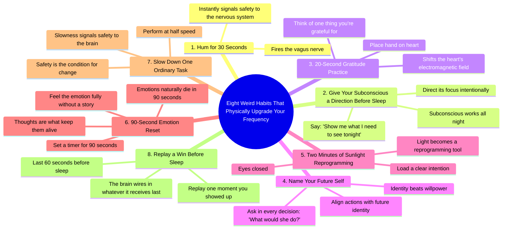

# Eight Weird Habits That Physically Upgrade Your Frequency

> 🌐 **Read this in:** [English](../../en/2026-08/tiktok-transcript-48k-views-22k-reactions-i-used-to-think-changing-your-state-e932.md) · **中文**

> **Creator:** [@MindsetVibrations](https://www.tiktok.com/@MindsetVibrations) · **Views:** 271.5K · **Posted:** 2026-08-09 · **Niche:** entertainment
>
> **TL;DR:** The word 'weird' and 'physically upgrade your frequency' create curiosity and promise tangible benefits.

[Watch original video →](https://www.facebook.com/reel/1059071623321069)

## Why This Went Viral

## 钩子（前3秒）
- **逐字开场白：**“八个怪习惯，物理升级你的频率。”
- **钩子模式：** **大胆断言 + 列表格式 + 好奇心缺口**（“怪”+“物理升级”+“频率”）。
- **为何能阻止滑动：** 它承诺了一种具体、近乎阴谋论式的转变（“物理升级”），并用一个暗示灵性-科学交叉的词（“频率”）。 “怪”这个词降低了怀疑——感觉像内幕知识，而非泛泛建议。数字“八”设定了清晰、易于刷完的结构。

---

## 情绪节奏
1. **好奇**（“八个怪习惯……”）——大脑想要列表被完成。
2. **安全/释然**（习惯1：“即时安全感”）——第一个回报即时且令人平静。
3. **神秘/好奇**（习惯2：“今晚向我展示我需要看到的”）——引入一条准魔法指令。
4. **温暖/共鸣**（习惯3：“手放在心口……感恩”）——情绪柔软，制造停顿。
5. **赋能**（习惯4：“身份胜过意志力”）——一句犀利、可引用的台词，颠覆常见信念。
6. **敬畏/扩展**（习惯5：“光成为重编程工具”）——将平凡升华为神秘。
7. **张力+释放**（习惯6：“情绪在90秒内消亡”）——为痛苦提供一条具体的逃生通道。
8. **平静/信任**（习惯7：“慢信号=安全”）——放慢观众自身的节奏。
9. **高潮/身份强化**（习惯8：“回放一次你挺身而出的时刻……你的大脑会把你最后给它的东西编织进去”）——这是顶峰：将整个视频串联回自我价值与自主性。
10. **行动号召的紧迫感**（“保存这个，并评论‘是’……”）——将情绪峰值转化为互动。

---

## 关键词密度
- **“频率”**（3次）——驱动算法触达（灵性/健康领域关键词）+ 情绪拉力（渴望）。
- **“大脑”/“潜意识”/“神经”**（3次）——将内容锚定在神经科学上，提升可信度和可分享性。
- **“安全”/“安全感”**（3次）——情绪拉力；触发深层生理需求，让建议显得必不可少。
- **“重编程”/“重连”/“编织”**（3次）——行动导向，暗示转变；在自我提升圈中搜索量高。
- **“身份”**（1次，但有力）——一个高冲击力词汇，驱动“未来自我”叙事，是经过验证的病毒式心理触发器。
- **“90秒”**（1次）——具体数字=易记+易分享（人们会引用这句话）。
- **“向我展示”/“保存这个”/“评论‘是’”**——直接指令，驱动互动指标。

---

## 为何能传播
1. **两分钟内可执行**——每个习惯都能立即测试（哼鸣、手放胸口、设个计时器）。观众立刻尝试一个，产生“这有用”的感觉，想要分享。
2. **“怪”降低门槛**——“怪”这个词卸下怀疑者的防备。这不是说教式自助，而是秘密技巧菜单。这让它显得独家，驱动保存和转发。
3. **90秒情绪论断是可引用的科学金句**——“情绪在90秒内消亡”是独立成句、可做成梗的台词。它会被截图和转发，将触达延伸到原视频之外。
4. **基于身份的框架创造拥有感**——“给未来的自己命名”和“她会怎么做？”让观众投射出一个版本的自己。这种个性化增加情绪投入和评论的可能性。
5. **最后一句是记忆技巧**——“回放一次你挺身而出的时刻”给观众一个感觉高尚的作业。它在高点结束，所以行动号召（“保存这个，评论‘是’”）感觉像自然的下一步，而非推销。

---

## 你可以偷师的
1. **以“怪”+“物理”的对比开场。** 将普通建议框定为秘密的身体升级。“怪”杀死“这我听过”的反射；“物理”让它比励志空话更真实。
2. **使用带内置情绪弧线的编号列表。** 不要只是罗列技巧——排序时让观众从释然→赋能→平静→身份递进。以情绪共鸣最强的项目收尾，而非最实用的那个。
3. **埋下一个可引用的微事实。** 在你的内容中找到一句能独立成截图的话（“情绪在90秒内消亡”）。重复它、简化它，让它成为视频的枢纽。那就是被剪辑和分享的部分。

## Mind Map

## Full Transcript (Generated by [TokTranscript](https://toktranscript.com/?utm_source=github&utm_medium=breakdown&utm_campaign=tool_attribution))

> 📝 Transcripts on this page are auto-generated and show the first 60%. Want to transcribe any TikTok in 30 seconds and get the full version? [Try TokTranscript free →](https://toktranscript.com/?utm_source=github&utm_medium=breakdown&utm_campaign=transcript_cta)

Eight weird habits that physically upgrade your frequency. 1. Hum for 30 seconds. It fires your vagus nerve. Instant safety. 2. Before sleep, say, Show me what I need to see tonight. Your subconscious works all night. Give it a direction. 3. Hand on your heart. Think of one thing you're grateful for. For 20 seconds, it shifts your heart's electromagnetic field. 4. Name your future self. In every decision, think, what would she do? Identity beats willpower. 5. Two minutes in sunlight, eyes closed, intention loaded, light becomes a reprogramming tool. 6. If hard emotion hits, set a 90-seco

*[Read the full transcript on TokTranscript →](https://toktranscript.com/plaza/tiktok-transcript-48k-views-22k-reactions-i-used-to-think-changing-your-state-e932?utm_source=github&utm_medium=breakdown&utm_campaign=transcript_full)*

## Browse More

- All [entertainment](../../by-niche/zh-CN/entertainment.md) breakdowns
- All [Curiosity gap with a numbered list](../../by-pattern/zh-CN/hook-curiosity-gap-with-a-numbered-list.md) examples

## Video Info

| | |
|---|---|
| Creator | [@MindsetVibrations](https://www.tiktok.com/@MindsetVibrations) |
| Original video | [https://www.facebook.com/reel/1059071623321069](https://www.facebook.com/reel/1059071623321069) |
| Original title | 48K views · 22K reactions | I used to think changing your state took something huge. A retreat. A breakthrough. Some version of me that had it all figured out. Then I started humming for thirty seconds before hard conversations. Putting a hand on my heart before I got out of bed. Naming what I’d do as the version of me I’m becoming, instead of the one who was tired. None of it looked like anything. All of it changed the signal I was running on. Your nervous system does not care how impressive the habit is. It cares how often you send it the message that you are safe. Eight of them are in this video. Pick one. Not all eight. Comment YES and I’ll send you the tool I use to raise my frequency and reprogram my mind daily. #manifestation #frequency | MindsetVibrations |
| Views | 271.5K (271521) |
| Posted | 2026-08-09 |
| Duration | 0s |
| Niche | `entertainment` |
| Hook pattern | `Curiosity gap with a numbered list` |
| Original language | `en` (this page translated by AI) |
| Available languages | en, zh-CN |
| Generated | 2026-08-12 by [TokTranscript](https://toktranscript.com/) |

---

*This breakdown is for educational analysis under fair use. Original video © [@MindsetVibrations](https://www.tiktok.com/@MindsetVibrations). All transcripts are auto-generated and may contain errors.*

*Want to analyze your own TikToks like this? [TokTranscript 转录工具 →](https://toktranscript.com/viral-breakdown?utm_source=github&utm_medium=breakdown&utm_campaign=footer_cta)*