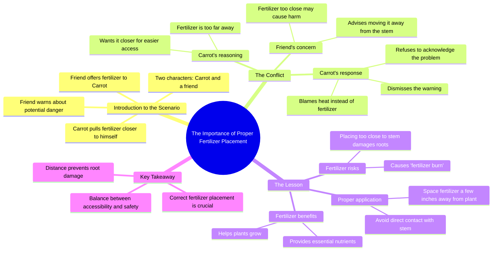

# Why You Should Never Put Fertilizer Too Close To Plants

> 🌐 **Read this in:** [English](../../en/2026-08/tiktok-transcript-5-3m-views-63k-reactions-why-you-should-never-put-fertilizer-137d.md) · **中文**

> **Creator:** [@Dr.Bota](https://www.tiktok.com/@Dr.Bota) · **Views:** 2.6M · **Posted:** 2026-08-03 · **Niche:** other
>
> **TL;DR:** The hook instantly creates a comedic scenario by treating a carrot as a sentient being, sparking curiosity and amusement.

[Watch original video →](https://www.facebook.com/reel/1161139290411642)

## Why This Went Viral

## 钩子（前3秒）
- **逐字开场白：**“嘿，胡萝卜！想要点肥料吗？”紧接着是“当然啦！”
- **钩子模式：**场景+拟人化（胡萝卜与看不见的叙述者之间的拟人对话）
- **为何能让人停下滑动：**它瞬间制造了荒诞感——一根有态度的会说话的胡萝卜。观众的大脑会停顿，因为这不是一个真人对着镜头说话，也不是标准的“植物养护技巧”视频；这是一场与蔬菜的戏剧性争吵。冲突即刻呈现，基调幽默，传递出“娱乐，而非说教”的信号。

## 情绪节奏
1. **好奇（0–2秒）：**谁在跟胡萝卜说话？它为什么想要肥料？
2. **好笑/紧张（2–6秒）：**胡萝卜*把肥料拉得更近*——一个荒谬又倔强的动作。叙述者的困惑（“老兄，你干嘛把它拉近？”）增添了俏皮的摩擦感。
3. **升级（6–12秒）：**胡萝卜变得防御性十足且咄咄逼人——“别多管闲事！”以及“这里太热了！”冲突显得既私人又滑稽，让观众持续被这场争吵吸引。
4. **反转（12–14秒）：**“我什么感觉都没有。”——胡萝卜的否认制造了一个戏剧性反讽的时刻。观众比角色知道得更多。
5. **高潮（14–18秒）：**“闭嘴。问题不在那儿。”——胡萝卜的固执达到顶峰。这是情绪高点：通过故意无视制造喜剧效果。
6. **收尾（18–20秒）：**叙述者以清晰、说教式的解释完美收场：“肥料能帮助植物生长，但放得离茎太近会损伤根系……造成肥害。”观众获得一种干净利落的满足感，玩笑瞬间变成了知识。

## 关键词密度
- **肥料**（5次）——推动算法触达（园艺/植物养护领域），并锚定教育核心。
- **更近**（3次）——情绪牵引；暗示冲突与靠近/危险。
- **伤害/损伤/灼伤**（3次）——情绪牵引；制造风险与对伤害的恐惧。
- **茎/根系**（2次）——算法触达；精确的植物解剖学术语，匹配搜索意图。
- **“问题不在那儿”**（1次，但至关重要）——情绪牵引；捕捉固执角色的否认，让知识点更令人难忘。

## 为何能传播
- **荒诞+实用组合：**视频将实用的园艺技巧（肥害）包装成一场戏剧化的肥皂剧。观众会分享它，因为它既好笑又有用——这正是“寓教于乐”的最佳平衡点。“闭嘴。问题不在那儿。”这句话适合剪辑成片段，也适合被引用。
- **拟人化制造共鸣：**胡萝卜表现得像一个拒绝建议的固执朋友。叙述者的无奈（“老兄，你干嘛把肥料拉近？”）映照出人们与不听劝的亲人说话时的样子。这种情感上的熟悉感促使评论如“这就像我的狗”或“这就像我老公”。
- **反转迫使观众重看：**叙述者最后的解释（“间隔几英寸以避免肥害”）重新框定了整场争论。观众会重看以捕捉线索——胡萝卜说“这里太热了”正是肥害的症状。这种“恍然大悟”时刻提升了观看时长和分享率。
- **清晰、具体的价值：**这条建议不是泛泛而谈（“给你的植物浇水”），而是细分且可操作的（“肥料间隔几英寸”）。这让园艺爱好者和植物主人们愿意收藏，从而触发收藏算法。
- **简短、有力的对话，零冷场：**每一句台词都在推进冲突或知识点。20秒的时长非常适合完播率，这向算法发出信号，将其推送给更多观众。

## 你可以借鉴什么
- **将“愚蠢角色”与“聪明叙述者”配对：**创造一种双声部动态，一方固执地犯错，另一方冷静地正确。冲突驱动留存率；回报交付知识点。将此应用于任何领域（健身、烹饪、编程），只需将常见错误拟人化。
- **将教育内容隐藏到最后2秒：**通过对话铺垫问题，然后以快速揭示的方式抛出事实性解释。这制造了一个“等等，什么？”的时刻，促使观众重看和分享。
- **利用戏剧性反讽制造张力：**让观众在角色之前知道真相（例如，胡萝卜感觉不到热，但观众怀疑原因）。这能让观众保持参与，因为他们在等待角色“明白过来”——而当角色始终不明白时，回报的冲击力更强。

## Mind Map

## Full Transcript (Generated by [免费 TikTok 文稿生成器](https://toktranscript.com/?utm_source=github&utm_medium=breakdown&utm_campaign=tool_attribution))

> 📝 Transcripts on this page are auto-generated and show the first 60%. Want to transcribe any TikTok in 30 seconds and get the full version? [Try TokTranscript free →](https://toktranscript.com/?utm_source=github&utm_medium=breakdown&utm_campaign=transcript_cta)

Hey, Carrot! Want some fertilizer? Yeah, of course! Dude, why are you pulling the fertilizer closer? Aren't you supposed to leave it where it is? Can't you see how far away it is? I'm bringing it closer to me! But if it's that close to you, it might hurt! Stop sticking your nose where it doesn't belong! It's so hot over here, dude! Ain't you feeling this? I don't feel anything. Maybe you s

*[Read the full transcript on TokTranscript →](https://toktranscript.com/plaza/tiktok-transcript-5-3m-views-63k-reactions-why-you-should-never-put-fertilizer-137d?utm_source=github&utm_medium=breakdown&utm_campaign=transcript_full)*

## Browse More

- All [other](../../by-niche/zh-CN/other.md) breakdowns
- All [Unexpected personification + immediate conflict](../../by-pattern/zh-CN/hook-unexpected-personification-immediate-conflict.md) examples

## Video Info

| | |
|---|---|
| Creator | [@Dr.Bota](https://www.tiktok.com/@Dr.Bota) |
| Original video | [https://www.facebook.com/reel/1161139290411642](https://www.facebook.com/reel/1161139290411642) |
| Original title | 5.3M views · 63K reactions | Why You Should Never Put Fertilizer Too Close To Plants | Dr.Bota |
| Views | 2.6M (2622400) |
| Posted | 2026-08-03 |
| Duration | 0s |
| Niche | `other` |
| Hook pattern | `Unexpected personification + immediate conflict` |
| Original language | `en` (this page translated by AI) |
| Available languages | en, zh-CN |
| Generated | 2026-08-04 by [TokTranscript](https://toktranscript.com/) |

---

*This breakdown is for educational analysis under fair use. Original video © [@Dr.Bota](https://www.tiktok.com/@Dr.Bota). All transcripts are auto-generated and may contain errors.*

*Want to analyze your own TikToks like this? [拆解你自己的 TikTok →](https://toktranscript.com/viral-breakdown?utm_source=github&utm_medium=breakdown&utm_campaign=footer_cta)*