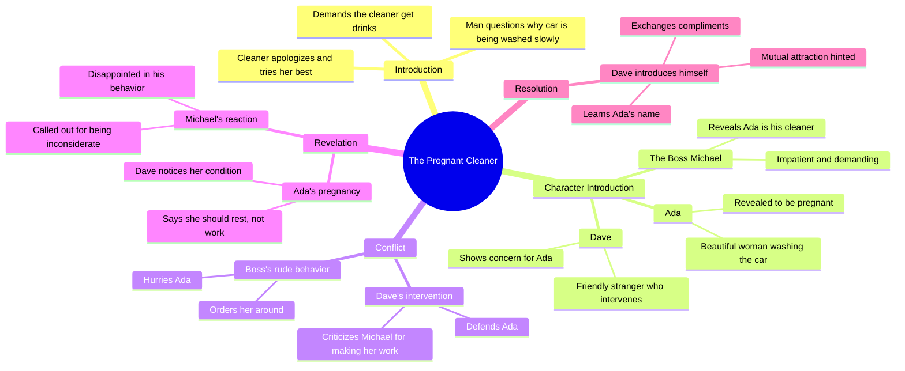

# He Called His Pregnant Wife a Cleaner, Then His Best Frie...

> 🌐 **Read this in:** [English](../../en/2026-08/tiktok-transcript-5-5m-views-223k-reactions-he-called-his-pregnant-wife-a-clea-3d4a.md) · **中文**

> **Creator:** [@Real Story with Ife](https://www.tiktok.com/@Real Story with Ife) · **Views:** 2.7M · **Posted:** 2026-08-07 · **Niche:** entertainment
>
> **TL;DR:** Opens with immediate tension and a rude demand, instantly grabbing attention and setting up a confrontation.

[Watch original video →](https://www.facebook.com/share/r/14sGBQ373F7/?mibextid=wwXIfr)

## Why This Went Viral

## 钩子（前3秒）
- **逐字开场：** “嘿，你怎么洗车洗得这么慢？赶紧去给我们买饮料。”
- **钩子模式：** 场景 + 紧张感（冲突驱动的对话，无背景交代）。
- **为何能让人停下滑动：** 它直接把你扔进一场争吵中。观众不知道说话的人是谁、语气为何充满攻击性、谁在被使唤。权力关系的瞬间失衡制造了一种痒感——你必须看看这些人是谁，接下来会发生什么。

## 情绪节奏
- **节拍1 — 紧张（0–3秒）：** 攻击性命令。观众感到不适；有人在被贬低。
- **节拍2 — 顺从（4–7秒）：** “对不起，先生。我已经在尽力了。” 增加对受害者的同情，提升利害关系。
- **节拍3 — 好奇（8–12秒）：** “她是你老婆吗？”——这个问题重新定义了人物关系。观众身体前倾。
- **节拍4 — 震惊（13–16秒）：** “她只是我的清洁工。”——一个显得冷酷无情的身份揭示。道德愤怒开始积聚。
- **节拍5 — 正义/反转（17–22秒）：** “你看不出来她怀孕了吗？”——陌生人（戴夫）介入。权力翻转。这是**高潮**——道德伸张的时刻。
- **节拍6 — 温暖/收尾（23–30秒）：** 戴夫自我介绍，称赞艾达，而她也称赞他。释然与满足。“好人”赢了，观众得到了一个暖心的结局。

## 关键词密度
- **“清洁工”** ——重复两次；推动阶级/地位对比，这是核心情绪触发点。
- **“漂亮”** ——重复两次（一次戴夫说，一次艾达说）；推动浪漫/认可角度。
- **“怀孕”** ——只提了一次，但它是转折词；通过社会正义/共情话题获得算法推荐。
- **“对不起”** ——顺从标记；强化权力不对等。
- **“老婆”** ——触发预设；制造反转。
- **“状况”** ——怀孕的委婉说法；为揭示增添尊严感。

**算法驱动词：** “怀孕”、“清洁工”、“老婆”——高搜索量、情绪浓度高的词汇，契合热门话题（社会阶层、怀孕、职场尊严）。
**情感牵引词：** “漂亮”、“对不起”、“状况”——让人物更有人情味，让观众产生保护欲。

## 为何能病毒式传播
- **1. “恶人遭报应”公式的反转版。** 攻击性男人被陌生人当众纠正。观众分享它来表达：“这才是对待人的方式。”“你看不出来她怀孕了吗？”这句话是值得截屏分享的高光时刻。
- **2. 30秒内完成一个完整的故事弧。** 铺垫（欺压）、冲突（身份揭示）、高潮（介入）、回报（浪漫火花）。没有悬而未决的线——让人容易观看、反复观看、转发给朋友。
- **3. 共鸣 + 向往。** 每个人都见过老板/有钱人欺负员工。戴夫的介入是观众*希望*自己会做的事。艾达的美貌加上戴夫的魅力增添了一层浪漫幻想的色彩，推动评论区互动（“他们应该在一起！”）和参与度。
- **4. 结尾留有开放循环。** “你也很帅”暗示着未来的联系。观众想要第二部——推动评论、分享和关注请求。
- **5. 低制作成本 = 高真实感。** 原始、单次拍摄的感觉（无剪辑、自然光线）让它看起来真实，从而增加信任感和分享可能性。

## 你可以借鉴什么
- **1. 从冲突中间开始，不要交代背景。** 用一句暗示不公或紧张感的话开场。让观众自己拼凑情况——这会迫使他们留下来。
- **2. 在视频60%处使用“权力翻转”。** 引入一个第三方角色来纠正施暴者。这创造了一个令人满足的道德回报和一个值得截取的瞬间。
- **3. 以浪漫或开放的钩子结尾。** 一句赞美、一个微笑，或者一句“也许我们会再见”。这给了观众想象续集的理由——并在评论区表达他们的期待，从而推动算法推荐。

## Mind Map

## Full Transcript (Generated by [TokTranscript 转录工具](https://toktranscript.com/?utm_source=github&utm_medium=breakdown&utm_campaign=tool_attribution))

> 📝 Transcripts on this page are auto-generated and show the first 60%. Want to transcribe any TikTok in 30 seconds and get the full version? [Try TokTranscript free →](https://toktranscript.com/?utm_source=github&utm_medium=breakdown&utm_campaign=transcript_cta)

Hey, why are you washing the car so slowly? Hurry up and go get us drinks. I'm sorry, sir. I'm trying my best. Easy, my guy. Is she your wife? My wife? No, not at all. She's just my cleaner. Really? I'm surprised. She's too beautiful to be a cleaner. You shouldn't be doing this in your condition. You should be re

*[Read the full transcript on TokTranscript →](https://toktranscript.com/plaza/tiktok-transcript-5-5m-views-223k-reactions-he-called-his-pregnant-wife-a-clea-3d4a?utm_source=github&utm_medium=breakdown&utm_campaign=transcript_full)*

## Browse More

- All [entertainment](../../by-niche/zh-CN/entertainment.md) breakdowns
- All [Conflict Hook](../../by-pattern/zh-CN/hook-conflict-hook.md) examples

## Video Info

| | |
|---|---|
| Creator | [@Real Story with Ife](https://www.tiktok.com/@Real Story with Ife) |
| Original video | [https://www.facebook.com/share/r/14sGBQ373F7/?mibextid=wwXIfr](https://www.facebook.com/share/r/14sGBQ373F7/?mibextid=wwXIfr) |
| Original title | 5.5M views · 223K reactions | He called his pregnant wife a cleaner... Then his best friend fell in love with her😳💔 #shortdrama #marriagedrama #shortstory | Real Story with Ife |
| Views | 2.7M (2732460) |
| Posted | 2026-08-07 |
| Duration | 0s |
| Niche | `entertainment` |
| Hook pattern | `Conflict Hook` |
| Original language | `en` (this page translated by AI) |
| Available languages | en, zh-CN |
| Generated | 2026-08-08 by [TokTranscript](https://toktranscript.com/) |

---

*This breakdown is for educational analysis under fair use. Original video © [@Real Story with Ife](https://www.tiktok.com/@Real Story with Ife). All transcripts are auto-generated and may contain errors.*

*Want to analyze your own TikToks like this? [TokTranscript 转录工具 →](https://toktranscript.com/viral-breakdown?utm_source=github&utm_medium=breakdown&utm_campaign=footer_cta)*