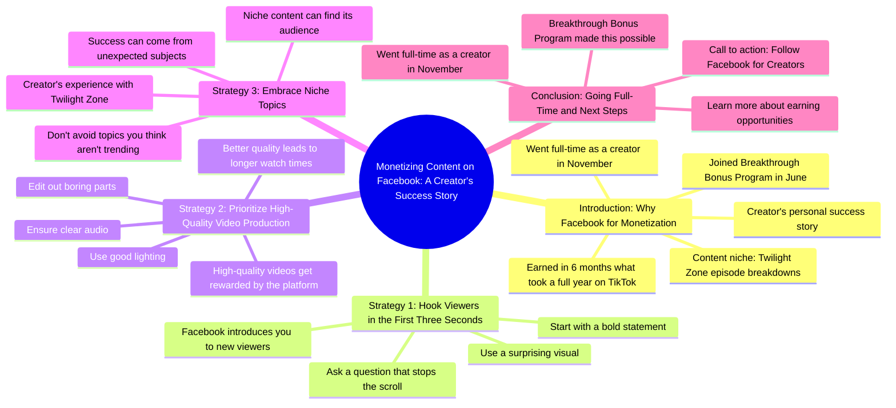

# Creator Earns Yearly TikTok Income in 6 Months on Facebook

> 🌐 **Read this in:** [English](../../en/2026-08/tiktok-transcript-513k-views-12k-reactions-heard-creators-are-making-more-on-f-7b74.md) · **中文**

> **Creator:** [@Facebook for Creators](https://www.tiktok.com/@Facebook for Creators) · **Views:** 140.7K · **Posted:** 2026-08-15 · **Niche:** marketing
>
> **TL;DR:** Immediately calls out the audience's inaction and promises a solution, creating urgency.

[Watch original video →](https://www.facebook.com/reel/2049729592479327)

## Why This Went Viral

## 钩子（前3秒）
- **逐字开场白：** “我跟你们说个事儿。如果你做内容创作，却还在忽视Facebook这个变现渠道，醒醒吧。”
- **钩子模式：** 大胆断言 + 直接称呼（“你们”）+ 挑战（“忽视”）+ 命令（“醒醒吧”）
- **为何能让人停下滑动：** 它精准点名特定受众（内容创作者），用挑衅性指控（“你在漏钱”）直击要害，并以一种对话式、近乎对峙的口吻，像朋友拽住你胳膊一样。 “忽视”一词暗示疏忽，瞬间触发错失恐惧心理。

## 情绪节奏
1. **挑衅**（0–3秒）——“你在忽视Facebook”制造轻微羞耻感/紧迫感。
2. **震惊/难以置信**（3–8秒）——“我赚到了在TikTok上整整一年的收入”以一种荒谬、几乎不可信的对比落地。
3. **共鸣/身份认同**（8–12秒）——“你可能认识我，就是那个解说《迷离时空》的女孩”将讲述者定位为同行，而非大师。
4. **幽默/放松**（12–15秒）——“这不是因为某个小孩拿着手机把我送进了玉米地”——一个《迷离时空》的内部梗，奖励忠实粉丝，同时缓和紧张气氛。
5. **权威/结构**（15–30秒）——过渡到“这里有几个要点”，从故事转向可操作的价值输出。
6. **憧憬/认可**（30–40秒）——“我去年11月正式成为全职创作者”是高潮——证明这套策略行之有效。
7. **行动号召**（40秒至结尾）——干净利落、零压力的关注品牌账号引导。

**高潮：** “全职创作者”的揭示——将整条视频从“技巧分享”升华为一个真实可证的成功故事。

## 关键词密度
- **“Facebook”**（4次）——驱动平台自身推广系统的算法触达；同时向搜索特定平台建议的创作者传递话题相关性。
- **“变现/收入/赚到”**（3次）——情感拉力：金钱是这类受众的普适触发器。
- **“突破奖金计划”**（2次）——品牌关键词，将视频与特定计划绑定，提升搜索该词条时的可发现性。
- **“前三秒”**（1次，但主题上反复呼应）——镜像视频自身的结构，通过示范强化建议。
- **“迷离时空”**（2次）——小众身份关键词，构建社群感，彰显创作者的独特视角。
- **“全职”**（1次）——高情绪短语，代表梦想结果；密度低但冲击力强。

## 为何能广泛传播
- **用实证代替理论：** “我赚到了在TikTok上整整一年的收入”是一个具体、可量化的声明。它之所以可分享，是因为它可争论——人们会评论“不可能”或“怎么做到的”，从而推高互动。
- **小众与主流的桥梁：** 《迷离时空》的引用足够小众，能建立忠实粉丝群，但赚钱故事是普世的。这种混合让它能在创作者圈和《迷离时空》粉丝群之间同时传播。
- **自我示范的建议：** 视频在告诉观众“在前三秒抛出大胆声明”的同时，*本身*就展示了这一技巧。这种元层面让人感觉聪明，值得分享给其他创作者。
- **真实声音，而非商业腔：** “孩子，我加入了……”和“醒醒吧”听起来像真人，而非赞助广告。这降低了戒备心，提升了信任感，让观众更愿意@朋友。
- **清晰、低门槛的行动号召：** “关注Facebook创作者账号”是一个柔和的要求，不显推销——但足够具体，让平台算法将视频视为成功的推广作品。

## 你可以借鉴什么
1. **以“你错了”式的指控开场。** 直接挑战受众当前的行为（“你在忽视X”）——这会制造即时的认知失调，迫使他们停下。
2. **在前10秒内使用一个具体、令人难以置信的数字。** “六个月赚到了我一整年的工资”胜过“我赚了很多钱”。具体性就是可分享性。
3. **在给出建议的同时示范建议。** 如果你告诉观众“以大胆声明开场”，确保你自己的开场就是一个大胆声明。这种元层面的证明让你的内容显得有权威感，值得收藏。

## Mind Map

## Full Transcript (Generated by [免费 TikTok 文稿生成器](https://toktranscript.com/?utm_source=github&utm_medium=breakdown&utm_campaign=tool_attribution))

> 📝 Transcripts on this page are auto-generated and show the first 60%. Want to transcribe any TikTok in 30 seconds and get the full version? [Try TokTranscript free →](https://toktranscript.com/?utm_source=github&utm_medium=breakdown&utm_campaign=transcript_cta)

Let me tell y'all something. If you create content and you are still sleeping on Facebook as a way to monetize, wake it up. Child, I joined the Breakthrough Bonus Program in June and in just six months, I earned what I made in an entire year on TikTok. Crazy. You may know me as the girl who breaks down your favorite Twilight Zone episodes, but I wasn't always tearing apart beloved characters on Facebook. Now listen, this didn't happen because a small child sent me into a cornfield with the phone. There has to be a strategy. So here are a few pointers. Facebook introduces you to new viewers. So make your first three seconds count. Start with a bold statement, a surprising visual, or a question that makes people stop scrolling. High quality videos get rewarded. Use

*[Read the full transcript on TokTranscript →](https://toktranscript.com/plaza/tiktok-transcript-513k-views-12k-reactions-heard-creators-are-making-more-on-f-7b74?utm_source=github&utm_medium=breakdown&utm_campaign=transcript_full)*

## Browse More

- All [marketing](../../by-niche/zh-CN/marketing.md) breakdowns
- All [Direct address + wake-up call](../../by-pattern/zh-CN/hook-direct-address-wake-up-call.md) examples

## Video Info

| | |
|---|---|
| Creator | [@Facebook for Creators](https://www.tiktok.com/@Facebook for Creators) |
| Original video | [https://www.facebook.com/reel/2049729592479327](https://www.facebook.com/reel/2049729592479327) |
| Original title | 513K views · 12K reactions | Heard creators are making more on Facebook? Make That Magic shares her Bonus Program journey and how you can get in on it too. 🔥 | Facebook for Creators |
| Views | 140.7K (140725) |
| Posted | 2026-08-15 |
| Duration | 0s |
| Niche | `marketing` |
| Hook pattern | `Direct address + wake-up call` |
| Original language | `en` (this page translated by AI) |
| Available languages | en, zh-CN |
| Generated | 2026-08-16 by [TokTranscript](https://toktranscript.com/) |

---

*This breakdown is for educational analysis under fair use. Original video © [@Facebook for Creators](https://www.tiktok.com/@Facebook for Creators). All transcripts are auto-generated and may contain errors.*

*Want to analyze your own TikToks like this? [TokTranscript →](https://toktranscript.com/viral-breakdown?utm_source=github&utm_medium=breakdown&utm_campaign=footer_cta)*