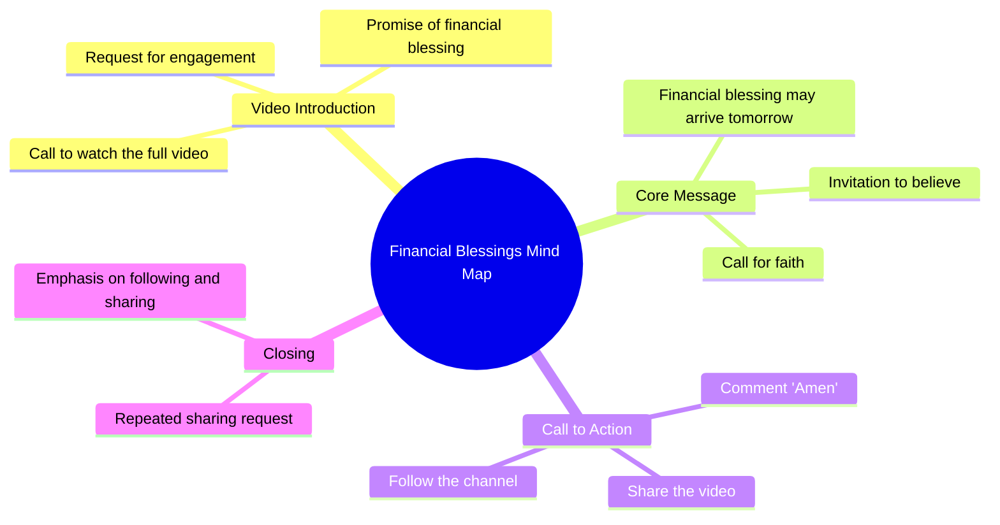

# Comment Your Luck Next: Financial Blessing Coming Tomorrow

> 🌐 **Read this in:** [English](../../en/2026-08/tiktok-transcript-536k-views-28k-reactions-comment-nyo-na-mga-boss-baka-sa-iny-504e.md) · **中文**

> **Creator:** [@𝐼𝐼𝒱.𝒜](https://www.tiktok.com/@𝐼𝐼𝒱.𝒜) · **Views:** 212.8K · **Posted:** 2026-08-29 · **Niche:** other
>
> **TL;DR:** The hook creates immediate curiosity and a sense of urgency by challenging the viewer not to skip, while promising a financial blessing.

[Watch original video →](https://www.facebook.com/share/r/1Ebc11Cey4/)

## Why This Went Viral

## 钩子（前3秒）
- **逐字开场白：**“我在问你，别跳过这个视频。”
- **钩子模式：**直接命令 + 隐含后果（害怕错过祝福）。
- **为何能阻止滑动：**它立即制造了个人利害关系。观众被单独点名（“你”），而“别跳过”这句话触发了心理逆反——你要么服从，要么觉得自己可能错过一个财务奇迹。这是一个低投入、高焦虑的邀请。

## 情绪节奏
- **节拍1——紧张（0–2秒）：**“别跳过”制造紧迫感和轻微的失去恐惧。
- **节拍2——希望（3–5秒）：**“财务祝福可能明天到来”植入了一个具体且令人向往的结果。
- **节拍3——信念测试（6–8秒）：**“你相信吗？”迫使观众在内心快速做出决定——信或不信——从而提升参与度。
- **节拍4——行动/解脱（9–12秒）：**“评论‘阿们’，分享，关注”提供了一个简单的仪式来“锁定”祝福，释放紧张感。
- **节拍5——强化（13秒以上）：**“阿们。让我们一起分享。关注并分享。”重复指令，形成服从与社群认同的循环。
- **高潮：**当“阿们”被输入的那一刻——观众已公开承诺，使信念显得更加真实。

## 关键词密度
- **“分享”：**重复3次——推动算法触达（分享是权重最高的互动信号）。
- **“关注”：**重复2次——推动留存和频道增长。
- **“祝福”：**出现1次但情感负载极重——触发希望和宗教共鸣。
- **“财务”：**出现1次——针对普遍痛点。
- **“阿们”：**出现2次——作为社群仪式的语言锚点。
- **“你相信吗？”：**出现1次——一个直接问题，迫使观众产生心理回应，提升评论意图。

*算法触达：*“分享”和“关注”是平台算法奖励的明确行动号召。*情感拉力：*“祝福”“财务”和“阿们”挖掘基于信仰的希望和稀缺感。

## 为何能传播
- **仪式化的互惠：**视频将分享框定为获得祝福的*条件*（“让我们一起分享”）。观众分享不是因为喜欢内容，而是因为害怕失去潜在横财——这是经典的“病毒式契约”。
- **低摩擦、高赌注的要求：**行动（评论“阿们”，分享，关注）只需5秒，但感知回报（财务祝福）巨大。付出与回报的比例荒谬地倾斜，使服从几乎成为自动反应。
- **稀缺性+具体性：**“明天”给出了一个具体期限，将模糊的希望变成紧迫的约定。这个时间戳让观众觉得必须*现在*行动，否则就会错过窗口。
- **社群回声：**重复的“阿们”和“分享”制造了虚拟合唱。观众看到别人在评论中这样做，验证了参与行为并触发社会认同。
- **算法共生：**视频明确要求分享和关注，直接喂养平台的分发循环。每次分享都将它暴露给新的社交网络，在那里同样的错失恐惧钩子再次重复。

## 你可以借鉴什么
- **以直接、个人的命令开场：**以“别跳过这个”或“看到最后”开头，立即制造利害关系。让观众感觉被单独点名，而不是人群中的一员。
- **将具体奖励与期限配对：**不要说“好事会发生”，而要说“某件具体的事会*明天*发生”。具体性+时间压力会成倍提升参与度。
- **将互动变成仪式：**不要只要求点赞——要求一个*词*（“评论‘阿们’”）和一次*分享*。创造一个感觉像交易的迷你仪式。行动越像一种契约，就越有可能被执行和重复。

## Mind Map

## Full Transcript (Generated by [免费 TikTok 文稿生成器](https://toktranscript.com/?utm_source=github&utm_medium=breakdown&utm_campaign=tool_attribution))

> 📝 Transcripts on this page are auto-generated and show the first 60%. Want to transcribe any TikTok in 30 seconds and get the full version? [Try TokTranscript free →](https://toktranscript.com/?utm_source=github&utm_medium=breakdown&utm_campaign=transcript_cta)

Tinatanong kita huwag lagpasa ng video ito. Maaring dumating ang isang biyaya sa pananalapi bukas. Niniwala ka ba? Mag

*[Read the full transcript on TokTranscript →](https://toktranscript.com/plaza/tiktok-transcript-536k-views-28k-reactions-comment-nyo-na-mga-boss-baka-sa-iny-504e?utm_source=github&utm_medium=breakdown&utm_campaign=transcript_full)*

## Browse More

- All [other](../../by-niche/zh-CN/other.md) breakdowns
- All [Direct challenge with conditional promise](../../by-pattern/zh-CN/hook-direct-challenge-with-conditional-promise.md) examples

## Video Info

| | |
|---|---|
| Creator | [@𝐼𝐼𝒱.𝒜](https://www.tiktok.com/@𝐼𝐼𝒱.𝒜) |
| Original video | [https://www.facebook.com/share/r/1Ebc11Cey4/](https://www.facebook.com/share/r/1Ebc11Cey4/) |
| Original title | 536K views · 28K reactions | Comment nyo na mga boss baka sa inyo na sunod! 😱🥳 #ivanaalawi #laptopwarehouse #lapag #dailyvlog #laptop #bossa #BossA #Pamorma #CrisHippers #Kuyamoboss | 𝐼𝐼𝒱.𝒜 |
| Views | 212.8K (212793) |
| Posted | 2026-08-29 |
| Duration | 0s |
| Niche | `other` |
| Hook pattern | `Direct challenge with conditional promise` |
| Original language | `en` (this page translated by AI) |
| Available languages | en, zh-CN |
| Generated | 2026-08-30 by [TokTranscript](https://toktranscript.com/) |

---

*This breakdown is for educational analysis under fair use. Original video © [@𝐼𝐼𝒱.𝒜](https://www.tiktok.com/@𝐼𝐼𝒱.𝒜). All transcripts are auto-generated and may contain errors.*

*Want to analyze your own TikToks like this? [我们用的转录工具 →](https://toktranscript.com/viral-breakdown?utm_source=github&utm_medium=breakdown&utm_campaign=footer_cta)*