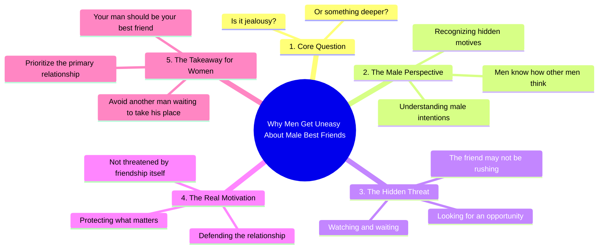

# Why Men Dislike Their Girlfriend’s Male Best Friend

> 🌐 **Read this in:** [English](../../en/2026-08/tiktok-transcript-580k-views-8k-reactions-women-can-t-have-male-best-friend-on-8962.md) · **中文**

> **Creator:** [@ONLY 4 MEN](https://www.tiktok.com/@ONLY 4 MEN) · **Views:** 339.7K · **Posted:** 2026-08-17 · **Niche:** other
>
> **TL;DR:** The hook immediately poses a relatable question and hints at a deeper answer, creating a curiosity gap.

[Watch original video →](https://www.facebook.com/reel/27846143808341228)

## Why This Went Viral

## 钩子（前3秒）
- **逐字开场白：** “为什么男人在女人有男性闺蜜时会感到不安？”
- **钩子模式：** 提问 + 大胆断言（充满性别张力）
- **为何能阻止滑动：** 它提出了一个普遍 relatable、情绪张力十足的问题，立即触发“我必须听听答案”的反应。“他们的女人”这一措辞营造出一种占有动态，在视频尚未推进之前就引发争论。

## 情绪节奏
1. **好奇** – 开场问题让观众准备好接受解释。
2. **紧张** – “是嫉妒还是更深层的东西？”引入了利害关系和二元选择。
3. **认同** – “男人知道其他男人怎么想”让男性观众产生内行人的优越感。
4. **悬念** – “他在观察，等待机会”描绘出掠夺性的画面，提升情绪温度。
5. **高潮** – “他们是在保护重要的东西”将嫉妒重新定义为忠诚，带来核心情绪回报。
6. **解决/挑战** – “姑娘们，你的男人应该是你最好的朋友，而不是另一个等着取代他的男人”以直接行动号召收尾，引发认同或愤怒。

## 关键词密度
- **男人**（4次）– 通过性别标签内容推动算法触达；搜索量高。
- **最好的朋友**（2次）– 情感吸引力；切入情感建议细分领域。
- **等待**（2次）– 营造悬念；塑造反派叙事。
- **观察**（1次）– 威胁意象；放大紧张感。
- **保护**（1次）– 情感吸引力；将叙事从不安感重构为力量。
- **嫉妒**（1次）– 算法触达；高流量情感关键词。
- **机会**（1次）– 威胁框架；强化“另一个男人”的叙事。

## 为何能传播
- **触发词“不安”** – 这是一种柔和、可共鸣的情绪，听起来不具攻击性，因此分享时不会显得有毒。文案第一行之所以可分享，是因为它命名了一种许多人都有但很少有人能说清的感受。
- **性别极化** – “男人知道其他男人怎么想”制造了圈内/圈外动态。男性分享它作为认同；女性分享它作为警告。双方都推动评论和争论。
- **反派揭示** – “他在观察，等待机会”将一个模糊概念转化为具体威胁。这是评论中被引用的那句话，因为它直击人心且易于做成梗图。
- **重构为保护而非嫉妒** – “他们是在保护重要的东西”将负面特质翻转成正面特质。这种道德高地使其可以毫无愧疚地分享。
- **最后一句的直接行动号召** – “你的男人应该是你最好的朋友”给观众一个清晰的要点，可以截图、转发或反驳。它是一个完整的观点，可以独立作为标题使用。

## 你可以借鉴什么
1. **用带有倾向性的问题开场，而不是陈述句** – 问题迫使观众在决定滑动之前先在脑中作答。用“不安”这样具体但不煽动的词来措辞，从而吸引争论双方。
2. **使用“重构”转折** – 将负面情绪（嫉妒）重新包装为正面特质（保护）。这创造了一个可分享的道德立场，观众可以将其内化为自己的身份认同。
3. **以二元命令收尾** – “你的男人应该是X，而不是Y”给观众一个干净、可引用的要点。如果最后一行可以被截图并独立存在，它就会以图片宏或标题的形式在视频之外传播。

## Mind Map

## Full Transcript (Generated by [TokTranscript](https://toktranscript.com/?utm_source=github&utm_medium=breakdown&utm_campaign=tool_attribution))

> 📝 Transcripts on this page are auto-generated and show the first 60%. Want to transcribe any TikTok in 30 seconds and get the full version? [Try TokTranscript free →](https://toktranscript.com/?utm_source=github&utm_medium=breakdown&utm_campaign=transcript_cta)

Why do men get uneasy when their woman has a male best friend? Is it jealousy or something deeper? Men know how other men think. That friend may not be rushing. He's watching, waiting for an opportunity. Men aren't t

*[Read the full transcript on TokTranscript →](https://toktranscript.com/plaza/tiktok-transcript-580k-views-8k-reactions-women-can-t-have-male-best-friend-on-8962?utm_source=github&utm_medium=breakdown&utm_campaign=transcript_full)*

## Browse More

- All [other](../../by-niche/zh-CN/other.md) breakdowns
- All [Rhetorical question + curiosity gap](../../by-pattern/zh-CN/hook-rhetorical-question-curiosity-gap.md) examples

## Video Info

| | |
|---|---|
| Creator | [@ONLY 4 MEN](https://www.tiktok.com/@ONLY 4 MEN) |
| Original video | [https://www.facebook.com/reel/27846143808341228](https://www.facebook.com/reel/27846143808341228) |
| Original title | 580K views · 8K reactions | WOMEN CAN'T HAVE MALE BEST FRIEND ! #only4men #adviceformen #relationshipmatters #ModernLove #malebestfriend #womensbestfriend | ONLY 4 MEN |
| Views | 339.7K (339726) |
| Posted | 2026-08-17 |
| Duration | 0s |
| Niche | `other` |
| Hook pattern | `Rhetorical question + curiosity gap` |
| Original language | `en` (this page translated by AI) |
| Available languages | en, zh-CN |
| Generated | 2026-08-18 by [TokTranscript](https://toktranscript.com/) |

---

*This breakdown is for educational analysis under fair use. Original video © [@ONLY 4 MEN](https://www.tiktok.com/@ONLY 4 MEN). All transcripts are auto-generated and may contain errors.*

*Want to analyze your own TikToks like this? [拆解你自己的 TikTok →](https://toktranscript.com/viral-breakdown?utm_source=github&utm_medium=breakdown&utm_campaign=footer_cta)*