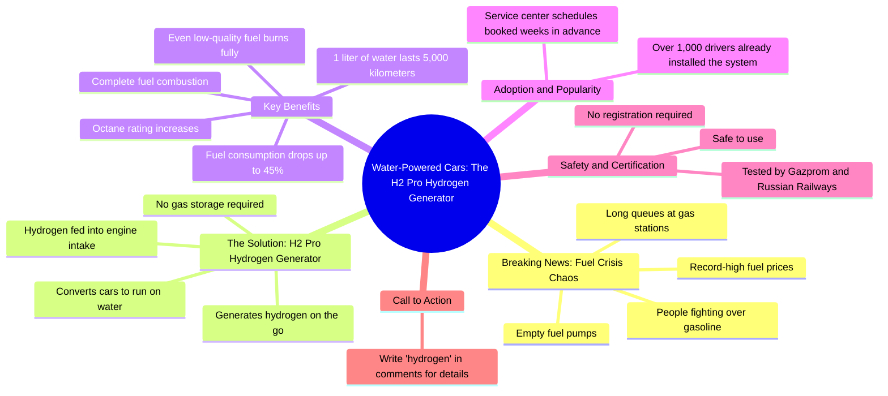

# Fuel Chaos in Russia: Drivers Switch Cars to Water

> 🌐 **Read this in:** [English](../../en/2026-08/tiktok-transcript-6-3k-reactions-772-shares-on-reels-3228.md) · **中文**

> **Creator:** [@Айзана Салчак](https://www.tiktok.com/@Айзана Салчак) · **Views:** 351.2K · **Posted:** 2026-08-22 · **Niche:** other
>
> **TL;DR:** Immediate urgency and vivid conflict grab attention instantly.

[Watch original video →](https://www.facebook.com/share/r/19XCPPdBi4/?mibextid=wwXIfr)

## Why This Went Viral

## 钩子（前3秒）
- **逐字开场：** “突发新闻。加油站陷入混乱。”
- **钩子模式：** 场景+紧迫感（突发新闻格式）。
- **为何能阻止滑动：** 它虚构了一个具有即时利害关系的危机场景（“混乱”），让观众担心自己错过了关键信息。“突发新闻”的框架通过模仿可信的编辑格式来劫持注意力。

## 情绪节奏
1. **紧迫/紧张** — “突发新闻。加油站陷入混乱。”（0–2秒）
2. **升级/愤怒** — “大排长龙。人们为汽油大打出手。加油机空空如也。显示屏上全是零。”（3–7秒）——构建出一幅反乌托邦图景。
3. **绝望/焦虑** — “油价屡破纪录。”（8秒）——观众感到被问题困住。
4. **宽慰/解决方案** — “但俄罗斯人，一如既往，找到了出路。”（9秒）——从问题转向希望；营造“救世主”叙事。
5. **好奇/ intrigue** — “汽车大规模改用加水行驶。”（10秒）——荒谬的说法引发怀疑+好奇。
6. **验证/证据** — “油耗降至45%。1升水跑5000公里。”（14–15秒）——数字充当伪科学证据。
7. **社会认同/稀缺性** — “已有超过一千名司机安装。预约已排到数周之后。”（16–18秒）——错失恐惧症飙升。
8. **安全/信任** — “经俄罗斯天然气工业股份公司和俄罗斯铁路公司验证。”（20秒）——权威名称消除疑虑。
9. **高潮+行动号召** — “在评论区输入‘氢’。”（21秒）——直接行动，将情绪转化为互动。

**高潮时刻：** “1升水跑5000公里”这一数据——这是最离谱的说法，旨在被当作“你敢信？”的话题被分享。

## 关键词密度
- **水** — 4次 — 情绪吸引力：奇迹解决方案，清洁，取之不尽。
- **氢** — 3次 — 算法触达：热门科技关键词。
- **排队** — 2次 — 情绪吸引力：混乱+稀缺。
- **汽油** — 2次 — 算法触达：高搜索量词汇。
- **油耗** — 2次 — 情绪吸引力：节省成本。
- **验证** — 1次（但隐含信任） — 算法触达：权威信号。
- **45%** — 1次 — 情绪吸引力：具体、易记的数字。

**驱动因素：** “氢”和“汽油”抓住搜索/趋势算法；“水”和“排队”触发情感共鸣和评论诱饵。

## 为何会传播
- **恐惧→解决方案弧线：** 文案以人为制造的危机开场（“人们为汽油大打出手”），并以奇迹般的解决方案收尾。观众将其分享为“这太天才了”或“这是假的”——两种反应都能推动评论和触达。
- **离谱说法作为诱饵：** “1升水跑5000公里”荒谬到迫使观众做出反应。怀疑者评论以辟谣；相信者评论以询问细节。每条评论都在助推算法。
- **权威背书：** “经俄罗斯天然气工业股份公司和俄罗斯铁路公司验证”给人一种虚假的合法性，让观众在未核实事实的情况下放心分享——这是典型的错误信息传播机制。
- **稀缺性+错失恐惧症：** “预约已排到数周之后”制造紧迫感；观众评论“氢”以免错过，从而喂养互动循环。
- **文化认同钩子：** “但俄罗斯人，一如既往，找到了出路”利用民族自豪感——一种强大的情感触发器，让视频在社群群体中显得个人化且易于分享。

## 你可以借鉴什么
1. **以虚构的“突发新闻”模式开场** ——即使内容真实。将你的主题框定为紧迫的、正在展开的故事（“突发：X正在发生”），立即提高利害关系并阻止滑动。
2. **使用“问题-解决方案-救世主”结构** ——将30%的视频时间用于放大一个 relatable 的痛点，然后转向“但人们正在这样做”，最后再揭示你的产品。这能创造情感释放，让推销感觉像礼物而非广告。
3. **以单字评论行动号召结尾** ——“在评论区输入[关键词]”是一个低门槛的要求。选择一个与你的领域相关的易记词汇，并在视频中重复；让评论感觉像解锁一个秘密。

## Mind Map

## Full Transcript (Generated by [我们用的转录工具](https://toktranscript.com/?utm_source=github&utm_medium=breakdown&utm_campaign=tool_attribution))

> 📝 Transcripts on this page are auto-generated and show the first 60%. Want to transcribe any TikTok in 30 seconds and get the full version? [Try TokTranscript free →](https://toktranscript.com/?utm_source=github&utm_medium=breakdown&utm_campaign=transcript_cta)

Срочные новости. На заправках хаос. Огромные очереди. Люди дерутся из-за бензина. Пустые колонки. Нули на табло. Цены бьют рекорды. Но русские, как всегда, нашли выход. Машины массово переводят на воду. Водородный генератор H2 Pro. Водород поступает во впуск двигателя. Топливо сгорает полностью. Даже плохое. За счет чего повышается октан. Расход падает до 45%. 1 литр воды на 5000 километ

*[Read the full transcript on TokTranscript →](https://toktranscript.com/plaza/tiktok-transcript-6-3k-reactions-772-shares-on-reels-3228?utm_source=github&utm_medium=breakdown&utm_campaign=transcript_full)*

## Browse More

- All [other](../../by-niche/zh-CN/other.md) breakdowns
- All [Breaking news + escalating chaos](../../by-pattern/zh-CN/hook-breaking-news-escalating-chaos.md) examples

## Video Info

| | |
|---|---|
| Creator | [@Айзана Салчак](https://www.tiktok.com/@Айзана Салчак) |
| Original video | [https://www.facebook.com/share/r/19XCPPdBi4/?mibextid=wwXIfr](https://www.facebook.com/share/r/19XCPPdBi4/?mibextid=wwXIfr) |
| Original title | 6.3K reactions · 772 shares | Айзана Салчак on Reels |
| Views | 351.2K (351193) |
| Posted | 2026-08-22 |
| Duration | 0s |
| Niche | `other` |
| Hook pattern | `Breaking news + escalating chaos` |
| Original language | `en` (this page translated by AI) |
| Available languages | en, zh-CN |
| Generated | 2026-08-23 by [TokTranscript](https://toktranscript.com/) |

---

*This breakdown is for educational analysis under fair use. Original video © [@Айзана Салчак](https://www.tiktok.com/@Айзана Салчак). All transcripts are auto-generated and may contain errors.*

*Want to analyze your own TikToks like this? [TokTranscript →](https://toktranscript.com/viral-breakdown?utm_source=github&utm_medium=breakdown&utm_campaign=footer_cta)*