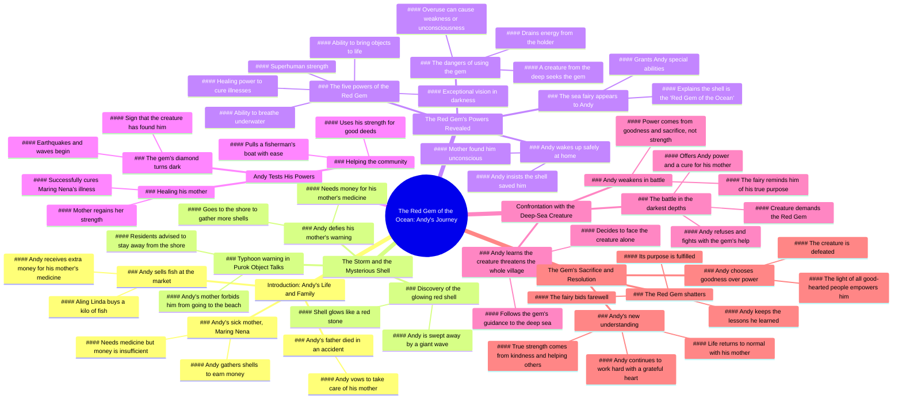

# Kabibe sa Dalampasigan: A Short Magical Story

> 🌐 **Read this in:** [English](../../en/2026-08/tiktok-transcript-670k-views-19k-reactions-kabibe-sa-dalampasigan-short-magica-1d05.md) · **中文**

> **Creator:** [@ObjectTalks AI](https://www.tiktok.com/@ObjectTalks AI) · **Views:** 342.8K · **Posted:** 2026-08-27 · **Niche:** other
>
> **TL;DR:** The hook immediately draws viewers into a lively market scene with a relatable and energetic vendor, creating instant engagement.

[Watch original video →](https://www.facebook.com/share/v/1Gzq3LgbXN/)

## Why This Went Viral

## 钩子（前3秒）
- **逐字开场：** “买吧！便宜卖了！只要一百块！一公斤！新鲜得很！刚从海里捞上来的！”
- **钩子模式：** 场景 + 感官轰炸（市场小贩叫卖、价格锚定、新鲜度宣称）
- **为何能抓住眼球：** 它将观众瞬间拉入一个鲜活、嘈杂、真实的菲律宾市场场景，对话节奏急促有力。语调节奏感强，几乎像音乐一般，“刚从海里捞上来”的细节埋下伏笔，后文会呼应。这感觉像一部电视剧，而不是随手拍的片段。

## 情绪节奏
- **节拍（按顺序）：** 温暖（市场闲聊）→ 同情（病母揭晓）→ 决心（安迪的使命）→ 紧张（风暴预警）→ 恐惧（安迪违抗母亲）→ 恐慌（巨浪袭来）→ 神秘（魔法贝壳）→ 惊奇（能力觉醒）→ 希望（母亲痊愈）→ 威胁升级（黑暗实体）→ 动作/高潮（水下战斗）→ 宣泄（贝壳碎裂、牺牲）→ 结局（领悟教训）
- **悬念落点：** 风暴预警和安迪偷偷返回大海。观众在他行动之前就已知道危险。
- **反转：** 贝壳不只是幸运的发现；它是一个有自我意识的神器，承载着命运。“迪瓦塔”（仙女）的揭示将故事从现实主义转向奇幻。
- **高潮：** 水下对峙中，安迪拒绝了实体的诱惑，贝壳碎裂，释放出由集体善念汇聚而成的光芒。

## 关键词密度
- **“Kabibe”（贝壳）** — 推动剧情和魔法神器；对奇幻/魔法内容有很高的搜索相关性。
- **“Nanay”（妈妈）** — 情感锚点；引发共鸣和同情。
- **“Pulang hiyas”（红宝石）** — 独特、有品牌感的术语；创造令人难忘的概念。
- **“Lakas”（力量）** — 双重含义（身体力量 vs. 道德力量）；强化主题。
- **“Dagat”（大海）** — 既是危险之源，也是魔法之源。
- **“Gamot”（药物）** — 驱动主角的行动；制造紧迫感。
- **“Ligtas”（安全）** — 与核心情感需求（家人安全）相连。
- **“Kabutihan”（善念）** — 道德回报；推动病毒式“暖心”分享。

**算法触达：** “Kabibe”、“dagat”、“mahika”（魔法）是可搜索的、常青的奇幻关键词。**情感拉力：** “Nanay”、“gamot”、“sakripisyo”（牺牲）触发同理心和以家庭为中心的价值观。

## 为何能传播
- **普世的逆袭故事：** 一个贫穷男孩对生病母亲的爱是超越文化的经典叙事。“我们的钱还不够买药”这句话直击人心，让观众为他加油。
- **高风险的道德困境：** 实体的诱惑——“我给你无尽的力量”——是经典的考验。安迪的拒绝（“我不会把它给你”）创造了一个值得分享的坚守原则时刻。
- **低成本视觉奇观：** “魔法”通过简单的调色（红光、暗水）和音效来呈现。这证明了不需要CGI也能创造奇迹，激励了其他创作者。
- **连续剧式的悬念结构：** 视频以清晰的道德启示结尾（“原来真正给予力量的不是魔法，而是善念”），但也为续集留下空间。这推动了“求第二部！”等评论，提升了互动率。
- **文化独特性 + 普世主题：** 菲律宾市场、“po/opo”的敬语、家庭奉献精神都极具地方特色，但为所爱之人牺牲的主题是全球共通的。这种双重吸引力扩大了分享范围。

## 你可以借鉴什么
- **以活跃、嘈杂的场景开场。** 不要从一个人对着镜头说话开始。将观众投入一个感官细节丰富的瞬间（市场、厨房、街道），让对话带动能量。
- **用“神圣物件”将内心冲突外化。** 给主角一个实体信物（贝壳、信件、钥匙），代表他们的挣扎。这能让抽象的情感变得可触可感，也给观众一个可以视觉追踪的线索。
- **以口述的道德启示结尾，而不只是画面。** 最后一句（“而是你愿意给予他人的善念”）是一个干净、可引用的金句。它给了观众评论、配文或转发并附上自己解读的理由。

## Mind Map

## Full Transcript (Generated by [我们用的转录工具](https://toktranscript.com/?utm_source=github&utm_medium=breakdown&utm_campaign=tool_attribution))

> 📝 Transcripts on this page are auto-generated and show the first 60%. Want to transcribe any TikTok in 30 seconds and get the full version? [Try TokTranscript free →](https://toktranscript.com/?utm_source=github&utm_medium=breakdown&utm_campaign=transcript_cta)

Bili na po kayo! Mura na lang po! One hundred na lang po! Isang kilo! Fresh na fresh pa po! Galing dagat! Andy, pabili nga ng isang kilo. Sige po aling Linda, dahil malakas po kayo sa akin, siyam na pong piso na lang isang kilo. Napakabait na bata mo talaga, Andy. Kamusta pala si Maring Nena ang nanay mo? Nagpapagaling pa po si nanay at kailangan pa po ng gamot. Ganun, pasabi kay Kumare, magpalakas siya dahil namimiss na namin mamili ng isda sa kanya. Opo, makakarating kay nanay. Aling Linda, sobra po ang ibinigay ninyo. Sa iyo na ang sukli. Idagdag mo sa pambili ng gamot para kay Maring Nena. Pero po, huwag ka nang tumanggi. Matagal ko ng kaibigan ang nanay mo. Maraming salamat po, Aling Linda. Sana sapat na ito para sa gamot ni nanay. Kuya, pabili po ng gamot. Ito po ang reseta. Sige, akin na. Apat na raan lang po ang pera ko. Kulang pa ito, iyo. Babalikan ko na lang po. Kulang pa rin. Saan kaya kukuha ng natitirang pera? Kumakako pa ako ng maraming kabibe. Baka makabili na ako ng gamot. Andy, nakauwi ka na pala. Opo, Nay. Kamusta po ang pakiramdam ninyo? Kaunting ubo lang ito. Hindi na po kaunti ang ubo ninyo. Kailangan na po ninyo ng gamot. Huwag mong ubusin ang lakas mo para sa akin. Tayong dalawa na lang po ang magkasama. Hindi ko kayo pababayaan. Kung hindi lang sana na aksidente si tatay. Huwag mo nang sisihin ang nangyari anak. Ginawa ng tatay mo ang lahat para sa atin. Gagawin ko rin po ang lahat para gumaling kayo. Bata ka pa, Andy. Pero kaya ko na pong tumulong, Nay. Isang malakas na bagyo ang inaasahang tatama sa puro object talks. Pinapayuhan ang lahat na umiwas sa baybain. Pusibling magkaroon ng malalakas na ulan, hangin at malalaking alon. Narinig mo yun, Andy? Bawal kang pumunta sa dalampasigan. Opo, Nay. Hindi po ako pupunta. Nay, inumpo muna kayo ng tubig. Ubus na talaga ang gamot. At kaunti na lang ang kulang. Kailangan kong gumawa ng paraan. Kukuha lang ako ng kaunti. Babalik ako bago tuluyang lumakas ang ulan. Ang dilim ng mga ulap. Pero wala pang malakas na ulan. Konting kabibilang. Pagkatapos, uuwi na agad ako Kailangan ko itong gawin Para kay nanay Kailangan niya ng gamot Maraming inanod na kabibe Kapag napuno ito, sapat na ang pambili ng gamot Kailangan kong bilisan Mukhang paparating na ang bagyo Wow! Ang lamig! Hindi pa puno ang lalagyan Hindi pa ako pwedeng umuwi Wow! Ang lamig! Ngayon lang ako nakakita ng ganito. Ang ganda ng kabibe parang pulang bato. Umilaw ba yun? Baka tinamaan lang ng ilaw mula sa kidlat. Isasama ko na lang ito. Baka may bumili nito ng mahal Andy anak nasaan ka Huwag mong sabihin, pumunta ka sa dagat! Andy, Diyos ko, iligtas ninyo ang anak ko. Mari, bakit ka nasa labas? Hindi ko makita si Andy. Sa tingin ko, pumunta siya sa dalampasigan. Ano? May paparating na napakalaking alon. Manghihingi ako ng tulong sa mga tanod. Bilisan natin, Linda. Anak ko ang naroon. Puno na. Makakabili na ako ng gamot. Bakit ang init? Bakit ka umiilaw? Umiilaw! Hindi maari... ang mga kabibig ko! Hindi pa dito nagtapos ang iyong paglalakbay, Andy. Nasaan ako? Nay, paano po ako nakauwi? Hindi ko rin alam anak, nang mag-ising ako kaninang umaga nakahiga ka na rito. Pero, nay sigurado po akong tinangay ako ng malaking alon. Pero ligtas ka ng nakauwi anak. Hindi ko po alam kung paano ako nakabalik dito. Ang huli kong naalala, nasa ilalim ako ng dagat. Baka panaginip mo lang yun anak, dahil nung nagising ako kaninang umaga, nakahiga ka na dito. Pero nay, alam kong tangay na ako ng malaking alon. Nay, ito po ang napulot ko, bago ako tangayin ng alon. Kabibilang naman yan anak. May pulang bato po ito sa gitna, at umilaw po ito, bago ako mawala ng malay. Baka epekto lang iyon ng pagod at takot mo. Hindi po ako nagkakamalinay. Pero nagsalita rin po ito sa akin. Nagsalita? Opo, alam ko yung kabibe, yun. Baka nanaginip ka lang habang wala kang malay. Pero sigurado po akong totoo ang nangyari. Anak, tama na yan. Mas mahalagang sabihin mo sa akin kung bakit ka pumunta sa dagat. Nay, sorry po. Kulang pa po kasi ang pera natin para sa gamot ninyo. Anak, hindi ko kailangan ng gamot kung buhay mo naman ang kapalit. Magpahinga ka muna. Marami kang pinagdaanan. Kailangan mo ng pahinga, anak. Opo, Nay, salamat. Pero aalamin ko pa rin kung paano ako nakaligtas. Basta huwag ka nang babalik sa dagat ng mag-isa. Kung ikaw talaga ang nagligtas sa akin, ipakita mo kung ano ka. Baka tama nga si nanay. Nandito na naman ako. Ito ang nangyari bago ako malunod. Umalis ka riyan! May malaking alon sa likuran mo! Nay! Hindi! Hindi ako makahinga. Ang kabibe. Nakakahinga ako. Napakalinaw nakikita ko ang lahat. Sino ka? Ikaw ba ang nagligtas sa akin? Bakit ninyo ako tinulungan? Dahil nakita namin ang kabutihan ng iyong puso. Ang kabibeng ito ay tinatawag na pulang hiyas ng karagatan. Habang nasa iyo ito, may kakayahan kang huminga at mabuhay sa ilalim ng dagat. Yun pala. Ang siyang malinaw na dahilan. Kung bakit, hindi ako nalunod. Bibigyan ka rin nito ng pambihirang talas ng paningin. Makakakita ka kahit sa pinakamadilim na bahagi ng karagatan Kahit sa kailaliman po Kahit saan ka mandalhin ng dagat Andy Bibiyayaan ka rin nito ng pambihirang lakas ng katawan. Hua, napakalakas ko! Ngunit huwag mong gamitin ang iyong lakas para manakit ng walang dahilan. May kakayahan din ang kabibe na magbigay buhay sa mga bagay. Nasaan ako? Nagsasalita ang laruan! Ngunit pag-isipan mong mabuti ang bawat bagay na bibigyan mo ng buhay. Ang pinakamahalagang kakayahan nito ay ang pagpapagaling. Kaya nitong magpagaling ng may sakit? Siya ang tunay, Andy. Ang ibig sabihin po ba niyan? Magagamot ko na si nanay! Ngunit may kalakip na panganib ang paggamit ng kakayahan nito, Andy. Anong panganib po? Kumukuha ang kabibay ng lakas mula sa may hawak nito. Kapag nasobrahan ang paggamit mo, maaari kang manghina o mawala ng malay. May panganib na nagising nang napasa kamay mo ang pulang hiyas. Anong panganib? Isang nilalang. mula sa pinakamalalim na bahaki ng dagat. Matagal na nitong hinahanap ang pulang hiyas at alam na nitong nasa iyo ang kabibe. Ano ang dapat kong 

*[Read the full transcript on TokTranscript →](https://toktranscript.com/plaza/tiktok-transcript-670k-views-19k-reactions-kabibe-sa-dalampasigan-short-magica-1d05?utm_source=github&utm_medium=breakdown&utm_campaign=transcript_full)*

## Browse More

- All [other](../../by-niche/zh-CN/other.md) breakdowns
- All [Direct address with urgency and sensory appeal](../../by-pattern/zh-CN/hook-direct-address-with-urgency-and-sensory-appeal.md) examples

## Video Info

| | |
|---|---|
| Creator | [@ObjectTalks AI](https://www.tiktok.com/@ObjectTalks AI) |
| Original video | [https://www.facebook.com/share/v/1Gzq3LgbXN/](https://www.facebook.com/share/v/1Gzq3LgbXN/) |
| Original title | 670K views · 19K reactions | Kabibe sa Dalampasigan (Short Magical Story) #magical #fantasy #lesson #animation #ObjectTalks | ObjectTalks AI |
| Views | 342.8K (342781) |
| Posted | 2026-08-27 |
| Duration | 0s |
| Niche | `other` |
| Hook pattern | `Direct address with urgency and sensory appeal` |
| Original language | `en` (this page translated by AI) |
| Available languages | en, zh-CN |
| Generated | 2026-08-28 by [TokTranscript](https://toktranscript.com/) |

---

*This breakdown is for educational analysis under fair use. Original video © [@ObjectTalks AI](https://www.tiktok.com/@ObjectTalks AI). All transcripts are auto-generated and may contain errors.*

*Want to analyze your own TikToks like this? [TokTranscript →](https://toktranscript.com/viral-breakdown?utm_source=github&utm_medium=breakdown&utm_campaign=footer_cta)*